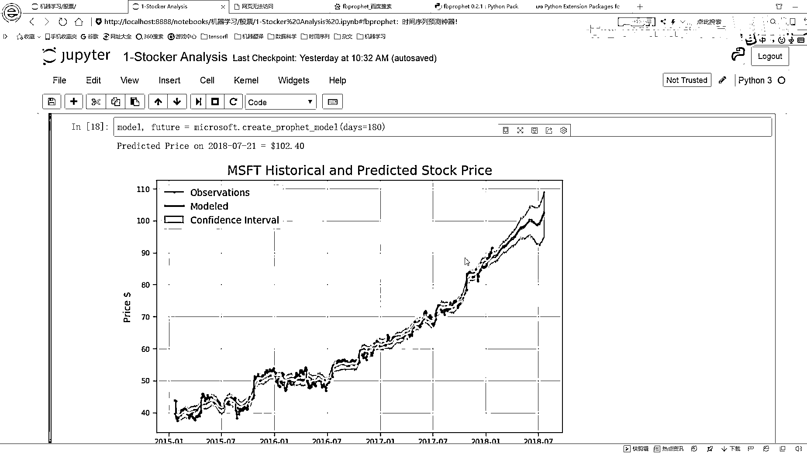
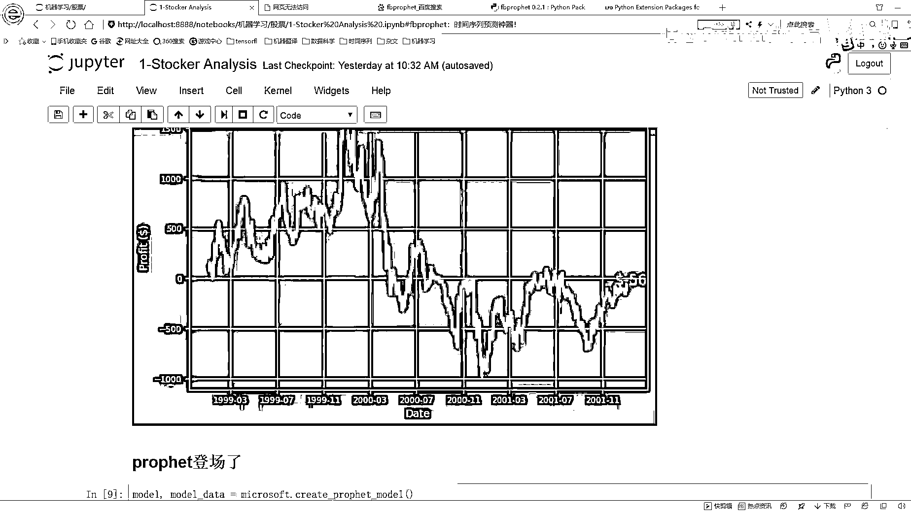
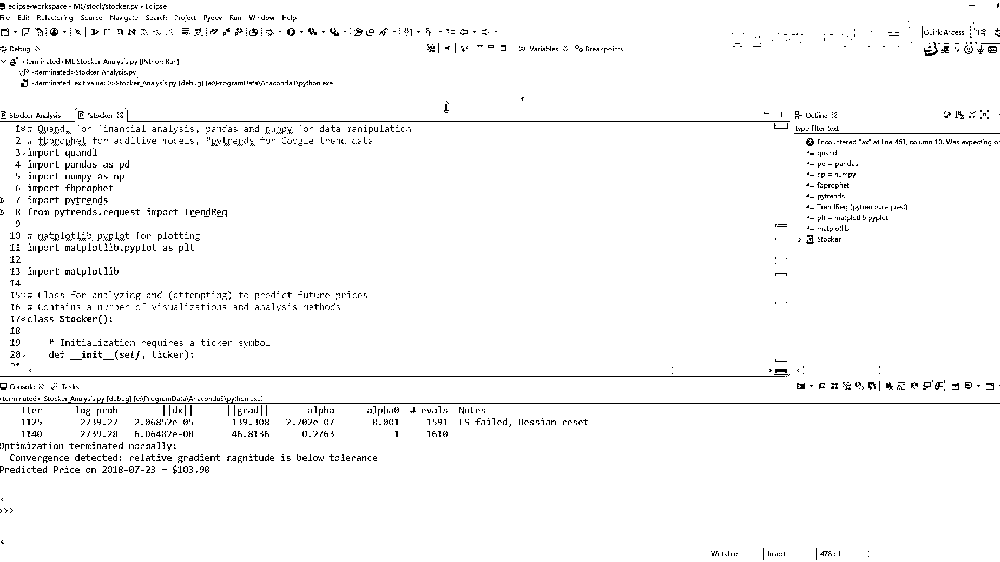

# P4：3-fbprophet时间序列预测实例 - 人工智能博士 - BV1aP411z7sz

首先呢咱们还是先来看一下这个整体图吧，当我们去执行啊就是这样的一个create一个model之后啊，它会帮我们去先去建模，然后呢建模之后啊它会帮我们去进行一个说白了，就是帮我们进行一个预测。

会画出来图长这个样子就是你看这里标了，就是这个黑色点啊它是我们的一个观测的一个值，然后呢这个绿色点它是我们实际建模出来的值，这个confidence啊就是我的一个指引区间。

这样呢就是咱们一个基本的序列啊就给它勾造出来了，勾造出来之后呢然后我们还可以干什么，当我们去就是勾造完这个model之后啊，然后呢我用这个Facebook实验序列这个框架里边，它直接有这样一个函数啊。

就是帮我们可以在这个这个函数不是咱们自己写的，是它这个框架当中自带的，它可以直接的帮你去展示一下，对于你这个模型你不是训练完了之后吗，它会发现一些规律，比如说按照这样的一个年份它的一个趋势。

然后呢这块就是按照一个月就是一个月当中的，这整个一个月它的一个趋势，下面呢就是还有按照这样一年当中每个月它的一个趋势，这些趋势我们也可以都给画出来，然后呢咱们先来看一下吧就是我这个建模啊是怎么去做的。

咱还是回到这里，到哪了到这里是吧咱们这个model，model呢然后我去F5跳进去啊，F5跳进去一样还是第一步，先是去把我的一个画图的工具啊就是重载一下，然后model等于self。

create model咱们跳进去，create model里啊它就会执行这样一个模型，首先把我的一个模型进行一个实例化，实例化的时候啊它在这里你看，先是指定一些参数啊这参数是什么。

它这个参数就是说一会儿呢你要不要去画那些季节性的一个变化，你可以指定啊咱们的一个处啊还有这样的一个false值，然后有一点比较关键就是，这个东西这个东西啊就是一个chunk。

咱现在用一个0205来当成一个默认值，因为就是这个Facebook这个框架它默认值我看了一下，它也是等于0205的，然后我们直接用这个默认值来去做这个事就可以了，让大家在看的时候啊如果说。

你想去看一下他的一个参数的设计，或者说他这些模型都是怎么定义的，你在这个我是Eclipse，我估计大家用pycharm可能稍微多一些，然后我这里是用control点去，因为我没用过pycharm。

因为以前我是做Hadoop这套的，用Eclipse又习惯了就懒得换了，让这里就是你control点去，它会跳到这个源码当中吧，源码当中啊就是你要真想去做这个东西啊，你可以自己的去读一下他这个每一个参数。

你看我们一会儿核心点是这个change points，不是change points，然后呢这里就是我们去不去把这个年化这个东西啊，给他指定出来按照年的一个趋势，然后呢按照周的一个变化的趋势。

按照天还有这个汉用者是吧，你也可以指定当前的一个holiday，你可以传前当前的一个节假日，然后呢，这些都是我们可以自己指定的一些指标，然后这两个源码这个内容太多了，但是说大家我读这个源码。

估计咱们时间肯定是花费太多了，到时候如果大家感兴趣，可以去執行的时候实际来看源码当中怎么去做的，这个咱们就不来看了，然后这里呢，我们就可以去把我当前就是你指定的一个参数传进去，一会儿呢。

我会详细的再看一下这个参数，然后这里啊，就是我又加上了一个就是一个以30。5天为周期的一个变化的一个趋势，所以说一会儿呢，我也只能统一出来啊，以这个30。5，然后进行一个变化他的一个趋势，然后这里呢。

把我的model给他返回去，这样呢，我就构造出来了一个基本的我当前的一个时间序列的一个模型，时间序列模型拿到手之后，然后你把你的一个数据给拿到手，这个数据啊，他是怎么去做的，他是这个意思。

你看这里就是我指定什么，这块减去了一个self。training，他什么意思啊，也就是说，咱现在fit什么fit的是一个历史的数据，历史的一个数据啊，就是我要fit几年的。

比如说我想只用近三年的来进行一个预测，那我是不是那近三年就可以了，我就不用拿全部的吧，你可以在这里啊，指定一个training years，就是你训练用几年的数据，这里指定了3。

就是拿最近的这么三年的数据来进行一个训练，训练呢，用model。fit一下，这样呢，我们就可以完成一个基本的训练，训练完之后啊，然后make一下。

make一下咱们的featured data frame，他的意思就是说，在此基础之上，你还要不要再往下去预测了，在这里啊，data只留成一个零，data只留成零啊，他的意思就是说，现在呢。

我只是拿历史数据去做训练，然后做这个自会用模型吧，然后去预测一下我的历史数据，说白了，就是在新的时间点上我就不做预测了，咱指定data=0，然后离会呢，再为大家演示啊，就是data=90什么样。

data=100多又是什么样，这就是预测之后的一个序列了，咱现在啊，就是不需要预测，只给大家讲一下，他能不能怎么构建，所以说指定一个data是等于零的，就是我现在不去预测新的一个时间。

只是在历史数据上重新进行一个预测，那你看历史数据怎么预测，你还是拿这个feature，这个feature是什么，这个feature刚才不就是咱们又把，你看这个就是延伸的天数等于零，那不还是这批数据吗。

说白了就是拿这个数据做训练，我再拿这个数据做预测，做了这样一个事儿，这一块就是值写的时候，可能会稍微慢一些，你看我这块等了半天了，因为我这个，我这个CPU还是蛮快的，可能大家在实际等的时候。

要比我的时间稍微长一些，预测完之后，它会出现这样一些值，你看它会出现这样一个值，我看在哪去了，有一个y-hat，这里面就是它会给你自动添加几个指标，一个叫y-hat，一个叫y-hat lower。

一个叫y-hat upper，就是我们可以拿y-hat当成是我的一个预测指标，然后那个lower higher，可以当成是一个我的一个自信区间，这个意思，然后这块它就会帮我打印出来当前的一个指标。

那下面的就是我去把这个图给它画出来，画图的时候就是我们画一张图，3+1，然后把我的DS以及我的一个Y值，这是画出来，这是什么，这是我的一个观测值，观测值说白了，这就是我的一个历史数据，它长什么样子。

然后呢，我当前是不是预测了一个feature，feature当中，DS照样是我的这个时间吧，它时间都是一样的，然后呢，这个y-hat，这个y-hat是什么，这个y-hat就是我去那什么。

就是我的一个预测值嘛，给它画出来，然后我用什么颜色，就是你自己指定当前那个颜色去画，然后呢，还可以画什么，还可以画咱们的一个interval，他们这样的一个区间，也可以画出来，这样呢。

咱们再往下一步一步去执行，你看就把这个图画出来了，中间这些绿色的是我的这样的一个浅绿色，是我的区间，然后这个就是区间就是一个，咱们有一个upper还有一个lower，这两个指标，然后呢。

这个黑色的是我当前的一个真实值，然后呢，这个绿色的它是我现在的一个预测的一个指标，这样啊，我就把当前这个模型给它画出来了，这就是我画出来的一个基本图，其实画这个图很简单啊，就是我们只需要把数据有了。

然后plot一下，这样呢，我们就把这个数据给它做好了，做好完之后，这是我当前的我的一个数据，然后再执行plot一下，它的一个就是看一下吧，这plot完之后什么，这块可能这块也稍微慢一点。

这个画图得画一会儿，然后这块啊，他们画完之后，哎，我收一下，就这个图吧，这个图啊，就是画了一下对我当前这个数据来说，它的一个趋势，你看啊，就是在这个嗯，这个是什么，这是按年的一个趋势吧。

从这个15年开始吧，从这个15年开始，然后它的一个价格，它的一个变化的情况，然后到这个一直到这个18年，你看按照每年它的一个变化情况，然后呢，下面就是什么，下面是一个按照它的一个月份，它的一个情况。

月份呢是以笛人为点，然后上面是增了，下面就是降了这个意思，那基本的一个情况就是这样，在这个月份刚开始的时候，可能稍微的往下有点走势，你看这个因为他就可能接着这条线，可能下一个月也是这个样子。

接着往下这个走势，往下走势完之后，然后月初会上升，然后月末会下降这样一个趋势，然后按照一个年来说呢，整个按照从这么几个月份来说，也可能啊是这样的一个情况吧，你看他也是这样的一个情况，也是有时候多高一些。

有时候低一些啊，这就是一个按照年化，它的一个情况，按照天按照，不是按照咱们的一个月份，还有按照咱们的一个整体，这个呢就咱们就可以去画一下，它的一个变化的一个情况是长什么样子，然后这块你可以自己往里去加。

哎这块我没有去画，这块就是说，你也可以就是把这个week，我们可以去自己指定，你可以去set一下，在刚才不是指定成一个false值吗，我不想看一个以这个周的，那你可以把这个week这个值啊。

整个数你可以去看以这个为周的嘛，这些我们都是可以自己来进行指定的，指定完之后呢，我们就画出这些图，趋势的情况给大家说过了，然后呢过去三年啊，咱们可以看一下，总的趋势啊，也是像上的一年当中似乎。

7月9月和10月是下降的，12月和1月是上浮最大的，这在哪看呢，在这看就是你看这是1月，然后12月12月，大概也是这个位置吧，12月大概也是这个位置，12月1月是上浮最大的，然后其他月份。

你看这些就是下降最大的，所以说咱们这里啊，还是给咱们提供了什么样的一个，思路啊，这里就是说月份它是这样，然后就是说每个月的月底，因为你看每个月月底，你看这个这个月底啊，就是这里月底可能有些奇异啊。

加上一个每个吧，每个月底每个月底还消停吧，你看月底的时候，这块在26号26到2728，可能282930，这天说大幅它会发生下降的趋势吧，所以说月底的时候还是消停点吧，咱这时候就不要买这个股票了。

然后这块呢，就是给大家看了一下，我们的一个基本的模型是长什么样子，然后这里呢，就是你想起这块，他的意思最后做这样一件事，你想添加进来一个以这个周为参考依据的，你也可以把这个东西指定这个处置，处置之后啊。

让你重新的create一下咱们这个model，照样death等于零，我只去看一下历史的，他还会把这个周的情况给拿出来，然后这个这个情况还很奇怪，你就看周五之后，然后还有这个周一之前他这个东西。

但是在我记忆当中是这么一个事，我也查了一下，我记得就是这个东西周末是不开盘的吧，周末是不开盘的，所以说我们观察的时候，一般只观察到周一到周五吧，因为周末不开盘，所以说这个情况我大概查了一下。

好像来说按照这个周来说，我们只用看12345就足够了，所以说你看12345，它是一个平缓的趋势，这里能呈现出来这样一个趋势，就是可能因为周六周日，他有一些其他什么操作，但是我对这个股票啊。

不是那么清晰啊，自己从来没玩过，不知道周六是不是开盘，反正呢，这个是一个以周为之间的一个变化情况，那加上估计肯定有朝五的高手，到时候你自己来看吧，这个周围情况，它是不是跟咱们实际遇到的一个趋势。

还有这些趋势，是不是跟你自己朝五遇到差不多，这个东西我也不太清楚，跟你的情况差不多多不多，如果说跟你情况比较相似，那你说咱这个模型，是不是预测的还是稍微准一些啊，然后呢咱们接着来看，下面还有什么。

下面还有一个突变点，这个突变点就是这个意思，我们可以观察这个时间序列，它的一个二阶倒数，观察它二阶倒数的一个正负的情况吧，就可以看一下，对于这个点来说，它突变的一个情况，说白了什么叫突变点啊。

它就是这个一个地方，它的一个就是要么就是原来是下降的，这块突然转折了，那这是一个突转点，还有呢，可能它本身也是上升的，一开始上升比较慢，在这个点的时候突然上升柔柔快了，这也是个转变点，或者说呢。

本来是下降的，这块下降的很快，突然下降慢了，那是不是也是个转折点啊，我们把这个东西叫做一个change point，说白了，它就是一个突变点，突变点呢，就是我们可以把这个我们接着把它来走，这块还没走完。

然后呢，在这块我往下走，这块它还会帮我们去训练一下这个模型，稍微等一下，然后走这个突变点的时候，我们来就是可以进行一个预测了，咱们可以看一下预测结果，在这块我来看一下，我看一下一会儿做了件什么事啊。

这块还去做了一个预测，来看吧，这块还没走完啊，我这还得瘦一下，瘦完之后我们才能到这个突变点这块，行这个这个这个不看了，这个图我给它直接关掉，然后再往下走，又卡住了，这个东西debug还慢啊。

一般情况下就是debug，它要比你正常运行要慢个几万个慢一些啊，咱们正常运行还是稍微快点的，然后这块呢，来看一下我的一个突变点的一个情况，其实呢，咱先看这个图吧，咱看这个图啊，在这里做这样一件事啊。

就是找到这些突变点啊，然后突变点当中啊，就是它有上升的有下降的，分别用不同的一个线来进行一个表示的，然后呢，这里啊就是用一条绿色线表示着这个点，它是一个往上升了，红色线呢，表示这个点它是一个往下降了。

就是一个positive还有一个negative这个意思，然后呢，再来看吧，首先就是还是create a model，然后把我的一个训练集拿到手，然后去点fit一下，点fit完之后呢，这个东西啊。

前面都是一样的，一样东西，这个我就不给大家拿出来看了，然后把我的一个预测的结果和我训练集啊，给拿到手，因为我一会要把他俩在一起去画的，所以说在这里呢，进行了一个merge。

按照我的一个Date Series，就是我的一个日期，因为日期都一样嘛，按照日期去merge一下，我就把我的y hat值和y值都拿到一起了，然后呢，Change points，这啊。

就是我的model当中，它会自动的帮我进行一个计算，我的一个Change points，这样呢，它就会找到一些突变点拿到手，突变点拿到手之后啊，然后咱们就可以把这些突变点都给它找到。

突变点你看我突变点的index值找到找到，有了index值之后啊，就可以找突变点的日期吧，所以说在这里你看，哎，这块怎么直接给我跳出来了，这块他直接就给我跳出来了，这样就是我看一下怎么办，哦。

在这里我去跳到这里吧，在这里啊，刚才他我直接跳出来跳出来没关系，这里咱接着看吧，这里呢，就是说他会帮我们找一些突变点，找到突变点之后，我们能找对应的一个日期吧，找到了对应日期之后。

我把这个日期也可以进行排序吧，排序之后我可以取前十个突变点，然后取完突变点之后呢，我就可以看突变点的一个二阶岛，它是一个大于零还是小于零的，这样能来决定它是一个positive。

positive二阶岛变大于零吧，negative变二阶岛小于零吧，可以通过它这样的二阶岛，这个二阶岛就是它也会帮我们进行一个求出来的，这里就是在这个model当中。

我们可以直接把它这个导数值给直接求出来的，这个Facebook这个框架也帮我们做这样一个事儿，然后呢，基于它二阶岛这个情况大于零还是小于零，我就说这是一个增幅还是一个涨幅，然后呢，有这个增幅和涨幅之后。

我就可以去把这个图画出来了，如果你在画图的时候，你看画图出来这块，这块呢就是分别进行了一个画图，就是对于一个二阶岛大于零的，我要画一个什么图画一个什么线，对二阶岛小于零的，我又要画一个什么线。

在这里呢我分别进行的表示，你看这条线画什么，这条线用红色画的，红色画什么，红色画的是一个，咱们的一个什么，咱们的一个Positive，然后呢，这块就是我用另外一种颜色画了一个Negative。

这样就是我们用不同的一条线，进行了一个衡量，一个Positive一个Negative，这样呢，我就把这个结果给它画出来了，画出来之后呢，就是这个图啊，它的一个表达的一个含义，这就是在图当中啊。

我们把这个结果给它画出来了，又把图边点找到了，图边点呢，是可以通过这个框架，直接帮我们找到手的，那接下来啊，估计就是大家比较感兴趣的东西了，就是当我想用这个东西啊，进行一个预测的时候。

比如说我想预测在未来的，因为我现在是2018年7月21号，这对我来说是未来的一个时间点，未来的一个时间点，我不知道这个时间点，它应该是什么样值呢，那在这里啊，咱们就先来预测一下吧，预测的时候怎么办啊。

预测的时候啊，其实这个东西啊，我也不用给大家去去，那什么不用给大家去演示了，因为这个Creative Model，这个模型还是一样的，它只不过在这里指定了一个Date，Date等于180。

咱们可以跳进去来看一下，在这里哎哟，不是这不是不是不是，看错一下，在这里呢，就是我们看一下它这个Date，你看现在这个Date指定什么，指定是180吧，所以说现在呢，我要预测的就是我有一个新的指标了。

这里能传进来一个Date等于180，你看我在Make Future Date Film的时候，它会得到的一个，这块往下你看这会得到多少什么，从咱们三年前开始，这个2015年1月26号，从这天开始的吧。

一直到哪天啊，一直到这个2018年7月23号，它会在这些时间节点上，进行一个自回归的模型，所以说它会帮我预测出来什么，会帮我预测出来，接下来你又指定了那180天，它还是可以帮我预测出来的，这就是一会呢。

在拿到这个Future结果之后啊，你会发现它里边是包括了，之后的一个时间点的，之后这个时间点啊，这块稍微等一下，这块比较慢啊，然后有了之后时间点之后啊，你把之后的一个指标值，你都画出来，这说明完事了。

只不过说之后的一个指标值的里边，它就没有那什么了，它就没有那个就是，它的一个真实值了，只有你的一个预测值了，在这里啊还是一样的，就是画图还是一样的，这个比较简单，咱们也不给大家看了，直接返回去。

返回去呢就得到最终的一个结果了，咱们来看这是最终结果，还是这个这个黑色点，黑色点还是我的那什么，还是我的一个观测值啊，然后这个绿色点，它就是我model的一个值，然后咱看这块段在哪段呢，因为这个黑色点。

它只有到这个1月26号，就是今天这个时间点，然后呢这个绿色点，它是指它是会往下延伸嘛，那你看我们预测的结果值，就是我这个绿色指标，还是会朝着这样一个趋势，然后大致的去延伸，只不过说呢，这块啊。

它就是就有一个下降，这个下降，至于它为什么预测出来这个下降，它可能是观察历史的一个趋势啊，就是天下之势啊，和久必分分久必合这个东西，上升多了，它就下降一些，然后再上升，这是可能我们的一个趋势，但是呢。

可能就是跟咱们的一个指标来说啊，还不太一样，因为我对一个指标来说，从我当前来看，就是在这个时间点来看，可能它会之后上升的，可能幅度更大一些，但是咱这个模型呢，可能稍微保守了一些啊。

它没有去太大幅度的去做这件事，这是为什么呢，因为啊就是咱们这个东西，可以自己去调的，主要由那个ChangePoint来去调这个东西，一会儿呢，咱们的一个核心啊，就大家来说一下。

我们怎么利用这个ChangePoint的这个参数，来去使得我们的一个时间序列啊，看起来就是更保守一些。

还是看起来更奔放一些。

这个意思，那现在就给大家简单的介绍了一下，就是我们用啊。

这个Facebook，它这个时间预测，我把它叫做一个神器啊，它是怎么样帮我们完成这个事的，然后在这个Exlist里边给大家debug，说了一下就是我们这个StyleClass。

它这个类当中都有哪些基本的功能，然后咱们又看了一下，这些功能啊都该怎么去用出牌了，就是一些画图，还有建模的东西啊都是比较简单的。

謝謝。