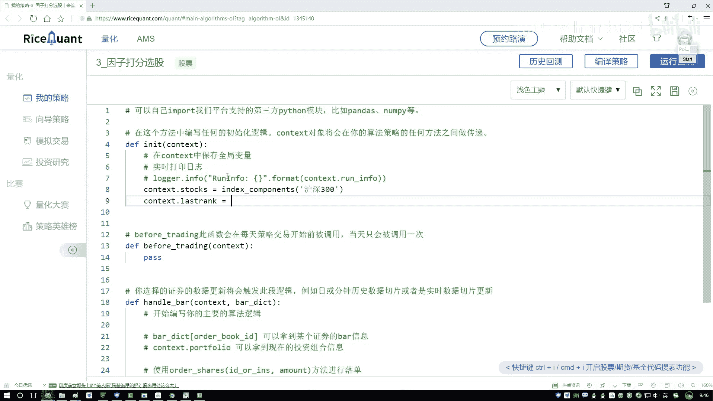

# P50：3-策略初始化与数据读取 - 人工智能博士 - BV1aP411z7sz

这里我已经是打开了一个新的策略文件，在这里我们一起来去动手实现一下这个因子打分选股，行了，然后按照我们的顺序咱们一步一步写，第一个，咱们现在要做一个助抓方法。

在这个context当中我们要指定当前我们的一个大池子，你要到哪当中去选这个股票，咱为了使得这个效果能够偏好一点，咱们直接在那个互衬300当中去选，这样咱们使得受益率看着能够更好看一下，好了。

咱们写互衬300，这是咱们现在指定好的一个大池子，然后接下来呢，我说在这个context当中，一会儿我做调仓，那调仓里啊，你是不是得告诉我，我到哪去选一些好的股票吧，那这块咱们先指定一个变化名字。

就是我们上一次咱们当前的一个排名情况，一会儿我会把这个排名情况给得到，咱们在context当中先指定好，一会儿在这里当中去选那么前十或者是前二十个，然后接下来咱们来指定一个定制器吧。

在这个定制器当中我们去指定一下，它的一个调仓我们是run的方法，咱选按月调仓，按月调仓当中第一个就是一会儿咱们要去自己实现的一个函数，我们写个rebalance，然后第二个写个1就行了。

然后既然我们写好这个函数了，来，下面我们来定义一下，在这个函数当中直接复制一块，写什么，写一下咱们的一个rebalance函数，在这个rebalance函数当中我们要做的事儿其实还是蛮多的。

其实最核心那个什么，最核心的就是咱们怎么样去指定我们的一个评分了，好了，rebalance当中第一步咱们就得现在把，那前三百个或者说排序好的三百个，或者说是那个排名的十个吧，咱得返回出来。

在这块我得知道当前你排名完之后的一个股票，在这块咱们自己去写个函数吧，比如说它就是get stocks，我们自己写个函数，在这个函数当中它要去帮我们去实际的去做一个评分操作，我们来写一下。

还是把这个分下来，然后名字改一下叫做get stocks，这个函数当中我们就去写吧，第一步干什么，第一步我们是不是说要去获取咱们现在需要的一个数据，所以说第一步咱们肯定要做一个查询的操作，get。

查询操作，查询操作当中咱们来写吧，第一个就是你的一个query，query我们自己写query吧，在这块我先写query，因为我们要查的比较多，这块我单独列出来了，我们查的就是刚才在Noble当中。

我们是不是给大家列出来了有那么六个指标吧，或者是有几个指标都行，或者大家自己玩的时候，你愿意多少个多少个，咱就以那六个为例子给大家来说吧，好了，咱们应该写第一个。

我直接复制了这个Fundamentals，哦，这个算了，这一写吧，Fundamentals它应该会给我提示，Fundamentals当中，咱们要选的第一个就是那个美股收益，在那个金融指标当中。

我们有一个美股收益，美股收益看一下，它是一个D开头的，找一找，看一看，这儿了，对，就单纯第一个美股收益是吧，Pershare，咱们点进来，这是我们第一个要做的美股收益，为大家写一下它的一个名字。

这就是我的一个美股收益，美股收益一篇指标，然后我们希望它是怎么样，它是越高越好的，这是我们第一个指标，好了，然后在这块我们写上个逗号，这里咱们是第一个指标，然后我们再写第二个指标，第二个指标。

像是我们脑补当中给大家说的，我还有一个净资产的一个收益率，跟这个都是一样的，我可以把前面一些全部给它复制过来，好，全部复制过来之后，我来找一找，净资产收益率也是一个金融指标，在这不是，它是一个收益率。

是一个Return开头的，Return开头的，当一个这个指标，好了，我来注释一下，它叫做一个净资产，净资产收益率，我们也是希望它是一个越高越好的，然后再来最后一个，最后一个还是在这个指标当中都一样的。

第三个我们来说，就是有一个投入资本的回报率，投入资本回报率，那也是一个Return还开头的回报率，Return一下，Return一下，然后净资产的回报率来找，它是一个on什么，最后一个是吧，看一下，对。

这是我们净资产的回报率，然后给它指定名字叫做一个，净资产回报率，然后我们也是回报，回报，率，我们也是希望它能够越高越好的，好了，这是我们现在把这三个指标全部列出来了，那有三个指标之后，其实还没完。

我们要对这个指标怎么样，是不是说得找一下它在我的股票当中，这个操作，估计大家应该相对来说都是比较熟悉了，在这一块我们指定一个，filter，在filter当中，我们来去指定一下。

filter当中来去指定一下，当前我们的股票，得是带我的这个池子当中，好了，Fundamentals。，点一下，咱们当前的，Statement当中，然后有一个stock，stock in。

stock code，然后对它，然后点in的一个操作，对它，然后我们来进行判断一下，是不是在我们的池子当中，把我们的一个，互联三百这个池子给拿到手，这就完事了，行了，这里咱们写了一下，我们的query。

query完之后，大家注意一点，这还没完，它返回是什么，返回的格式，最早一刺客就给大家说了，我们得把这个格式怎么样，给转折一下，到时候方便我们去取它的一个缩影的，好了，然后在这块，咱们实际写一下。

get Fundamentals当中，我们来写，在这个get当中，我们来去把这个query传进去，这样我直接给它复制进来，直接把这个query传进去，然后这块正好它是一个点，这也完事了。

括号也没什么问题，好了，这是咱们完成的第一件事，我们现在把一些越高越好的指标，给它拿到手了，然后给它指定个名字，咱一会得区分这个东西，它是一个越高越好了，指定一个fundamental。

我们希望当前得到的dataframe，它是越高越好的，指定一个up就行了，然后复制一下，就是在我们当前这个指标当中，我们不光要拿越高越好的，还要拿什么，是不是还有一个是越低越好的，来咱写一个down。

我把这些名字稍微改一改就行，然后下面基本这些操作，咱都不用去改的，截止标，把这个改一改，这个它就不是美股的一个收益率了，我说这个它叫做一个资产的负债率，资产负债率，我们希望这个资产负债率。

它是一个越低越好的，这三个其实它都是一个越低越好的，我把这三个值拿到手，它都是一个越低越好的，这是一个资产负债率，然后还有一个就是，Pb的一个，1比上一个Pb，因为Pb我们希望什么，Pb我希望越高越好。

所以说，不是就是1比上一个Pb，我们希望越高越好，所以说当前的一个Pb值，我们希望它是一个越低越好的，这是一个Pb值，然后第三个，第三个我们再拿到一个市值，市值反正也是越小越好的，所以拿简单的得了。

改一改，第一个我们给它改成实际的值，叫做一个资产的负债率，资产的一个负债率是吧，好了找一找，它有没有当前，没给我出它的一个提示，点一下，资产的一个负债率，就是第一个是吧，然后第二个叫做一个Pb值。

我再点一下，点一下就是Pb，在这里直接点一下，它应该直接会拿到这个Pb，找一找，这里怎么没有Pb，当前前面这个不对，前面这个稍微改一改，改一下就行了，然后把这个改成一个Pb指标。

第一个就是这是个Pb指标，我们也希望越低越好的，然后第三个就是我们的一个市值，直接把这个复制过来，直接把这个复制，然后市值，它就是一个点marketer当中的，找一找，第一个就是了，好了。

我们现在就是已经把我们当前的，需要查找两个数据全部做好了，一个我们是越低越好的，第二个我们是一个，第一个我们是一个越高越好的，第二个我们是一个越低越好的，行了，这两个值咱现在就有了，这个点t这边不太对。

大家来观察一下，这个点t应该是放哪的，是不是我们最后的时候，才放这个点t，不应该点框里边，应该是你get，fundamentals之后，我得到的dataframe，对dataframe做转制。

所以这块有点毛病，我们得把这个点t给它放到外面，这刚才差点有点小毛病，转制要到外面，最后我们来去转制的，然后这块做完之后，这样咱先打印一下结果，来看一看，一会咱们打印一下，算了一会，一会咱们打印。

等运行的时候，其实这块先大家说说结果，现在我们得到什么，一共300个股票，当前这个dataframe，它的一个shape值是多少，300多号3，那下面也是一个300多号3，这块有个越高越好的。

这块有一个越低越好的，我们现在把这两个指标数据。

或者是我们的一个因子数据，全部给拿到手了。