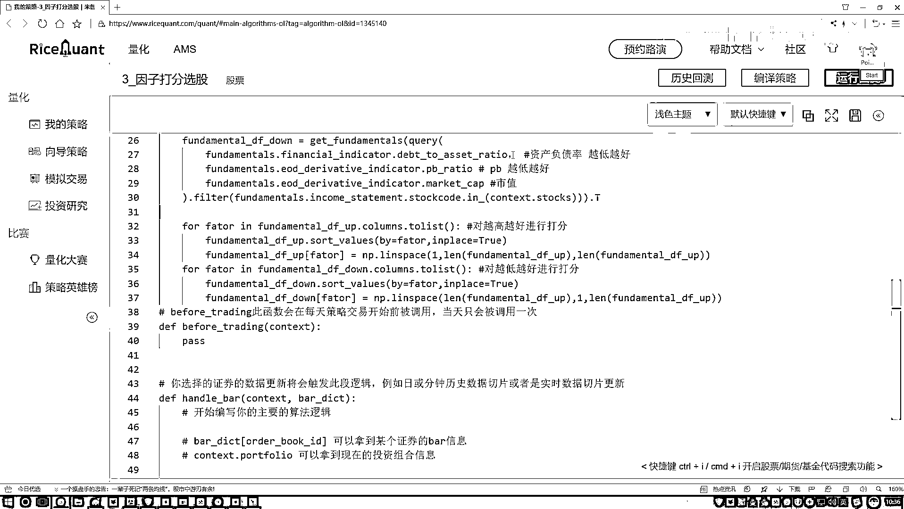

# P51：4-因子打分与排序 - 人工智能博士 - BV1aP411z7sz

接下来咱们就要去变力啊，我们现在做出来两个DataFrame，因为一个是越高的一个是越低的，所以说咱们得分别去，变力这个DataFrame，然后呢对其中的因子做排名，做打分吧，来，咱来完成这样一个操作。

首先呢咱来写一下吧，就是我做一个变力，变力我就要拿到其中的每个因子是吧，好了，在这个因子，在我们的DataFrame当中，先从这个up来吧，先从越高越好的来，我们要变力是什么啊，它的结构是多少。

是一个300乘上一个3的吧，我们是变力数据还是变力因子啊，是要变力这些因子吧，所以说现在我要拿到每一个因子的名字，在这里呢因子的名字，就是当前我拿到这个，DataFrame来说，它的一个列名。

我把这个列名转换成一个列子的，这样我就可以去变力，其中的每一列了吧，就是每一个因子，然后呢我拿到当前的一个因子数据，我要对当前的结果做一个排序吧，好了，在当前的DataFrame当中，我说啊。

我现在要去做一个排序，在这里咱们做这个排序，做排序过程当中啊，它是一个SortValues，Values拿进来，那现在好了，这个DataFrame，你要排序啊。

你是不是得说你要按照哪个列做这样一个排序啊，那现在我们有三个列，那就是按照当前的，我的一个Factor做这样一个排序，指定好你的一个By参数就行了，然后排序完之后，这块我就不给它返回值了。

直接在这块咱写了一个InPlace，等于一个true就行，InPlace这个意思就是，如果说你不写这个InPlace等于true，相当于没有这个参数，你只执行这样一个语句，那它就是一个打印的操作。

它在原子数据当中啊，就是不会把你的一个排序结果保留下来，除非你做一个复值，你说这个Fundamental再等于一个Fundamental，然后做一个复值才行，如果说你不想做这个复值。

那你只要在这个Fundamental里面，把这个Fundamental的数据，把它写了一个Fundamental，然后把它写了一个Fundamental，然后再把这个Fundamental的数据。

把它写了一个Fundamental，然后再把这个Fundamental的数据，把它写了一个Fundamental，然后再把这个Fundamental的数据，把它写了一个Fundamental。

然后再把这个Fundamental的数据，把它写了一个Fundamental，然后再把这个Fundamental的数据，把它写了一个Fundamental，我直接把它改成什么，改成它的一个平分值就行了。

平分值，这块这样吧，给大家先看一下，咱们这个Numpy这个函数，然后它的一个用法，在这里就是给大家看一下，import一下这个Numpy as一个NP，在这里我直接给大家打印一下。

Numpy当中有一个叫LessBase的方法，直接给大家写一下，LessBase当中，p-a-c-e，LessBase当中有三个参数，我先把这三个参数给大家写出来，然后我们来去看一看。

就是当前咱得到的一个结果，比如说我传进来一个1，300，300，我们来看一下，到什么，从1到300，选了多少个数，就是取值范围，是从1到300，然后选了300个数，所以说得到结果就12346789。

一直到这个300，那我们一会儿要干什么，通过这个Numpy的LessBase当中，我们去做一个打分，就是排序完之后，如果说它是一个越大越好的，那越大的值，我给它一个300分，如果越小越好的，我越小的值。

给它300分，那怎么样描述，越大越小呢，还有越小越好呢，你把这个顺序稍微换一换，在这里，这是一个1到300，是吧，得好了，下一个300到1，是这样，我们可以自己去控制，在当前我们的打印的一个结果。

是从这个1到300的，还是从一个300到1的，LessBase当中，咱直接的，就可以去做吧，非常方便，还说咱就能帮助我们完成这样一个事，然后行了，回来我们写一下吧，在这里，咱们现在要得到这个得分了。

那就是Numpy的LessBase当中，在这个LessBase当中，spce，我看之前工具包，之前工具包还没导入，在这块我们得自己写一下，import一下这个Numpy，s一个np。

我再把这个pandas也导进来吧，import一下我们的一个pandas，然后s一个pd，就行了，这是我们要用到两个工具包，在这里咱们先是Numpy。spce，在这里咱们先是Numpy。

lessbase当中，第一个，就是一个，我们现在是希望它是一个，我看着着，是越高越好的吧，那也就是从1到上咱们的一个300，然后这块，我不写300了，我就写咱们一共有多少股票，一共就是有这么多个股票。

然后其中我们取的是一个，然后其中我们取的是一个，这个一共有300个数，相当于就是排名，一会儿我是从小到大个去排，这是因子最小的，因子中间的，因子最大的，然后我们得分就是，这样是1，然后中间可能是150。

然后这块是个300，这是咱们的一个排名，直接做这样的一个Numpy。lessbase，相当于我给它设计了一个打分，好了，那咱们现在，做完了这个打分操之后，接下来，打完分之后，我看一下这里。

这块怎么又写这个300了呢，把这个参数改一改，咱不用300，用一共的个数，这个是靠谱的，现在我们得到了一个越高越好的，这一块我写一下就是，对越高越好，进行打分，然后呢，接下来我复制一下，咱还有什么。

是不是还有一个越低越好，把它也拿过来，还是一个负循环，在这里我说改一改，这是越低越好，做个打分，越低越好的时候，我们把这个DataFrame稍微改一改，这里咱们要去变一只Done。

这个DataFrame了，这个Done的Value，这个东西都没有去变的，在这块所有的参数，对我们来说都一样的，然后这里我们改一改，之前是从这个，要300是吧，那现在既然越低越好了，那越低的。

那肯定有多少，越低的应该是一个300，我把这个参数去掉，然后把这个1放到这个中间，相当于从这个300到1，咱要这么去打分，这就完事了吧，这里我们写了两个顺序，就是要是越低越好，还是一个越高越好。

咱们把这两个得分，分别算出来了，那现在相当于我们还是一个，一个表是300*3的，然后两个表都是300*3的，那接下来一会儿我要去做这个，汇总总分，所以说呢，我们得把这两个表怎么样，先合并一下吧。

然后去算，我的一个总分，说不定就完事了，来，咱们去合并，然后算总分。

