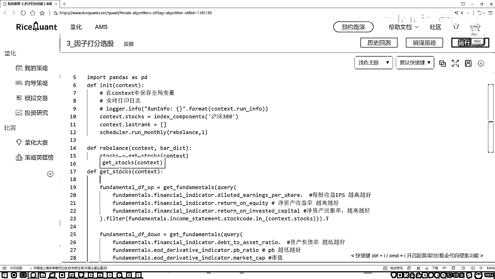

# P52：5-完成选股方法 - 人工智能博士 - BV1aP411z7sz

接下来咱们来把这两张表给它做一个拼接操作，我们写一下这块我们要做一个拼接操作，拼接操作就是用一个DataFrame去转另外一个DataFrame就完事了，咱们把这个复制一下就是让我们这个down。

然后我说它点然后去转一下，转当中把我们第二DataFrame给它转进来这就行了，好了现在我们把两个DataFrame已经拼接起来了，我们给它起个新的名字吧，现在在这个DataFrame当中我们要做的。

其实上就是一个排名操作吧，好了我们给它指个名字就做一个电风转就可以，好了现在我们已经有了一个大表了，但是这个大表当中还没有咱们的排名的信息吧，在这块我说我先建一个列。

这个当中就叫做咱们现在排名的一个结果，我叫做一个得分值吧，暂时先让这个得分值它是一个都是零的，然后我们把这个得分值实际给它计算出来，在这里我们就是，这给我提示什么东西，这块我们转进来的就是指定好。

Numpy。js当中你矩阵的一个维度，我们指定成一个300*1的就行了，这块就是一共多少样本数据，然后接下来再写一个1把这一列数据给它构建出来，那好了现在我们这一列已经构建出来了。

但是这一列里边的数据全是1的，我们得写一下这块我们要去计算总分，计算总分然后并排序，现在我们每一个指标分都有了是吧，那接下来我要把这些指标的分给它合在一起了，好了把它们计算一起。

计算一起其实上我需要什么，就是我看一下当前比如说咱这六个指标，六个指标做一个加法算一个求和操作，这就完事了吧，好了咱们写一下这块我看不上一下，然后接下来我说把这个横着的。

把它们其中一个一个的全部加到一起行吧，加到一起我说取最后的一个总和，这就完事了，然后接下来我再对这个总和干什么，做一个排序的操作吧，好这里我说要做一个sort values，做一个排序。

排序当中现在你告诉我你要去by哪个指标了，那既然我们已经排序到一起了，那最后排序完之后看不上完之后咱得到什么，score里边就是前面所有的累加吧，好了把这个score拿过来就行了。

然后我们希望这个排序它是升序还是降序，应该是一个降序吧，因为我们现在我们要找的是什么，排名最就是分数最高的这些结果吧，所以说咱们也指定成一个false，我们要做一个降序，好了这就完事了。

虽然降序之后现在我说给它一个返回值吧，这个就是我第一个date frame，把这个返回值咱们给它做出来了，行了那现在我们已经得到了总分的一个结果，那接下来把这个东西直接叫做一个。

把这个其实我们不需要其他指标，我们只需要什么，只需要它的一个score值就行了，把其中的一列拿过来，好了这一列这是一个就是一个，series在这个series当中我们取了某一列，这个列拿着之后接下来。

我说你做一个返回吧，返回什么，哎我们返回的是前十名那个得分啊，还是前十名那个股票啊，我们要选的是前十名那股票吧，所以这里我们要把它的index也就是股票给拿到手，并且呢给它to list一下。

在这里我再取吧取一个前十，那就是从0到10，哎这就完事了，这样我们就完成了咱们当前就是，get stocks当中咱们的基本操作了，相当于啊第一步我们是去啊读我们的印子数据。

读完印子数据之后呢对印子数据啊，我们做一个打分操作，把最终啊打完分的结果，我说拼接起来最终呢再完成一个排序，那现在啊它返回结果就是，我们get stocks当中你执行一次，我们现在就你返回哎呀当前啊。

就是当前某一天呢，啊当前这些指标，然后它具体的前十是谁我们就做完了吧，好了这里我们的最关键的一个函数已经做完了。

就是怎么样获取哎当前我的前十。

