# P53：6-完成策略交易展示结果 - 人工智能博士 - BV1aP411z7sz

接下来咱们来继续完成我们的REBECA函数啊，第一步我们现在选出来了，当前呃我要去的就是当前我们排名的一个股票，然后呢，接下来啊咱们不是把这股票拿到手了，那接下来我们是不是得看一下。

哎呦现在我这个排名可能做了一些变化吧。

那我们现在要再写函数，就是呃，我们手里有的和现在新的一个排名当中诶，有什么样的一个差异，一会儿呢咱们是不是要基于这个差异，唉实际的咱们要去选一些股票，或者说实际的我们要去购买一些股票了，好了。

咱们来把这个函数完成，这个函数其实说白了就是呃去看一下，当前你手里有的股票有哪些，然后呢我们做一个差异好，我们先写第一个就是现在咱们手里有的啊，咱先把所有的股票给拿过来。

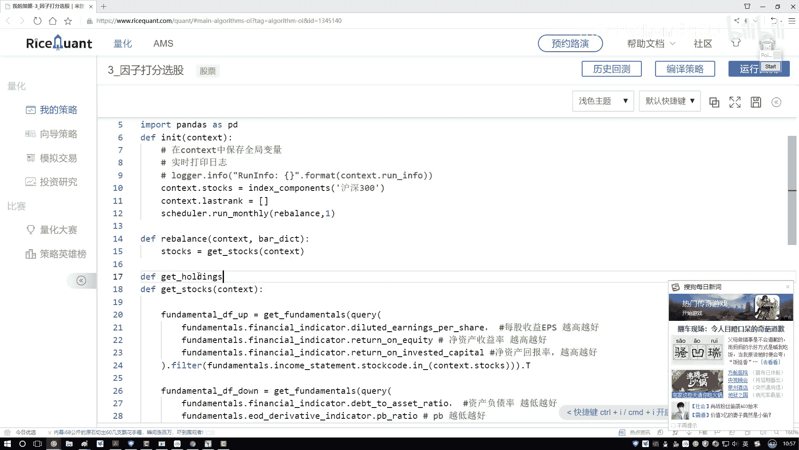

把这个context的给我传进去好了，在这个函数当中啊，咱们想一想做什么。

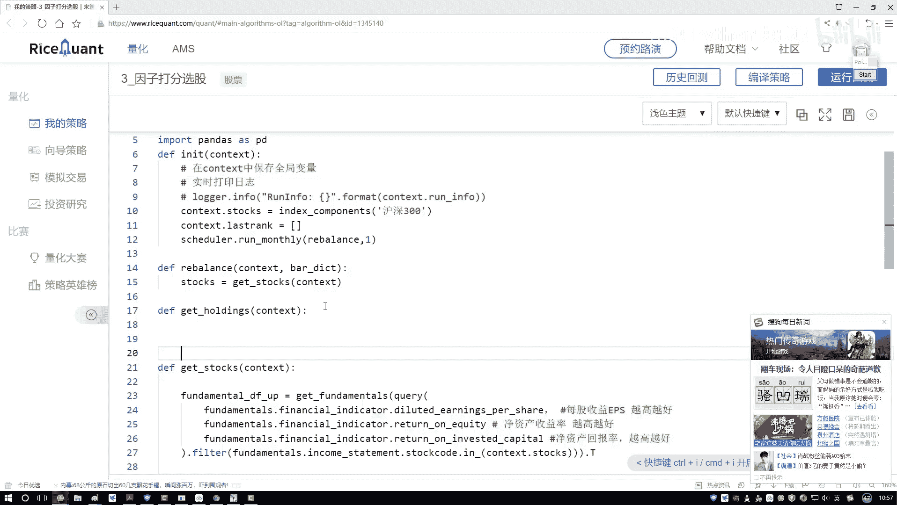

首先第一步哎，我说现在这个股票当中，我师傅说看一下我这个position它是等于多少啊，PSATON好了，拿到我们contest当中找吧，contest里边咱找一下咱们的用户信息，里边这些个指标。

在这个指标当中，我们是不是把第一个position拿过来啊，跟咱之前的方法是一样的好了，然后我说现在我呃写个名字吧，在这个holding当中混动当中，先现在它是一个加S吧，现在它是一个list。

然后呢一会儿我说把这个list做一个填充，然后做一个判断吧，for咱们的一个position呃，在这一块for我们这个position in这些position当中好了，看一看咱们现在这些车有的吧。

如果可说唉我持有的数量只要怎么样，它大于零，是不是就行了好了，把我这个pose拿过来呃，然后看一下，如果看一下这里哎，我说先找到吧，找到把production传进去看看什么。

看一看咱们拥有的一个质量等于多少吧，Q u n t i t y，然后去判断一下，如果说大于零二，那是不是说咱们先持有啊，持有的时候给它加进就行了哦，这块这块应该是个判断，如果说诶他是大于零的。

大于零的情况下，咱就是持有的持有的，然后在这里我说做一个判断操作，俄派的操作，把咱当前的这个股票给他传进来，是不是可以了好了，现在啊把咱们股票拿到手之后，那我说最后我是turn一下吧。

return就是咱们当前你持有这些东西啊。

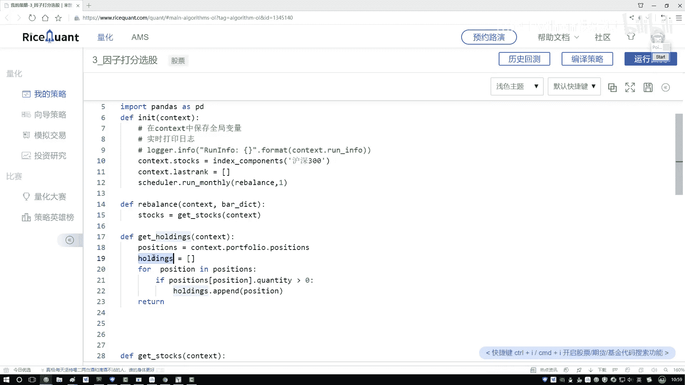

就完事了好了，咱来练习啊，现在我得到了就是新的一轮DOS是排名收益结果，然后呢，接下来我说现在把我这个holdings再拿到手，它等于去get一下啊，这就完事了，get一下咱当下结果。

然后把这个context再传进去，那现在我说要算什么，哎，我说我得去算一下我要买什么了，能写一个to b吧，我要接下来去买的，买的就是当前什么哎，你手里有的这些东西，跟你现在新的一名之间肯定有差异吧。

重复的你就不用去管了，你要管它什么差异的吧，所以说啊在这个DOS当中，我们要在这个DOS当中，我们去算剪掉谁呢，剪掉咱现在手里有的，这不就是我现在要去买的吗，然后不管我要去买，然后我可能还要去卖。

去卖是什么意思，现在这个holding当中不在哪了，不在style当中了，那holding里边不在STLE当中的，是不是用这个holding减去一个DOS当中啊，好了，我们把一个买的和卖的都指定完了。

那先卖吧，应该是先卖后买吧，好了，然后我一个full stock，因在咱们现在要去卖的当中。

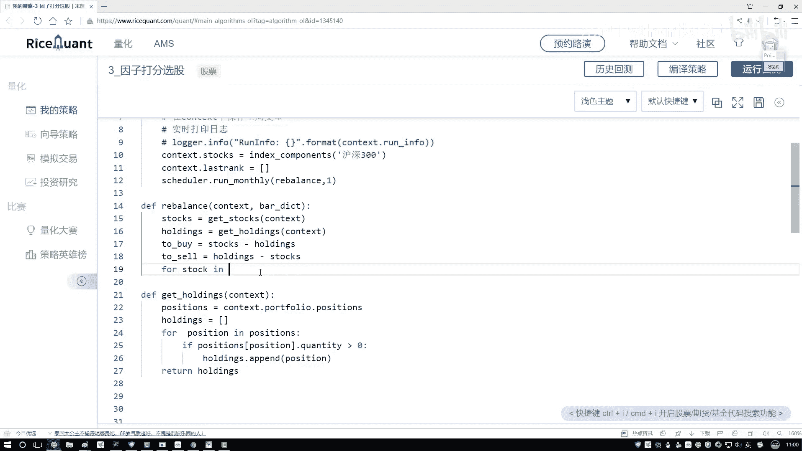

然后再去执行这样一个卖操作，写上了吧，然后一个order order。

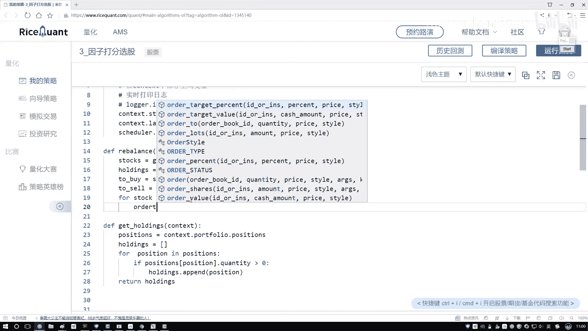

Target value of order texpercent，然后全卖掉，那percent就是给他变成零，Talk，给它复制过来，然后全卖掉，占有的量变成0%就完事了，这就是一个mt操作。

然后呢接下来直接买啊，这个可以先判断一下，如果说啊咱们现在没有买的j return运行，如果这个东西to bed浪值，如果它等于等于零二，一只股票都没有去买，那return回去相当于咱做完了就完事了。

然后如果说咱要有买的，要我买的时候再去看一看呃，我现在手里有多少钱，然后呢咱们平均去买，所以行了，哎比如说给大家算一下吧，咱可以咱现在指定个指标，就是在这个context当中啊，你所有的信息都能调出来。

你的一些用户的信息，在这里把咱们信息当中好看一下呃，找一个Y6值，咱们来我把这个直接复制过来吧，这里边它叫做一个Y6值哦，应该是它的全称，然后点一下它的全称，然后杠一个value就行了好了。

看一下咱们现在呃有多少的一个资产，然后呢有多少资产之后，然后我们要指定哦，对于我当前这个资产要判断什么，判断一下呃，当前我买股票的时候，我买一个股，然后咱买多少吧好了，然后咱一共是有这么多股票啊。

投票当中一共是有这么股票，那他俩比一下，那就是实际一个股票当中，我们应该去买多少吧，好了这块我指定的参数叫做一个平均的，那一会儿咱就平均去买啊，average找一个Y9值就行了。

接下来呢我们还是执行这个函数，只不过说呃还是把这个复制过来吧，还是要去便利一下，遍地在我们接下来这块不是to sell了，就是一个to b的，在我们要去买的这些个股票当中哦。

这就不是一个percent了，我们之前不是算了，你要买多少吗，那就是一个value lost style当中再执行出来了，然后每一个买多少哎，咱也指定出来，是不是就行了。

这样我们就指定了咱们去买的一个操作吧，那好了，现在就是基本上我们已经把所有操作。

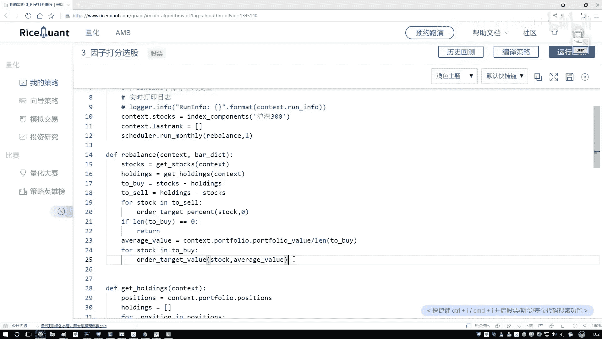

咱都列完了吧，嗯回顾一下吧，看一看我们还没有什么落到一开始在context当中，哎我说指定个股票池子或者赛当中，然后这里呢哎有一个那rank，就是我们上一期咱们的一个排名嗯。

咱们现在暂时还没用上这个结果是吧，一会咱看看会不会用不用给它注释掉吧，然后说每个月咱要做一个调仓的操作。

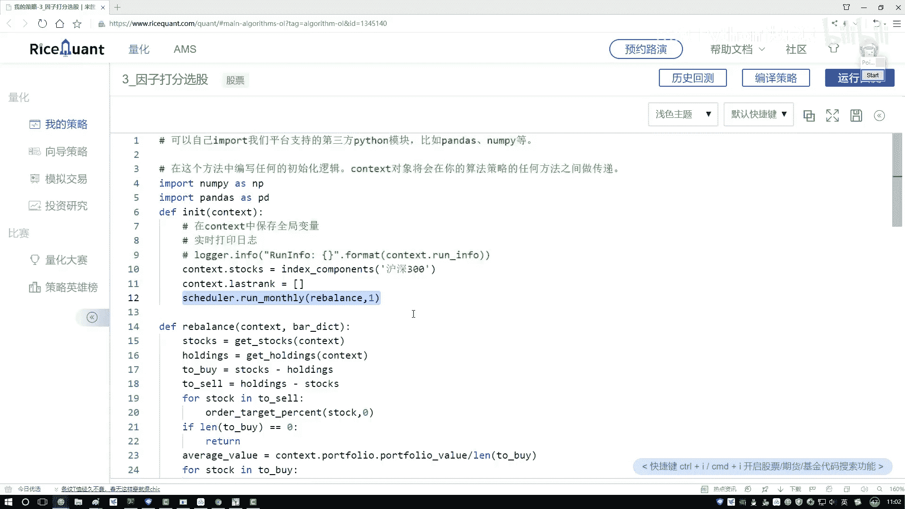

然后每个月都在做这个调仓操作过程当中，我说我先去算算几个值，哎先算买什么和卖什么，不是就是现在我算一个新的排名的值。

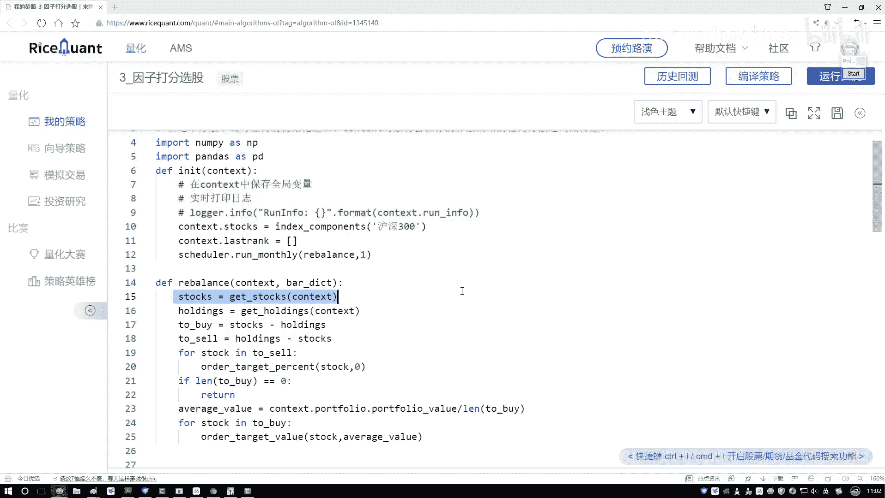

然后呢再算我手里有什么，然后接下来我说基于他们的一个差异，然后去买还是去卖。

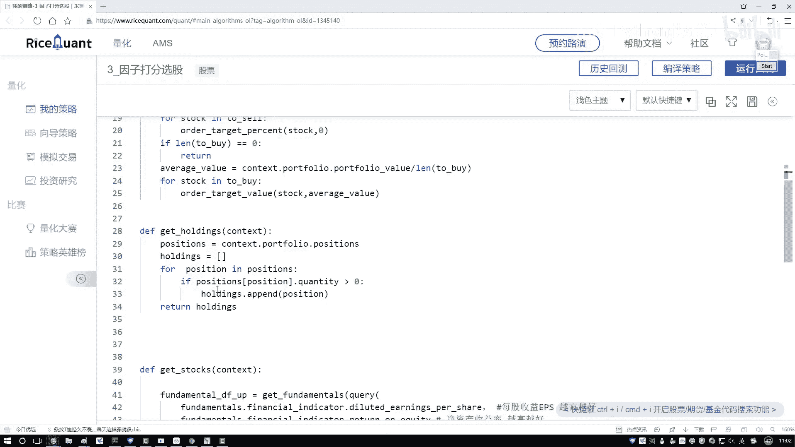

唉这些操作都没什么问题，然后呢主要还说啊，就是我们这个get source灯状，咱去查这些指标，然后把这些做一些筛选是吧行了，基本上没什么问题啊。

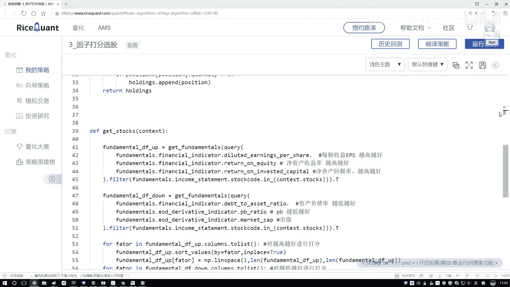

咱写完了，这样咱运行一下，看一看有没有什么问题，我估计可能会报错。

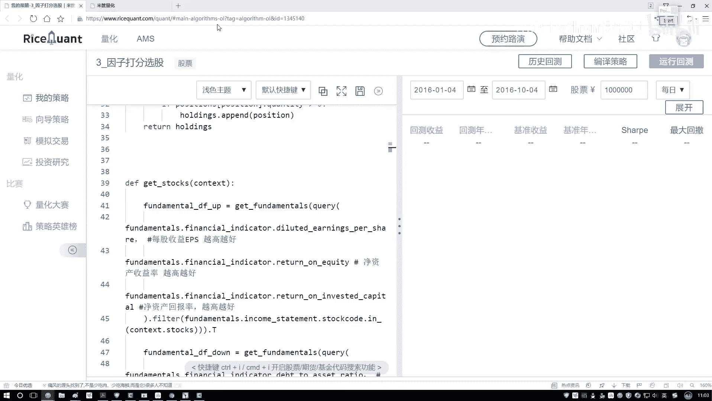

遇到报错没关系，咱们来改一改，我现在就pass，没用上的，咱就全都给他pass掉。

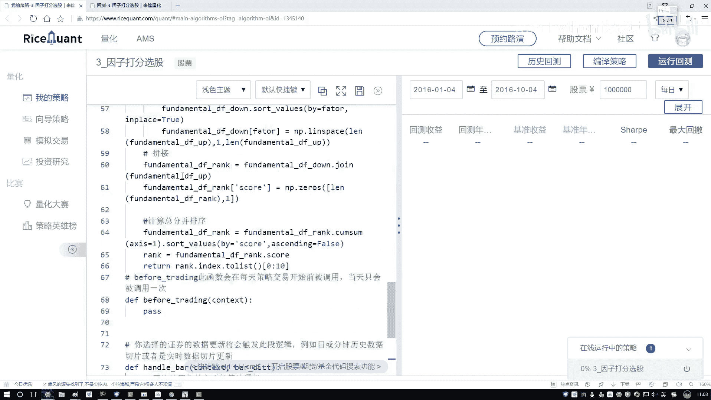

然后看下结果吧，这会儿可能会报错，来看一看看书日，结果写出报错了，他主要现在这块有一个无效的字符哦，找一找他说每股收益P。

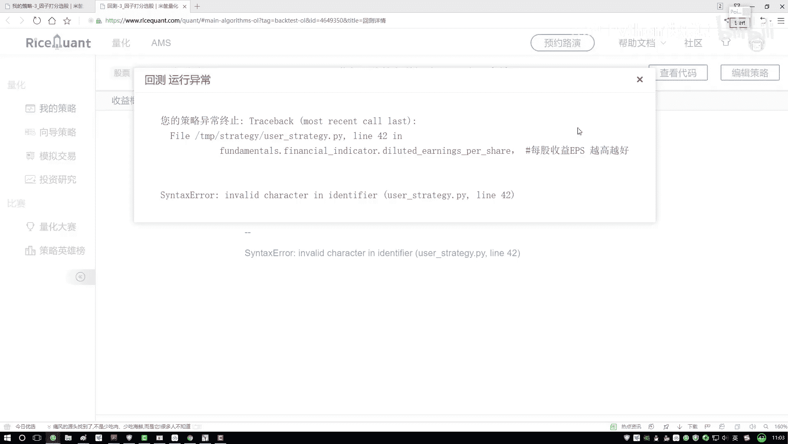

那看一下，在咱们当前的给他还是放放右边每股收益EPS。

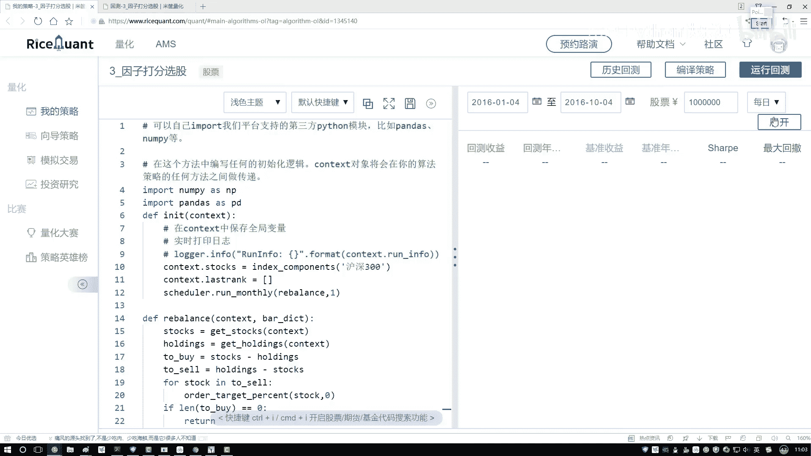

这来找一找，在当前这块他说有一个特殊字符呃，FMX点，然后去查找哦，这个写错了是什么，写成了一个中文逗号是吧，好再执行一下哦，我顺便哎算了，这边先给他扣掉吧，我发现几个毛病，这块他也是一个中文逗号是吧。

真的没注意，然后这一块，然后这里这块又少写了一个逗号，我们再再加上这一块，他也少写了，逗号，也加上，这里也是一样的，咱有点小毛病，给它稍微改一改好了。

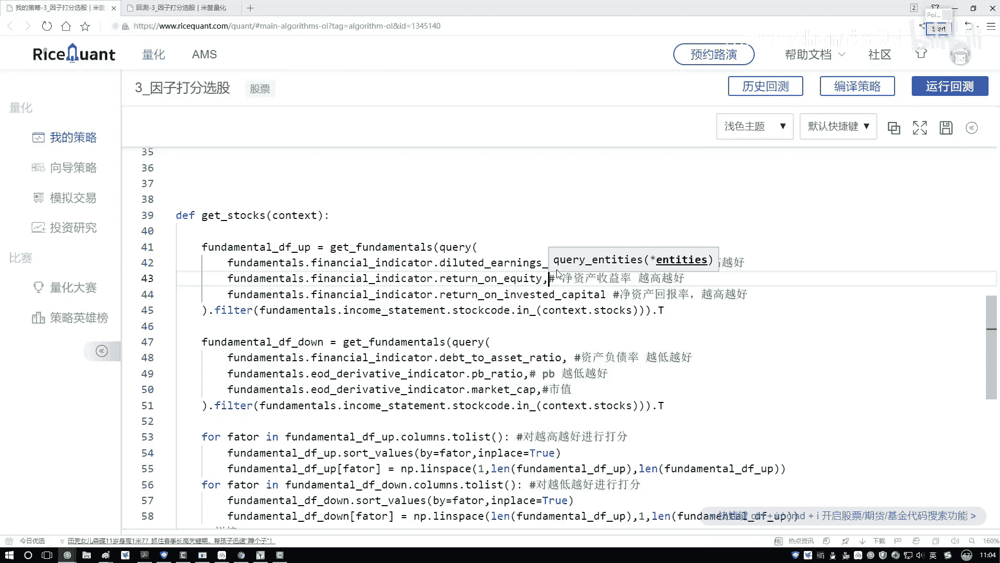

这块都有些逗号，然后再往下看看啊，这都是在执行吧，看有没有什么问题呃，他只想让我顺便先过一下。

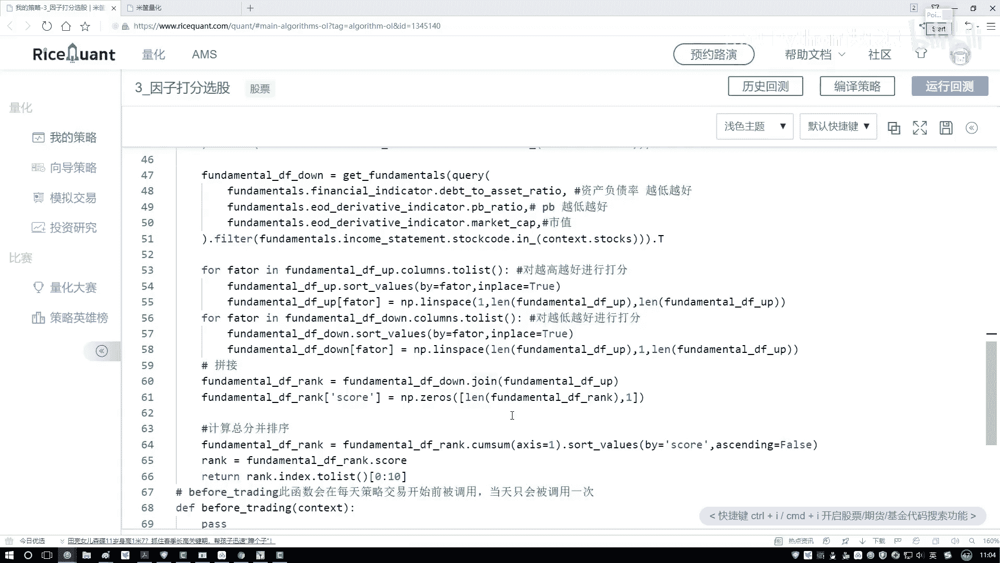

简单的找一找有没有什么太大问题，然后这里啊看起来都没什么问题。

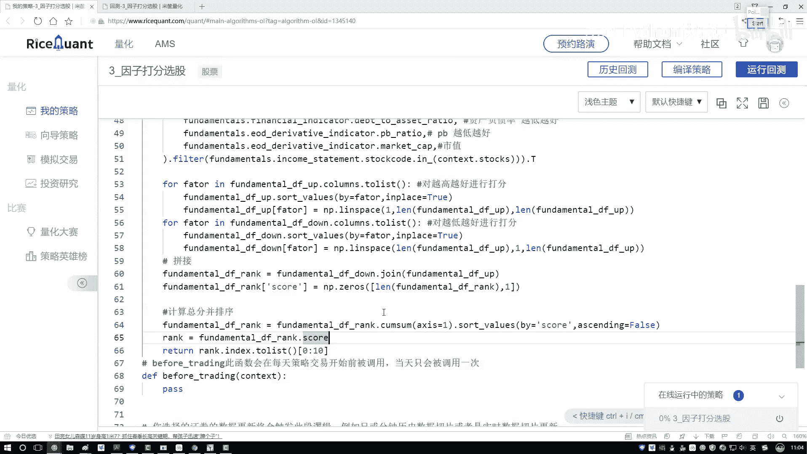

先看结果吧，看报报错吧，看报错了，咱们来改呃，他说不支持类型，然后list我看在哪儿好，在这个to by当中啊。

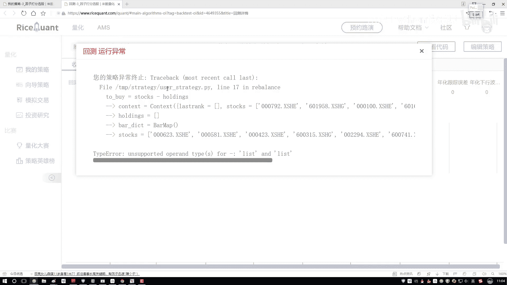

等于这样一个减法来看一下，我们现在还设计了一个图by。

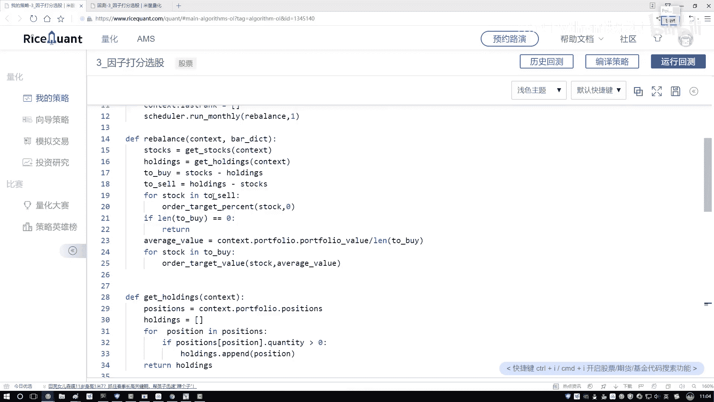

我说现在我要去买什么，等于我的一个STOS减去我当前的一个holding啊，这块不行，那我们得做这样一件事，我也给它做成一个set集合，这样吧，咱把它全部处理成一个set集合。

这一块我说也除以剩下的集合除以成set的，没问题吧，好了这样咱来看一下，应该就能执行我们的一个差异的一个操作了，这个关掉看一看，哎呀咱这块还有个东西忘设了，就是咱们的一个时间呃，时间也不管了。

就是从2016年1月4号吧，到2016年1月10号，这无所谓了，反正就是这些时间吧。

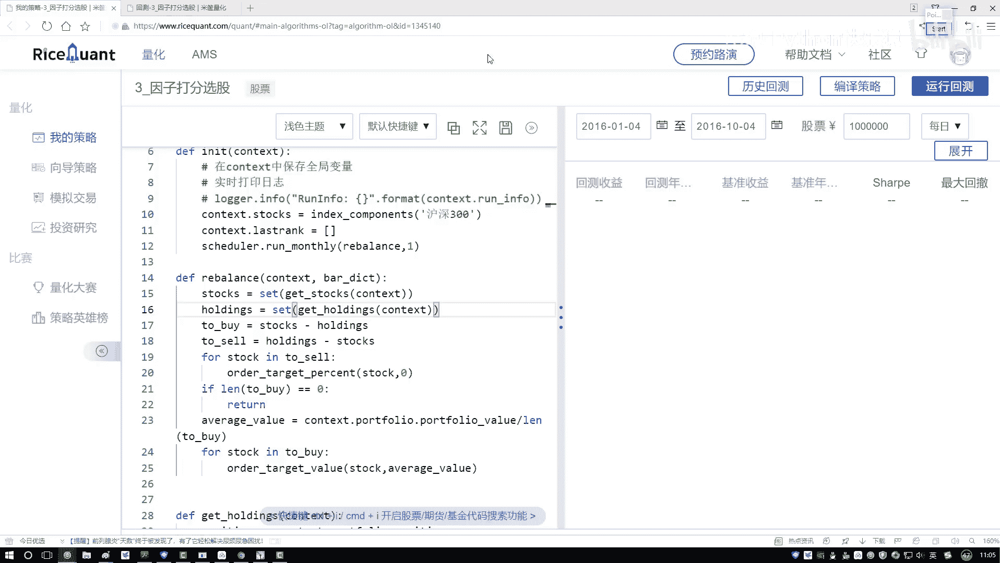

咱不改了，然后一会儿我再改个时间。