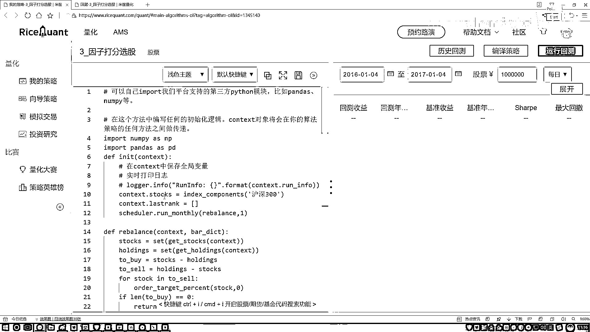

# P54：7-策略总结与分析 - 人工智能博士 - BV1aP411z7sz

行做完了做完之后没报错是吧没报错说明咱这个东西警告就不看了啊基本上没什么太大问题，先看收益吧收益来说基准的怎么样基准的是一个赔的咱们怎么样，咱们起码把这个没赚太多但是稳住了吧。

然后最大回折区间还行稍微大百分之十七点多看着还可以，然后我们的超额收益基本上能维持到百分之六七左右哎看着还不错是吧，这个是我们选择了时间段比较短的这样咱再选择一个时间比较长的。

我说20年1月4号吧然后往后找一找到这个2018年吧，然后咱们算两年的一个时间1月4号行了一般咱做这个回测啊，很少说做几个月的如果你做几个月你也看不出来一般都是5年左右或者三五年。

这些是比较常见的今天这个速度值钱还挺快啊很快就能得出来当前咱们这些结果，然后这块咱已经做完了那你看现在就是哎呦这个2016年1月4号到这个2018年1月4号。

这个时间点感觉咱得到的结果啊和这个基准收益来说差不太多啊，没有什么太大的没有什么太大的一个起色是不是我再稍微改一改吧我再换一个时间，那比如说从这个2018年1月4号到这个2020年1月4号吧。

再来看一看看这回咱们的一个区间会有些变化，然后我主要我主要看就是咱们的一个逻辑逻辑来说应该没有什么问题啊，该指定出来指标咱现在全部也都是算出来了啊，基本上没什么太大的问题应该，行了看一下咱们大压值啊。

这回效果来说也不算特别明显吧啊，基准的一个收益是零点多，咱们这回的收益2点多，你看起来效果也没有太明显是吧，可能啊，这个2018年我觉得贵股市的影响还是蛮大的。

这样咱们把这个策略稍微改一改咱们补约到这个2018年了，咱们稍微的改成16和17吧，因为18年这个熊市估计整体来说可能都不行，咱们稍微改一改，我这东西从17年1月1号，再到这个17年1月4号吧。

看这段时间这段时间估计市场可能会稍微好一点，我们来看这个结果，然后刚才给大家说的是不是说咱们看什么，看一下我排名的一个前十，哎，咱们效果怎么样吧，那一会儿归大家可能有种想法啊，就是前十的哎，你说效果好。

那你说后十的会怎么样啊，你看这回就是16到17，就是这一年怎么样，16年这一年啊，看起来还不错吧，你看咱们的回色收益要比基本收益要高一些啊，这样的结果，然后这块我们稍微改一改啊，就是在这里哎。

我们把这个，策略之前我们不是哎哪去了，之前我们不是选的是吧，是从这个理论到时嘛，相当于前十是吧，好这个我们换一下，我说谁啊，从这个负十，然后到最后啊，相当于是选那些最差的，我们来看结果啊。

之前咱们的回色收益大概是十点多是吧，现在看一看就是咱用那些指标最差的，我们看能不能比一些基准的啊，会更差一点，咱来看一看，啊，基本做出来了是吧，基准的负的负的快十是吧，好了，你现在用更差的。

那比基准还要再差啊，这个是咱们当前咱们的一个结果，然后这里还有一些交易详情，然后还有你看咱们来看一看吧，是不是每月经调调仓啊，额这里交易详情啊，4月5月6月7月8月9月10月11月，哎，是吧。

每月经调仓，然后池塘详情，然后一开始的时候啊，池塘详情总算怎么样的，账户信息你的一个咱们来看吧，你的一个总价看最后变多少了，完了，100万最后让你获得成77万了啊，这是一个你的账户里的信息，像这里啊。

咱把这个改回来吧，到时候大家玩的时候，我把待会发给大家，到时候大家玩的时候啊，就是，默认啊，咱们玩这么前十个就行了，这个效果能够稍微好一些啊，当然我们只是哎，通过一些那些包袱当中挤出来了，哎。

有些哪些指标越高越好，哪些指标是越低越好，哎，给大家做了简单啊，我们的一个回测的一个策略，这个到时候大家来玩一玩吧，觉着打分法啊，用的还是比较多的，也是比较直接的，就能得到一个稍微啊，还不错的一个结果。

当然啊，你是跟这个，可能你会遇到一些熊市的影响，使得你的一个收益，哎，或者说你的一个回测整体上的效果，可能会有一段时间啊，会出现比较一般的，这个反正也都是哎，都是市场决定的吧，这也都是比较常见一些现象。

行了，这点跟大家说了一下，咱们的一个打分策略啊，在代码当中。

哎，我们该怎么样去做。