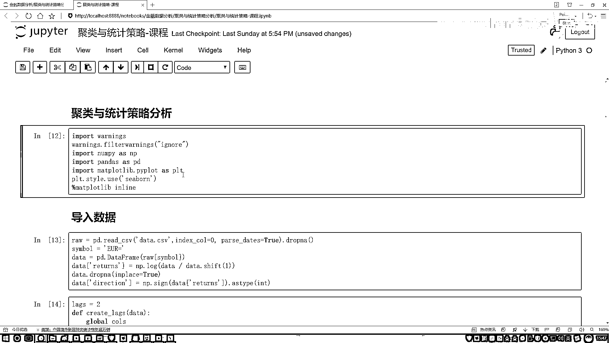

# P57：3-统计效果展示 - 人工智能博士 - BV1aP411z7sz

好了，那接受拿手之后接下来干什么，那是不是说我现在可以去做一个统计了，统计谁啊，统计这里哪一种可能性多，哪一种可能性少了吧，要做这样一件事，接下来咱们还得对我们的数据做一点稍微变化。

因为现在其实我要的是谁啊，要观察这两个是前一个特征，这是一个结果吧，但是现在好像是你把它们都当做是一个特征，给我组合起来了吧，好，这里我们对这个数据啊稍微的做一点变换，我说这里啊就是。

对啊我们当前的一个group当中，我们的最后这一列，这一列不是我们的一个结果吗，好了，我说把这个结果对它做一点操作，对这个结果，然后把它给它安stack一下就可以了，点size当中，然后去。

现在先看我结果吧，这个结果要比这个代码讲的更简单一点，直接看结果就行，然后里面不是有这个failure，我说把这个值给它填进去吧，值没有的它就是一个0，这样咱执行一下，执行完之后你来看。

这个failure意思就是说这一块，有些地方如果说它没有值，它可能会把这一个东西之前咱不是会不显示出来吗，现在我全让它显示出来哦，此时咱们来看，此时我们得到什么，那你看这个东西像是什么了。

这就是我们的一个目标，展示挺明显吧，前面两个呢就是我的一个特征，我想看一下对于我特征不同变化的时候，我的一个什么，我的一个像是最终的一个结果，最终的目标它是怎么样去变的，指定个result。

然后来执行一下，这个这也来看过了不看了，那接下来呢，我说现在要干什么，是不是得去做这样一个统计了，好了，我说咱们现在要去执行一些策略了，那安排一下位置，然后data我要传进去。

data当中还是刚才我们指定的，指定好的做好特征的这两列，前一天的还有前两天的，然后呢我算一下吧，算什么呢，算一下它两个的一个和，是不是等于2，是不是等于2的意思，相当于就是前两天，它是否是一个这样。

再把这个结果再展示出来一下，把这个结果再展示出来一下，你看在这个结果又展示一下，我说我可以看一下，他们的当前的一个趋势，那你说就是前一天涨了，第二天也涨了的时候，那你看接了一天，大概率怎么样。

大概率是赔的，那我们现在要统计了，我说看了一下，哎呦前两天，这样拿不同颜色的画，红色我拿绿色的画赔的，你看就是这个，你看就是这里吧，-1咱顶就不看了，你就看-1和1谁多，我把多的那一列先都给它画出来。

然后看-1的我用绿色画，然后+1的我用红色画，然后这里这是一个+1是吧，这里也是个+1，这里也是一个+1，看起来好像右边三个都是涨的，然后左边这个是跌了，因为这个278，它是小于这个251。

咱现在据统计的，那就得看哪一种可能性大，什么意思，也就是说，有这种可能性，如果前一天它是涨了，前两天它也是涨的情况下，第三天大概率会跌，好像跟我们实验当中的一个预感，也是差不多的，然后其他情况下。

都是会涨是不是，最后这里，我说我列一个，能安排点位置一下，我要去判断了，判断什么呢，前一天是1，第二天是1的时候，我们结果是什么，是一个跌了，跌了咱用-1来表示，涨了我用+1来表示。

所以这里我们要判断一下，能安排点位置一下，然后算什么呢，当前前一天和前两天的，然后算啥，算它的一个SUM盒，这个好判断，我说SUM当中，我去判断一下，它这俩加起来，是不是等于什么，是不是等于2。

等于2的时候怎么样了，是一个-1，赔了吧，然后不等于2的时候，我们是什么，是正了吧，那就是一个正义，所以这里我们多做了一个判断的符号，我然后给它复制成一个电明，复制成个电明，这个就是。

咱们当前的一个Position，然后我们基于这个频率，来去统计了一下，当前它是一个，应该是个跌还是个涨，到时候我是按照大盘走势，还是不按大盘走势，来去买这个股票，这个意思，这里就是你看我这块。

等于等于2，纯粹是根据这个结果，我自己数数数出来的，可能大家数据来了之后，数出来结果并不一定相同，这里就是简单看一下，我们的一个统计的方法，好了，这里，统计方法我们做完了，做完之后，咱们来算一算。

就是现在我们的一个走势，跟实际的 direction当中，到底有多少个是一致的，比如这里，我说data当中，我把 direction传进去，这是实际的情况，好了，拿实际情况，跟我们当前。

我们自己的写的情况，我们不是写好了，也是-1和1，看一看它俩当中，有多少是一致的，这样有多少一致的，那就是一个ValueCount，我把这块括号一下，然后。Value一下，然后。Count一下。

再来看一下它的一个结果，初的有1102次，代表什么，在走势当中，就是每一天都会变化，有1102天，我们的一个预测是对的，然后有1033天，我们的预测是一个错的，感觉像是一半一半是吧，但是看起来。

我们的一个基于统计的方法，要稍微的多预测了，对了几次，是不是，行了，既然你说你多预测对了几次，咱来看看结果，还是之前我把这个一还原就得了，把上面这个结果拿过来，然后我稍微改一改，把这两个值拿过来。

把这个名字一改，咱就完事，这里把咱们的名字一改，你看一下，这一块就是咱之前说这个东西，叫做一个剧类的结果，然后我说它不是个剧类，这是基于什么，我的一个统计的方法来去做的，然后这一块我们的Data。

Data当中选的列名也不一样了，然后乘的这个Returns，这个东西没变，然后接下来这里不一样，。SUM还原的操作还是一样，好了，来执行一下，执行完之后，怎么给我三说无穷，这里好像有点不太对劲，看一看。

当前这里，我说这一块是我第一个Returns，这里是这一块不对，这一块是咱这个结果，再来执行一下，行了，结果算出来了，Returns是你实际大盘一个走势，你是赔了一部分是吧，然后基于统计的方法。

能让你怎么样，赔的稍微少一点，反正也都是赔了，小于一的，那肯定就是赔了，现在直播说，我只赔了一丁丁，0。1几个百分点，是不是，但是如果你不按照统计策略，可能会赔的更多，这个给大家说了一下。

就是在我们的一个统计分析当中，可以用哪些个方法，其实说白了，就是比谁的可能性大，我算各种各样的可能性，这一块说给大家说了一下，就是GroupBy这个操作，咱们该怎么样去用，以及对我的一个结果。

咱们该怎么样进行指定，咱们怎么指定的，非常简单，简单的去数一数就行了吧，这一下就是咱们这一课当中，Python代码去怎么样去做的，一个剧类，还有统计分析的策略，这样的策略相对来说，不是那么特别靠谱。

主要给大家解释一下，他们的一个基本含义，以及在做的过程当中，咱的基本出发点，还有我们的一个简单的结果。

对给大家做了上一个展示。

