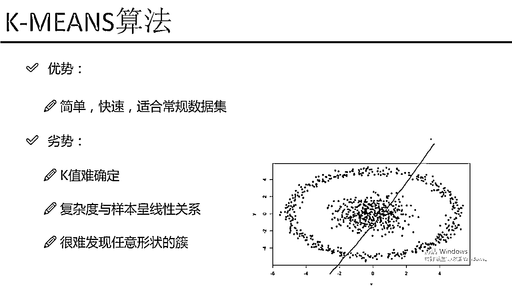

# P59：2-KMEANS工作流程 - 人工智能博士 - BV1aP411z7sz

那下面呢咱们来看一下我的这个K-mean算法，它的一个工作流程，咱们从这节图当中来看一下，首先呢就是我的一个原始数据，我有一堆点，一开始的情况下就是由于我是一个无间度的问题。

我并不知道每个点它属于每一个，就是不知道每个点它到底该属于哪个粗呢，那这回啊假设说我用K-mean算法，我需要指定个参数吧，我让k=2，k=2什么意思，k=2首先它会在你的算法当中初始化两个点。

比如说初始化两个点是一个x，是一个红色的和一个蓝色的，这两个点基本上都是随机的进行一个初始化，假设说我在B图当中，就随机初始化两个点，这两个点就落在了当前的一个位置，然后我要干什么。

然后我要基于这两个初始化点，算每一个其他的点都属于这个红色的还是蓝色的呢，怎么办呢，对一个点来说，比如说对于这个点，对于这个点来说，我怎么看它属于这个红色的还是蓝色呢，算它这样的一个距离。

比如说这个绿色的点，然后我去看了一下它到x的距离，这是一个到红色距离是一个第一，到蓝色距离是一个第二，那有什么样的一个趋势，肯定第一它是小于第二的吧，第一小于第二我们认为什么。

我们就认为当前的这个点它是属于红色的，为什么，因为距离越小，距离越小它可能越相似，所以说我说当前这个点它是属于一个红色的，那对于另外的一个点呢，对这个点来说，同样我还是去算这样的一个距离。

还是有这样的一个第一和一个第二，也就是说对于样本当中我要进行一个变力了，所有样本点都要进行变力，每一个点都要算，它跟我红色的点，它跟我红色的第一个初始化致新，和蓝色初始化致新的一个距离。

总能够算出来距离的一个大小吧，谁小我就说，它是属于哪一个处的，这个是我中间的一步，我要进行一个大量的迭代，把每一个样本点都算一遍，它属于特质，它离哪个致新比较近，那在C图当中我们就算出来了。

对于所有点来说，我们算完之后，一些离红色近的我化成了红色，一些离蓝色近的我给它化成了蓝色，这一步就是说，现在我已经划分出来了两堆，一堆红色的一堆蓝色的，那现在来说这堆红色的和蓝色的。

好像来说跟我的要求不太一样吧，其实咱们一眨眼可以看出来怎么样，一眨眼我应该看，这是一堆，这又是一堆吧，但是当前画的效果并不是很好吧，所以说我要干什么，我要进行一个更新，更新是什么。

更新是更新我衡量的一个依据，咱们刚才是不是说，我的一个致新的选择，是一个随机的选择吧，随机的选到了左上角和右上角，这个红色的和蓝色的，那你随机选择肯定是不太准的吧，那这一回我要进行一个更新，怎么更新呢。

咱们再来看，对于所有的红色点我们来看，这一块对于所有的一个红色点，我给它框出来了，我们来算重新的一个致新，最开始致新是这个吧，现在我认为它的致新我要进行更新了，怎么办呢，把我所有的红色点都拿出来。

都拿出来之后我重新算它一个致新，可不可以啊，完全可以吧，就是这些点它都是有一个数值，在X轴在Y轴上，都可以有一个数值，在高维也是一样的，我重新算一个致新，比如说重新算出来一个致新。

大概是在这样的一个位置，那可能这个位置，就是这个位置是我的红色的一个致新，那对于蓝色的数据样本点呢，同样的方式吧，我还是要算蓝色的一个致新，也就是说现在当我进行完第一次迭代之后。

我要重新再更新一遍我的一个致新了，咱们来看，在这个地图当中做点什么事啊，把致新进行了一个更新吧，我们来看红色点落到了这个位置它的致新，蓝色点落到了这样的一个位置，也就是说我要更新了我的一个致新。

那致新更新完之后要干什么呢，致新更新完之后要重新进行计算了，重新对于遍地样本当中所有点，比如说，原来红色点，原来红色点我们还要重新算了，我们来看它到红色的距离，和它到蓝色的距离谁大啊。

显然是到蓝色的距离，距离比较小吧，那这个时候原来第一次的时候它属于红色点，现在呢在我做更新的时候我就要给它做一个改变了，让它是等于一个蓝色点为什么，因为它离蓝色致新比较近呢。

所以说我就给它更新成了一个蓝色点，然后呢我接下来我来看，原来啊这块有一个蓝色点，但是它离红色点比较近，所以说为它再去更新的时候，它就变成了一个红色的点，也就是说当我更新完致新之后。

还要按照跟这个B图差不多的一个模式，再编辑一遍所有点到致新的一个距离，然后看谁小就把每一个点划分到对应的一个粗，这个就是我的一个D我要进行一个更新了，更新完之后啊咱们来看变成了这样的一个趋势。

变成了这样的一个趋势之后咱们要干什么，按照之前套路还要更新我的一个致新吧，又把我蓝色的致新更新到这个位置，红色致新又更新到这样的一个位置，更新完致新之后再进行编辑找每个点的一个归属，然后不断的更新下去。

直到我更新到某一步的时候，咱们所有样本点基本上都不再发生变化了，不再发生变化我们就说，这个更新已经基本上结束了，因为你再更新它也不会发生变化嘛，每次更新的时候，就是后几次更新的时候它的样本点就是。

这个属于红色永远属于红色，属于红色永远是这一堆，属于蓝色永远是那一堆，不再发生变化了，这个就是我K-Means这个工作的一个流程是长什么样子，这里咱们是假设是说K=2，那K=3什么意思。

K=3比如说在这里我又多了一个颜色，比如说多了一个黄色，多了一个黄色它的致新可能是在这样的一个位置，那可能一开始画堆的时候，我可能说这是一个黄色的堆，这是一个红色的堆，这又是一个蓝色的堆。

就可以分成三堆了，分成三堆各自在更新致新，我就可以得到一个有三堆，一个有三种颜色的一个2的结果了，那这个就是给大家看了一下，我们K-Means实际的一个工作流程。

从它的一个工作流程角度来说还是比较简单的，就只是咱们选致新，然后更新致新，更新完致新不断得下去，最终就可以得出来它的一个结果了，K-Means算法是我觉得当中一个非常简单的一个算法，原理非常简单。

但是它也是比较实用的，就是用起来用的也是比较广泛，然后咱们来说一下它的一个优点和缺点，首先优点来说，理解上非常简单，做这个事也比较快，直接选K值就可以了，需要我们考虑的东西并不是很多。

考虑一个K值就可以了，然后它适合什么，适合一些比较常规的数据集，什么叫常规数据集，像我们这个数据集，这个两度完全就是基本上能够，咱们看起来它就能够分得开，所以说这个是一个非常常规的一个数据集。

然后我们来看它优点，咱们就不多夸它了，主要来看它的一个缺点，缺点是什么，缺点第一个点它要设置参数，只要它需要设置参数，那这个问题都是比较难的，因为这个K值很难去确定，当你拿到了一个数据之后，你能稳。

就是你拿到数据之后，你可以给它做一个可视化展示，但是你由于不知道它的一个标签的一个，就是标签是什么，所以说你很难去知道，到底这里边你给它做一个十分，给它聚成十个簇，还是聚成五个簇，还是聚成八个簇。

到底这个K值该选择什么是比较合适的，这个点是非常难确定的，普遍情况下我们都需要设置多组，然后看一下它的一个效果的，然后它的一个复杂度，我们来刚才看了，就是复杂度是跟样本各处相关的。

因为每一次我们在更新一个置信的时候，在更新的置信的时候，是不是说所有样本都要跟我置信，进行一个计算，如果说你的样本是特别庞大的，它计算的一个复杂度是比较高的，因为它是跟样本呈现出来。

这样的一个线性的关系，样本越多计算越多，一旦样本是个几千万的，复杂度就相当高了，然后它最大的一个问题是什么，最大的一个问题，它非常难发现一个更易，或者说是比较奇怪的一个形状的错误，因为你的一个数据。

并不能完全保证它就是一个，就是归了八成的，这个不能这么说，就是一个非常规矩，非常普遍的一个错误，有可能你的错误是我又涂的这种形式，又涂它是一个环绕的形式，我们可以认为它里边。

正常咱们可以认为里边是一个错误，然后外边它又是一个错误，这一回如果说你拿K-means去做剧烈的时候，它没办法把里层和外层分得开，它会分成什么，它会根据我的一个，就是根据我的一个质迹会发生成这样的。

左边是一个错误，右边是一个错误，也就是说我的K-means算法，它在剧烈上虽然说用的比较广，但是它有一个问题，就是对于这种认计类型的错误，它很难给它发现出来，剧烈出来效果并不是很好。

这个是我K-means算法，它自身的一个缺点，就是对于有一些错误，我们还是不光，就是不能用这种K-means算法，尤其是你的错误，你可划出来，这个错误长得奇形怪状的，而且环绕的或者缠绕在一起的。

就是说有一些交叉的，这些我们很难用K-means给它挖掘出来，这个就给大家讲了一下我们K-means算法，它的一个工作流程，以及它的一个优缺点，还有它的一个基本概念都是长什么样子。

一个非常简单的这样的一个剧烈算法。

