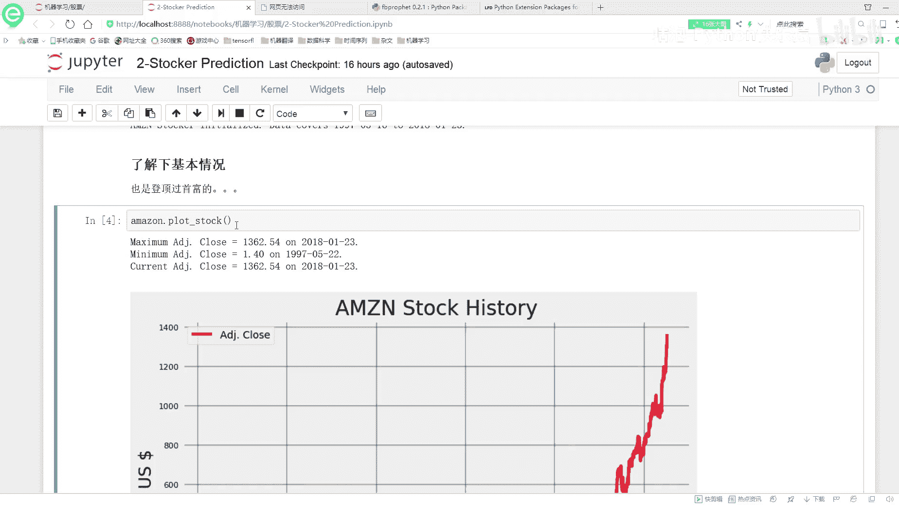
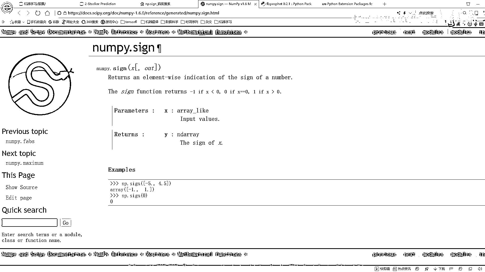
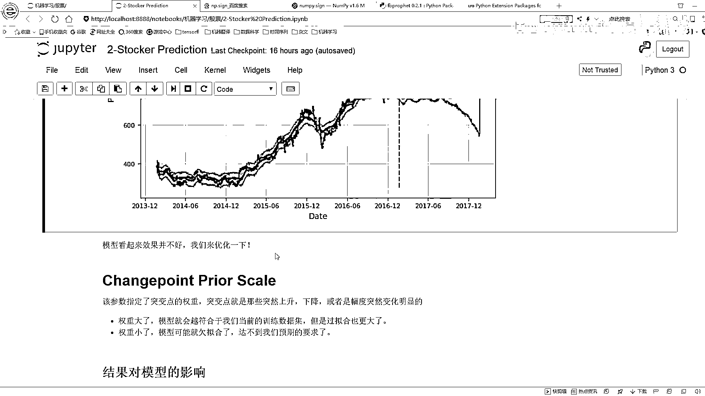

# P5：4-亚马逊股价趋势 - 人工智能博士 - BV1aP411z7sz

刚才咱们已经做出来了一个基本的模型，那下面呢我们要做的就是怎么样让，怎么样能让这个模型看起来能够更好一些，做这样一件事儿，还是那些库啊，就是这些库啊，大家之前都有安过了，那这回呢还是把他们倒进来啊。

就是我们继续来做这个事儿，然后这回呢我们换个股票吧，换一个亚马逊的股票，看一看是不是也是呈现出来这样一个事儿啊，然后这个亚马逊的这个股票就是AMZN，然后这个股票我觉得就更牛逼了，这个股票更牛逼了。

因为他那个老总毕竟也是登顶过全球首富的人嘛，现在首富是谁啊，我不太清楚啊，反正之前有段时间啊，就是亚马逊的老总吧，他们创始人，然后登顶过那个首富吧，所以说这个股票啊还是蛮有发展的，这个股票还是蛮狠的。

再来看一下他这个情况吧，这个情况，他是从这个九几年，他是我看一下最低价，最低价是去年5月22号，然后现在呢最高价是这个1月23，这是我1月23号那天执行的，然后呢，他的收盘价是1362。54。

这个反正对股票来说，我对这个股票价格的概念不太清楚，我也不知道这个1362在这个行业当中算是个高价呢，应该算个高价吧，我觉得啊，背后是一个应该已经登顶的价格，这个呢，就是他股票整体趋势。

这个就不给大家画了，这个东西咱都看过，咱就不看了，然后呢，又看了一下他的浮动的一个情况，这个浮动情况看起来还是蛮大的，因为在这里你看他有时候上升下降上升下降，但是总幅度还是进行一个上升的一个趋势的。

所以呢，还是要构造一个基本的模型，基本模型啊，他长这个样子的这个样子是没什么问题的，然后呢，还是啊，这个黑色点是真实的，这个这个绿色点是咱们预测的，其实大家发现这样一个事儿啊，他真实的模型啊。

可能来说就是嗯，就是那个突变点更多一些，但是咱们预测出来模型呢，普遍来说都是咱们更均衡更平稳一些，这个也是我们暂时希望的一个次落，就是我们希望这个模型别太去过拟核，因为一旦你把所有突变点都找到了。

那可能就完全过拟核了，这个趋势可能就不太对了，我们要是预测出来模型，可能还得就是朝着平稳一些这样的一个方向，更把握一些的，然后这些都是一样，这些咱们也不想去分析了，我们也不关心这个股价到底怎么样。

也不去买股票，这些就不看了，给大家专业说他有哪些功能，然后呢，我们要去预测，要去预测未来90天的，在这里啊，就是我先随便的建立个模型，在这里我们什么参数不调，只写一个DAX等于90，在这里呢。

当你写了一个DAX等于90之后，在这里啊，就是当你写了一个DAX等于90之后啊，然后呢，我们得到结果什么样，我们得到的结果就是你看这绿色是他预测的，他明显应该是一个上升的，但是呢，他这个东西啊。

却是一个比较平稳上升的一个模型，你看这绿色是他预测出来的结果，然后呢，他预测一值啊，在这个4月24号，反正今天是三个月之后吧，预测三月之后是1366，我不知道大家到时候看视频的时候是哪天。

要是真超过了4月24号，那这个时候就是你这样，你可以把那个4月24号那天数据拿出来看看，看是不是这个1366，我估计肯定是跟这个数是有一定偏差的，然后现在咱们预测完这个模型之后，这是基础模型。

预测完之后发现这样一个事，我们模型怎么样，它是更保守一些的吧，其实呢，他这个应该是明显往上穿的，我估计要穿的更高一些，因为今年这个东西，他是这个公司可能越来越牛逼了吧，反正我对这个公司也不是特别了解。

没上去买个东西，因为国内也很难去上这些网站的，然后这里呢，就是应该明天晚上穿的，但是他更保守了，所以说我们发现模型更保守了，但是呢，他会降低一些离群点，还有这样一个突变点，对我结果的一个影响的。

在这里呢，咱们先提出来这一点，就是我的一个模型的一个评估，模型的评估啊，咱们这里说，你说我要去怎么去评估这个事啊，咱们来想，现在要去评估，哎呀，这里我现在就是往简单的说，咱们要这么评估。

比如说预测值是一个值，真实值是一个值，我预测值和真实之间，我会有这样的一个误差吧，就会有这样一个差异，那现在呢，比如说我在这里我选，我选一部分就选这个17年吧，17年之前我当了训练级。

然后一天之后当测试级，这样呢，我就可以看训练级，他这个误差是有多大，测试级他对误差又是有多大，这些误差啊，我们都是可以自己的实际的算出来吧，就是真实值和咱们实际值之间误差，说白了就是这样一个绝对值嘛。

这个值可以可以看出来，这是第一点，我们要看一个误差，第二点要看什么，第二点我要看的就是，当前这个指标啊，如果说它实际的是一个上升趋势，那我们预测的，它是不是一个上升的趋势。

如果说它实际它是一个下降的趋势，我愚昧预测出来它这个下降的趋势，也就是说在我评估的时候，第二点要考虑的就是这个趋势，我们预测没预测对，在这里呢，有上升趋势还有下降的趋势。

我要看一下上升和下降趋势分别都做没做对，这个事儿，然后呢，在这里啊，就是我们还是来debug，这个咱们也debug完了，然后这里这里呢，你看这里要写的比较少，这里我写的比较少，来看一下哦。

可以先看一下这里，我看一下把这个直接复制过来吧，这里我先去构造一个模型，我看直接跳，直接跳这里可以吧，前面的东西用复制过来吗，前面东西不行，前面东西我还得去把这个东西啊，模型先构造出来，把股票拿到手。

然后构建模型，然后去评估就没问题了，然后这个第二第二咱们不看了，建模一样的，咱们直接来看评估这块，我还是debug一下，这个这个Elipse已经帮我帮我，完全当成是我的一个就是讲课。

要给大家去演示的一个debug的功能了，因为我都是这么觉的，就是你自己看他这个代码，其实我之前我我带过一些线下班，我在线下班的时候，之前同学去看代码的时候，他们一般情况下都是从头到尾去看。

然后看我觉得这东西能看出什么，还是觉得比较难理解吧，最好呢，就是能debug一遍，你看debug的时候，你看一下这个值多少，那个值多少，比本来这个代码其实挺难懂的，那你就是你看代码，你不知道啥意思。

那你看值，我觉得是个八九，你也才能猜出来的吧，因为我去看别人代码的时候也是这样的，别人代码其实很多也不一定，我第一遍直接看函数，你直接看函数也不一定能看懂吧，一般情况下从头到尾debug一遍。

自己走一遍走一遍之后，心里差不多就有一个数了，哎呦给大家尬聊这么长时间，他还没有去给我跑完，咱还得再尬聊一分钟，这东西看起来蛮慢的，然后我这个CPU是8700K，已经八千。

但我估计大家可能没有我这个高一些，因为我当时是我这个不是，这个还不是专门用来当服务器的，只是放到我这个家里，要给大家做这样的一个演示的一个功能的，又尬聊了又尬聊了这么半天，还是没有还是没有跑完。

这可能就是这个数据，嗯怎么说呢，怎么说呢，怎么说我也不知道怎么说，他就是比较慢，还没有到我这个断点上，那咱再稍微等会吧，哎，我看这块他这块怎么已经预测出来结果了呢，这打印出来预测那天结果。

但是没有过跳这个评估里边，这么的吧，咱先看咱看结果吧，咱看结果，然后再来说他这个模型，哦哎呀，我玩儿了，这块专业电源这样就是他会给你画出个图，你需要先把这个图给他关上，他会才能继续往下给你运行。

我这个图一直没关，我还在这儿傻瞪着呢，尬聊了半天，要给关上这边就进来了是吧，大家注意一点就是在Elipse里边，他是这个这块他会跳出来图，跳出来图之后他会等着，等着你把这个图关上。

关之后他才会给你往下去跳，我就说这个尬聊这么长时间，怎么还没给我读完，首先一样啊，还是给你找这个起始和终止日期啊，你看17年，哎，其实日期怎么怎么怎么这么往前，其实日期啊，他是一个，我看一下这一块啊。

因为这块我只我只选择了一个一年啊，这块一个我只选了一个Elipse等于一年，所以说我现在起始时间是这个2017年1月24号，终止时间是2018年1月24号，那这部分时间当成是我要接下来处理的一个日期。

然后春呢，对于我的一个训练数据训练数据，我是取的是三年的，就是14年到17年，然后测试就是训练数据14年到17年这么三年，然后测试数据啊，是这个17年到18年这么一年就是三年。

是三年的时间来当成是一个训练，一年时间当成测试，但不要忘一点，这个测试级一定是要有真实的一个指标的，所以说测试级只能是从今天开始往前推这么一年，然后训练级呢，就是往前推那么四年。

往前推四年代表人取三年嘛，这个意思，然后分别把我的一个训练数据测试数据，按照日期都拿到好吧，拿好之后啊，然后这里我还是先去建立一个模型，来fit一下我当前的一个训练数据，训练完单一数据之后呢。

然后接下来要预测吧，接下来预测的时候，你在这里指定365，什么意思啊，你要预测出来接下来的365天吧，所以说这块fissure，我们把这个东西拿到手，它是从17年一直到这个18年的1月23。

所以说这是咱们当前的一个指标，然后呢，我去在这里又去，project一下就是实际的去进一个预测吧，这块啊，这块又稍微等，哎，这块蛮快的，是预测预测预测完了，然后最终呢，我就得了18年结果了，然后呢。

把我当前预测完的结果给它version进来，就是把我的结果拿到手，春的结果呢，也给他拿到手，这回呢，咱们就来看吧，咱们先算这个东西啊，先算一个这个difference，这个difference。

它的意思啊，就是说我按照我前，就是按照今天减去昨天这样的一个这样的一个指标，去进行一个计算，它这个意思说白了就是我这么一减得到一个正数，说明就是我是一个上升的预测是上升的趋势，我一减它这个负数。

那不就是预测它是一个下降的趋势吗，这里就是通过这个difference这个函数啊，帮我去看一下，在当前这个当前咱这个幅度啊，它是一个上升还是一个下降的一个幅度的，这块呢我没有去打印值啊。

如果说大家不清楚的情况下，你可以去打印一下difference之后的结果啊，说白了就是我拿今天跟昨天去比较，然后把每一天和前一天的差异值拿到手，拿到的是这样的一个差异值啊，要这块SIGN啊。

这个函数它的意思就是说，大于0的情况下，它是就是等于1的，小于0的情况下，它就是等于0，就是等于0的，它是这个意思，给大家来看一下这个函数吧，这个函数，大家当大家就是读的时候，如果说你遇到哪个函数。

你不太了解，不太了解是怎么办呢。

比如这个函数啊，我现在也不会了，我这个函数也不会了，我就百度一下吧，是吧，这个Numpy直接进它的文档当中，它就会告诉你，如果说当前它小于0的时候，它是等于-1的，大于0的时候呢，它是，大于0的时候。

它是等于1的，等于0的时候呢，它是等于0的，忘了这个东西啊，不要紧啊，这些函数啊，我也容易忘，忘了之后怎么办呢，忘了就代表不确定，你看我刚才，我刚才，我刚才我想什么来着。

我会不会认为它是小于0的时候等于0呢，那不确定自己查一下，查一下这个函数啊，你就查这个Numpy的一个官文档，你在这里去查一些函数，我们都可以找一个结果吧，这里啊。

就是说遇到哪些东西啊。

不会了，实际查一下，我也经常查，你说整这么多东西啊，我一天记的东西其实也蛮多的，我能记住吗，大部分情况下都记不住的，记不住怎么办啊，用的时候先查呗，但你也知道这个东西啊，它是怎么一回事，然后一看呢。

你就会明白起来，这就是我们得反复去查，因为每天啊，你都在忘一些东西的，这块看什么，这块算了，就是我的一个上升的趋势来说，我预测对了百分之多少，这块预测对了百分之五十六吧，这块去统计了一下上升的趋势。

你预测对了多少，这块呢，就是在我的一个预测里啊，我看了一下它的一个大于0，然后算了一下它的Crit值，然后它的一个实际情况，你看这里，它是算了它的一个实际情况吧，实际情况就是预测的和真实的是不是一样的。

如果说它也是一样的，那你预测对了，不是一样预测错了吧，道理一样的，这里呢，就是你这个增幅预测对了多少个，然后这个降幅预测对了百分之多少，你看这百分之五十六，这个百分之四十三，这看起来很低是吧。

相当于就是百分之五十左右，就是相当于蒙嘛，这个数，你蒙大概能蒙对多少，我估计现在来说对于股票，咱现在当前那个模型来说啊，做的其实还不好，还是在蒙，然后test error。

然后算它那个mean error值，然后true error，算true那个mean error值，这都好算吧，就是一个Y它真实值，-Y hat值就是真实值和预测值之间的差异值。

然后你可以看这个true error，还有test error，这两个呢，我们都可以去给它指定的，然后呢，指定完之后啊，这里我们最终要干什么，最终呢，我们要算一个run值吧，这个run值啊。

就是我的一个upper值和lower值之间的一个，就是中间的一个差异值，最后呢，我们再来看，最后啊，就是我去打印这些指标了，打印这些指标，然后我去，画这个图，画这个图比较简单，直接就是挑最后了。

我去收一下这个图，这就完事了，这块呢，这块直接干没了，直接干没了，这块没完去粘代码，这么多吧，咱回来看吧，回来看这个图，你看这块就显示出来结果了，然后咱来看一下吧。

我预测的是这个从17年1月23到这个18年1月23，预测这么一年啊，然后预测到的1月20号的一个值是800多，但是这么一天啊，它实际的一个值是1000多的1200多，所以说就是预测值和认认值之间。

在咱们当前这个模型上是差异比较大的，咱们来看这里咱平均的一个差异，平均的一个差异就是我训练级，它平均的一个差异大概是18块多，然后测试级它平均的差异大概是160多，那看起来这个东西还是蛮大的是吧。

然后呢，下面打印咱刚刚那样的值啊，就是你上升的有多大，有56%预测出来了，下降的趋势有43。81%预测出来了，然后呢，在我的这个质因区间上，大概是有20%多的数据，那下面就是我当前这个图，当前这个图啊。

红色这条线就是说我从哪开始去预测的，从这个2017年1月份开始去预测的，这条红色线表这个意思，然后呢，咱来看吧，这里有几条线啊，这条蓝色，这深蓝色能看清吧，这深蓝色对于深蓝色线是我实际的预测值。

然后对于这个黑色的是它真实的一个走势，那这里咱们来看，现在这个情况来说，嗯，是一个明显趋势什么，预测值和真实之间差的比较大吧，这差太多了，其实差了好几百了，那这里明显趋势什么。

你看咱这个模型走的稍微来说是，看起来有些平缓是吧，但是上面的实际情况它没那么平缓，那我们怎么样能够捕捉到这个信息啊，所以说接下来我的目标就是，现在这个模型不太好，那我该怎么调参，能让这个模型做的更好呢。

它能抓到它这个上升的趋势啊，能把这些突变点，能把这些上升下降预测的，更准确一些，这个呢就是我们一会儿要做的一件事，咱们把这个模型进行一个调整，看一下改一下什么参数。

能去优化一下这个东西。

謝謝。