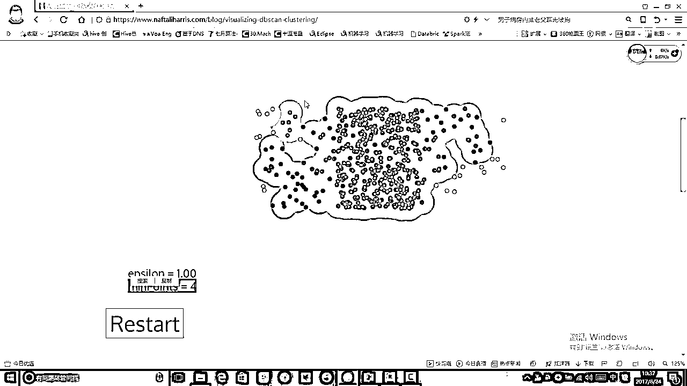

# P63：6-DBSCAN可视化展示 - 人工智能博士 - BV1aP411z7sz

嗯这回啊咱们再来看一下就是咱们刚才不是给大家说完了，那个DBSCN啊一个我给大家说是非常牛逼的一个算法啊，像传销制的它的一个工作流程嘛，然后呢再给大家用可视化的形式给大家展示一下。

嗯这个DBSCN啊它在就是做这样一个剧烈的时候啊，它的一个流程或者说它一步一步啊是怎么样去做的，还是啊咱们还是随便选择一个数据集吧，然后呢在这块就是我可以自己指定它的一个半径。

然后我们来看我给调这个东西吧去指定它的一个半径的大小，然后这里它都给你画出来了，这就是它的一个半径，然后我给这个半径暂时指定成一个1吧，然后呢这个minPoints啊就是我刚才说的那个EPS嘛。

就是我的一个呃就是一个就是一个密度的一个阈值嘛，这个东西这两个值是需要大家自己指定的，也就是我们两个参数，调节下面的我的一个轴啊就可以去做这样一个东西，然后咱们来概述一下它是怎么做的，首先选择一个点吧。

然后基于这个点去传销，传销完之后啊实在找不到传销的，再选择另外一个点去建立一个新大陆吧，咱们来勾一下来看一下，就是选择一个点然后去在这块做传销啊，我们来看把所有点都放进来了吧。

都放进来之后啊这个传销做完了，传销做完之后在另外一个新大陆又去做传销了吧，又去找这些点啊又把这些点都圈进来了，那么来看这块有一个白色点啊，它是没有被圈进来的，那是什么它就是一个离群点嘛。

或者说它是一个噪音点异常点都是可以的，这样呢我们基于它的一个传销的方式啊，就把咱们的一个粗给它做完了，然后我们来看最终啊有三个是离群点，然后呢其他点啊就是我的一个三个粗就画满出来了。

这个就是我DBSCN算法它的一个工作流程，在每一个位置去画这样一个圈画完圈之后呢，又到啊咱们的一个新的位置去找这样的一个点了，这个我们就做完了一个DBSCN算法啊，它的一个整体的流程。

这个咱们就不restart了，咱们可以restart一下来看一下，咱们刚才不是找出来了一些噪音点吗，那当我把这个半径给它设置的稍大一些之后，咱们再来看一下，它还有这个离群点了吗，就没有了吧估计。

因为它会把它都圈进来吧，哎呀这个点好像还是没有圈进来呢怎么，啊圈进来了已经都圈进来了它就没有离群点，对索文来说呢它也都圈进来了吧，也没有离群点也就是说这个半径会影响什么，这个半径啊和这个下面参数啊。

都会影响你这个粗的一个形状的，尤其是对离群点，你要想找离群点是吧，你不妨把这个半径设置的稍小一些，然后这个名判子也设置的稍小一些，这样啊我们就把这三个粗也做完了，这回就没有离群点了。

这个就是两个参数对我结果的一个影响的，再来找一个吧，咱们刚才不是做了一个大笑点吗，咱们最后在做大笑点的时候，我们说那个K-means的效果不是不好吗，那咱们还是默认这个参数啊。

然后用我的DBSC我去算一下吧，反正一开始我也不知道多少个粗，我也我也不需要给定一个粗，找出一个点去传销就可以了，咱们来勾一下，一开始找出一个点，然后传销传销传销，哎呀这个红色点完事了。

然后这个蓝色点就开始了，蓝色点它就基于它的一个密度，不断的去发展下线发展下线发展下线，这个东西可以做成一个并行的，就是我们在很多位置都可以去发展出来，它的一个下线，慢慢啊这个蓝色就会画成这样一个圈。

那现在我们来看就是基于密度这种剧烈啊，它的一个好处可以发现任意类型这个粗吧，只要这个粗啊它前后是能相连起来的，就是像我们说的那个密度可达嘛，只要是密度可达我们就可以的圈起来。

这样呢我就得出来了这样的外层的一个圈，我们看现在它都快整完了，然后最外层啊它有它的一些离群点嘛，就是我这个圈，然后绿色的又开始了，绿色的开始去传销了，然后又开始发展一堆堆下线。

把这些都加到我绿色的当中的这个粗当中来，然后呢这是我黄色的，然后最终啊我看出来一下啊，这还有一个其他的一个粗，因为我这个MIMP啊MIMP_POINTS是等于4的，如果说MIMP_POINTS等于3啊。

这个粗它就找不到了，这个就是我这一个DBSN啊它的一个效果，从它剧烈完这个效果来看啊，它的一个结果还是比较不错的吧，要比K-MEANS啊强得多呀，因为我们是基于密度的一点一点去发展下线。

最终呢发展完就得到了啊，咱们当前的这样的一个粗的一个结果了，再找一个吧再找一个这样式的，这样是咱们刚才不是说哎呀，我K-MEANS的时候我不知道，到底给它聚成多少个粗比较合适吗。

那好吧那我基于密度的去看一下吧，这是个红色的粗，红色粗我估计它会发展出来很多啊，因为它们都比较密集嘛，这个基于密度的它有一点就是说，一旦啊就是这个东西都非常密集的情况下，我们再去进化分就比较难了。

这个点我们来看，它这个我估计啊，它得把大半个图啊都给它全进来，来看一下结果吧，这个结果我还没跑过，应该是会把大半个图都全进来，所以说它这个问题啊也来了，就是一旦这个数据啊分布都是比较密集的。

这个时候会什么样，这个时候它会把所有东西都全进来吧，我它会认为所有东西都是一个红色的，那这个也是它的一个问题嘛，这个问题怎么解决呢，咱们可以调参吧，让它半径稍小一些。

半径稍小一些应该会改变它的一个结果的，哎呀第一次我们来看它的结果，把所有的都给它全成了一个红色的，那都全是红色肯定是没用的吧，因为我们剧内我们都是属于一个类别，对我来说没用嘛。

咱们再来改变一下把我的半径稍稍调小一些，我调小个一半我调到个0。5，咱们来看一下，这个时候来看呀，0。5太小了，0。5太小的时候，它在圈的时候就不太合适了，它会圈的太多了，所以说我这个0。5还不行。

哎呦就最多我全出来上百个粗了背不住，粗的个数啊就太多了这个时候，这么多个粗这么多个粗不太合适啊，咱们再给它restart一下吧，这该设置的太小了，我设置的我设置成一半，我是称一个0。75吧，0。74吧。

咱们再来看一下，这个时候应该还是一个比较合适的吧，应该这个应该也是偏小一些，它剧出来粗的效果也不太好，那其实大家可以看就是说这个时候我们用这个db3的剧烈效果，感觉就不如那个k-means了吧。

因为k-means我们强制给了一个k之后啊，它剧出来之后起码都是差有挺有规律可循的，但是这个dbSEN啊，它剧出来之后可能就是基于这个东西剧烈完之后粗太多了，然后分布也还可以吧。

但是我感觉它就没有k-means剧出来效果好，因为它剧的太乱了太多了，这个就是它的一个效果，到时候大家也可以给它再改一改，再看一步吧，我给它改成了0。8，0。8有点还是小，0。88吧，希望这0。88哎。

没准它又给都给剧成一个圈了，这个就是我们改变参数的最结果影响，大家可以看出来就是这里我改变了一个参数，就是这个半径光改变这个半径，它就会使得你每次结果都是不一样的吧，那这个半径对我结果影响也非常大。

也就是刚才说了，这个无论什么算法啊，这个对于剧烈问题来说，参数啊都是一个大难题啊，因为你没有一个标准答案知道什么样的粗，它是比较合适的，所以说这里啊，我们就是很难去指定出来，哎呀。

什么样的一个参数到底它是比较合适的啊，看这个咱们就不看了，这个就给大家演示了一下我们这个dbSEN啊，它的一个效果是长什么样子，它会把最后下面这个粗，哎，我觉得这次剧烈还可以啊，这次剧烈还可以。

这次剧烈要比之前的剧烈效果都好，所以说嗯，不同的参数会使得你的一个效果完全是不一样的，这次啊，我的效果还是比较不错的吧，基本上据说几个大模块，这几个大模块还是比较规律可循的。

其实我想再把黄色这个再分成两块，蓝色的也可以再分成两块嘛，这个就是我的dbSEN啊，它的一个效果，然后我看一下还没有什么好玩的啊，这个也可以看一下，这个刚才我们剧烈完，就是每次指定不同的一个。

指定不同的一个K值啊，它的一个效果也是不一样的吧，咱们在最后看一个这个就就完事了，咱们最后看一下这个dbSEN，它的一个效果是长什么样子吧，我想啊就是可能分成三处吧，中间左边右边分成三个处。

具体分成多少处我也不知道，不知道左边这个是不是太稀疏了，右边稍微稀疏一些，然后它检测的时候检测的时候效果也不也也挺好，因为它检测的时候，会使得我最终的一个结果啊，就是说使得我最终的一个结果。

它会有这样一个离群点吗，有离群点离群点是很重要一个东西啊，离群点可以帮助我们进行很多个分析的，然后这块哎呀，他把它都拿进来了，都拿进来之后哦，这块还被传销了，右边被传销完了。

那就分成了两个模块一个绿色的啊哦，左边和右边这块，其实我们这块就可以看到这个明判子，我们是不是设置的稍微稍微有一些小了，我可以设置的稍微大一些稍微大一些的时候。

你的粗的个数也就会变小一些。

那这个就给大家一个演示了，到时候大家就自己玩吧，这个给大家演示了一下我们DBSCN啊，它在就是工作的时候。

它的一个流程以及参数啊。

对我结果的一个影响是长什么样子。