# P6：5-突变点调参 - 人工智能博士 - BV1aP411z7sz

接下来咱们就来看一下哪些参数会对我结果产生一个影响，咱们先来说最主要的就是这个change point，change point在这里我们可以来进行有一个指标来进行衡量它，这个指标叫做一个scale值。

它的意思先给大家解释一下，就是说这个参数它指定了我突变点的一个权重，你看这里写了，这个参数它说的是突变点的一个权重，那权重什么意思，那是不是说当你给一个突变点较大的权重，模型就会更重视它这个意思。

所以说现在如果说我当我把权重甚至大了一些，模型就会更符合于我当前的训练的一个数据吧，因为你看就是模型当中我随便找就这个图吧，模型当中这个突变点我给它较大权重，咱们的模型就非常重视这个突变点。

就得去学这样的一个突变的一个趋势吧，那这个时候你可以想，当你训练结束的时候去学了这些非常非常多的一个突变的一个事情，而且你给它赋予了较大的权重，那明显发生一件事是什么，这个时候你在训练的时候。

你的一个棍领盒风险太大了吧，因为咱们是完全按照训练级当中这些突变点，去训练当前这个模型的，所以说还有这样一个问题，权重大了咱们现在是能够更符合于我的数据级，但是棍领盒风险它又更高了一些，这是第一个问题。

那你说权重小了呢，权重小了模型可能就欠领盒了，它可能就是比较保守的，你看这个这个就是说，这里就是我用这个Facebook的框架里边，它是有个默认值，这个突变点它权重我看了一下这个代码。

默认的是设置成了0。05，默认设置成0。05还是比较小的一个值，就说明它这里对突变点没有那么敏感，没有那么敏感情况下，当前咱们去做这个训练，它就可能有些突变信息没有把握的那么多。

那接下来它这个模型这个趋势还是比较平稳的一个趋势，你看我就是我这块做了一些实验，我发现了就是你这个突变点如果说设置的比较大，那它可能就是它跟你这个模型它吻合程度非常高，但是呢它这个过领盒风险也很大。

但是如果说你把这个突变点设置比较小，它这个过领盒程度没有那么大，但是呢它这个模型始终比较保守，就是这个意思，然后呢为了给大家解释这个事，咱就实际来看一下吧，这块呢我就是选了四组参数。

咱来看一下这四组参数对结果影响怎么样，就是咱的这个TrainPoint它的一个权重值，然后呢有什么0。001 0。005 0。1 0。2这几个值，然后把这样代码我得去给它拿过来，为大家在这里啊。

咱还是按照咱这个思路还得去debug来看一遍，然后我看一下这个东西这东西就不要了，然后再看一下哦，这东西还要然后就拿这几个来说吧，debug一下，这块它debug，然后这块我不跟大家尬聊了。

然后看一下咱这个图啊，这个图当中啊就是画出来这样一个趋势啊，就是你看这个黑色的还是我的一个真实点，然后呢分别有几种不同线条啊，都画出来了咱的一个就是最终的一个预测值，因为在这里相当于我建立四个模型。

每个模型它的结果都是不一样的，因为他们选择的参数是不一样的，有这个比较大的一个有比较大的一个就是权重点权重，也有比较小的权重啊，咱们来先给大家说一下它的代码怎么做的，然后咱们来分析下这个图。

首先呢这个东西一样的就是，还是把我的一个渲染数据节给拿到手，从这个15年到这个17年的嘛，然后这里就是我写复运环对于每一种这个权重，每种权重不同的时候我们要干什么，我们在这里去设置一下。

当前我的一个权重量等于我接下来复制这个指标，复制完之后呢，然后我再去create这个model，create model的时候，它就会帮我去用新的一个参数来进行一个复制，然后呢在这里就是我make一下。

就是我去指定一下咱接下来预测180天的一个数据，然后呢去预测一下吧，这样可能会稍微慢一些，哎呀这块稍微等一下预测完之后预测完之后啊，在这里就是我去把当前的一个预测结果，然后往里去填充。

一步一步的去填充填充完之后呢，这是完成第一个，然后这个复制完就不看了，它第二个第三个第四个，这个意思就是说在这里，我们就一个一个参数去建立模型，一个参数一个参数去得到我最终的一个结果，得到最终结果之后。

然后你看什么，在这块就是先是整体的把我要画的图啊，都给它画出来，先把这个就是真实的情况，蠢的一个结果把它画出来，就是我这个观测值嘛，这是一个真实的情况，然后呢，我接下来不是画了四个模型吗，复制完当中啊。

有几个模型就画几个呗，这不就一样的吗，照样画我这个图照样画在当前的这个区间，然后呢把这个结果显示出来，这块还在执行，最后呢，我就把这个图返回去，这就完事了吧，所以说啊，在这里没有什么太多操作，只是说。

看我看一下这个图挑哪，这块就算咱就不等他了，不等他这块去执行了，直接大家看这个结果吧，这看结果，这个说运行完了，直接看一下这个结果，其实这里啊，直接一样的，下面你看就到了这个画图这块操作了嘛。

复制完当中你画几个图，最终他就是不断去迭代，完事就完了，你看一共四个图吧，然后收一下，这个收还没显示出来，那咱在这看吧，在这看吧，就是这几个图嘛，咱们来对比一下。

先看这个蓝色的蓝色的是非常小的一个这个这个图边点全皱，你看我非常小的图片全皱，你看他整体的趋势啊，这个蓝色的整体的趋势长什么样子，他这个整体趋势啊，是不是说他就是你看一些图边点，他根本都没有表现出来吧。

而且这块明显是下降了，这块他预测确实上升的，所以说就是当你用一个小的图边点全皱的时候，最大的一个问题就是，在这里他没办法去捕捉到，咱完整的一个训练集当中的信息是长什么样子，你看这对于一个小的图边点全皱。

你看他是这个样子没有去捕捉到太多信息，那最终预测的结果呢，你看他也是非常平稳的一个趋势吧，就像是一条线似的，所以说非常小一只啊，像我刚才说的他是一个全是太小了，模型有可能欠领盒。

就达不到咱们预期的一个要求了，然后再稍微大点呢，看这个红色的红色的是不是，你看这个领盒效果是不是，咱就来拿这个领盒效果来说，这个蓝色的感觉非常差的吧，红色的你看这个红色的0。05，默认值是0。

05稍微好一些吧，你看红色稍微好一些，但是呢最终结果也是没有直线的往上升上去，然后再大一点这个灰色的还有这个黄色，就看这黄色的吧比较大的，比较大的情况你看这个黄色的，他明显的一个趋势啊。

就是跟其他线条相比啊，他就是你看在这个点来说，红色的他上升到最高点了，没有吧，黄色的上升到最高点了，就是他在捕捉你训练集的时候，他会捕捉的更强烈一些，尤其是他会更好的去发现你这些突变点在什么位置。

那这里呢，你看他可以把咱们的整个的训练集当中，所有点基本上都能捕捉到，然后呢，按照这个趋势他接下来去预测，你看红色的预测的更高一些，因为他发现了当前这块突变的这样一个趋势，他会预测的更高一些，这个呢。

就是咱们当前给大家说了一下，我的一个change point，他这个参数对结果的一个影响，其实这个参数对结果影响是非常大的，在这里，我们也主要调节的就是这个参数，最明显就看这个蓝色和这个黄色吧。

太明显了吧，这个蓝色的不咋地，这个黄色的拟合的非常好，但是呢，他可能会有些过拟合的问题，在这里我们就看了，默认参数给大家说了，他是0。05，他是在这些之间的，蓝色的线和黄色的线。

他们都是一个比较比较特别的，一个是欠拟合，一个是可能有些过拟合这样的一条线，然后呢，我们来进行一个评估吧，来进行评估是吧，这个就不跳往里面跳给大家看了，这个一样的，其实这里就算了这样一个事儿。

就是这个CPS就是Chain Points，这个Chain Points就代表CPS，他分别有0。001，0。05，0。1，0。2几个值吧，然后我们可以看他的一个Train Error。

还有他的一个Test Error，我们就Range这个东西就是咱们的一个，就是一个，Y-hat的一个Lower和Y-hat的Upper之间的一个差异值，这个咱们先不管。

咱们就看这个Train Error和Test Error就行了，其中主要关心的就是，这个Test Error吧，因为Train Error对我来说可能没那么重要，因为我要预测的是一个时间序列嘛。

时间序列啊，Train上的Error可能就是没那么重要，但是我关心的一定是Test的一个Error，明显的一个趋势是什么样，Train Error明显要比这个Test Error要小很多吧。

这也是时间序列问题啊，本身就难解决的一件事儿，因为你要预测的是用字回归模型预测，咱之后的一个时间点这个东西啊，我就是从我就是一听，我就觉得这东西可能不太靠谱。

所以说咱这个Test Error相对来说都是偏高一些的，这个都是蛮正常的，比Train Error高一些的话，然后来看吧，随着我这个CPS值增加增大，那这个Train Error肯定出现一种趋势是什么。

CPS值越大，100%的这个Train Error值会越来越小，因为CPS代表着你的一个就是越大，就是权重负荷越多，才能更好地去拟合这个训练数据吧，这是咱呆呈现出来这种情况。

然后呢这个Test Error，这个Test Error咱来看，这里呢它也出现降低的吧，那这里你说对于这几个参数来说啊，你选择哪一个比较合适啊，我肯定选0。2的，为什么，因为0。

2的对应的一个Test Error，它是等于127。60的，这个Test Error值啊它是比较低的，所以说呢在这里我们是选择咱们Test Error最低的那个参数的。

它相当于就帮我进行了一个评估这样一个操作，你看在这里画了一个图，True Error下降多明显是吧，然后呢这个Test Error它也是在进行一个下降的吧，然后这块它可能还进行有一个稍微点的一个上升啊。

这个趋势都蛮正常的，咱只需要找最终的一个Test Error值最低的那个就可以了，拿最低的当成是一个当前指标，那现在我看这个趋势好像是，它没准就是当我把这个CPS值啊。

就Change Points值再增大的时候，它没准还能下降是吧，那一会我们再来看一下我们再增大点，它还能不能再下降一些，在这块呢，咱们来试一下更大的，咱们来看一下就是更大的一些CPS值，你看我从0。

25开始啊，0。25 0。24，然后一直干到0。8，这些值都比较大，再来看一下它的一个结果啊，然后这里咱们来画下这个图啊，然后还是进行预测啊，这个道理都是一样的，这咱们就不给大家多说了。

然后CPS值对应着一个True Error，你看都是比较低的，True Error还在下降，然后呢这个Test Error，从这个114一直下降到了67是吧，最低可能66。

可能到这呢去一个差不多的一个位置了，在这里咱们就来看吧，我的一个Test Error最低是中间这个是零二，是零二七这个吧，最低是零二七这个吧，也就是说现在呢，当我调参的时候发现了，我选择这样一些值啊。

都会达到不同效果，但是呢，达到这个零点七的时候，当前效果应该是最好的，现在咱那个指标值是66，也就是说达到一个历史最低点吧，这样啊，我们就把最终的一个参数结果选出来了，我们选什么呢。

就选这个零点七就可以了吧，这个就大家说了一下，咱们的Change Points这个参数该怎么调，以及呢，它会对我的结果产生着一个什么样影响的，然后呢，我们再来评估一下模型吧，在评估模型的时候啊。

就是还是这一天啊，就是你看当我选择一个新的参数的时候，原来咱们的一个预测值1263，真实值呢1294，这个东西差的怎么样，差的就是没有那么多了吧，所以说啊，这个就是说当我们用一个新的参数的时候啊。

我们去测试的时候，咱们效果是比之前能够强一些的，达到这样一个结果，然后呢，强一些之后啊，可以画这样一个图，画上一个图之后呢，这个时候从开始去预测啊，咱当前的一个结果值是等于多少的，然后这块我们有啊。

这块我们是用一个Ulution，从这个123到这个18年的一个123，得到了这样最终的一个结果值，然后呢，拼完模型之后啊，咱们主要是调这个车身筷子，然后接下来再带大家看一个好玩的一个事吧。

这个呢就是在这里啊，我们就是给大家准备了这样一个函数，这个函数啊，就是说我们可以去玩一个小的游戏，那这个模型呢，就大家先强调这里，然后就是如果说大家对模型当中啊，有哪些知识，哎。

我们就是可以说就是我这里啊，直接给大家概述了一下，这个模型啊，我们基本上的一个使用的方法，以及呢，我们这样的一个案例啊，咱们是怎么去做的预测最终的一个结果值，如果大家还是想把这个东西做得更深。

想去深入了解其中的每一个细节，那最好的方法在哪里呢，最好的方法就在他的一个官网当中，最开始的时候给大家给出来，他的一个GitHub的一个链接吧，那里面呢，他有详细的介绍，跟你讲每一个参数。

每个功能是什么样，其实这东西哪来的，这些东西啊，也都是从那个官网当中啊，去介绍来的，这个模型，你说让我自己从头到尾去用，我哪会用这个东西啊，我也不知道它是什么，我也都是在这个官网当中一步步去看的。

所以说大家在使用的时候，最好能结合他的官网一步一步看，他会告诉你每个指标什么意思，告诉你完什么意思之后啊，那你说你怎么能知道他这个东西说的是不是这么意思啊，他实际表达什么样啊。

我们自己动手实验的试一试不就知道了吗，最好实际动手，参考着他的文档，我们自己实际动手去做一些小例子，小demo，然后就能掌握这个库啊，咱们该怎么去用的，然后这块就是。

my friends want to play a game，这里就是我是比较愿意看那什么，我是比较愿意看那个那个什么，那个就是什么那个那个哎呀，电视惊魂啊，就想了半天没想起这个名，电视惊魂是吧。

总爱说这句话，电视惊魂8我还没来得及去看，之前那个第一部到第七部啊，我之前有一段时间啊，就是实在是没事干，一天看一部，第一天看一，明天看二，后天看三，一步一步看，看了一期不之后。

然后然后过下个月又没啥看了，再从头到尾看一遍吧，我就觉得自己看这个东西啊，感觉蛮爽的，我也不知道我这个心里是不是有病了，要咱来看这么个事啊，就是说如果说我现在要预测啊，一个我买股票能不能挣到钱。

这个时候怎么办呢，这个时候咱们来试一下吧，如果我们预测是一个涨，那我就当咱们这么玩，就是说如果说我预测涨，那我就赚到这天差价，如果说我预测错了，那我就赔了，我预测涨我就是相当于预测。

我就是挣这个钱预测错，我预测赔我就是没赚这个钱，就是这个意思，我们是一天一天的去赚这个差价的，这个也不给大家在代码当中实际去看了，这相当于是一个小玩具啊，比如在这里我们就指定了。

从这个17年。

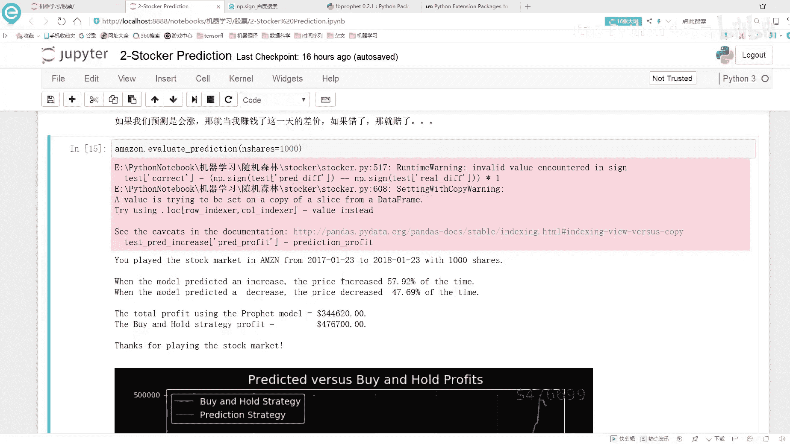

哎，不不不，从这个啊，从这个17年1月23到这个18年1月23，我们在这里预测了一下，我57。92%预测的是涨预测对了，47。69%预测跌预测对了，这里就是我们的一个差异还是接近于50%是吧。

所以说股票这个东西啊，到底他是可不可以预测的，这个东西啊，我看好多研究金融的人都研究这个东西，能不能构建一个自动化的一个交易模型，然后帮你挣这个钱，我觉得是不太可能的，这个东西一旦做出来了。

我觉得这个市场啊，没准他就已经是要倒闭了，这个东西而且这东西你估计你也预测不了太准。

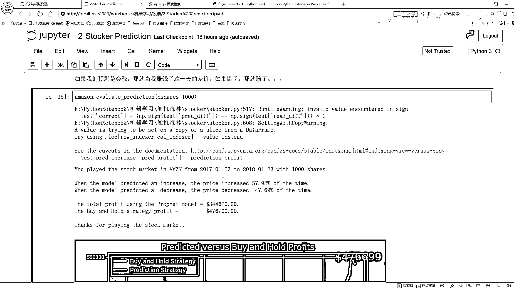

基本上还是有一些瓶颈有些局限的。

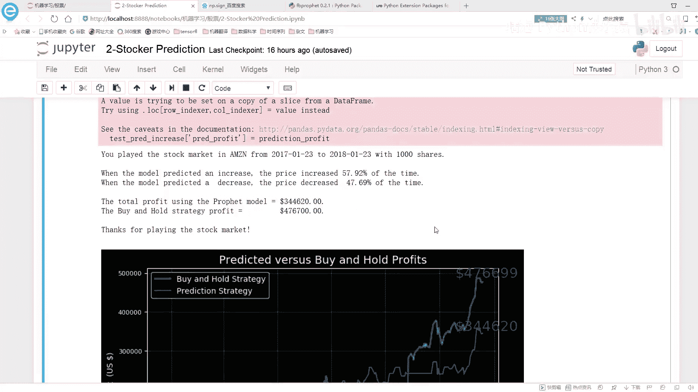

让这里咱们来看吧，比如说在这里，我可以按照我的一个所得货率，buy and hold的就是我买然后卖买卖，然后预测涨就买预测跌，我就我就我就给他卖了，就是不留了今天，这样呢，我可以得到一个利润啊。

就是在这一年当中能赚多少钱给大家，总共的去看了一下当前的这样的一个结果。

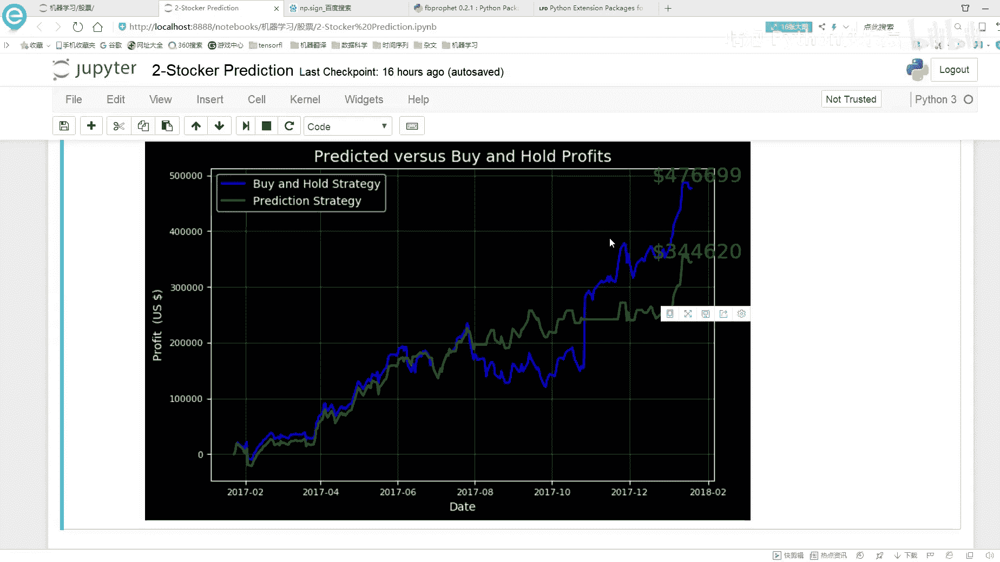

所以呢，咱们就可以把这个预测的情况和真实情况给他给他画出来是吧，给他画出来之后啊，就可以来去预测我实际的一个指标啊，是长什么样子了，第一预测呢，是我的一个预测的一个趋势，黄蓝色呢，是我的一个板啊。

就是买，然后并且保留下来的这样的一个方法。

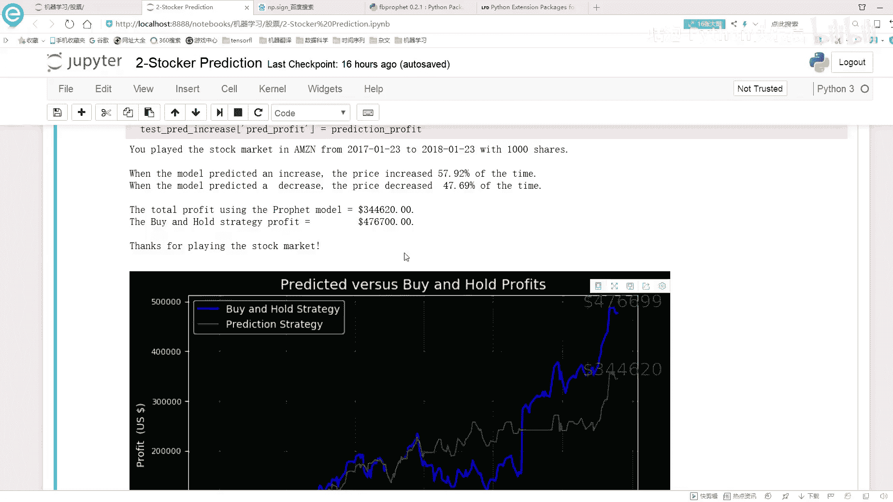

这样呢，我都可以赚钱两种方案啊，就是大家可以在代码当中啊，拿这个Elipse或者Paycharm。

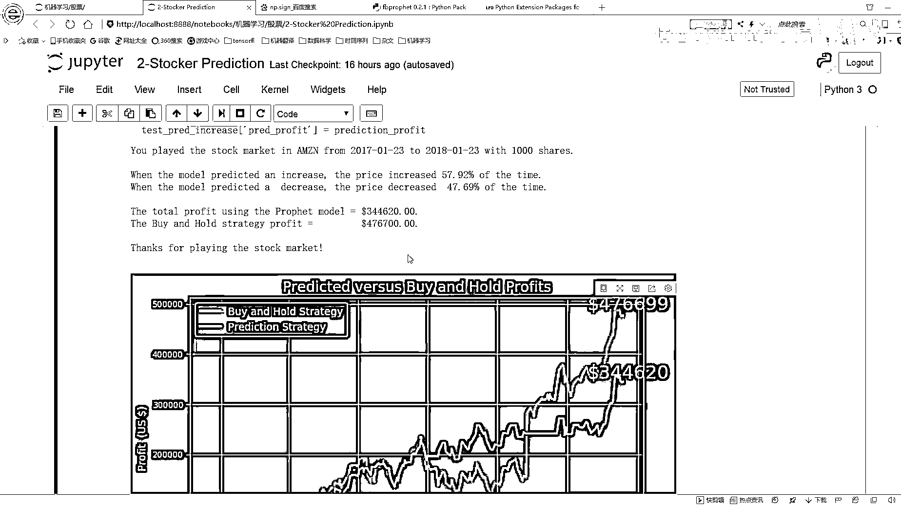

自己实际动手看一遍，这个东西是怎么去做的，最终呢，我就得到了一个结果的一个值。

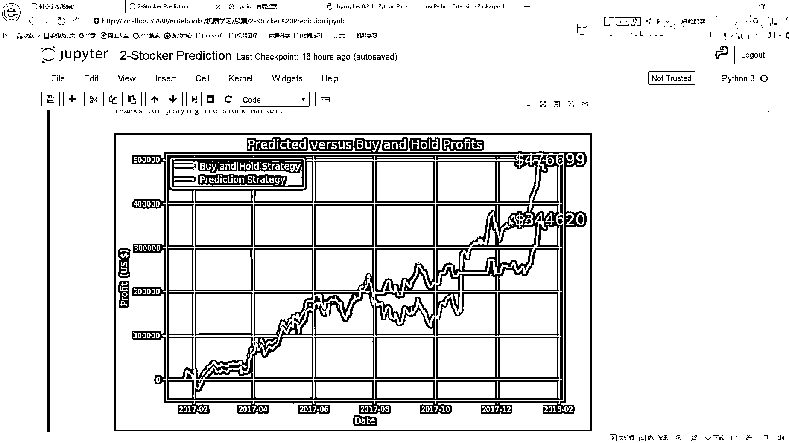

这块啊，最简单的来说吧，这也没什么太多技术性的东西啊，这块就是我们呢，也能挣钱。

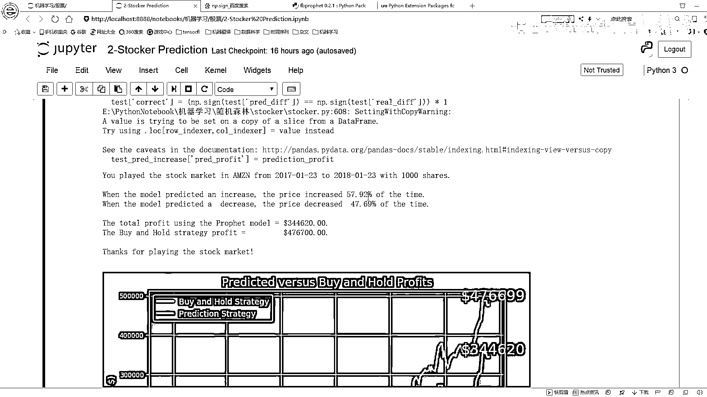

在这个17年到18年，你去买能挣钱，那换个时间点呢，08年到09年呢。

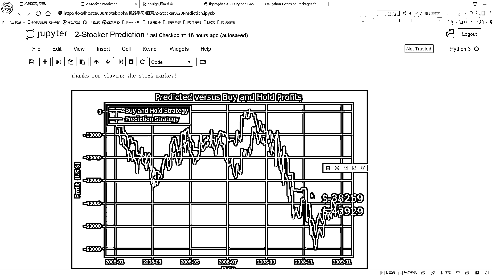

你要买他就是个赔钱的一个趋势了，这个就为大家说了一下，咱们的一个啊，还有这样一个小工具啊，可以预测一下，按照时间点来说，可以这是只买多少份股票啊。

他是能挣钱还是能赔钱这样一个意思。

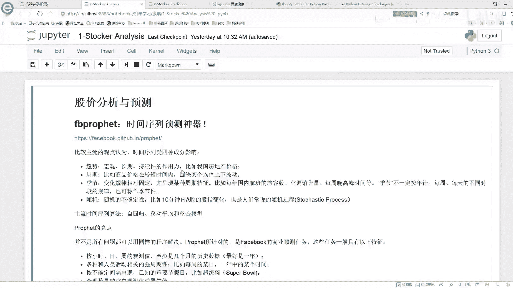

然后呢，预测未来十天的一个价格。

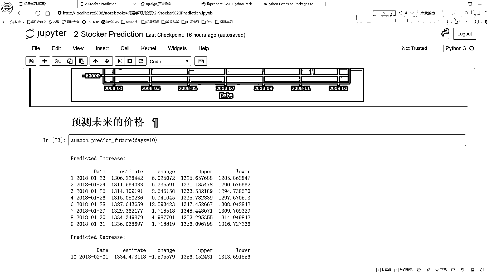

这也很简单，你把这个Date指定下去，他就会帮你预测出来，接下来的一个十天的一个价格吗，你看这块就帮你预测出来了一个十天价格，然后是他又是一个Y-hat的一个lower。

Y-hat的一个就是一个upper，还有这样一个lower，就两个时间点嘛，以及Y-hat的实际的一个指标值，这些就是我们预测的一个结果预测未来的一个价格，然后下面呢。

我们还可以预测的更多一些预测更多一些，我们可以你看这预测多少，一直到这个预测三个月预测三个月，你可以把这个东西都画出来吗，都画了之后啊，其实随着时间的一个推移，越来你肯定这个模型是越来越不确定。

咱当前这个值到底是取多少了，这个呢，就跟大家说了一下，咱们当前啊就是这个啊，Facebook他的这个模型，他是怎么样帮我从头到尾啊，去完成这样一个时间序列的一个预测，在这里呢，我们是拿一个股票数据集啊。

来给大家进行分析的，如果大家呢，有其他数据集，其他数据集可能来说还没找到一些数据集啊，反正这里用股票数据集，我觉得还是蛮好的，因为他时间也不用处理了，数值也有了，而且比较方便就能获取到这个里。

就是我们可以直接用一个股票数据，来玩这样一个事，如果说你有其他数据集呢，照样啊，你都可以来试一下，用我当前这个框架能不能帮我把这个时间序列预测的还不错，然后给大家又简单说了一下，他的一个参数啊。

该怎么调，诚实判断主要是这个属性，他会对我结果产生一个什么影响，那关于这个股票分析啊，还有预测的这个工作啊，就给大家先说到这里了。

今天的视频就拍到这里了。

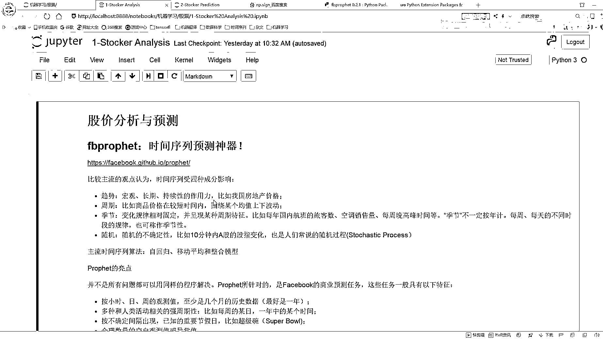