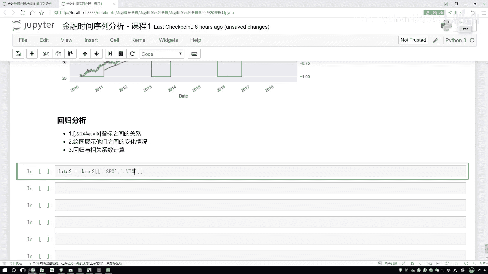

# 吹爆！2023B站公认最系统的Python金融分析与量化交易实战教程，3小时入门AI量化交易，看完还学不会你来打我！人工智能｜机器学习｜时间序列｜股票预测 - P10：4-指标相关情况分析 - 人工智能博士 - BV1aP411z7sz

接下来咱们来看一下这个恢复分析，说白了就是我现在要看一下变量之间有什么样的一个关系，或者说变量当中一些走势，一些我们刚才说的一些增长率之间，有没有什么样的一个相互影响，或者是相互的一些就是观点吧。

咱们要做这样一件事，这里呢我给大家说一下我们这个流程，第一步咱们还是先选择两个指标，我们选一个FTS还有一个VX，一个标谱还有一个恐龙系数，在这里我们第一步还是先把这样列给拿到手。

就是我们现在有个data，之前不叫data2吗，还是用这个data2吧，等于data2当中，把这两列的名字我直接拿过来得了，这两列是它的一个名字，然后这个名字把这块稍微改一改，中间有个逗号。

然后名字我得给它引起来，这是第一个名字，然后后面这是第二个名字，然后这个名字还得多做一件事，它那个原始数据当中它是一个大写的，再改一改是一个大写的，然后这个它也是一个大写的，然后把数据打印出来看一看。

现在我只拿这两个数据来就行了，因为我们只观察它两个之间的一个关系，其他两我们就不用去看了，好了在这里我们就做完了，就是第一步先把数据给读过来，然后数据读完之后，然后这个所以目前也都是没问题的。

咱直接来往下去做，第一步你说我要去展示它们之间的一个关系，做这个关系其实还挺简单的吧，最简单方法是什么，直接在图当中我们把这个结果给它画出来，是不是就完事了，好了咱们来画图。

在这个data当中我们来看一下，data里边然后去plot一下，plot当中我去把当前两个结果传进去是不是就行了，直接点plot一下，然后其实什么都不用写了，直接一画这个结果是不是出来了。

但是这个结果出来之后有一个小问题，如果说你现在你说给它放到一个图当中，好像看不出来一个趋势吧，所以这块咱们还是得把这个东西给它supplot一下，supplot当中放到我们两个图当中，咱们来指定一下。

然后我们来执行一下吧，这样当前结果我们就给它画出来了吧，行了这是我们第一步，先把这个图我们已经给它画出来了，然后呢画完图之后，其实我们可以观察一下，那此时我们想看它的一个指标好像挺难的。

我一正常情况下我们不是看这个关系，应该放到一个图当中吗，但是一个图我就给它描述不出来，那怎么办呢，之前咱们是不是给大家说一种方法可以干什么，在一张图当中，我可以既有一个左边的歪轴。

我还可以再有右边的一个歪轴吧，这样我可以把它放到一个作料系当中，不是一个作料系就放在一张图当中，但是呢它们结果会就是怎么说呢，给大家来画一下吧，画一下应该会更清晰一点。

这样我们把这个数据重新来去指定一下，还是我们data这个数据，然后我把这个多写个参数，不过这回咱就不用这个soft loss，然后直接指定我的一个坐标轴，咱们之前不说了吧，在这里我可以去构建两个坐标轴。

第二个我指定一个Y，然后呢在这个Y当中咱们来去写吧，咱们的Y指定成它的一个data名字，data名字我们拿第二个吧，我看第二谁直接给它复制过来得了，指定好我的一个data名字，然后呢我再指向一下。

再来看结果，这个结果你是不是大概能看出一点趋势了，哦这个结果可能看的趋势不是特别明显是吧，再这样吧，咱为了使得这个结果太明显一些，再画一画，这个数据当中你看它是从这个10年到18年。

如果把八年数据画一起，那这个东西里边的点太多了，是不是变化太多了，咱把它稍微选一选吧，只选择其中的一部分数据可以吧，比如说我只选择这么一年，或者只选择这么两年的一个数据。

在之前不是已经把这个日期当做一个缩印了吗，我把这个数据读过来，格式我来复制一下，然后把这个格式复制过来，我们自己来选，比如现在我只是想选择这个到这个12年得了，它是从这个10年开始。

然后到这个12年年底吧，12月一个31号，然后呢我们再画一下，这个图看着小，把这个图稍微画的再大一点，我指定一个feature size，指定一个feature size等于稍微大一点，执行一下。

看这儿它出现了一个报错，在这里点upload一下，点upload完之后还给我报错，再来看一下什么问题啊，他说当前这个label，这个当前这个东西它不是一个label，哦这块这块冒号完之后。

它没有一个不是一个逗号，应该是它是一个区间，我们取下一个数据，改不言写逗号，然后再执行一下，行了这回画出来了，那你看啊，现在我们选了两年的一个数据，我们的一个变化幅度，是不是就清晰一点了，来观察一下吧。

他们这有什么结果，当这个SPS指标啊，我们来看一下，当它变化的时候，如果在在这个蓝色当中啊，SPS你看啊，它发生下降的时候，这个VS怎么样上升了吧，你看这里它发生下降的时候，这里出现上升吧。

这一块也是蓝色的下降，绿色上升蓝色的下降，绿色的上升，我们是不是可以通过画图啊，把这个结果观察出来啊，所以说最直接有效的方法，直接去画，画的过程当中啊，其实刚才我故意啊，就是给大家多画了几步啊。

其实正常我直接把这个一份代码写出来也行，但是呢，我给大家说这样一件事，画图啊，从来它都不是一蹴而就的啊，一般我们都先画一个最基本的，然后看一看有什么问题，有完问题之后，我们再想，哎，怎么去改进一下。

再改进一下，能使得咱的结果看起来更清晰一些吧啊，这是我们的第一种做法，直接去画这样一个图，那还有没有一些其他方法能帮我去做呢，哎，刚才咱不是说了吗，我们要干什么，我们可以去画当前的一个回位分析吧。

做回位分析之前，我们还得先把数据再处理一下，或者说先别处理数据了，我们先把第二个图带来画一画，其实这里啊，不光可以画一个折线图，我们还可以画一个散点图，是吧，画散点图的方法其实蛮多的，哎。

再来带大家来举个例子，比如这里这样啊，我说现在啊，我说现在咱指定一个结果，这个结果呢，咱们之前这个数据当中不有这两列吗，哎，记不记得咱之前说过一种方法算什么，我说算那个增加率的时候啊，增长率的时候。

咱们用Nanpi。log的时候，然后用数据去做了一个除法吧，来，咱把那个再写一下，Nanpi。log一下，然后呢，我之前啊，说用这个data比上什么，比上一个data。shift是吧，这个当中，哎。

给他，我给他那个往下滑一天，是就得了，然后再把这个结果打印出来，这是我们当前结果，然后给他点hide一下，打印出来，啊，这个结果就有了，那有结果之后呢，咱接下来，那你说该怎么样去把他的一个相关性。

给他描述出来呢，或者说怎么样通过画图，能够说呀，让我更清晰的去观察到当前的这个结果当中啊，他各自变量的关系，以及呢，比如说变量的一个分布关系，以及两两变量之间的关系呢，咱把这个图啊，给大家来画一下。

其实画的方法非常简单啊，呃，咱用咱就直接用这个pandas来去做了，其实还有一些其他国外工具包，像Sibren之类的，也能帮咱们去做啊，pandas当中，我直接啊去plot一下，哦。

只不过说他的API名字稍微有变化，啊，plot一下，朋友当中啊，我们要去选，你要画什么样的图，这是两个数据吧，两两之间，我看的变化情况，不光折线图也可以，我用三点图，是不是也行啊。

这回咱把这个三点图给大家画出来啊，matrix一下，在这个三点图当中啊，他里边的一个参数相对来说比较多啊，第一个参数就是啊，我们得写一下，你把哪个数据给我传进去，是吧，然后呢，第二个参数，呃。

因为三点图啊是这样，如果说你的数据点特别密集，咱这个就属于数据点特别密集，那肯定很多点，可能都会重叠在一起，咱得指定什么，一个透明度啊，别让太多的点重叠在一起啊，你指定一个透明度，然后呢，接下来。

一会儿呢，当咱们画图啊，它是一个二乘二的图啊，然后呢，它会有对角线，在对角线当中啊，你可以去选啊，你是想画直方图，还是想画一个kt plot啊，和密度估计，在这里先拿这个直方图，给大家描述一下。

就是我们的一个在对角线当中，你去自己写一下，你要画什么图啊，现在大家可能说，哎，这个对角线是什么，不太了解，没关系啊，马上咱就给它画出来，然后呢，在这个直方图当中啊，你也得指定它的一个Qworth。

Qworth就是说，我们都会涉及到哪些个参数，然后用字典的格式给传进来，对于直方图来说啊，你就得告诉我，咱要做多少个bins，比如说啊，做50个bins吧，平均的分成多少个块，分成多少个格。

要做一个bins吧，最后咱指定一个facesize，然后等于稍大的一个图啊，就行了，这个就是我们当前啊，得到的一个结果，还没得到一个结果，这个就是我们当前把这个图，我要去画一下，然后来执行一下，好了。

执行完之后，来看这个结果吧，刚才咱是不是说对角线了，这是不是对角线啊，对角线当中啊，描述的就是，一个图，自己和自己，你看这里，这是点sps吧，这是点sps吧，所以说中间的这一块是谁啊。

就是sps这个指标，它的一个直方图，直方图啊，其实有两种画法，不是两种画法吧，就对角线当中啊，大家可能现在看的是一个直方图，哎，我知道什么意思，但是其实啊，就是当我们画过程当中，还有一种图啊。

是一个就是怎么说，还有一种图画的更好看一点，给大家来看一看，我直接复制一下，你把这个参数稍微改一改，我改成一个kde plot，kde当中不需要这个参数了，然后再执行一下，你看这个结果变成什么了，哎。

变成了一个很平滑的一个曲线吧，这个叫和密度估计啊，它是怎么做的，大概的做法就是，其实它俩的一个趋势是一个类似的，你看当前这个趋势和这个直方图画出来，结果是类似的吧，其实它是这样，就是把你当前这个图啊。

啊，这不是分成一个个beams吗，那你想，如果你能分成一万个beams，或者说分的beams越多，你当前得到的这个曲线，就接近于这个曲线，是不是会越光滑呀，大概就这样一件事，所以说啊，当时画图的时候。

呃，你愿意画这个kde也行，愿意画这个hist一个直方图也行啊，通过这个图咱可以去观察啊，什么，其实这两三点图是类似的，关于谁啊，就是当前我们这两个指标，如果说在三点图当中，它的一个趋势是什么。

肯定是有互相关的吧，咱之前哎，在这张图当中，我刚才说给大家看了，你下降人也增加，你下降人也增加，咱通过这张图是我观察来的，但是三点图当中，是不是会更清晰的，帮我把定位设给他做出来啊，所以说啊。

到时候大家来做分析，或者观察的时候啊，至于具体用什么图，无所谓啊，选择一个看起来舒服的就行，哎，那你说这个图现在舒服吗，好像差点，你说还差了点啥呀，哎，这个图当中啊，如果说你说你画了一个这个三点图。

你再给我画一个回归方程行不行，给我画一个回归方程，往这一看，或者说你把这回归系数告诉我，我是不是一打眼儿，我就能知道，哎呀，这个当前他们之间的关系长什么样子，所以说接下来，哎，咱们终于说到了。

怎么样去构建我的一个回归方程。

