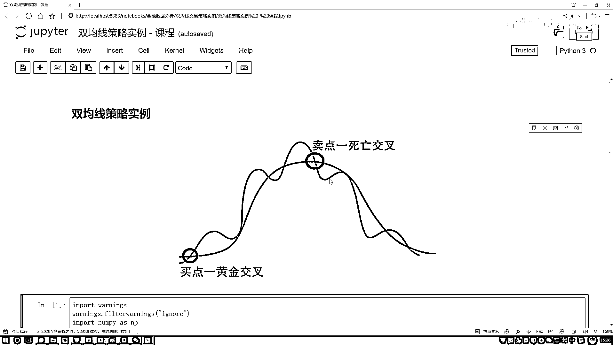

# 吹爆！2023B站公认最系统的Python金融分析与量化交易实战教程，3小时入门AI量化交易，看完还学不会你来打我！人工智能｜机器学习｜时间序列｜股票预测 - P12：1-金叉与死叉介绍 - 人工智能博士 - BV1aP411z7sz

这节课咱们来说一下就是在交易数据当中啊，我们的双均线策略啊，它是怎么去做的，现在大家解释一点什么样叫做一个双均线，那还是拿股票数据来说吧，好比说我们现在有一个苹果的股票吧，那这张股票当中啊。

是不是说在每一个交易日当中，我都会得到它的一个收盘的价格啊，那收盘价格可能第一天有第二天有每一天都有，但是我问你一件事啊，你说啊，就对于每一个时间点的价格，今天这个点明天这个点它发生一个浮动，哎。

我能看出来它大致的一个趋势吗，给我们的感觉好像就是哎呀，只是看了一个个体，然后它的一个变化情况而已，但是好像不能从整体上去描述它的一个变化趋势吧，那这个时候该怎么办呢，怎么样能更好的描述啊。

提出这么一点，他说啊，现在啊，还是咱们这个股票数据每一天都有收盘价格，然后说这样吧，我按照一个日期来统计啊，这里你看双均线，双指的是有两个的意思是吧，这里两个咱提出来一个，一个叫长均线，另外一个呢。

叫做一个短均线，先说什么叫短均线，那比如说我说按照我交易日啊，一周有我交易日嘛，我这按照一个周来说吧，五天算它的一个平均情况可以吧，那好比说这个是整个数据，那我把这个数据当中啊说这是一个五天。

这也是一个五天，这也是一个五天，这也是一个五天，那给我们感觉啊，现在是一个区域上了，这个区域当中不是一个样本数据吧，而是有多个样本数据，那对于多个样本数据，我来算一算，比如说这里有五个样本数据。

我算一算五个样本数据的一个均值，可不可以啊，是不是也可以啊，好了，我说我第一就是第一个位置拿的是第五，就是这五个数据，然后后面还有这个蓝色的五个数据，然后还有这个绿色的五个数据可以吧，那这样。

我说我现在在画一个走势的一个曲线，在这个走势曲线当中呢，之前那如果说咱拿到苹果股价，那每一天的收盘价，就是能把这个折线图画出来，这样一个走势吧，那我新的走势呢，我说这样，我既然说了咱们的一个短线。

短线当中我用这五天，比如说每个五天的平均值来画这个走势，是不是也可以啊，那给我们的感觉现在好像这样，之前你是一天一天的去画，现在呢，我是五天平均五天平均，哎，把这个图画出来，那你说我的一个平均起来。

是不是能看出来它短期变化的一个趋势啊，大概这样一个事吧，那好了，这是一个短线，那什么叫长线呢，其实说白了，短线和长线有这样一点区别啊，短线啊，就是周期比较短，我说这个五天十天是不是都行啊，啊。

叫做一个短线，那长线呢，那自然就比较长了，相比较常见的像20天啊，一个月咱们20个交易日20天可以吧，甚至更多的两个月40天，三个月60天，是不是都行啊，长线和短线之间唯一的区别就是我们选择这个窗口。

哎，它的一个就是大小吧，啊，短线比较短比较少，长线比较长，那做出这两个线之后啊，哎，你说它有什么用啊，咱们来看这个图啊，这个图当中啊，你看哎，他说了两点，一个叫买点，一个叫卖点，给大家解释一下。

先来看这个买点，买点什么意思呢，呃，好比说这样一件事，嗯，这个红色的红色的，我说这样吧，这个红色的叫做一个短线得了，这红色的我说它叫做一个短线，然后呢，这个蓝色的我说它叫做一个长线，可以吧，你看啊。

在这个买点这，我们的一个短线的均值啊，它这个变化情况是不是穿过了这个长线，并且是向上的一个趋势吧，向上啥意思啊，是不是要涨了呀，那这个给我们感觉什么，哎呦，好像从一个近期的一个指标来看，哎呀。

这个股票涨，但是从长线来看呢，这个股票可能还处于平稳阶段，那说明此时，如果说你要让你做预测啊，你说接下来股票是涨还是跌啊，短线已经超越长线了，说明在短时间内它应该会涨吧，所以我刚才叫什么，叫做一个买点。

我们把这个买点，既然它有这样一个交叉啊，就给它起个名字，叫做一个黄金交叉，黄金肯定好多东西我要要的呀，所以说此时就是我的一个买点，在这个时候我可以低买，然后之后我再高卖，是不是这样一件事啊，好了。

然后再看下一个，下一个卖点呢，我们的短线还是穿越了这个长线，但是我们的箭头是往哪的，是往下的吧，短线穿越了长线，箭头往下，你说从这个趋势上来看，在短期内它又怎么样了，去跌了吧，去跌的过程当中。

比如手里我现在有一百个股票，那我都知道它现在又跌了，我是不是在此时你给它卖掉，然后过一段时间再买回来，是不是可以做这样一件事啊，所以说此时我们管它叫做一个卖点，卖点又称为是一个死亡交叉，这样一个意思。

那行了，给大家解释了就是有两个点，一个叫黄金，一个叫死亡，那你说现在既然我们知道了，这个买点和这个卖点，那对于一个数据来说，如果呀，我能做这样一件事，哎呦分析出来了，哪块是一个买点，哪块是一个卖点。

我能不能设计一个策略，那比如说我说买点的时候，我就买进来，卖点的时候我就给它卖出去，是不是这样，如果说每一次我都能按照，就是我预测的情况，如果说每一次我都预测对了，那最终我肯定是收益的吧。

因为每一次我都是去赚的，我没有赔的时候吧，是不是这样一件事啊，始终保持自己是收益的，那这个啊，就是我们今天要做的一个策略，一会呢，咱又会用这个拍子的例子，给大家解释啊，怎么样把这个双击猿策略啊。

给它做出来，行了，这个啊，基本的一个知识点，其实也不用介绍太多啊，关于股票当中啊，那些专有名词，什么平仓不平仓那些东西啊。

不给大家去说了，就记住啊，一个买一个卖啊，就完事了。