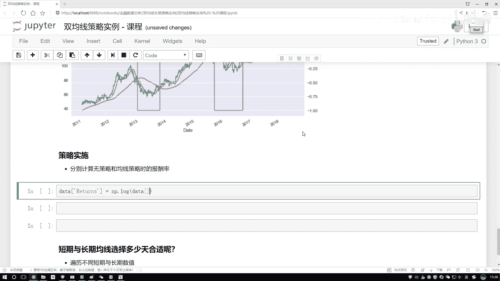

# 吹爆！2023B站公认最系统的Python金融分析与量化交易实战教程，3小时入门AI量化交易，看完还学不会你来打我！人工智能｜机器学习｜时间序列｜股票预测 - P14：3-策略收益效果分析 - 人工智能博士 - BV1aP411z7sz

先写一下吧就是我们的一个收益吧，收益咱之前是给大家说过了，就是当我们做这个收益的过程当中啊，这个咱们得用什么，因为我们要算就是最终的，就是最开始一块钱相对最终多少钱，这是不是一个累加的一个过程啊。

有这样一个累加过程，咱们之前说了累加的时候你不能直接算，我们得引入什么，引入一个对数吧，好了在我们的电脑当中对谁去算的，是不是说我这个算这个报酬率，我得对我这个股价把股价拿过来，这是我的一个股价，好了。

然后对我这个股价，然后当前算什么，他比上一下当前，我直接复制吧，比上他的结果怎么样，去shift一下吧，当前的比上前一天的啊，这样的一个结果，然后呢，这块我点shift一下，shift当中传进来一个1。

是不是就可以了，好了，这块咱们执行一下，就是有一个return值，return的结果就是什么都不管的时候，不是什么都不管吧，就是咱这个通过这个走势算出来了啊，我们的一个赚上率它是得多少的，那接来呢。

接来就是按照我们的一个策略来去算吧，我们的策略什么意思啊，那现在好像是这样一件事儿，哎呦，我们的策略当中啊，是不是得考虑什么了，永远都是赚的了，好了，我写一下，咱的这个策略当中，大家可能觉得啊。

就是你这个策略有点像开挂似的，有点未卜先知了，行，咱就假装是开挂吧，实际当中啊，可能没有那么好去算啊，好了，在这里我们来看啊，得需要多加上一个什么东西，多加什么。

之前的我们这个就是我们这个赚上率已经算出来了，但是现在呢，我们要干一件什么事啊，是不是说现在这块我们之前算了一个position这个东西啊，position代表什么，哎呦，当前这个位置要么是1。

要么是-1，是吧，那咱们来看一下就是当前我们这个策略当中啊，呃，就是对于什么时候position会等于-1来看这个图，position等于-1的时候有哪啥，这两两个区域是吧，那对于这两个区域来说。

咱之前来说我们是怎么办的，之前啊，如果说原始的情况下，在这里，它是由100变成80，它是亏了，但是我们反而要给它反过来，反成一个赚了，是不是，就是这块我们应该把这个-1乘上什么。

乘上我的一个returns吧，这没问题吧，因为这一块我说了，哎，这两个地方是我在策略当中观察到的，对于这样两个区间，我得怎么样把它反转过来啊，相当于我倒着来跟直接它的走势正好相反了啊，我这么去玩啊。

这么去赚收益是吧，所以这里咱们来算啊，就是我我的一个策略结果得什么，肯定是用position乘上我的returns吧，因为position当中啊，等于1的表示是呃，我原封不动，就是跟你正常走势一样。

然后position当中呢，如果它是等于一个-1的，代表我恰好给你的一个收益，我应该是反过来的，咱是不是要做这样一个策略啊，好了，我把这个position给传进去，但是大家注意点。

这个position啊，当我们用的时候应该怎么样，哎，你看这里，我们是不是也应该去做一个shift操作啊，啊，不要忘记这里咱对于这个position来说，也有这个shift操作跟之前要对应上吧，好了。

这一块我们做完了，做完之后呢，我可以把这个结果啊，再展示给大家看一下，好了，此时你看，呃，前几个看起来都一样的是吧，这样咱一会看整体吧，因为在这数据当中啊，可能前面大部分都是position啊。

它都是一个为正的一个结果，那行了，那我们想看一个最终最后的结果怎么算，最后的结果，哎，对于我们的一个增长率来说，我们可以做一个累加吧，好了，咱把这个所有结果加一起，挺烦人的一点是吧，这块又出现确实值了。

我得把这个确实值再也照不掉一下，好了，再把确实值给它照不掉一下，好，这没确实值了，没确实值，没这个确实值之后啊，咱来看一下就是我们的策略啊，和什么都不做的情况下，咱的一个收益到底哪个高，是不是做还原了。

之前做那个对数是吧，现在给它还原回去啊，还原回去的过程当中，第一个啊，就是data当中，我把这两列都理传进去，直接复制名字吧，一个叫return，第一个叫这个return这个东西，然后呢。

第二个就是我们自己所指定的这个策略，好了，这是我们自己所指定的一个策略，然后这里就是还原回去完之后，大家不要忘记一点什么，你要做的是一个加法吧，啊，把增长率每一天的全加进去。

就相当于第一天跟最后一天的结果了吧，就是此时这还有什么，这还有一个。sum的一个操作来执行一下，呃，执行完这个操作之后，我怎么感觉这个值这么大呢，应该没这么大，不可能一块钱。

相当于之前的1700多块钱了，检查之前没有什么问题啊，应该不会这么大的，因为苹果这个股价，它实际值才相当于4块多啊，我检查一下，嗯，这里这个。sum操作加错位置了，我怎么给它加到外面了，应该对什么。

应该对我里边的结果，做这样一个。sum操作，然后接下来在什么，再把那个对数还回去吧，所以说这里应该这块加上一个。sum操作，啊，这完成了，执行一下，行了，看一下吧，这个returns什么意思，就是。

正常情况下，你什么什么策略都不都不做啊，一块钱相当于现在的4块钱，是吧，那现在呢，如果说我加上了咱之前什么，我们的双均线策略之后怎么样了，一块钱相当于5块8了吧，是不是说赚的会怎么样，更多一些了吧，啊。

这是给大家先说了一下。

这个双区分策略啊，咱能够达到的一个收益。