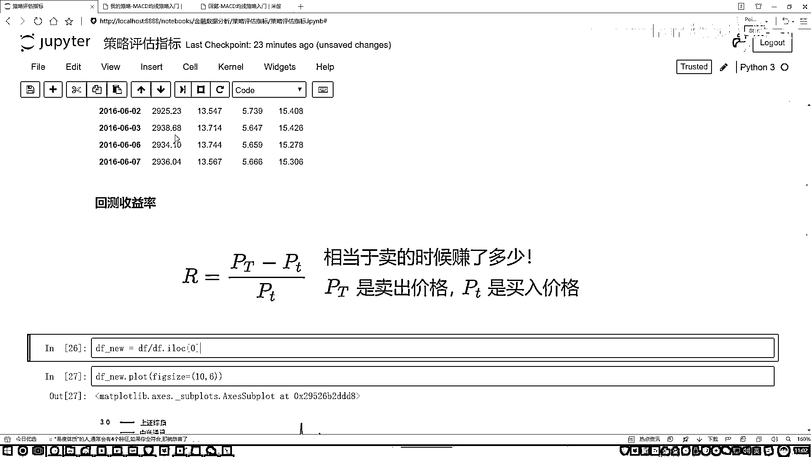

# 吹爆！2023B站公认最系统的Python金融分析与量化交易实战教程，3小时入门AI量化交易，看完还学不会你来打我！人工智能｜机器学习｜时间序列｜股票预测 - P17：2-年化指标分析 - 人工智能博士 - BV1aP411z7sz

然后呢这个回策收益率我们是不是算出来了，有的负的，那是不是说投资有风险，咱这个不一定是稳赚的，然后呢你看有的怎么样，有的是赚的比较多的吧，这都是翻倍了，有的剩下的量可能相对来说赚的是比较少的吧。

这个就相当于啊，我赚了多少跟一开始相比的一个比值，这个我们叫做一个回策收益率，也就是我们在分析指标当中最重要的一个，你设计好一个策略之后你就得看，这个策略能够使得我赚多少是不是，好了这是第一个问题。

那第二个问题是什么，对于我这个策略来说，那回策收益率大家也明白了，相当于你赚了多少呗，那还有一个值叫做一个年化收益，大家经常听到这个词吧，年化收益，那可能上面你说你这个回策收益率。

那你说你是做了十年做了八年，时间挺长的，那可能你的策略当你去跟别人说的时候，别人说我没时间听你这么长时间的一个情况，你能不能告诉我你的一个年化收益是多少呢，这一块把咱们的年化收益列出来了。

相当于就是对我们之前的一个回策收益，还要给他做了一个变换吧，做了一个工程上的变换，使得咱们现在这个东西叫做一个年化收益，其实通常就是当我们在看这个回策收益的过程当中，咱更关注什么，是一个年化收益。

这个通常是我们重点要去观察的一个指标，看起来没差特别多吧，但是多少还有一点区别，然后来看一下吧，他的一个公式，公式其实挺简单的，给大家来说一说，他都做了哪些个值，第一个就是这个R。

表示的是我们的一个总的收益率，咱刚才是不是算过了，这个东西回策收益率，这是咱们刚才算过了，然后这块有一个M和N，M的意思就是表示是天数，通常我们所说的一个年化收益，因为一年一般情况下就是平均来看。

250或者252个交易日是不是，这个表示的是我们的一年有的一个交易日的一个数量，然后这个N，N表示就是你的一个数据，比如咱们这个数据，咱们这个数据我计算一下，我把咱们当前数据拿过来。

这个是我们的一个数据是吧，看一看咱数据，不是这个，是我们的一个data，这个data frame，把这个data frame拿过来，这个是我们的数据，一共有730个样本吧。

它表示的是就是你选择了多少天的一个数据，然后我们来实际的算一下吧，比如说这个指标，我们叫做一个年化的一个收益率，我的一个能得到多少钱是吧，然后它等于什么，你看这里，这一块是不是说用一个什么。

1加上一个R，来咱们写就是一个1，再加上咱们之前做好的一个结果，我把这个结果给它加过来了，然后呢，对它这块有一个，就是一个MBN是吧，我们把它写出来，就是这里我直接写数值了，250。

然后比上咱们是一个730是吧，不用730了，我把这个浪值传进来，250比上一个它，是不是就行了，然后呢，做多少次密，那就是一个QW，列过来，这就完事了，然后不要忘记最终就是在什么，再减去一个1。

是不是就可以了，然后我把这个表格还是给大家展示出来，我们来看一下，在这个表当中，改几个参数，第一个参数稍微改一改，这个我这个我也改一改，就这个吧，回测年化收益，行，然后我们来执行一下，行了，这几个指标。

我们是不是就算完了，跟上面结果怎么样，是不是稍微的有一点不同啊，因为你看这个中兴，之前你看那个就是做了好几年的，最近多少年，700多天数据，大概得有个三四年吧，中兴之前是1。13是吧，那你看一看年化呢。

是0。2几，然后第一个，第一个是赔了的是吧，然后一看年化是个稍微小一点的，下面两个指标是不是也一样啊，这个就给大家说了一下，就是，当我们在看的过程当中，其实你不光可以去看一个最终的一个，你的一个收益率。

还可以看什么，我们的一个年化收益吧，好了，这里给大家先解释了两点，最重要的就是，咱们这个收益来说，你要观察的最重要两个指标，最终我怎么地了，然后这个按年化来说，我的一个收益啊又怎么样了。

这是咱们解释的第一个指标。

