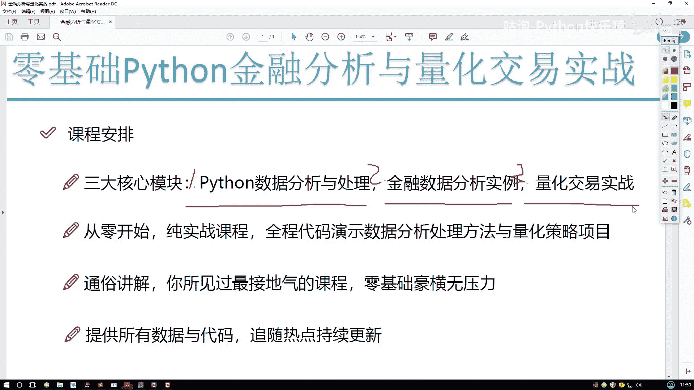
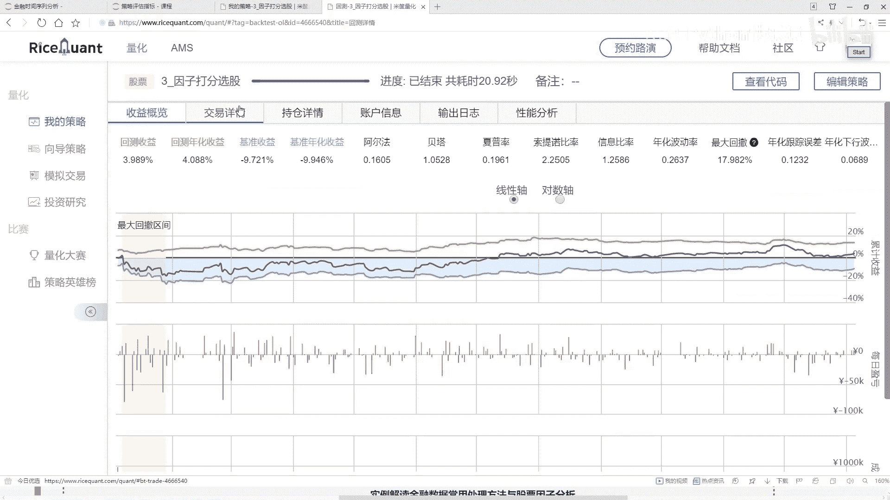
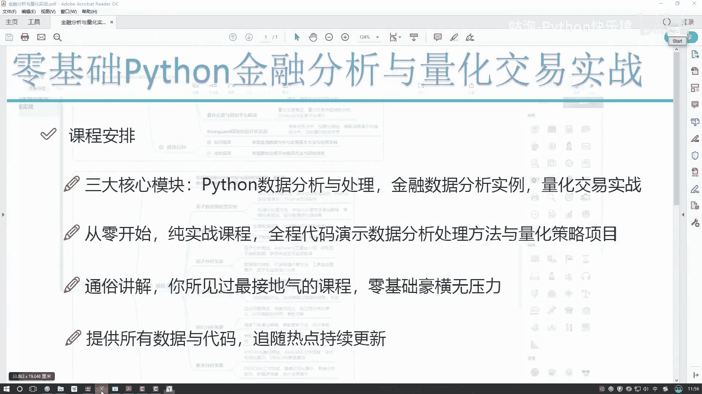
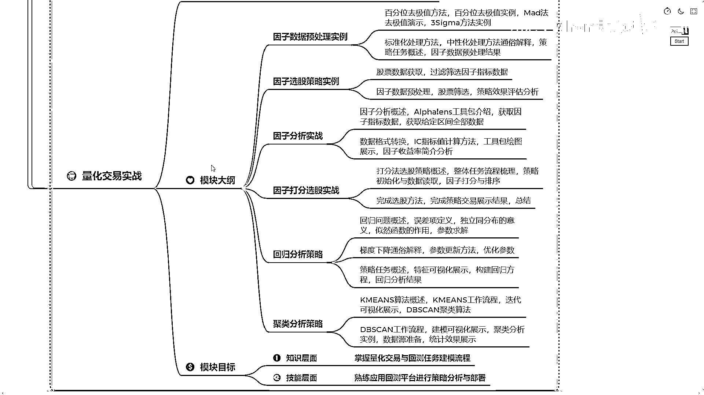
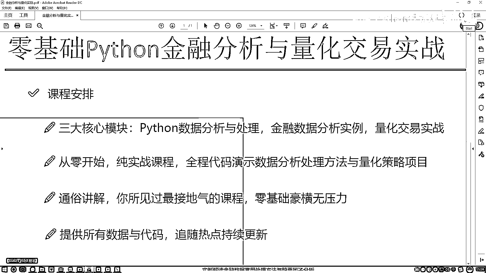
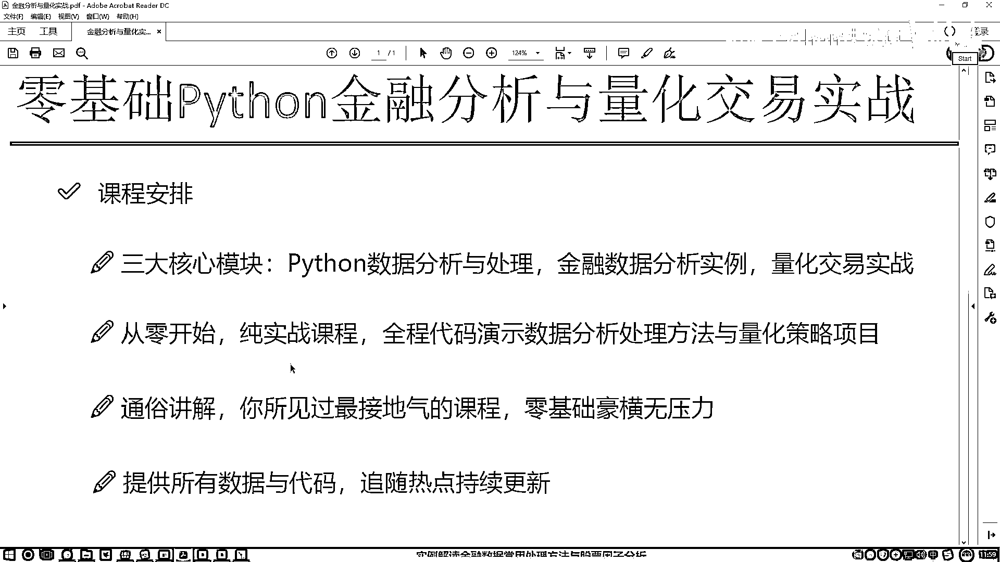

# 吹爆！2023B站公认最系统的Python金融分析与量化交易实战教程，3小时入门AI量化交易，看完还学不会你来打我！人工智能｜机器学习｜时间序列｜股票预测 - P1：课程内容与大纲介绍 - 人工智能博士 - BV1aP411z7sz

真心希望各位观众老爷们不要白嫖。

你的三连是我更新的东西。

第一节课先大家从整体上来介绍一下，咱们这门零基础Python金融分析与量化交易实战课程，我们的内容安排，咱们课程当中主要涉及到了三大模块，分别是我们的Python数据分析和处理。

在这个数据分析和处理当中会带大家去讲，怎么样用Python去玩咱们的数据，怎么样处理数据，怎么样分析数据，然后第二模块是涉及到我们的一个金融数据分析了，也就是说我们会拿到一些股票数据。

对股票数据当中我们都能做哪些个操作，做哪些个分析，以及对这些时间序列咱们该怎么玩，这个是我们第二部分，第三部分我们要选择一些量化交易的策略了，比如说咱们现在写一个策略，那这个策略究竟能够挣多少钱呢。

咱们要在这个历史数据当中做这样一个回测，通过回测咱们来分析分析，我们这个策略到底是好还是不好，好了这个就是咱们的三大核心模块，先大家简单介绍一下，一会儿会大家来看我们的详细的大纲。

接下来给大家先来看一下，就是咱们在讲解过程当中会用到的一些工具吧，现在就是我打开这个界面，就是我们课程当中讲解这个界面了，咱们这个课程是没有PPT的，不会给大家去讲这个金融的知识，也不会教你怎么去炒股。

我们的重点是在Python当中，怎么样实现出来这些任务，怎么样把我这个任务给它做出来，怎么样去分析，怎么样做回测，怎么样得到一个结果，所以说我们的重点是什么，全部要放到代码当中，整个的课程来说。

它是一个纯实战的一个内容，每一节课我们都给大家讲，在代码当中我们会怎么去做，所以说最核心的就是，我们怎么样用Python处理数据，去玩数据，去做回测，去完成我们的一个量化交易的策略。

好了这个就是我们课程界面，可能大家现在对这个界面不太熟悉，没关系，等咱们正式课程当中，我会详细给大家去讲，我们这个工具该怎么样去用，咱们这个代码该怎么样使用起来，在讲解过程当中，咱们全部的课程内容。

都是以这个实际的数据为例子，给大家来做这个引入的，会给大家去讲，在这个数据分析当中，以及金融数据，还有时间序列当中，一些常用的分期，还有统计方法，咱们一步一步该怎么样去做，这个是我们的第一模块。

相当于我们要掌握，这些Python工具包的使用方法，以及对金融数据，咱们该怎么样去玩，这个是咱们的一个notebook，主要给大家演示，我们怎么样用Python这些工具包，并且完成一些数据分析的案例的。

然后我们再看下一个，下一个当中这个也是类似的，这里就是我会给大家讲，接下来我们要用到的一些回测的平台，比如说现在我有了一个量化交易的策略，我脑子有个好想法，我说想把这个策略给它实现出来。

然后看一看这个策略，在历史当中，比如说从19年到20年，这么一年，如果说我用我的策略，咱能赚多少钱，咱要玩这样一件事，也就是一个量化交易，在量化交易当中，我会给大家去讲，每一种指标，比如说一些回测收益。

还有一些超额收益，咱们都该怎么样进行获取，以及各个指标，它都是什么样的一个含义，并且要把咱们的项目，还有我们任务用到哪，用到我们的一个回测平台当中，什么叫做一个回测平台。

这个就是咱们实际写一些回测策略的时候，会用到的一款工具，我先不介绍，等咱们这一块当中会详细给大家去讲，这些工具，这些平台我们怎么去做，这里这个意思就是，当我们现在有了一个策略之后，我想把这个策略。

像我刚才说的用到历史书籍当中，看一看咱的一个回测结果，你看这里，我们写了好多策略，就是会有一些方法，以及计算，还有一些筛选，然后写完策略之后，我们要运行一下，运行完这个策略之后，我们可以看一看。

在这个一年或者是三年五年当中，如果用咱们当前这个策略，我们得到的一个结果，或者然后我们还会跟这个大盘做比较，也就是咱们当前，我们的一个回测收益，跟一个基准收益来比，咱们到底是赚了还是赔了。

以及当前我的一个策略来说，给我来能带到，能给我带来的一个超额收益，是有多少的，这个就是我们的一个分析，还有展示的一个结果，相当于这里我们去写策略，然后接下来我们会执行策略，得到咱的一个结果。

在这个结果当中，它包括了我们详细的一个，就是交易的详情，在这里每一天你买了什么东西，卖了什么东西，以及当前你的一个职场情况，还有你的一个账户的信息，比如说我给你十万块钱，然后经过了一定的周期。

比如说是个三年或者五年之后，看一看这笔钱让你糟净的还剩多少钱了，到底最后咱们是一个赔了，还是一个赚了，行了，这个就是在我们的一个回测片当中，我们可以观察到的一些个指标值，好了。

这里跟大家简单的介绍了一下，就是我们的几个核心模块，刚才我也说了，就是我们的客人来说，是从一个零基础开始的，大家如果觉着就是以前，我对python不熟悉，没关系，我们课程当中会先给你讲。

python怎么样去用，python工具包怎么样去用，以及怎么样把python融入到金融数据，还有量化交易实际的项目当中的，所以说咱们的是一个零基础开始，纯实战的一个课程，我们的核心重点都是放到。

怎么样在代码当中实现我们这些个功能，并且咱们在讲解过程当中，我的一个风格就是会比较通俗，用一种比较接地气的方式给你去讲，这个东西这个工具包怎么样去用，这个策略咱们怎么设计。

怎么样在平台当中完成咱们这样一个项目，所以说咱们这个策略是一个零基础，好横无压力，这是咱们这个风格，然后并且在咱们学习过程当中，为了方便大家自己做练习，自己做一些小任务，我会给大家提供咱们课程当中。

所有我们但凡涉及到的这些个数据，还有代码，就是但凡用到的东西我们会全部提供的，行最后给大家看一下我们的一个课程大纲吧。

大纲当中咱们也是分了三个模块，我一个一个给大家来说一下，第一模块就是一个Python必备的工具包实战，咱们刚才既然说了，我们的课程它是一个零基础无压力的，所以说第一模块，我现在大家去讲。

Python当中最基础最核心的一些知识点，以及咱们课程当中会用到这些工具，我们该怎么配置怎么安装，这是第一模块，我们要打基础的，并且我们还会讲Python当中两个非常重要的工具包。

后续也是我们主要依赖的，一个叫NumPy，主要是做一些数值计算的，第二个叫Pandas，主要是做一些数据分析，还有处理工作的，这个是我们第一模块当中，主要是讲给Python相关的分析。

还有处理的这些工具包，咱们该怎么样去玩，然后第二模块，第二模块我们要过渡到，Python的金融数据分析当中，在这里我们也是一个纯实战内容，会拿到我们实际股票数据，跟大家去说，一个股票数据来之后。

我们该怎么样去分析，怎么样去做建模，怎么样做统计，并且在这个另外平台当中，我们该怎么样去使用这个平台，完成我们第一个回测的一个项目，看一看我们的策略，在历史的数据当中，咱们到底是赔了还是赚了。

以及我们各项指标是什么情况，第三模块，我们主要是深入到量化交易当中了，会带大家去讲量化交易当中，我们一些常用的经典策略，以及我们一些实际操控当中数据，我们该怎么处理，因此我们该怎么样去分析。

实际制定出来的策略，我们该怎么样进行改进，怎么样融入到历史数据当中，并且获得一个比较好的收益的结果，好了，这个就是我们科技大纲当中。

主要涉及到的三大模块。

跟大家简单的做了一个介绍，行了，这个就是咱们第一节课来说。

我们的一个主要内容吧，跟大家简单概述一下，咱们课程的内容，以及我上课的一个风格，还有就是我们会涉及到哪些个知识点。

接下来我们就进入到咱们的正式课程当中。