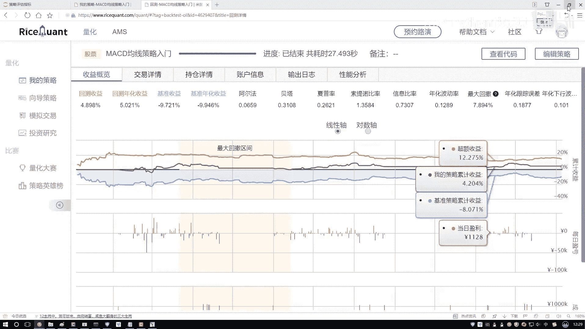
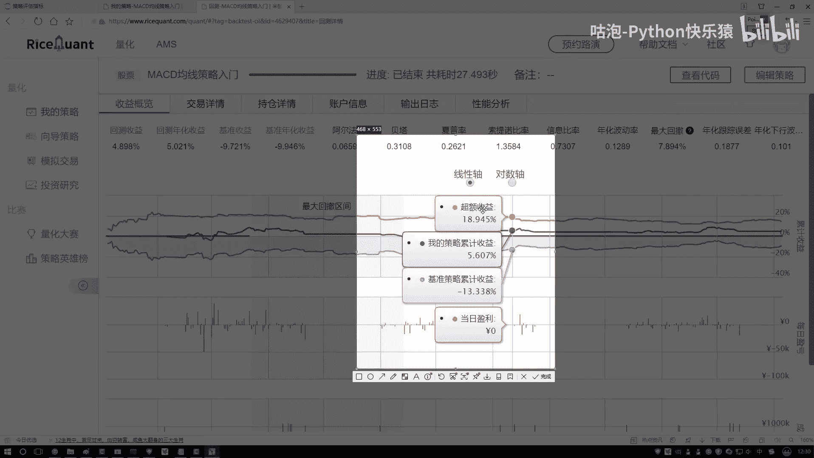
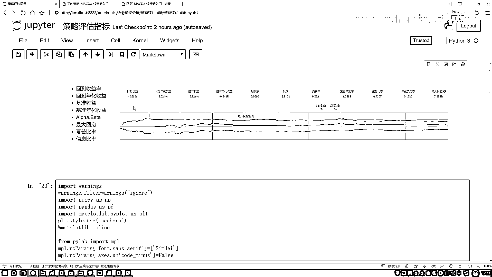

# 吹爆！2023B站公认最系统的Python金融分析与量化交易实战教程，3小时入门AI量化交易，看完还学不会你来打我！人工智能｜机器学习｜时间序列｜股票预测 - P20：5-阿尔法与贝塔概述 - 人工智能博士 - BV1aP411z7sz

最后咱们再来说一下这个α还有β，其实就是在我们测调当中还有两个值，你看这里一个α一个β，咱们再来说一说，αβ是这样一件事，就是好比说你现在赚钱了，那你这个钱是怎么赚的呢，我说你赚这个钱是分成两部分。

反正你说你写了一套代码，写了一套策略，或者说你去选了些股票，做一些事情，赚这个钱分两部分，一部分是说，现在整体这个市场，大环境就好的，大环境好，自然你就能赚钱，就是说一部分是跟这个市场相关的，另一部分。

我说另一部分可能这样，它跟市场不是太相关，跟你的一个努力是相关的，比如说你每天都在去考察各个公司，考察他们当中财务，或者这个信息那个信息，或者他们的一些公司的运营，公司的状况之类的，你读具会眼了。

然后你去发现了一下，当前我该怎么去操作，能够使得我去赚钱，相当于你有两部分，一部分是跟大市场大环境相关的，另一部分是跟你的策略，跟你的一个敏锐的观察力，或者是跟你的一个手法相关的，组成两部分可以，好了。

我们所谓的一个α和β，就是分别去衡量，我刚才说的这两部分的，来看一下它的一个定义，说α它叫做一个，不用管它的定义了，叫非系统性风险，其实它就是这样一件事，它描述的是，你的一个投资，或者是你的一些策略。

或者是你做了一些什么事，与市场的波动是无关的，就是大市场大环境怎么样，这你做这些事跟它没关，主要是你自己努力来的，所以说一般是用它衡量，你的策略怎么样，这有个指标叫做一个α，然后还有个指标叫β。

β是这样，β就是说，你现在跟大溜混，跟大溜混你也能挣钱，跟大溜混可能就是大市场，它的一个走势，表示就是投资的一个系统性风险，就反映了你的一个策略，对大盘的一个敏感性，就是说白了。

市场收益它是跟β是挂钩的，超额收益是跟α相挂钩的，我解释一下什么叫市场收益，看这个图，这个图，这个图当中，你看这里是有这样。

我看这都怎么还有负的。

来随便，这还不带有截图，这样，咱随便截一个位置，来看这个位置，你看现在有什么，现在这里有一个点，叫做我的策略收益，是不是，就是你现在做了一件事，然后你的一个收益多少，然后基准策略收益，基准策略收益。

就像我刚才说的，这是一个大环境，大市场，比如说你的一个几百股票，三百五百的股票，然后它的一个指数，整体的一个走势，可以吗，相当于就是大环境，它的一个走势，这里还有什么，还有一个超额收益，超额收益是什么。

就是用你的一个策略，减去市场的走势，通过你，是因为你的策略，你的努力，所带来收益，叫做超额收益，所以这里咱们就把蓝色的，现在主要在这个位置，你就当做是市场，它的一个大环境，然后这一块，就这块策略的。

不管了，超额收益，就是我们独具慧眼，咱得到的。

我想要的一个结果，在这个任务当中，你看超额收益是什么，通过你的策略带来的，是不是，市场收益，就是你跟着大盘走，它所带来的一个收益，所以此时我说，最终我们的一个总收益，把它比作成两部分，一个是市场收益。

一个是超额收益，然后市场收益，它有个系数，北特超收益，它有个系数，α，其实你说这两个东西，北特α怎么求出来的，你看它叫什么，我说这个东西它是Y，就是一个回忆方程，可以吧，在回忆方程当中，有两个什么。

有一个北特，有一个α，我让你把音子给它求解出来，是不能去解，咱们可以按解现有方程的方法，把它解出来，当然这个只是其中一种做法，等后续咱们来说，音子策略分析的时候，给大家专门去讲，这些具体。

我们的策略该怎么去办，现在大家只需要知道，有这么两点就行了，一个叫β，β意思就是说，这个东西它是，跟市场相关的，然后α这个东西，是跟市场无关的，其实你要干什么，你说我们目的是干什么，我们目的是赚钱是吧。

你说市场你能改吗，就钱这个东西，它爱谁谁，为什么这么说，市场这个东西说白了，你无能为力，你改变不了，你也没那个本事，所以说我们的关注点在于什么，你就关注点就在于，怎么样获取一个超额收益。

这是我们的一个目标，所以说通常情况下，咱更关注什么，我们的一个α，怎么样获取更多的超额收益，这是我想要去做的，行了，就是简单了解一下，先了解一下α和β，它表示的都是哪两个层面的，一个意思就行了。

后续咱们再详细去说，好了，这里给大家看了一下，就是，在我们这个指标当中，有一些常见的，我都给大家举个例子，咱们来简单唠一唠，公式不用去记，记完了后面你也忘了，你就知道，比如说这样一个什么最佳汇测。

或者一个消费率，一说到，你知道什么意思就行了，不用去记它的一个公式，Python实现简单了也行，因为实际在运动过程当中，基本上也不自己去写，有很多工具包，以及这些现成的平台，能帮我们去做。

这边还有基准收益，基准收益，我记得好像之前忘说了，基准收益这样，基准收益像我刚才说的，就是，你什么都不做，你跟着大盘玩，然后它的一个，它的一个收益的结果，你看你什么都不做的时候，可能怎么样。

还是一个负的，我们要做的，就是去获得它的一个超额收益，行了，这里给大家解释了一下，就是在策略评估当中，一些我们的评估。

还有风险指标。

都是什么意思。