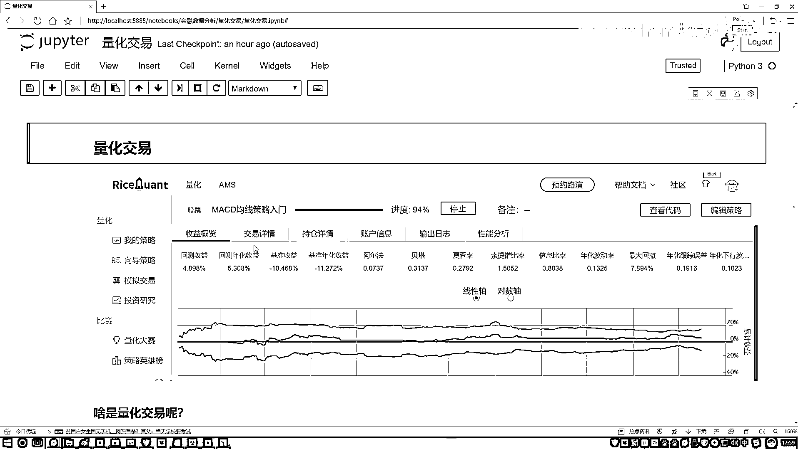

# 吹爆！2023B站公认最系统的Python金融分析与量化交易实战教程，3小时入门AI量化交易，看完还学不会你来打我！人工智能｜机器学习｜时间序列｜股票预测 - P22：2-量化交易所需技能分析 - 人工智能博士 - BV1aP411z7sz

那都需要哪些技能呢？，你看看我是不是写了，机械学算法当中，几大项，回归分类剧类，这都不用说了吧，最常规了，而且更重要的是什么，你看这也写了，叫做一个特征工程，做过数据挖掘的同学，肯定都有个印象。

你说现在我要去做一件事，那做一件事，我是算法更重要呢，还是数据更重要呢，我在讲机械学一科当中，经常会提到一点，就是数据决定了你模型的一个上限，算法只是决定，咱们怎么样去逼近于这样一个上限。

所以这一块有一个词叫特征工程，说白了就是怎么样处理数据，怎么样在海量数据当中，找出来最有价值的信息，因为我们现在在做量化交易过程当中，拿到一些金融数据，我可以这么说，金融数据简直太庞大了。

比如说你想分析股票，那你不光有什么，大家可能觉得就是一个收盘价开盘价，就是这两个指标，其实不光这两个吧，股票对应什么，对应公司，公司当中财务数据，各种各样指标数据是不是都来了，所以说我们要面对的。

可能是更为复杂，更为庞大的数据了，你想把这么多层面数据都融入到一起，比如说有一个市场的数据，有各个公司数据，有各种财务报表数据，还有股市走势的数据，这些可能都会对你最终结果产生影响，那你怎么样设计算法。

怎么样把这些算法融入到我们的数据当中，这就是特认工程了，怎么样选择最有价值的数据，怎么说就是继续当中最难的一点，其实并不是算法，是怎么处理数据，难就难在数据了，这里我写了一下，还需要什么，统计学方法。

像我们说的，大家可能可以看一些关于量化交易，它一些招聘的岗位都会写什么，要不然希望你是数学专业，统计学专业，计算机专业，或者金融专业，是不是，为什么说需要这么多，跟数学相关的，其实在我们计算当中。

你说无论是算法，还是你的一个策略都是什么，把数学公式应用到了数据当中，所以说数学这个东西已经不用强调了，我讲机器学义当中，大家可能觉得讲机器学义里边数学讲太多了，因为数学就是一个本质了。

这里需要大家掌握的数学知识点，还是蛮多的，然后第三点就是一些框架的使用，咱们课程当中会选择一款，我先不说，等后去咱们会介绍，选择一款我们的一个平台，来给大家去讲解，怎么样去一个平台做一些回测。

做一些我们策略的实践，以及能看一看我们策略结果好坏，其实大家咱们现在去一搜，你搜这个量化交易，能搜到好多平台，是不是，你说具体选哪个平台，其实这里也没有具体选哪个平台一说，那就是看哪个方便。

我会给大家找一个，相对来说用起来是比较方便的，相当于就是API，我尽量使得简单一些，可人化展示的清晰一些的，会给大家选择一个框架，相当于一个平台，在API当中，你可以把写python代码。

写python代码之后，你可以直接编译，然后得到一个运行结果，运行结果就是，一个持续时间，比如说你观察，10年到20年期间，你设计一个策略，然后它的一个策略，然后在每一天实施的一个情况。

然后你的一个收益怎么样，你最终的一个结果，这是一个平台使用，但是这里你看我写的，平台和框架，这些东西都是什么，都是我们的一个工具，工具就是熟记就行，没必要去背，也没必要去记，简单了解，或者说会用就行了。

还有策略算法，算法当中其实蛮多的，你要想看最新的，建议大家去看一些，经常非常经典的一些论文，论文当中讲的都是一些新的，但是我们课程当中，会给大家讲最常用的，最经典的一些算法，比如说怎么样经济学上去做。

怎么样会去用一些，常用的策略算法，这些全是会带去讲原理，以及在Python当中，咱们该怎么样去用，注意一下我们课程的一个名字，跟Python是直接挂钩的，所以说咱们的重点，不会给大家去讲。

怎么样教你超过票挣起来，怎么样教你去做这个做那个，我们重点是，怎么样在Python当中，给它做出来，我们重点是要落在一个案例，实践当中，这个是我们的一个重点，然后接着同学问我，咱们现在期货和股票。

你说咱们在量化交易当中，都能去做，我们可能更重点的是做哪一个，我觉得可能是跟股票是相关的，因为对于一个股票数据来说，咱们可以看什么，你自然而然股票数据，各种各样数据指标，是不是都有，它适合做数据挖掘。

所以说我们接下来课程重点，可能是跟股票更相关一些，因为在股票当中做数据挖掘，相对而言更容易一些，期货为什么不适合，其实大家估计有一点感觉，就是那些期货玩的厉害的，玩的牛的人，他都是什么样。

他都是专门去研究这个东西的，他不是一个学IT出身的，也不是一个学数学出身的，他可能就是专门这个行业的，一个从业人员，因为他对这个市场，非常了解，因为期货这个东西，跟股票可能稍微有点区别。

期货跟市场关系更大一些，但是你看一旦，他跟市场关系更大一些，相当于主观判断力，是不是更强一些，你判断这个东西什么时候，可能是一个高价，什么时候可能是个低价，主观的因素会更重要一点，所以说咱们课程当中。

关于期货会举几个小例子，不当做一个重点，我们重点会给大家讲什么，讲股票，因为股票更适合做数据挖掘，更适合咱们拿python做案例，做一些实际的任务，既然提到了数据挖掘，咱们不得不说数据挖掘要干什么。

其实说白了，数据挖掘就是给我们拿到了，这些咱们简单调解就行，大家都不用去记，拿到了一份数据之后，怎么样对数据做处理，怎么样你去设计一个交易策略，好了，有数据有策略之后，怎么样融入到一起，融入到一起之后。

其实说白了就是一个回测，回测的意思就是说，你现在我拿到历史的一个数据，然后你告诉我，你要用什么样的方法去做，然后我测试一下，当前你这个策略怎么样，是不是，测试好的这些策略，都是对历史数据来去做的。

在对历史数据做完之后，我们是不是要对实际的决策，产生什么，一些指导，一些依据，这个就是我们量化交易，大家要去做一件事，其实你可以把这个东西，叫做数据挖掘，我觉得也没什么问题，因为我是专门做技术学习的。

我觉得这个东西，它其实说白了，就是数据挖掘，把数据挖掘算法，融入到金融数据当中了，起了个名字，叫做一个量化交易，但是其实，以前有同学问我，就是量化交易，是不是去预测一下，我这个股票明天是涨还是跌。

然后你基于它的涨跌做一些事，其实不仅是要做这样一件事，预测涨跌，其实可能不是那么特别容易，我们刚才说什么，我们量化交易目的是什么，是要做收益，所以说当我们在做的过程当中，可能并不是非要关注于一个涨。

和一个跌，而可能更关注于什么，怎么样让收益最大，比如说现在300只股票，摆在一个池子里边，我说这池子里的股票，你都可以去玩，比如说你本金是一定的，怎么样能让你的收益最大，怎么样去选股，选择最好的股票。

选择单位风险，收益最高的股票，这是不是也是数据挖掘，所以说量化交易，不是像大家想的，就是预测一个走势，那就是一个集血液问题了，这里它是一个综合绝科，但是目的是一样的，就是让咱们怎么样，收益最大化，行了。

关于量化交易，不需要大家掌握太多，你对它的一个基本概念，有一个了解就行了，没必要看一些长篇大论，也没必要看一些历史，你看历史都是国外历史，因为中国第一点股市开放的，比较晚是不是，而且这些常用算法。

也大部分都是从国外流行下来的，人家研究这个东西研究几十年，中国的路，其实怎么说，发展到已经比人家晚了，三四十年了，所以历史咱都不用去看了，国外爱咋做咋做，这些咱们都不用关心，你只需要去知道。

量化交易要干什么的，数据挖掘什么意思，用什么工具，大概我们后悄讲什么，这就可以了，这时先给大家概述了一下。

我们的量化交易。

是一个什么事儿？。