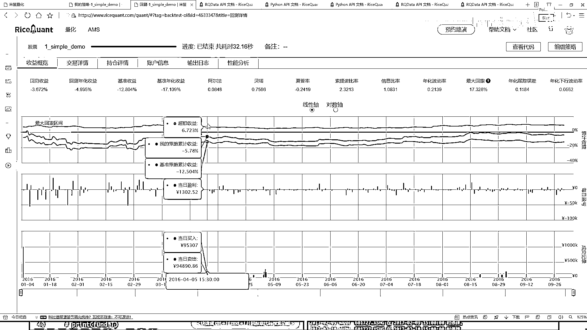
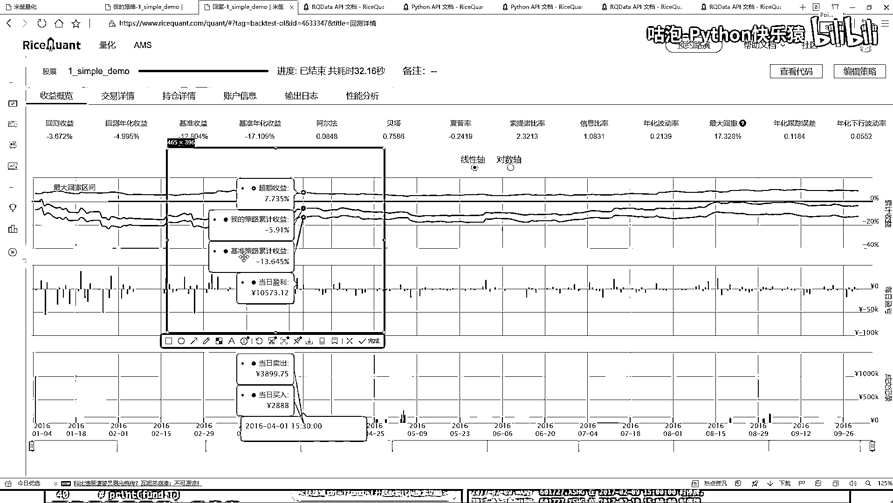
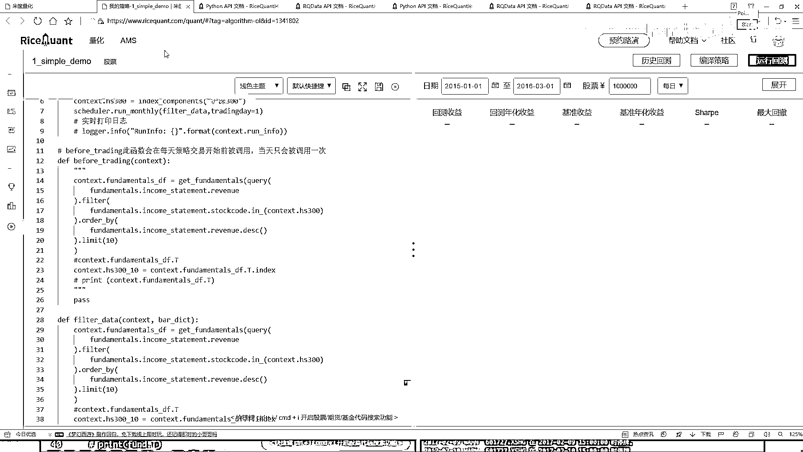

# 吹爆！2023B站公认最系统的Python金融分析与量化交易实战教程，3小时入门AI量化交易，看完还学不会你来打我！人工智能｜机器学习｜时间序列｜股票预测 - P27：4-定时器功能与作用 - 人工智能博士 - BV1aP411z7sz

交易详情就是咱们之前选的这个时间，你不是2016年1月4号到这个2016年10月4号吗，所以说就是每一天那咱们刚才做这些事儿，你看这里咱们之前说的时候，Handlebar里边每一天都会去做吧。

Before trading当中也是每一天都会去做吧，那所以说咱们现在得出结果，那每一天都会去产生一些交易吧，你看这块它都是详细给你列出来了，这个1月4号，反正给你选出来这几个这10个是吧。

选出这10个然后肯定第一天都是买的，因为第一天只有这样一个买，并且是一个平均的一个买吧，就是占到你的一个总价，它是一个平均的，然后总共是10万块钱，那就是相当于每一个买这么1万块钱。

但之前这里是不是指定了，我第一天第一天肯定执行的是这个东西是吧，因为第一天的时候它这块怎么样，等于等于零了，你的仓位当中啥也没有啊，所以说第一天它是买，那咱们该写的是平均买啊，这个平均买就是这样。

就是你今天有10万块钱，然后每个股票你买这么1万块钱啊，它是这个意思，你看中国石化，然后它是一个买，然后这有个成交量，然后这个成交价费用就是你那个什么印花税啊，然后还有什么滑点。

还有一些其他可能也就是几个几一点点费用吧，一般买的时候都会存在一些费用的，然后下面就是啊，第二天第二天的过程当中啊，它又会进行一些买还有卖吧，因为它要保证就是咱们的一个仓位吧，你要把卖出的东西了。

那你还要把这10万块钱给就是给他就是你先有多少钱，你都要给他花掉吧，这个意思啊，所以说这块第二天开始它就出现了一些买卖，然后成交量，然后成交价这个就不给大家一个看了，大家感兴趣自己往下去拉吧。

这有海多甜了啊，就是你一来往下去拉，咱们能得到所有它的一个详细的一个交易的一个结果在这里，你可以把它的一个结果展开，或者说你想看哪些指标咱全看是不是都行啊，或者说你把这个东西也可以下来下来啊。

这一个就是供你自己来去分析一下，这些东西都是啊，你去模拟的一个实际的情况，持仓持仓也是一样的，就在这里啊，你的一个价格，然后你现在比如说这个股票你手里啊，他有了多少钱，然后你可以去看每天他的一个盈亏。

第一天肯定都是零，因为第一天都买了，然后第二天开始是发生了变化了，你可以针对啊，你手里有的每一个股票，他给你去看啊，当前是亏了还是赢了，给我这个感觉好像大部分情况下都是亏了，这连着亏了多少天了。

你看从这里连着亏是不是啊，这可能就是我看一下咱们那个最大回撤是不是就是最开始的时候，你看最大回撤区间来了，这个是不是刚才我看的一堆绿的呀，什么这就是我刚才说的最大回撤区间了，你能不能挺过去的一段趋势了。

挺过这一段后面是不是稍微的给你涨了一点啊，有这样一件事吧，这个哦在这里，相当当中也会有这样一个指标，想给你介绍每一天你的一个情况，这连着亏了多少天啊，占了整体时间的一个17%点多，占的还是挺多的。

然后你这个账户信息，每一天你的一个呃，你的一个市值吧，就是当前啊，你就反正就是看十万块钱到底让你获过成多少钱了，那你可以往最后翻，最后大概咱们刚才看是亏了点吧，我看最后啊，最后是亏了一些，但还好啊。

亏的不是特别多，这块有你的一个账户，哎，就是你就看你的一个市值，然后他的一个变化情况吧，这就行，这就是你的一个变化，日志就是你要不要去打印出来一些东西啊，警告这个东西咱可以不看，性能性能这个东西啊。

咱再不用去看了，这些就是咱们得到的一些简单的结果，跟大家做了一个分析，然后呢，你把鼠标点到这里的时候。

他又给你显示出来就是这里啊。

有一个你的一个策略收益有这里，你看这块有我的一个策略收益，然后他是一个啊，反正都是负的是吧，然后一个基准的，然后当前你的一个就是你的一个情况，然后这个超额收益就是你的策略的。

然后减去什么减去你的一个基准的相当于你比这个基准能强多少啊。

这个意思这些啊，就是咱们当前第一个简单小例子吧，然后大家大家可能有问题就是现在啊，可能看这个代码，在汉字瓣当中啊，咱怎么处理的，那每一天都处理，那你说你买股票用每天都去做这样一件事吗。

好像不一定需要去做吧，可能我说我作业间隔，我说我十天啊，去在这个池子当中洗一个牌，然后看看哪十个最好的，或者说一个月洗一次牌，是不是也行啊，咱能不能把这个时间点，我说我自己来设置一下，也可以啊。

这块我们也可以自己就是自定义一个函数，所以自定义一个函数的意思啊，要给大家说一下啊，在这一块我们还有一个API也挺常用的，大家来看一下在这里，这里有这个东西啊，叫做一个定时器，大家来看一看。

定时器也是这样一个意思，就是，呃，它是就是按照一定的一个时间间隔吧，来去执行某一个函数，比如说你看在我们的这个策略当中啊，我们策略当中这块我说每一天，哎，你都要洗一下这个牌，那洗的时候太勤了。

我说这个定时器，我说我给你设置成这样吧，我说你每十天洗一次牌行不行，是不是也可以这样啊，咱可以自己去定义啊，什么时候去做这样一个洗牌操作，你看这里有每天运行，还有每周运行，或者是每月运行，是吧。

咱们来试试吧，举个例子，我说这个东西啊，咱就每月运行吧，然后看一下它的一个参数，第一个参数啊，它要什么，你自己也写一个方式，自己写一个函数吧，然后这点就是每月当中你选择呃，比如这个月里吧。

有好多好多的交易日啊，你选择哪个交易日啊，去执行这样一个操作啊，这些是我们自己要去写的，咱默认就拿第一个交易日吧，咱一会这块写一个一，然后呢，这里你看呃，当我们去做的时候，这块让你写个方式吧。

这个方式就是呃，每月然后第一个交易日的时候，要做一件什么事儿，那这里啊，就是我们不能给他写到这个before，trading当中了，咱们得稍微的改一改，比如trading当中，呃，这里咱就是啊。

我看一看这里呃，测验当中这个before trading，这一块，我说我就得给他注释起来了，好了，比如trading给注释起来，然后我们自己写个函数吧，我直接复这个名字先，复这个名字啊，自己写个函数。

这个函数叫做一个呃，就叫做一个filter data吧，去过滤一下咱们当前这个数据，然后呢，这个代码也不用自己写了，直接把所有这个东西，咱全复制过来，是不是就行了呀，然后呢，我说在这个我看一下这个。

他不是有个要求吗，你看啊，这个当前我说这个每月运行能在哪使用，只能在你的一个构造函数，init文号当中去使用，其他地方不能用啊，所以说我把这个函数给他复制过来，在测验当中，指定一下吧，好了。

我说加上我们的一个定时器，加个定时器，第一个function，你自己写的函数，在这块是不是写了一个filter data呀，好了，我说我把这个filter data给拿过来。

然后每个每个月第一个交易日吧，来去执行这样一个操作，哎，是不是行啊，其他代码你说用改吗，那其他代码都一样的，再也不用去改，好了，咱每就是每个月我们做一次洗牌。

这样还是这个16年1月4号到16年10月4号吧，来试试吧，是这个结果怎么样，再来运行一下，看一看他的一个结果，不一定好也不一定坏啊，因为这个东西咱们现在指定策略相对来说比较简单啊，可能可能还不如刚才呢。

不好说，咱们来看一看，额，完了还真不如刚才，刚才我记得是亏了4%点多是吧，现在亏的更多了，可能这个就是你自己不断的去实验啊，不同的一个效果的，然后自己这样，我把这个时间点改一改，我说你可能这个16年。

可能这个16年不太好，换一个年，我说这样吧，咱们给他指定成一个，18年，18年的一个1月1号，然后到这个，20年吧，到这个20年的一个，3月，然后1号吧，再执行一下，结果好不好，这东西都不好说。

咱今天给大家举这个例子，只是跟大家去说，这些API咱怎么用啊，至于他具体这个结果到底怎么样，至于这个结果，我估计刚才看可能不太好，刚才看到了一个负的28%点多是吧，可能这个结果还不如刚才的，来看一看吧。

还不好说，等他跑完的，好了，这个结果跑完了，跑完之后，果然不出咱们所料，咱们设计了一个非常牛的策略啊，就是跟着你的指数走，基本不打亏，跟着咱们这个策略玩，那亏的啥也不是了，是不是，所以这里啊。

就是可能你选择呀，一个不同时间点，或者说指定咱不同策略方法，你看刚才我就改了一个，你把电视机，刚才原来咱们是每天执行，我说现在改成每月执行了，这个结果怎么样了，那可能就完全都不一样了吧，这个效果不太好。

换一个时间点，我换一个2017年吧，然后到20别了，换早点吧，2015年可能15年的时候能挣一点，到这个2016年吧，咱再执行一下，啊，试试水玩一玩，其实这里啊，主要给大家就是说了一下。

这些API该怎么样用，然后呢，这些指标咱们简单的做一下参考就行啊，就是后续大家，你看我换了个时间点，这个哎呀，刚才是正的，现在怎么突然变成负的了，可能就是这块出现了小问题，如果说咱们只取前面这一段。

我看看啊，我说这个策略，你看在那在哪啊，在当前这一块，我你看到此时的时候，哇，咱们这个收益怎么样，你看这块还是比较大的吧，盈利是比较多的啊，再往后那又不行了，可能这个可能这个大盘也这样吧。

15年15年初到15年中学可能是一个好时候，后面可能就完蛋了，这样一个事儿行了，这里总给大家说了一下，就是在我们策略当中，哎，怎么样，就这个平台啊，进行一个基本代码的一个写法。

其实基本的写法还是Python啊，然后就是参考人家API就是勤看API吧，API当中啊，都有什么，这些个函数吧，像我给大家讲的，哎，你说我怎么知道在这块有写个query，在这块当中要有什么filter。

要有order by要有libit啊，再来的就是参考人家的什么，人家的API文档来去写的这个工具，哎，大家都开始刚开始去学，那说白了，谁也不知道他怎么去设计的。

最好学习方法就是参考人家文档自己来做一个实验就行了。

这个先给大家说了一下，我们那个平台当中啊，基本的一个使用方法。