# 吹爆！2023B站公认最系统的Python金融分析与量化交易实战教程，3小时入门AI量化交易，看完还学不会你来打我！人工智能｜机器学习｜时间序列｜股票预测 - P2：1-fbprophet股价预测任务概述 - 人工智能博士 - BV1aP411z7sz

今天咱们来给大家唠的主题叫做股价分析与预测，那先说一下什么叫做一个股价吧，无非就是一个股票，今天这个价明天那个价，然后今天涨了还是跌了这个意思，那你说这个股票像什么，它是不是说它是有日期的。

还有一个数据，所以说我们说是股价的分析预测，实际上我们就要做一个时间序列的一个预测任务，那这里当咱们想用时间序列，咱们之前讲过有一个东西叫做Arial模型，那个模型可能稍微难度有些大。

用起来没有那么方便，这一回给大家来说这样一个Facebook开源的一个时间序列预测的一个神器。

在这里我们先来看一下吧，就是这里我打开了Facebook它的这个，它的这个就是时间序列预测这个框架，它的一个官网站。

这么的我把这个网站给它复制过来，我给它复制到这里，这样到时候大家就是可以直接的去访问这个东西了，而这个就是它的一个主页。

这个主页当中我建议大家先是整体的了解一下吧。

我现在来介绍一下这个东西吧，这个就是时间序列，咱们先说时间序列都受什么成分影响，首先一个序列，你要它是能可分析可预测的，它首先就是得有一个趋势吧，有了一个宏观长期还有持续性这些作用。

比如说时间序列好多种东西都可以说是跟时间跟序列相关的，比如说随着时间的推移，咱的一个房地产价格还有什么相关，还有跟周期相关，比如说这个时间它就是这个时间序列，它呈现出来那种周期的趋势。

围绕着一个周期进行上下的一个波动，还有什么，还有季节性的因素吧，在春夏秋冬啊，它的一个季节性的因素都会对结果产生影响吧，比如说咱们国内的航班的一个旅客空调销售量，每晚的一个高峰时间等这些都是不一样的。

所以说呢，我们还可以按照一个季节把咱们时间序列进行一个分析，还有什么，还有一些随机性的因素，比如说嗯，这个东西就是不太确定了，有一个随机的一个过程，还有什么呢，比如说我们的一个节假日。

还有我们的一个这个什么什么突发的事件，这些都是可能对我们时间序列造成一个影响的，那这里呢，我们选择Facebook它的一个时间序列预测的框架，主要原因在于这里啊，它是肯定是有些亮点的吧，没有亮点。

我们也不用这个东西去做，那最大点是什么，我觉得啊，就是最大亮点就是嗯，当咱们想构建一个模型的时候，这个模型啊，对咱们来说是不是应该封装的更好，咱们使用的更方便，那我才觉得这个东西好用啊。

那这个框架它最大一个亮点就是用起来非常方便，用起来呢，也是比较简单的，我们只需要调节简单的几个参数，把我们的模型就可以非常轻松的给它挂出来，这个就是我的一个Facebook给我们开源的一个框架，然后呢。

它还有这样的一些特征，就是接下来我们在进行预测的时候，我可以按小时按天，然后按周甚至按月，我都可以进行一个预测，也就是说我们要预测的指标，我们都可以自己来设计，然后呢，在这里啊。

我们还可以就是去衡量咱们的一个周期性，比如说按照季节的按照年的周期性，我们都可以考虑进去，还可以添加什么，还可以添加一个节假日对我时间序列影响的，以及呢，还有什么，还有一些异常值，缺失值。

它都会帮我们自动进行一个处理的，以及还有什么，时间的一个转折趋势，之后会大家就是介绍一下，在这里啊，我们的一个非常重要的参数，就是时间的一个转折点，那什么叫时间转折点，比如这个序列今天突然升的非常高。

那是不是一个转折啊，明天突然降下来了，这些点呢，都是转折点，我让我这个模型记住了历史数据当中，哪些出现了一些转折点，这些转折点，它是不是能更好的去拟合我当前的训练数据啊。

这个就是转折点对我数据的一个作用，但是呢，咱们得想这样一个问题，这个转折点啊，对我训练数据来说，哎，我能拟合的更好，但是呢，对我的测试数据来说啊，是不是容易过拟合啊，因为转折点都是突上突下的，这样呢。

就是非常，它就是非常强烈的去捕捉了原始你数据集当中的这样的一个趋势，那这个趋势一定是在测试集当中呈现的吗，这个还不好说吧，咱们之后啊，回来探讨了一下，就是这个转折点啊，它是我当在这个框架当中啊。

最主要的一个要调节的参数了，这两点呢，都跟大家简单的概述了一下，然后呢，我们现在用的这个算法主要什么，基本上啊，就是这三个的结合，一个呢，就是时间序列预测的一个最主要算什么，自回归模型吧。

要基于自己的前一段时间的数据预测接来数据吧，所以说啊，时间序列它是一个自回归的模型，还有什么，还有移动平均，还有咱们的一个整合模型吧，这些啊，跟Ozone模型都是差不多的，只不过说呢，深度啊。

就是Facebook啊，它这个框架给我们封装的更好。

我们用起来呢，是更舒服一些的，在这里啊，这个就是我的啊，不是我的，就是这个Facebook啊，它这个时间序列预测框架的一个主页，在这里啊，推荐大家来自己简单的阅读一下，如果说你以后啊，想从事。

不是从事吧，想去做一个跟时间序列相关的任务，咱们可以想到这样一个框架，这个框架，从现在来说啊，我觉得用的还是蛮方便的，就是给我自己的感觉，因为我也自己用了一段时间，我是觉得这个东西啊。

用起来确实比其他框架都方便，因为简单，对我来说我不需要太多的功能啊，前提来说啊，越简单还是越好的，然后呢，它有两个接口啊，一个就是说，你可以用R来去做用R啊，就是去做这个框架。

你也可以用Python做这个框架，也就是它有两个接口，反正我估计大家应该都用Python吧，咱们就点啊。

就是该start用Python。

咱们点进去，这里呢，它会有这样的一个教程啊，这个教程，哇，这个这个这个。

这个太阳蓝月啊，给我快看疯了，天天在这看，它这个教程当中啊。

就是告诉你怎么样用Python，一步一步去做这个东西，我建议大家就是。

这个文档其实没有那么多，大家只需要花个很短时间就能阅读完。

建议大家先自己的阅读一下，到时候呢，我也会给大家讲，就是这个框架我们该怎么去用。

一个基本使用流程啊，就是在这里，它会跟你说，你要先把数据啊，转成这种格式，一个什么有时间，还有我预测的一个指标啊，这是一个标准形式，一个DS代表着我的一个时间序列。

一个Y代表着我要预测的一个指标。

这是我输入数据啊，一个基本的格式，然后呢，你看它的构造模型怎么构造啊。

跟那个SKLearn是差不多的，你看最上面说了，它是跟SKLearn model的API是差不多的。

然后呢，在这里就是我们构造模型，其实很简单，直接把这个模型实体化出来就可以了，然后点fit一下呢，这就是进行一个训练了。

然后这块有一个函数叫做Make Feature，然后Distribute Frame，它的意思就是说。

把我要去预测的整个的一个时间片段都给拿到手。

这个意思，然后呢，后面我们就可以进行一个实际的预测了。

预测完之后就可以显示出来的结果，预测结果用YHIT来进行表示。

然后呢，在它的直行区间上，它有YHIT_LOWER和YHIT_UPPER，就是我的一个下限和我的一个上限。

这就是我预测完之后的一个结果，然后这里就是这个时间预测，它这个框架还有个优点就是。

它给我们提供了很多的可视化的功能，我们可以很简单啊，就是把我当前可视化的一个结果给它展示出来。

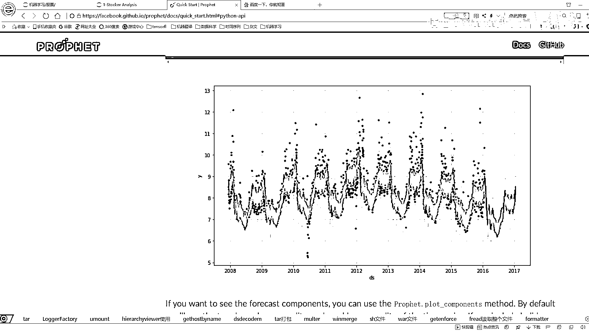

你看这里就是画了一下我当前预测的一个结果吧，下面呢，又画了一下就是对我结果产生影响的一个因素。

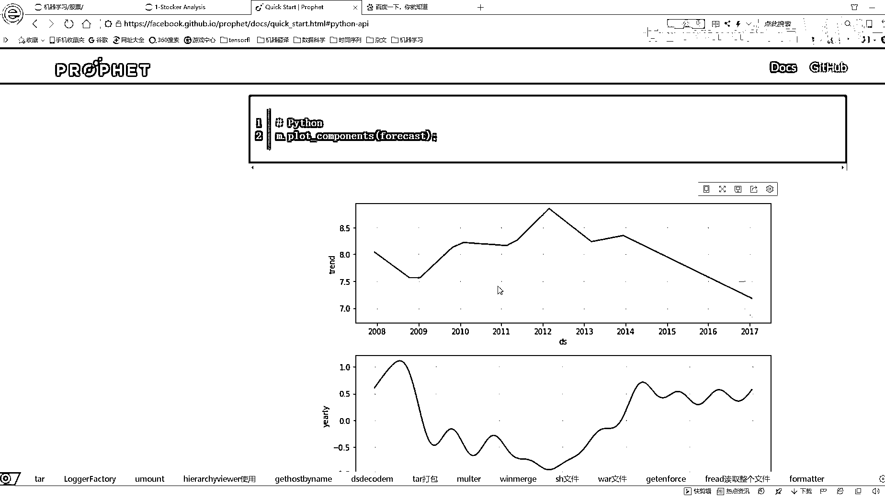

我的一个年份的一个年，就是这一年它的一个趋势，然后呢，你看整体从08年的17年，它整体的一个趋势是什么样子。

然后下面呢。

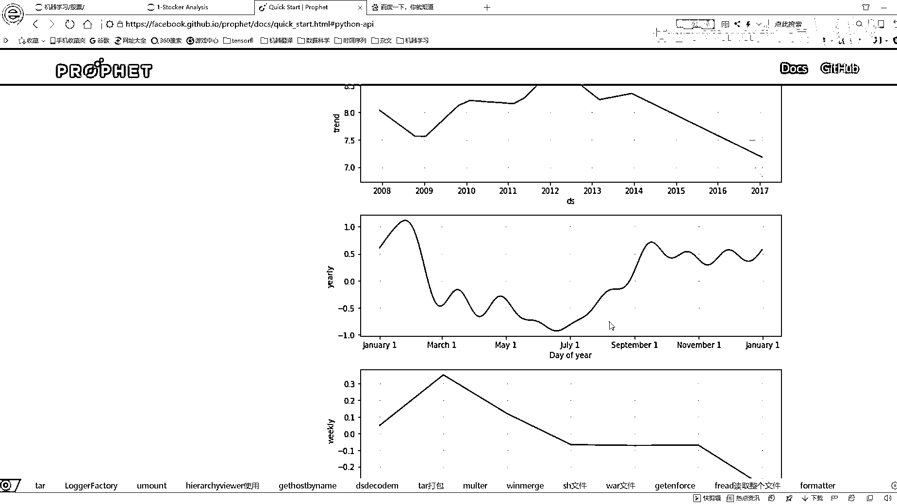

就是在一年当中，按照不同月份它的一个趋势，按照周它的一个趋势，这个里呢。

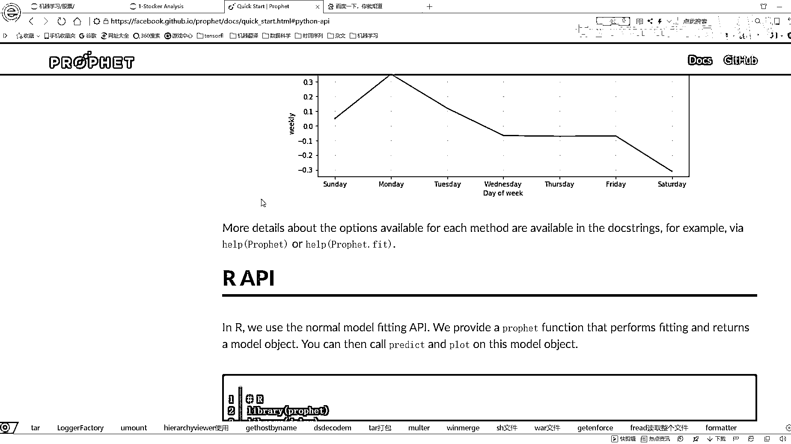

它有Python的API，还有R的API，这里啊，反正我也不给大家详细介绍了，咱们一会还会去给大家举这样的一个例子。

大家看的时候就可以围绕着它这个官文档啊。

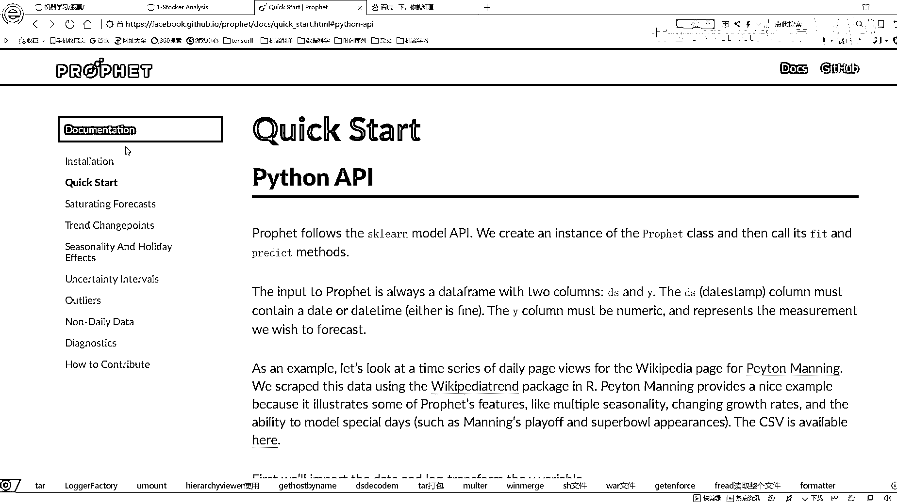

我们自己先从头到尾去看一遍，但是可能有个问题啊，就是哎。

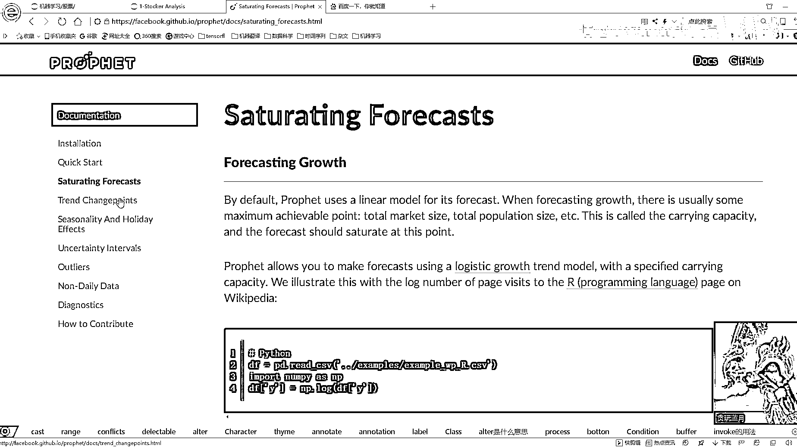

这块今天点没什么问题是吧，你看这边点有些问题，有一些文档它点的时候。

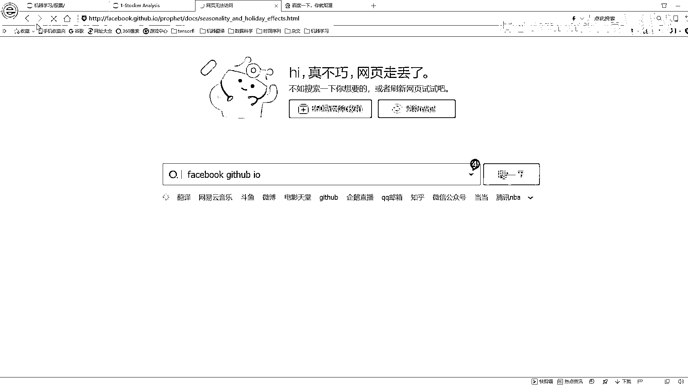

它会找不到这样的一个就是界面，这里就是说推荐大家就是看这些国外文档的时候，咱们最好还是能翻墙，咱们就翻墙，因为很多东西啊，国内是没法访问的，尤其是国外的这个什么Facebook谷歌出品的东西。

有很多都是没办法进行访问的，咱们最好呢，还是能够翻墙去看这些文档啊，先找先找一下咱们当前因为大家说的这个实践预测的一个神器啊，它是做了一件什么事，然后接下来咱们就来看一下我们的一个任务啊。

还有我们的一个数据它是长什么样子，这里呢，咱们也说了就是我们今天要做的是一个股价的分析，还有预测，所以说啊，我们拿到数据肯定是一个股票的一个数据集，在这里啊。

就是我们需要去给大家在就是大家在运行我们这个呆萌的时候啊，需要去先安装几个工具啊，第一个工具就是我们要去获取的一个数据集啊，这个事就是我们要获取股票数据啊。

通过这这里还有一点就是说大家在之前的时候必须得连上网连上网才能去执行这个东西，然后第一个呢，要做的就是我们要去获取这个数据集啊，先把我的数据拿上手，所以说呢，我们用这个工具啊。

这个工具他就是可以帮我们去获取一些数据集，只需要我们把一个要获取的东西传给他就好了，所以说呢，这里需要PIPinstar先让大家装这个东西，第二呢，就是我们实践预测的这个框架也需要大家先去装一下。

在这里啊，就是你看我这一写就是PIPinstar装这个东西。

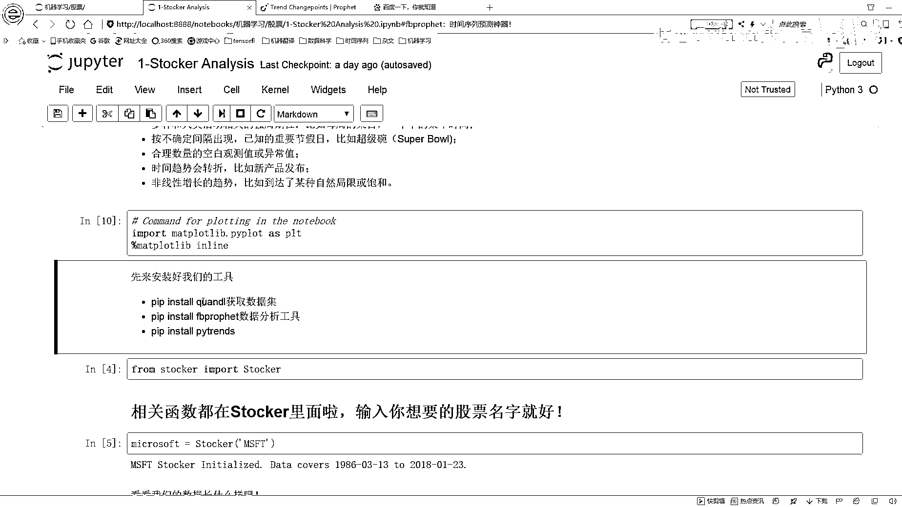

大家先这么运行啊，就是你在你的这个Promit里面，你先去打PIPinstar。

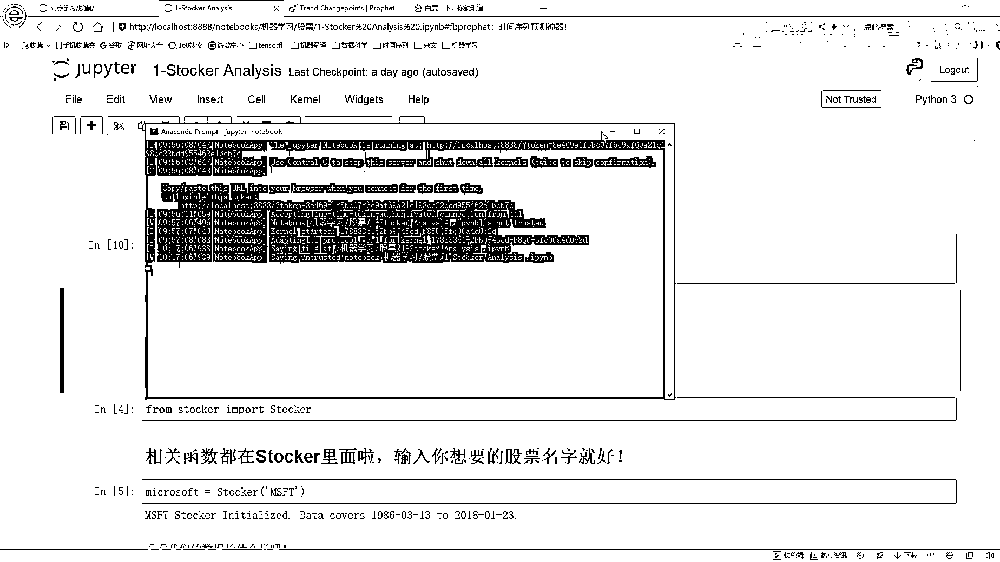

然后看能不能就是执行这个东西，然后再带再带讲一下，就是这个库啊该怎么安装。

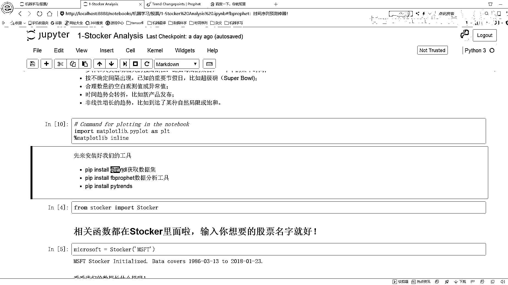

然后如果说你这个PIPinstar没有去安装上怎么办呢。

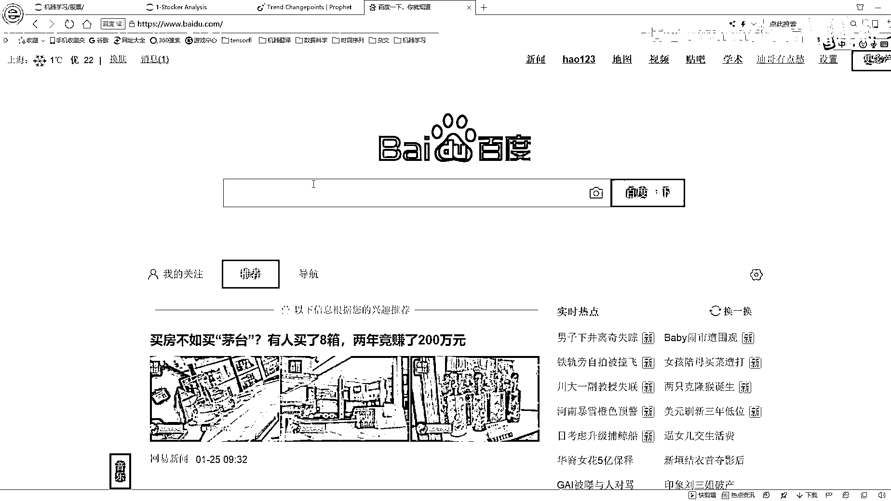

在这里啊，再搜这样一个东西就是一个Python windows包。

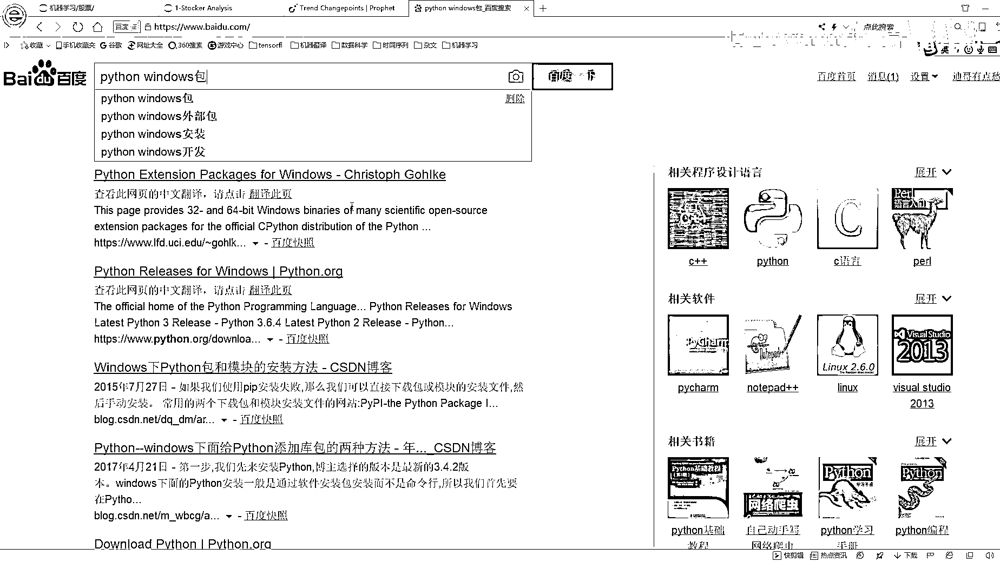

一般情况下就在这里，我看一下就是应该是这个是吧，一般情况下我们都可以找到，然后呢，比如这个这个东西我看一下，这个东西你Ctrl+C，然后到这里Ctrl+F，但是呢，你发现没有找到。

这里就是我登特尖锐跟大家说的方法，然后这里我们先下一个。whl文件，然后去PIPinstar这个。whl文件吧，这是咱们以前安包怎么安，那这里你说你这个东西没有搜到，没有搜到怎么办啊。

没有搜到也没关系啊，咱在百度接着搜这个东西，然后你打开这个这个东西，这里啊，这个网址我也给大家复制过来吧，这个网址我看一下，我给它复制到这里吧，就是你进到这个网站，这个网站就是我们用源码安装也可以。

然后你去download一下，你点这个东西download完之后，然后你就去下载，下载完之后呢，然后你给它打开，打开完之后啊，然后给它解压到一个地方，你看这里啊有个什么，有一个setup。py吧。

有一个setup。py啊，就是你就是把这东西放哪之后，反正你这个python环境变亮，你不已经配了吗，然后你到就是你下载到的一个位置之后，你去执行这样一个命令，就是这个python，setup。py。

然后再打一个install，打上一个指令啊，它就会也是帮你进行安装啊，安装好之后都一样的，但是这点就是说你得需要再把那个Anaconda，把那个Anaconda自动配置了，这个我们环境变亮也配完了。

应该直接就用了，直接执行这样一个命令，我们就可以去安装这个工具了，反正我给大家推荐的一个基本思路啊，就是你今天先用pypinstall去装，然后pypinstall如果说你装不了，然后你到这里。

这个我也给大家复制过来吧，这个估计之后大家也能去，也能去经常会用到的，然后看这个，这个它能搜到吧，这个东西我直接pypinstall给装上了，我装都是没什么问题的，这个也没有是吧，这个就是说为大家先。

这块这块咱们不写这了，我不写这了，这个反正就简单，你要去用的时候，你就是百度你搜一下python windows包，然后你就点开这个界面就可以了，然后呢装这个库的时候。

因为这个库我去用那个pypinstall，它没有装上，然后我只能去下载它这个setuppy，然后执行这个python setuppy install，这样进行安装，这样是装法是没有什么问题的。

这样呢我们先把这三个工具给装好，装好之后呢，等一会用的时候，再给大家详细的去介绍，每个工具咱们都是怎么去用的，然后这里就是画图这个东西，这个就不用说了，把画图这个包导进来，然后呢。

我们就是所有的黑密码都放在这里了，就是在这里，我们看有这样的一个函数，这个函数就是它会帮我们去做很多的功能，还有我们实现的一个功能，实现的函数都在这里，在这个notebook当中。

会给大家演示它的一个完整流程，都是长什么样子，然后呢，我们具体的一个代码细节，我会给大家通过这个Eclipse，给大家来进行演示，因为Eclipse里边，它有debug这个功能吧。

我们可以实际的进到这个函数当中，一步一步的去看它做了一件什么事，这些核心东西我都封装到这里了，反正一会大家用的时候，这里边大部分都是些可视化的操作，还有咱们这个构建模型的操作，这些呢都放在这个里了。

都放在一个class里边了，所以说一会儿咱们就是这样演示流程，然后看结果，然后在Eclipse里，为大家实际的debug。

咱们看一下它的代码是怎么样。

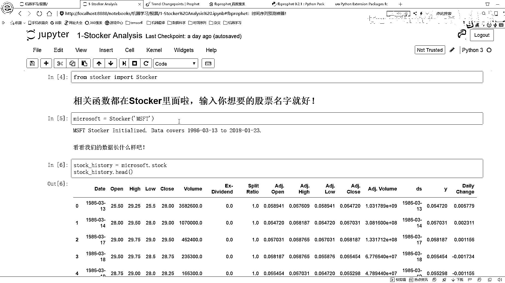

帮咱们去完成这样一个事的。