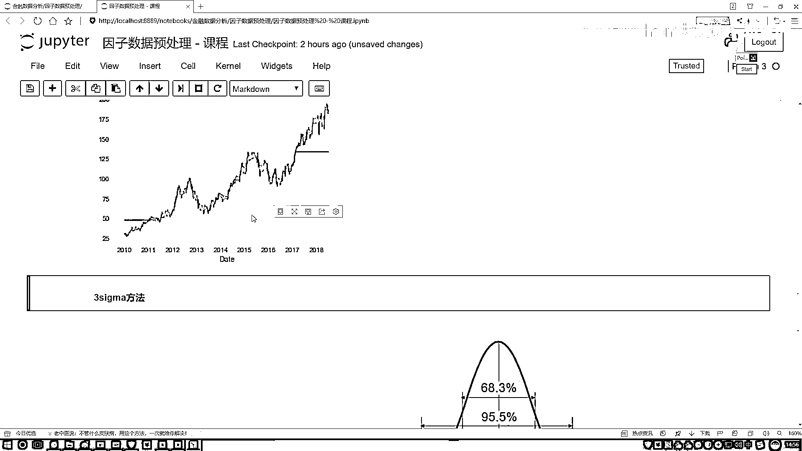

# 吹爆！2023B站公认最系统的Python金融分析与量化交易实战教程，3小时入门AI量化交易，看完还学不会你来打我！人工智能｜机器学习｜时间序列｜股票预测 - P30：3-Mad法去极值演示 - 人工智能博士 - BV1aP411z7sz

接下来咱们来说我们的去机制当中第二种方法叫做MAD，MAD给大家的感觉像是公式上稍有复杂，其实计算起来也蛮简单的，给大家先来看一下吧，首先它有这样一个要求，就是要求我们先算出来这样一个MAD值。

就是跟它名字其实是一样的，它是这个操作，咱们先来看一看，首先我说我先拿到了一个序列，这序列当中比如说什么123然后4。。。一堆数是吧，我们对这个序列可以算一个中位数吧，好了比如这里我算了中位数它等于4。

后面还有5，6，7之类的，现在我算了中位数等于4之后然后干什么，对于我咱们当前这个序列当中每一个数，这块有这个1是吧，好了我算1-4，注意点这里我们是没有负号的外面有什么。

一个绝对值吧你看这里它都是有绝对值，所以这块我们算的是一个绝对值差，用我的每一个数减去中位数能算出来绝对值差吧，比如第一个它等于3，然后第二个算完等于2，第三个等于1，把这些这里然后这里就无所谓了。

然后接下来再把其他的都算完之后，我又形成了什么，又形成这样一个序列吧，对这个序列再干什么，再求一下它的一个中位数，相当于这个东西跟我感觉是招了两遍，为了求咱们当前的一个范围。

我说现在我一开始先对我数据求了中位数，然后对每一个数据减去当前中位数，得到一个新的序列吧，但这个序列都是正的，因为这块绝对值，再求它的一个中位数也能求出来是什么，是不是一个值啊。

那好了有了这个MAD值之后呢，我说这样，现在你不是想对这个数据做一些规范的操作吗，我说这样吧，我说这个数据啊这是一个数据，对于这个数据来说啊，如果说你看这块这公式当中做什么，做了一个判断吧，如果说呀。

这个原始的数据当中，比如说一个中位数加上N倍的一个MAD值，以及减去一个N倍的MAD值，比如这里，我说这个是数据，数据当中这块是它的一个中位数，加上了N倍MAD的值。

这一块是一个中位数减去了一个N倍的MAD值，把它俩当做的一个下界和一个上界，是不是就可以了，然后剩下操作就跟刚才咱说的那个，百分位的是不是一样啊，其实说白了就是怎么样去找这两个界限，然后这个N值。

N值通常情况下就是有一个固定取值，1。4826，关于这个MAD啊，大家就简单熟悉一下就行，知道一下，它大概是做一件事的就行，这里相当于我们是用另外一种方法，来去干什么，来去对我的一个数据。

做了一个去积值的一个操作，然后代码其实也挺简单的，咱们给大家简单写一写吧，就是按照咱们上面给大家写出的公式，先算什么，先算这个MAD值，然后再算我的一个上下界，好了一个filter。

filter当中我们要指定就是，跟之前名字咱们是一样的吧，跟之前咱的名字都是一样的，然后这东西，这东西最后我说叫做一个MAD可以了，这个叫做一个MAD，然后呢这一块咱们输入也是一样的。

我传进来一个SERIES，然后这一块需要传进来另外一个参数，叫做一个N，N是什么，你看这里，这一块不是有个N吗，多少倍的MAD，咱们刚才是不是说了，有个通常的一个取值吧，咱们就咱们不想不认值了。

一会儿咱们自己传进来一个值，然后呢首先，在我们这个行为当中第一步要算什么，是不是我说现在算的是一个中位数，中位数等于我整个序列的一个中位数，好了这是我的序列，中位数怎么算，刚才咱们任务当中，这一块。

我说算的是什么来着，min是0。25max0。75，我传进两个它能帮我去算，那我传进来个0。5，讲道理它是不是也可以，好这里我说点一下，把这个什么传进去，就传一个值为0。5，那就是一个中位数吧。

好了现在我说我算出来了，当前我的一个中位数，接下来呢咱们去做计算是用什么，我序列当中每一个值，你看这里，序列当中每一个值，减去我中位数，再算一个绝对值吧，好这里这样，我说我序列当中每一个数。

对于这个判断来说，一个序列减一个数，相当于这个序列当中的每一个数，都会减咱当前这个中位数吧，好减完之后算什么，算一个abs，我的一个绝对值是吧，把它绝对值给拿到手，然后呢对这个绝对值干什么。

绝对值现在我得到的还是一个序列吧，对当前这个序列怎么样，再求一下，它的一个中位数吧，那好了我把它扩起来，对当前整体的一个序列，再求中位数，再求中位数方法，是不是还是一样的，再求一个中位数就完事了。

然后呢我说指定咱当前的一个范围吧，我的一个，最大还有一个最小，写一下吧，我说咱们当前最大的一个范围，等于我当前算出来的这个中位数，怎么样，它应该加上你看这块，中位数加上n倍的mad值吧。

好了这里我说给它加上一个n，乘上我刚才算出来的结果，算出来结果咱们还没取名字，这个名字就叫做一个，得了就叫mad得了，把这个mad拿过来乘上我n倍的这个结果吧，然后下面用我这个中位数怎么样。

减去我当前的这个结果，是不是就行了，好了这现在我们算出一个上界，还有一个下界了，那接下来呢，你看这一块咱直接return，它这个结果给它就是，相当于做规范吧，好了同样return当然这个结果。

这个是series，然后这个稍微改一改，这个就是我的一个最小的，然后呢第三个就是我的一个最大的，是不是就完事了，好了这里咱们就写了一下，怎么样去算什么，一个mad值吧，函数给大家列出来了。

那好了那现在咱们执行一下吧，我说咱们当下这个结果，也叫mad得了，然后等于执行一下这个函数，把这个函数给它复制过来，函数复制过来之后，然后我说把这个数据给它实际的传进去，然后这个n值。

咱就用一个通常的一个数值，来去执行一下，是不是就完事了，然后大家如果想画图，这里可以这样，我咱们再来画个图吧，简单画了画图不是重点，我随便画了，mad。plot一下，原始数据。plot一下。

这个结果咱是不是就有了，这一块部分的大于了，我要等于这个蓝色的，这一块部分小于了，我要等于这个蓝色的。

这个就是第二种方法叫做一个mad。

大家简单熟悉就可以。