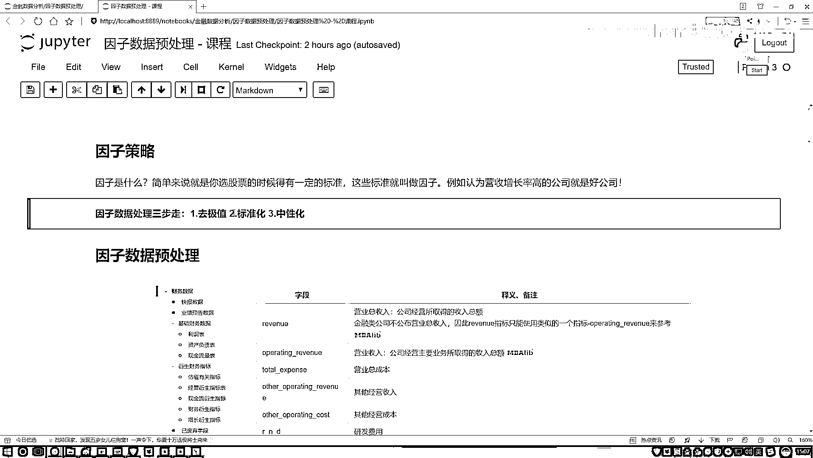

# 吹爆！2023B站公认最系统的Python金融分析与量化交易实战教程，3小时入门AI量化交易，看完还学不会你来打我！人工智能｜机器学习｜时间序列｜股票预测 - P31：4-3Sigma方法实例 - 人工智能博士 - BV1aP411z7sz

最后咱们来说区区一日当中还有一个叫三死一马方法，它的原理非常简单，大家先来看这张图，这张图当中你看我们画了个什么，大家可能一眼就看出来了，我画了一个正态分布，正态分布如果大家理解起来比较麻烦。

你就当做是一个正常的分布，什么叫正常分布，我以前讲机器学习当中，接下来举个例子，我说你现在上银行贷款，银行就是多借给你个三块五块的，那是不是挺正常，多借你十万八万的，少借你十万八万的，是不是就不正常了。

咱们来看这样一个走势，这里我说我先画一条线，那咱们就拿标准正态分布来说，标准正态分布当中这是什么，这里有个均值，均值是什么，零，什么意思，比如现在我要干一件事，我这一个误差，就让我去银行贷款。

他可能多借我钱，也可能少借我钱，多借我钱，那往右边点，少借我钱，往左边点，但是大家来看，我们现在这个区间来说，比如说你看我现在画第一个区间，红色我现在阴影画这个区间，你看它的面积怎么样。

是不是相对来说会比较大一些，代表着这些个事发生的可能性会比较高，那你看当我把这个区间越往外放的时候，你说这个可能性发生的概率怎么样了，是不是就越低了，那来想一想，我们现在要干什么。

是不是要做一个去极值的问题，那极值它可能落到哪，我拿这个红色来画，落到这儿可能吗，这块落的你说能是极值吗，在均值附近了，大概率发生一事儿，那就是正常的数据吧，均值一般落哪，落在比较偏远的地方吧。

这一块这一块这一块这些个地方，越远的，离均值越远的，偏差越大的，越有可能是一些离群点吧，这样一件事儿，那什么叫做一个三倍的Sigma，它是这样一件事儿，你看这里，我们画的这个东西当中有什么，这有一个x。

它的均值是吧，加上一倍的，减去一倍的，加上减去两倍的，加上两倍的，减去三倍的，加上三倍的，那你看从这个区间当中，我们能发现一件事儿，你看一旦你这个区间选的越大了，你看加减三倍的，你得到数据。

它越往左右偏的可能性会怎么样，就越小了吧，那这个三Sigma意思是这样，我说我现在做这样一份数据，原数据来了，然后我假设吧，就是可以对数据做一些变换，使得它理论上服从这个高次分布，或者质量分布。

咱们先不知道怎么变的，就假设它就是质量分布的一个规则，那你看当我指定一个正负的三倍Sigma的时候，你说这个当中包含了百分之多少数据，这个值你给它列出来了，这是统计当中，咱们经常会利用的指标。

百分之九十九七多吧，那好了，我们现在发现一件事儿，哎呦，如果我这位数据当中，我想取最正常的百分之九十九九七的，当做我的数据，剩下百分之二三的，我当做一个集值，给它规范一下，是不是可以啊。

这个就叫做一个三Sigma，相当于你的一个下限，和你的一个上限，持乃定的，在高次分布当中，你要算两个值，告诉我一个均值是多少，告诉我你的一个标准差是多少，是不是就行了，咱就能把这个上限和这个下限。

全部计算出来了，好了，这个叫做一个三Sigma方法，写一下吧，其实也很简单，在这里名字跟之前一样吧，还是做一个复制，在这里我们做复制，然后把最后面的值吧，改成一个三Sigma就行了。

然后这一块我们输入的值，这块n1等于3吧，既然你说三，咱就写个三得了，然后这块咱来写吧，我们要需要算什么，哎，在整个数据当中，这一列数据，我是不是得知道，当前的均值是多少，当前这个S这个标准差多少啊。

所以说对我的数据，我可以算两个值，一个是点mean，第二呢就是一个啊，直接复制吧，这第二个就是他就是一个点std，这个他就是一个点std，算他的一个标准差，行了，那我们指定两个变量吧。

变量名字就是一个mean，然后下面的他就是一个std，行了，现在两个指标算出来了，有两个两个指标之后，接下来那都复制就行了，这也不用自己写了，把这个东西给他复制过来，好了，这复制过来了。

那你看中间的是什么，一个均值加上我n倍的一个std吧，那下面呢，就是我的一个均值减去，在n倍的一个std，这就行了，那返回值，这是一个zero，然后我的一个下限，我的一个上限，咱们指定出来。

是不是就完事了，非常简单吧，咱就完成了这样一个3Sigma，哎，这个函数，呃，执行一下就是得到这个Sigma，等于什么呢，等于我的这个数据当中，然后把我当前这个data，我的这一列传进来，然后n值。

n值我不用写了，n值，这个数据咱写一下吧，这个数据，你要画这个90。7%啊，画过太不明显了，咱画个稍微明显的，你看谁明显，68。3，这个挺明显是不是，咱取68。3%的当正常的，超出这个范围的。

当不正常的，我写个1吧，假设n等于1，然后我们执行一下，然后来画这个图，简单来看一看，它的一个大概取值的一个位置，这是一个Sigma，执行一下吧，你看这是大概的一个位置，我们是不是算出来了，可能通过啊。

就是，大家整体来看这个图，就是绿色线，都是不会去变的，然后这个蓝色线，可能在不同任务当中，你看这里边，可能等于60左右，然后这个里边，可能等于不到50，然后这种方法，可能等于50多一点，可能不同方法。

咱得到的结果，略微有一些差异，当然就是用哪种方法，都行，看你的一个实际任务需求吧，这也相当于是，预处理方法当中的，不同的几种策略吧，到时候大家都可以，我们自己来去做一些实验的，主要就是三种吧。

OK 大家说完了，我们的第一步叫什么，叫做一个，一个去极值，注意点，这个去极值，不是给它丢掉，而是给它做一些规范，定义好一个下界和一个上界，然后呢，让所有数值保持在。

我们指定好的下界和上界当中。

这就行了，这个是我们三步走当中，第一步。