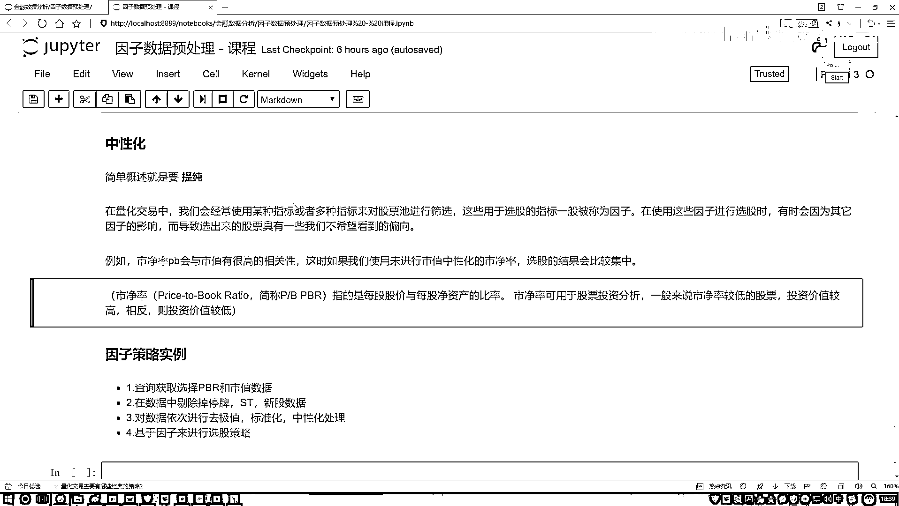

# 吹爆！2023B站公认最系统的Python金融分析与量化交易实战教程，3小时入门AI量化交易，看完还学不会你来打我！人工智能｜机器学习｜时间序列｜股票预测 - P34：7-策略任务概述 - 人工智能博士 - BV1aP411z7sz

行了，那给大家说一说吧，你说，提纯这件事儿我该怎么去做啊？，比如说现在我这样，我说我有一个因子，说这个Pb，它就是我的一个因子，行吧，然后呢，我说这个因子当中啊，有一些我不想要的成分，谁啊？。

那比如说现在我发现了，这个市净率啊跟这个市值啊，它关系挺大的，然后呢，在市净率当中啊，包括了一些跟市值相关的东西，那我既然要提纯，那是不是说，现在，我说这是我的一个因子，表示我的一个市净率，然后呢。

这个它是一个市值，是吧，我是不是说，想在这里，我把蓝色这个东西给它清出去啊，是不是做这样一件事儿啊？，那怎么清啊？，你是不是得先知道，市值，比如说我说因子，我说因子，现在是个整体，我们是不是想看一看。

市值啊，解释了这个因子当中的哪一部分，我把这一部分找到，然后呢，我做一个减法，做完减法之后，我剩下的，是不是就是我中心化之后的一个结果啊？，那怎么做呢？，我说这样，现在举个例子，我说我做一个方程。

这个方程当中啊，大家一定注意啊，就是谁等于谁啊，我说我现在做这个因子，就好比是我的一个市净率啊，我说这个因子啊，刚才你不是说了吗，跟谁相关的？跟我的一个市值相关，那我说这样吧，我说这个市值，我写出来。

这里我说有一个市值，市值跟它相关啊，那是不是一定有一定的关键程度啊？，那给我们感觉好像这样，就像是一个，Y=WX+B的过程吧，好了，我说这块，市值，你再给我乘上一个W，再加上一个B，行吧。

我说有这样的关系，既然你说市值占因子当中的一部分，那我把它俩列出这样一个市值，没问题吧？，那大家来想啊，那现在我们要干什么？，我们要知道因子当中市值占了多少，那说白了，我要干一件什么事啊？。

这个东西叫什么？，这个东西叫什么？，它是不是就是一个回归方程啊？，如果说，我能把这个回归方程给它解出来，什么叫解出来？，我知道W是什么，知道B是什么，我是不是就能知道了，哎呦，这个市值。

占我因子当中多大的一个成分了，是不是这样一件事啊？，但是我跟大家一件事啊，我之前在讲现有回归的时候，在基础学课当中，我经常会讲，我都是先讲现有回归，那我问大家一件事，我说现在啊，当你得到了这个W。

得到了这个B之后，你跟市值，就是W乘上市值，再加上B之后，你还原回去，得到了什么？，我们一般情况下，管这个东西叫什么？，是不是叫做一个预测值啊？，当前，我说现在，我拿绿色匡写这个东西。

我说这个东西叫做什么？，叫做一个预测值，这有没有什么问题啊？，没问题吧？，然后呢，我说现在，我这块是不是还列了一个Y？，这个Y是什么？，我说这个东西啊，它是什么？，它是我的一个真实值吧？。

是不是我的一个真实值啊？，那现在大家看，你说这块，我们列了一个等式，但实际当中，你真能得到一个等式吗？，在现回归当中，你真能得到这个等式吗？，那我们得到什么？，是一个近似解吧？，那表示什么意思啊？。

好像说这样一件事啊，我做一个回归方程，用我的一个Y，或者用我的一个标签，表示我的因子，用的式值表示我的输入数据，我现在就想看一看，我式值解释了因子当中的多大一部分，我做了这样一个回归方程。

得到了W和B吧，然后呢，我说这样，W和B，我还原回去，W乘上式值再加上B之后，我又回归了一个预测值吧，那预测值和真实值之间，是不是会有一个差异？，预测值和真实值之间，肯定会存在一个差异吧。

我们一般情况下叫做这个误差项，为什么会存在差异呢？，为什么会存在差异啊？，我们现在这个预测是什么意思啊？，我要看，因子当中多大一部分，能被式值所解释，它们之间的一个差异代表什么？，它们之间的差异。

画这个图当中，是不是这样，我说现在啊，有这个，重新画这个图，在这来画吧，在这画也行，就是，接着来这画得了，换个颜色，我说这个图啊，它本来是个红色的，然后呢，式值解释了其中蓝色这一部分。

那它们的差异代表什么？，差异在哪啊？，是不是我现在画圈的这一部分，这一部分代表着我当前的一个差异啊，什么意思啊？，真实值和预测值之间，必然存在一个差异，解释不了因子的那一部分，可以吧？说白了。

回忆范围当中，我们建立了一个联系，建立联系的意思，我就找到了式值在因子当中，多大的一部分，或者说，能解释因子当中多大一部分，一旦我做一个减法，用真实值减去，我这个预测值，我能得到什么？，是不是就是。

我想干的一件什么事啊？，就是提纯的这一件事吧，好了，咱们来总结一下，一会儿我们该怎么去做，第一步，我们要建立回忆方程，建立回忆方程的过程当中，一定注意，谁当歪？，是把因子当歪吧，好了，注意点。

我是把因子当歪了，你想剔除谁的影响，把谁当作一个X吧，要做这样一件事，好了，第一步，求解回忆方程当中的一个W和B，W和B解完之后，我有了一个X，我是不是趁现在我手里有因子实际的值，用因子实际的值。

比如这个Y，减去什么？，你的一个预测值吧，大家以前如果对基因学习不熟悉，你看我这边写个等号，不是说它俩就是一定相等，我是说这里要建立回忆方程，尽可能去估计W和B，这样一件事，所以说现在。

我们给大家解释了一下，咱们该怎么去求，那一会儿呢，中性化的做法，都给大家现在猜到了，第一步，用回忆方程，用回忆方程得到的结果，被谁减去啊？，被你的一个因子实际当中值减去，这相当于在因子当中。

刨除了我一些，我的跟其他的，就是你想刨除掉的，哪些对你有影响的，这样咱们做一个减法，得到剩下的，是不是就是，因子实际该有的一些信息了，我们把这个过程，就叫做一个提纯，说的挺复杂啊，哎呦我天。

说的是不是挺复杂，但是其实做起来是不是挺简单，就是在我因子当中减去，不能被你当前的一些，比如说，在我视频里当中，减去，不能被咱们的一个市值，所解释的那一部分，剩下的，就是我要的一个纯的这个意思。

说的有点绕，大家自己来理解一下，看一看，是不是我们说的，回忆方程这样一个意思，行了，最后我们要做一个，因子的一个策略，现在大家说一说，这个策略要怎么去做，是这样一件事，我先把这个，过程写完。

一会咱们来写这个策略，我说这样，现在既然我们提到了，有两个指标，一个PBR，我们这个市净率，还有个市值，行了，把他俩指标先拿出来，一会你不是要干什么吗，你不要去玩这个，中性化是吧，咱一会来。

这两个值来给大家举个例子，然后，对这里我说中性化，其实忘说一点，我们现在说的，什么，因子要做中性化，其实在实际一些调查当中，不光因子做中性化，一些行业是不是也能做中性化，其实能做的事蛮多。

这些咱先不给大家做延伸，大家后续可以自己来去看资料，能做的东西还蛮多的，咱就先拿因子，来给大家举例子，在这个PBR和市值数据，我先拿到手，一些指标，然后在数据当中，我要做一个，剔除的操作。

比如说现在股票池里，我要剔除一些我不喜欢的，或者说剔除一些垃圾，什么垃圾啊，停牌的啊，ST股啊，还有一些新上市的啊，比如说小益半年，半年之内上市的，我可以先都不管，剔除掉一些我不想要的股票。

然后依次对我们数据要做处理，按照咱顺序啊，去极值，标准化，中性化，然后我们处理完，处理完之后呢，我们要做这样一件事，考虑，干什么，基于我处理后的结果，来去选股了，比如说，现在，我说这个市净率。

它现在小于0。2的，我认为是我比较喜欢的，我说所有小于0。2的结果拿出来，基于这个策略，来去选股，是不是行啊，说白了，就是一个基于因子，来去选择股票池当中，哪些我要买，哪些我要卖，这样一件事。

这个是一会儿，咱们要完成的一个任务，中性化，咱在这个策略当中，给大家一步一步去写吧，萝卜当中咱不看了。

一会儿咱直接拿平台来玩。

