# 吹爆！2023B站公认最系统的Python金融分析与量化交易实战教程，3小时入门AI量化交易，看完还学不会你来打我！人工智能｜机器学习｜时间序列｜股票预测 - P35：1-股票数据获取 - 人工智能博士 - BV1aP411z7sz

接下来我们就来看一下，刚才哎咱们说的一个因子选股的策略诶，先把我们的一个因子拿过来做一些预处理，我要去机制诶，我还要去做标准化，还有中性化操作，做完这些基本操作之后啊，咱们来看一看基于因子啊。

我设计个策略诶，比如说像他们说的因子当中选择某些指标，然后我们来衡量一下哪些股票好，这样呢在股票市当中啊，咱把这批数据哎，咱把这批股票拿过来，我去买，然后呢我们的因子会随着时间的变化。

每天都会发生变化吧，那其实啊相信这样一件事，哎，我过一段时间我要做一个调仓，就是说国时当中啊，可能就是我买这么十支或者买20支，但是呢一定得是符合我的一个因子，选股策略的吧，咱们就要来完成这样一个任务。

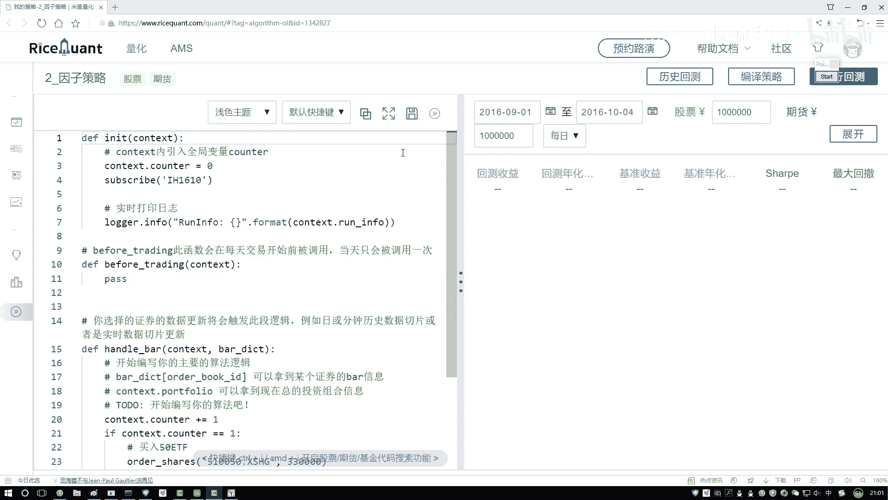

好了，来咱们来看一下怎么去写第一步唉，在这里我是新建了一个我们的文件叫做二杠，因此策略在这里呢，呃一开始它的注释信息都删掉了，没什么用啊，咱们把我们一会儿啊，会用到的一些工具包先导进来。

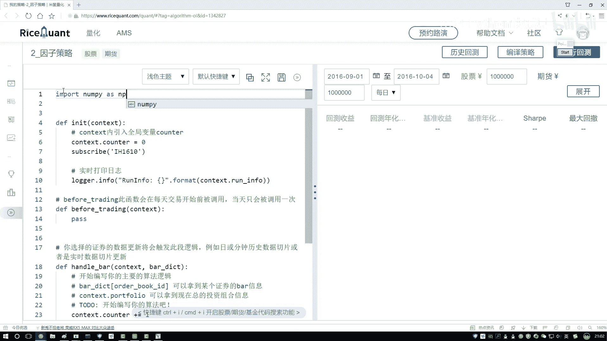

在这里啊，就是呃它也是支持，就是你的一些额外的工具包，像是咱们常用的这个南派啊，pandas啊，这些东西都是只能导进来的，然后呢第二个就是一个pandas，然后一个pd。

然后接下来还有一个还有一个就是哦，一会儿我们肯定要做一个回归方程吧，因为当我们在做这个中性化的时候，你要求解一个回归方程，所以说啊咱们得把回归方程哎，这个东西导进来呃，有两个可选的工具包。

一个叫sk learn啊，非常经典的一个Python及学习工具包，还有一个呢就是统计分析当中也会比较常用的，叫save models呃，对比一下，就是还是觉得CMODELS用起来更简单一点啊。

基本上咱们两行代码就能把这个事做出来，所以这里啊咱们把steam mos给它导进来，在啊咱们当前的模式当中，我们导入一下呃，其实只需要导入它的一个回归模块就可以了。

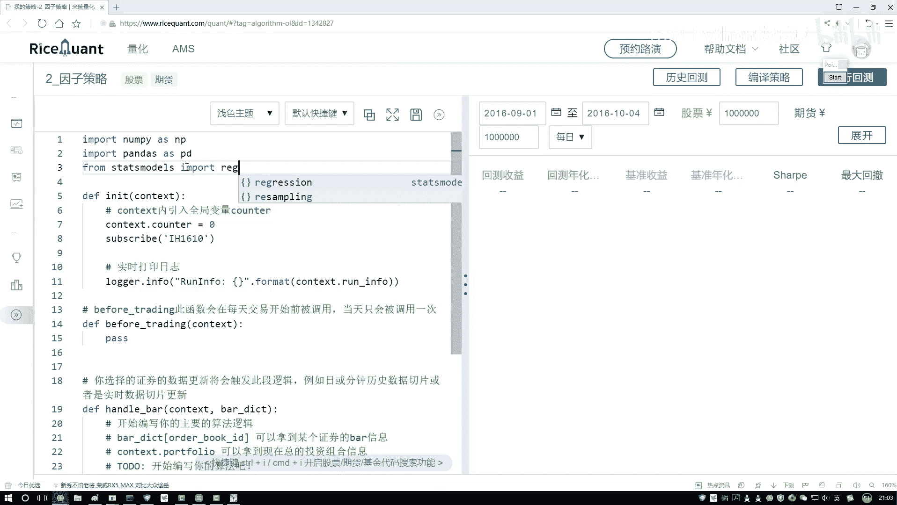

其他的咱们暂时还用不上，这个是我们要用的几个工具包，一会儿看看吧，一会儿看看咱们还能不能用上，其他的用什么。

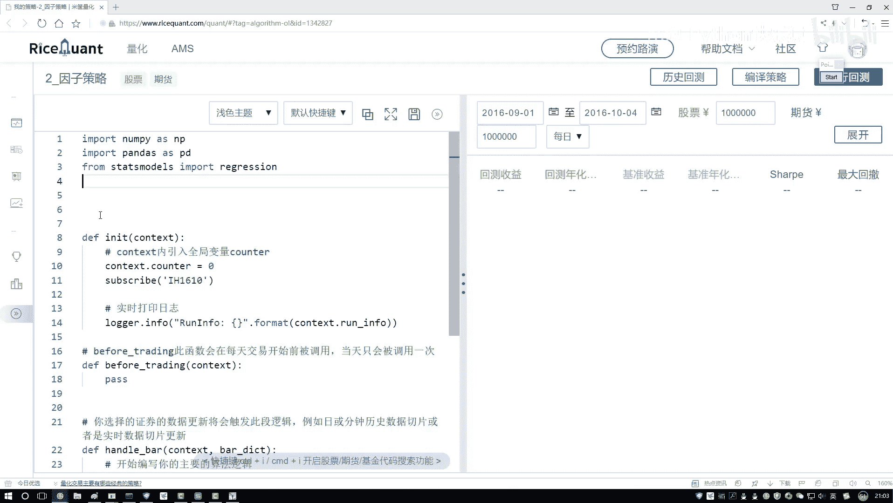

咱们线条也行，然后咱们就按照这个顺序一步来去写吧，首先第一步咱们的一个初始化模块，在这个出厂模式当中啊，我们要设计来设计什么，一会儿呢我们要肯定要做的一件事，大家想一想，你看啊。

我一会儿我会选择一个时间，比如说这个时间要改一改啊，从2016年的1月1号，到这么2017年的一个1月1号吧，咱们就这么一年时间一会儿啊，咱们是这样，我说现在啊我去选了一个策略。

然后在这个策略当中我选了一个股票啊，咱们有大池子在这个池子当中啊，可能呃我每个月都要做一个调仓啊，每个月我都要选一选，看看哪些诶不符合我策略了，给它卖掉，哪些呢，符合我策略可以买进来，是不是这一件事啊。

那这个就是当我们设计说产品消耗，你是按月来执行呢，还是按天来执行啊，按天你说是有点太频繁了，没必要吧，一般情况下咱们还是按月来执行。

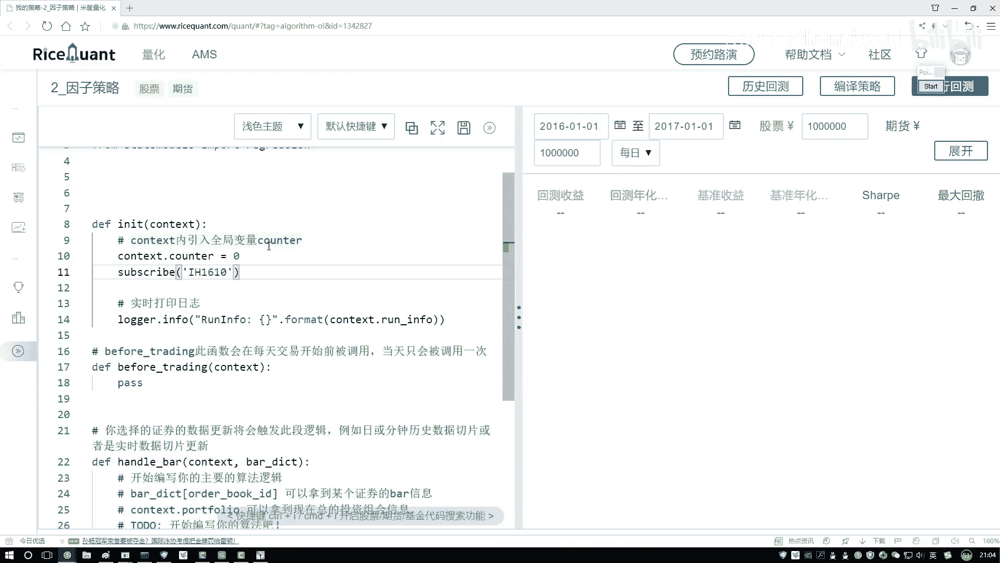

所以说这里在我们这个圈当中啊，咱们得写一下啊，因为我们的定制界，需要写到我们的一个构造函数当中啊，咱写一下咱们之前是不是说过有一个模叫什么。

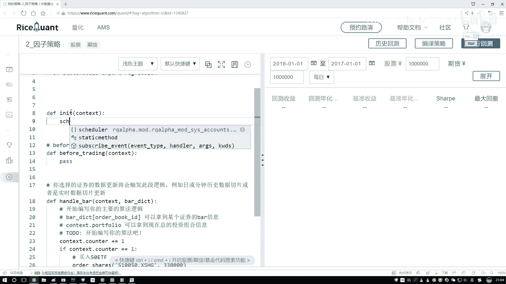

叫做一个诶，就这个我们这个定时器吧，指定好咱的定时器电容器当中啊。

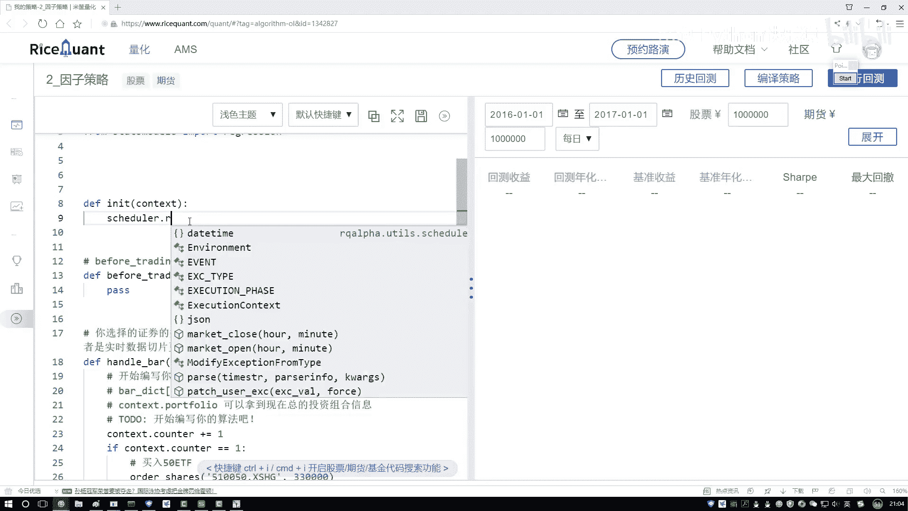

你可以去指定，你看我这块点转它入串了，你是按天呢还是按月呢，还是按这个周呢，咱们按月属于行了好了，我们指定一个按月指定按月的时候啊，然后你需要去指定交易日，不管了，然后你需要去指定一个值，就是呃按月啊。

你在做的过程当中，咱们该怎么样去调吧，好了，那我们写一下吧，呃咱们写一个response，一会儿呢我们要定义这样一个函数啊，相当于在这个函数当中啊，我们就去执行一下。

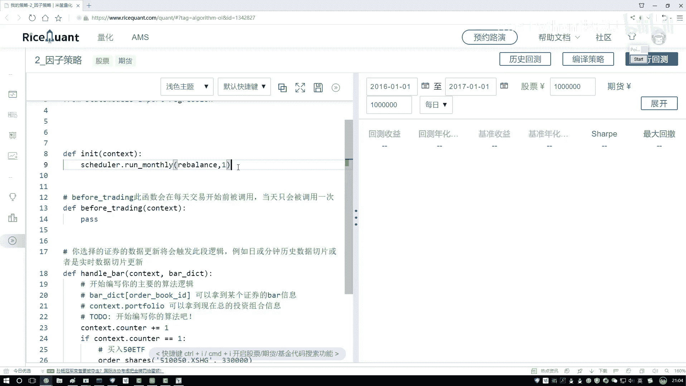

实际咱们的一个哦池子该怎么去选啊，这样一件事好了，然后把这个复制一下，名字稍微改一下就行，在这里名字尾复制过来，balance这里啊，咱们来想一想，我们都需要做什么。

是不是说一开始的时候哎呀我得去看一下啊。

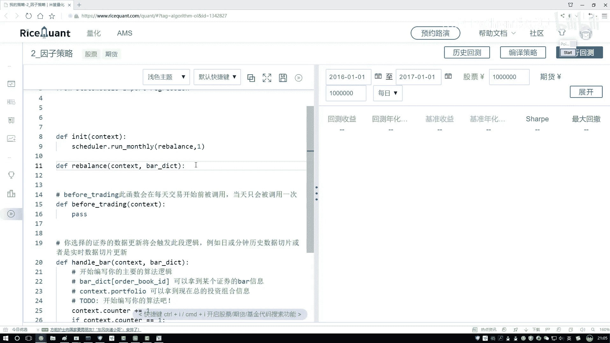

不是一开始的时候我得去先找一批股票出来，然后在这个股票当中我去选哪个是我要的，哪个是我不要的吧，我们有这样一件事吧，那这个啊咱们该怎么去做啊，是不是说第一步，我先得把咱们的所有的股票数据。

哎我说我都得给它读进来，然后呢接下来咱们在这池子当中一个去选吧，先把我们的数据给它读进来，数据读啊，其实有很多种方法，这点咱们就暂时先选所有的一个股票数据了。

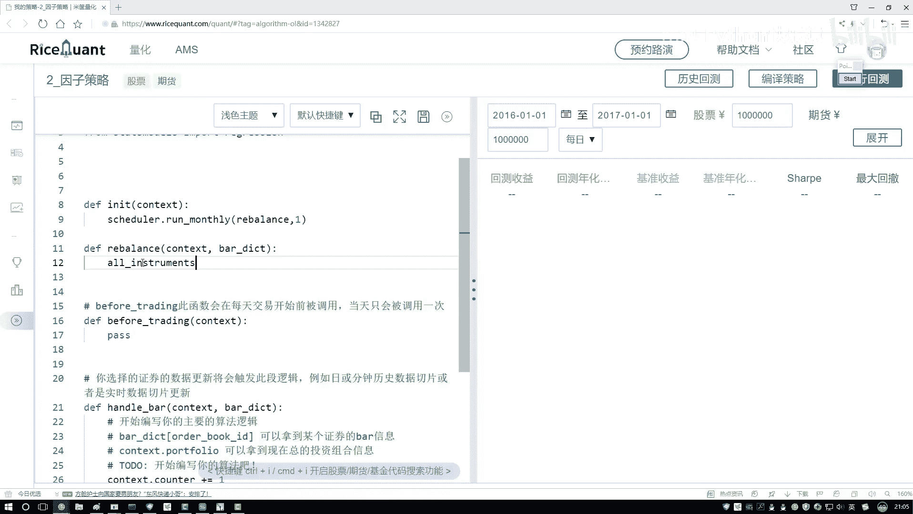

你看他是API，咱们点进去啊，点进去的时候不用点进去，就是你鼠标放到这儿的时候。

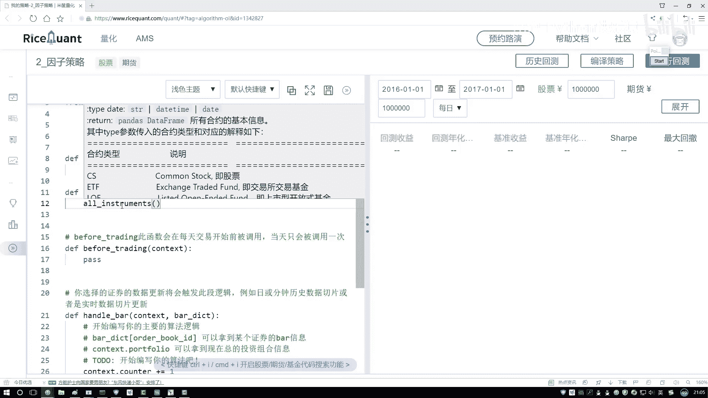

他就会给你解释啊，当前诶你用的函数它是什么意思，他说这样啊，往上一点啊，他说了，现在呢我们要去哦，这个唉这个我再往下点吧。

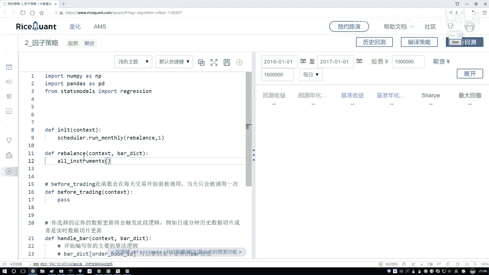

要看不清了好了，他出啊，现在哎你要获得某个国家市场，然后一些所有合约信息了，在这里我们就玩股票就行了，所以说一会儿我们会创建一个tab值等于cs啊。

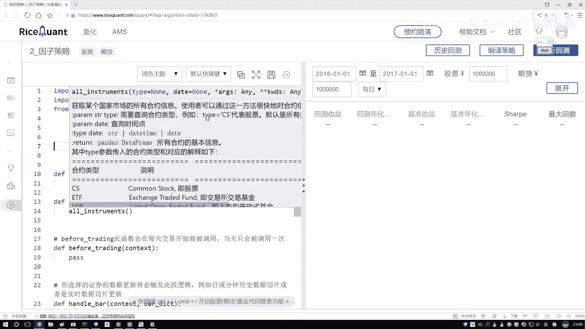

咱们找到这批股票，找到所有的股票啊，咱们先来写一下，在这里呢咱们该说了，看到有一个参数type叫什么，叫做一个cs吧，好了，我把这个cs传进去，这样他会把我的一个股票啊给拿到手，拿出股票之后。

然后我们还得对股票构做什么，其实一会儿啊咱还得对股票做一个操，就是作为过滤的事吧，因为这些显示所有的，咱一会儿呢可能不会用到这么多个股票啊，一会儿我们可能只会用其中一部分。

所以这里我们把这些股票的id怎么样，把这些股票id啊，我要做一个筛选了，看看有些怎么样，它是不符合的，那我们在前面他得写。

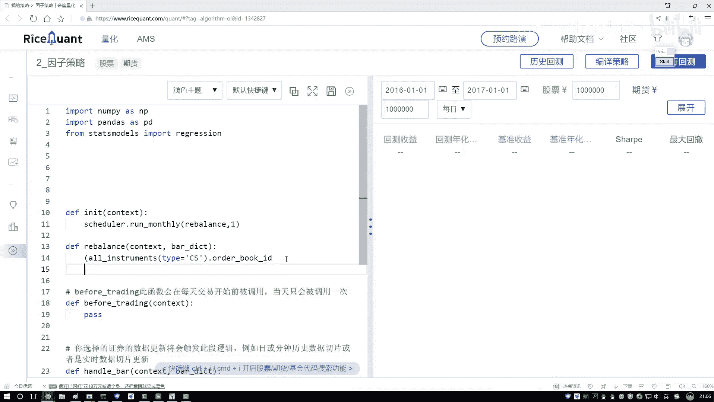