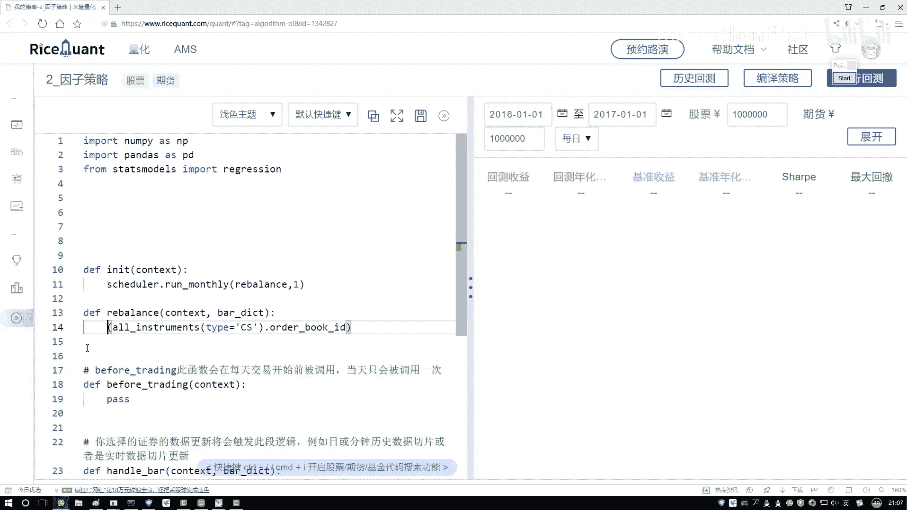

# 吹爆！2023B站公认最系统的Python金融分析与量化交易实战教程，3小时入门AI量化交易，看完还学不会你来打我！人工智能｜机器学习｜时间序列｜股票预测 - P36：2-过滤筛选因子指标数据 - 人工智能博士 - BV1aP411z7sz

上面还有什么呢？咱们想一想吧，比如说现在一些停牌的，一些停牌的咱能用了吗？肯定不用吧，或者是一些你这个，现在拿股票那什么都有，那如果还有一些ST股呢？是不是我也不要了，还有一些新上市的股。

刚上市两三天呢，刚上市几天呢，我们是不是可能也不要啊，在这里我们说第一写几个函数，帮助咱们去过滤一些股票了，我说我自己写一下，一个filter，filter什么？咱们先来一个判断吧，先判断那些停牌的。

停牌的咱就不要了，在这里，我一会儿我会传进来一个stock list，在这里就是传进来，我们当前股票的一个池子，然后对这个当中做一些筛选，怎么筛选呢？，我说我里面列一下，对我其中每一个股票。

每个股票因我的当前，我的一个大池子当中，在我当前大池子当中，我要判算一下它什么，它是不是一个停牌的吧，那怎么判断是不是停牌啊，如果说它不是，不是什么一个停牌的吧，找一找，我看这个应该是这个API。

点进来看一下，你看这里，你点的时候，它是不是说了判断某只股票，是否全年停牌，那我来判断一下吧，如果这个股票全年停牌了，我是不是就不用它了，好了，然后这里我把这个股票转进去，股票池当中，每个股票。

我都需要做这样一个判断，好了，那现在我编辑完之后，我要保存什么，那就是剩下的吧，如果说它没在这个停牌当中，我把它拿出来就行了，好了，我把这个stock给拿到手就行了，然后给它返回一个list。

这就完事了，这样咱就这块再写一个return吧，我把这个直接往右边了，右边咱们先不用，咱先写代码，好了，我说这块我直接给它return回去，相当于此时我去判断了一下，当前咱这个股票，它是不是一个停牌的。

咱完成第一件事，然后咱们就就着这个事，把所有东西都写了吧，接下来我还可以再判断，判断什么，判断这个股，它是不是一个ST股，ST股咱肯定不要吧，好了，这个list给它拿过来，然后这里咱们接着写。

还是我把这个东西复制过来就行了，其实逻辑都是一模一样的，在这里之前我们判断什么，判断它是不是一个，就是是不是那个停牌，那接下来再判断Ace，Ace什么呢，你看这里直接出现了，是不是一个ST股是吧，好了。

把这个传进去，还是我的stock做一个便利，再把它的结果返回来，是不是就行了，这一回我又判断了一下，它是不是一个ST股，然后接下来再判断一个，再判断一个，它是不是一个新的股票，就是刚上市的。

在这里所有的操作，咱都不用去改，只是这块我们要去重新的判断一下，判断什么呢，当前我们的一个股票，它是不是一个新上市的，这里然后把我的一个股票，给它传进去，然后对我咱们当前，这些所有的股票要判断什么呢。

它是不是一个新上市的，就是你这里没法判断，是不是新上市的，但是你可以把它的一些，这里咱是拿到所有股票了吧，然后拿到股票当中，你可以去判断一下，就是当前股票，对于当前这个股票来说，它的信息里边。

是不是小于某些天，比如这里咱们写，我说他这个Days，他这个API没有直接整出来，那我直接写吧，就是Days，Drum咱们的一个，Days当中有这样一个，我看一看他没有提示，是我写错了，对是这个。

然后对这个他已经提示我了，然后这里我们要做一个判断，判断什么，你自己想要调大于多少天，比如说最少，我说当前这个股，你大于半年，大于一个180天，这个也可以帮我们去做一个筛选，那相当于这里我们先写了。

我们有这样三个，就是筛选函数，这里我都写一下，这块判断是否停牌，然后这块我说判断，判断是否ST股，然后这个他是去判断，判断是否是新股，这是我们做的一个判断，在这里，既然我们做完判断之后。

那你说我们现在要干什么，首先这我写一下，首先过滤掉，不想要的股票，这里我们来过滤，好了，刚才我们收下了函数了，用这个函数干什么，传进去一下，把刚才，但凡这里咱得到所有的股票，我都得到他的一个ID了。

都有这个编号了，行了，传进来，我们先判断他一下，是否他是一个停牌的，然后如果说这块地我返回值，你看这块他返回的是，就是我们的股票是吧，所以说给他指定个名字，那就是，Dox，等于我这个过滤完结果。

这个只是我们现在做了第一次过滤，我们肯定还有第二次过滤，第二次过滤得用什么，现在判断了是否停牌，接下来判断，他是否是一个ST股，是不是行了，然后接下来还有最后一个判断，他是否是一个新股，我再执行一下。

我往下移一下，是否是新股，好了，把函数拿过来，这样咱们就完成了，当前的一个操作，过滤掉了，我不希望要的，然后接下来干什么，好了，那现在股票有了，我们要的是什么，咱们今天做什么策略，这是不是一个因子策略。

在因子策略当中，我需要拿到我想要的一些指标了，好了，现在咱们来写，在这当中我说获得，就是查询，查询想要的指标，好了，查询什么函数，这里不给大家看一篇文档了，他也会提示我。

get fundamentals在这里，好了，get fundamentals当中，我们要需要传递一下，第一个就是一个query，因为你看这里，你点进来之后，他会告诉你，第一个参数就是一个query。

你得需要写个query语句，咱们写，在这里，我说我要去查，去查，查什么，咱们来想一想，在这里，我们是不是，咱之前说了一个什么，一个市净值，还有什么市净率，还有什么，还有我们的一个价，市场价值，是不是。

所以说咱们把这个就市价，咱们来看一下，在这里，我们把这两个要查询的目标，咱来写一下，第一个，fundamentals当中，我要去查，查它的什么来着，查的pd ratio是吧，来找pd，不是，看看这个。

对 pb ratio，这个值，我们把它要查出来，我们的市净率，然后接下来，我还要再查一个指标，这块你得写个逗号，还有个指标，还有指标跟他是一样的，就是最后不太一样，我复制过来，复制过来。

然后把最后的去掉，看一下，它是个market什么东西，咱找一找，market什么东西，market，这呢，market cp是吧，给他找到手了，这个就是咱们课程当中，给大家说的。

我们的市净率和一个市值来说，要查询这两个指标，好了，现在我们把这两个指标拿到手了，拿手之后，你说现在找了这么多指标，我们要什么，是不是得符合，我当前手里这些股票的，你要查谁，查我手里这批股票的。

所以说这块你写个filter，filter当中，你要写上查谁，那就是我们手里现在的这些股票，好了，把它拿过来点一下，点一下，在这个当中，我们来想一下，它是什么，它是一个股票的编码，找一找股票编码。

code，然后它是一个in，in操作，in咱们的一个，in咱们的一个stock当中，我把这个stock给它传进去，就可以了，好了，这里我们又做了一个筛选，现在就是拿到这两个信息了。

然后之前咱们是不是给大家说过一下，现在咱们得到的信息，其实长什么样子，这里我先不运行了，它会比较卡，存的时间比较长，它会得到什么，上面第一行是股票的名字，第一个股，第二个股，第三个股，第四个股。

第五个股，第六个股，然后这是指标，指标，是吧，这样一个格式，跟我们想要的一样吗，不一样，我们想要的是竖着的，我说这是第一个股，这是第二个，这是第三个，这是1234，咱是不是要这样，之前说过了。

所以说这里我们怎么办，是不是得做一个转制，然后这个其中可能你会取到一些空值，空值咱也不下什么招了，我就全不要了，直接照片A就得了，行了。

这里咱们现在完成了这一步。

就是要去查询一下，我想要的这些指标。