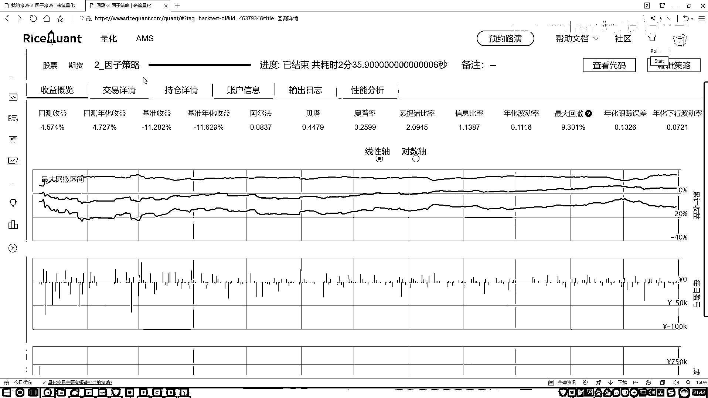

# 吹爆！2023B站公认最系统的Python金融分析与量化交易实战教程，3小时入门AI量化交易，看完还学不会你来打我！人工智能｜机器学习｜时间序列｜股票预测 - P39：5-策略效果评估分析 - 人工智能博士 - BV1aP411z7sz

行了 那我们现在是不是已经删除掉了，咱们现在不在我当前持的当中这些股票，那好了 那现在我要去做一个判断了，咱们来做第一个判断，如果说 如果说现在你确实删掉了一些。

那就是你摘这个当中它的一个数量是大于零的，就是你确实要执行这样一个调查的操作，因为现在有一些不满足咱们要求了，那就是一个不等于零，那我现在要干什么 我就可以打印一下。

不打印也行 就是现在我们就要完成一个调仓任务，打印一下吧，一会咱们观察一下，就是方便看一下你这计时器起没起作用，然后现在我要做一个调仓，现在咱们来执行这样一个调仓操作，好了 那做吧 咱们来执行一下。

那也就是说现在对我要删这个东西，好了 for我的每一只股票 是吧，好了 txt_in 咱们现在要删的这些个当中，那我要干什么呢，说实话 首先第一步，我先把它给它就是不持有它了。

那这块有一个函数吧 叫做order，order找一找 order%，不是 order% 这个函数是吧，在这个函数当中我们要写什么，好了 你现在对谁操作呀，对我股票操作，你想让你的持有量变成多少呢。

变成零不就完事了吗，不在我手里了，这就是全抛出去了吧，好了 这是第一步 stock 多打了一个，多打了一个 好了 这样咱们已经抛完了，抛完之后啊 现在那我们接下来要干什么，那你调完仓了。

整出去一写 你数据管理往里整点啊，那好了 再写循环吧，for我的一个股票在哪啊，在咱们现在要 就是在我们现在池子吧，哪个是池子，来算一下 这个我看是不是这个，这个是我们的一个 这个是我们的池子吧。

刚才咱们说了 这里是我做了一个筛选，筛完之后我得到了股票池子，那好了 对我所有股票池子当中每一个，还是要执行这样一个操作吧，还是执行这样一个操作，但是呢 此时那你就是，不是拿零了 拿谁啊 拿一吧。

好了 拿一去比上，哎呀 那一个买多少呢，咱也不用去管这个买多那个买少了，反正平均来吧 平均来去买，好了 一比上就行了，咱把这个股票在这里给它全一比，上一个浪值 数据完事了，这样相当于我要做些什么操作。

哎 把咱们当前股票给它就是买出来了吧，相当于这就是完成了咱们的一次调仓操作，行了 这里咱们就写完了，就是每个月咱们都要干什么，是不是都得去查一查这个池子，有没有什么问题。

然后好及时执行我们当前的一个操作呀，好了 这里是我们现在写了一下，我们当前的一个所需要用到的吧，所有的一个函数，这样咱们先来 现在反正写完了，试试看吧，我先把这个东西，这个东西都没有用了。

这个东西都pass掉吧，咱先 哎呀 这这 这很多办法没用上的，咱直接都写到一起了，我不改了，直接在这里，咱们就在这个rebase函数当中直接写了，其他的我就不改了，然后看一看这个东西都pass掉了。

行了 先试试吧，估计可能会先报错，咱看一看有没有什么问题，运行一下，看一看这个程序先能不能跑起来，要是能跑起来，再看结果 直接看这个输入日志，我估计对，你看他可能会有报错，报错了，看一下。

在这里有一些小问题，他说了一下，哪一块他缺了一个参数，哦 在做咱们的一个中心化的时候缺了个参数，来看一下中心化的时候，在这里找，这里是预处于操作，中心化的时候缺了一个参数是吧，好了。

把这个参数给它复制过来，这个参数就是，我看下这次咱用没用上，中心化，中心化操作，在这里，这里咱少写了个参数，我们得把这个指标再给它传进去，这个指标就在这里，咱们得写一下，第一个是咱们该指定好的。

那第二个就是返回的DataFrame当中，我得把它的名字给它写进去，名字找一找，没按证呢，给它写进去就行了，把他的名字给写进去，行，让我们再运行一下，看一看，看会有报错，会报错反正咱们就改。

反正第一次写了，写完之后对不对，现在不好说，又报错了，再看一看，又说一下，我有个这个又是中心化当中，看一下中心化当中，他说这个属性名字，我估计是不是我拼错了，哪去了，中心化咱们这个属性当中。

ESID没问题，是有这个属性，Result=sm。ors，然后一个Y值，这是一个，这块少了一个东西，哎呦咱们现在只是定义好了，这个定义好了一下，我们第一个就是要做什么，做最好人法，但少了东西少了什么。

少了个feat，少了一个训练操作吧，还没有去做训练，所以说就是训练完之后，咱才能对这个结果算它的差异吧，之前少了一个训练操作，好了，再执行一下，把之前的都关掉，看这回还没有什么问题，这边应该可以了。

编译，又编译又出问题了，看一下，Series当中没有，这个应该咱们单词又评错了，找一下，这个是在哪来着，是不是说我们在选股的时候，我说要选择咱们的一个百分之多少，Qrant，Qu，诶呀这个评错了。

Qrant是吧，好了，这块稍微改一改，Qrant，然后Lg，这没问题了，运行一下，运行一下，看这回咱们的小错误也挺多的，因为直接写这个东西难免多多少少，会出现点小错误，警告不看了，又出现这个error。

stock list，哎呦，又是点小问题，这又少了个list，找一下吧，在哪一行，delay当中是吧，好了，delay当中又少了一个，在我们去删的过程当中，stock list，好了，再来执行一下。

我再顺便检查一下吧，估计这个拼写当中可能有点小毛病，list都是list吧，好了，再来看一看这回是不是，这回好像可以了，半天没报错，那行了，说明现在执行，已经通过编译了。

下面咱们就看一下逻辑上有没有什么问题，在这块我不是做了一个打印吗，就是你看这块就是每次调仓的时候，他都会做打印，再来看一看他是不是有，二月份先有，是吧，二月一号执行了，接下来可能是三月初，三月几号。

看会不会执行，这一块有他的，三月一号也执行了，这一块有个进度条，你看现在速度还挺慢的，因为毕竟咱们这个时间选的是一年，然后我们的一个本金，这块都是默认的，这都没改，然后这里就是默认情况下。

他是每日都会做计算，但是我做了个定时器，我是不是做了一个定时器啊，咱们是按照每月去执行什么，去执行这样一个balance的操作吧，好了，然后五月三号，然后咱们接下来稍微等一等吧。

接下来就是大概就是大概再过几十秒钟吧，咱就能把这个任务给做完了，做完之后，这块做的时候，咱们来看收益，看这个收益吧，是不是感觉还可以，是不是，咱们选的随便选一年，我也不知道今年怎么样，当时，然后现在呢。

你看就是基准收益赔的挺多的，然后呢，咱们的收益，让你现在少赔一点，一会看能不能稍微挣点，哎，现在是怎么样，是不是稍微挣一点了，你看基准年化是负的，咱们现在也负的，再等一等。

注射日期现在已经打印到七月份了，现在已经打到七月份了，然后哎，现在怎么样，你看你的一个基准的啊，基准的怎么样都是负的，但是咱们现在呢，我们的一个策略是不是开始起一点作用了，他好歹是个正的吧。

就是一般情况下不赔，有时候不赔都是一个比较好的，现在咱们是不是也是正的，你看右边这两个相对来说，比他的一个基准效果要好那么一些吧，然后呢，哎，这个这个这个这个下坡率相对来说太低了，然后再等一等。

马上他就执行完了，百分之八十多了，速度还是有点慢，可能一到晚上，我大概我试了一下，就是白天的时候，速度稍微快快一点，晚上时候，可能这个平台用人可能比较多啊，都是晚上闲的没事突发奇想。

怎么玩一玩什么东西啊，其实大部分人啊，就是用这些平台都是什么都是干什么，都是来去玩一玩，大部分都是做回测嘛，拿这些数据看一看我的想法怎么样，不一定真要干什么，咱只是去模拟玩一玩这个东西。

当然咱们这个东西啊，你不能拿到实际的一个市面上当中啊，因为我这个东西什么样，那都说不准啊，都不好说的，咱只是来做一个回测，好了，来看一下吧，在这个回头当中，最大的回撤区间还行，百分之二十多不算大。

在这里能这两个指标怎么样，也不算太高，是不是，但是比一些基准的效果要强一些吧，这个是我们在选择股票的时候怎么样了，基于啊，我们的一些指标，像是基于一些因子来去选哪些我想要，哪些我不想要吧，并且呢。

是不是把咱们刚才说的我们有三步走，咱们可以把预处理操作也加进去吧，在大脑当中，主要就给大家说了一下，我们的一个整理流程，咱们的一个走法是长什么样子，一步一步啊，咱们该怎么样去做，第一步。

你在这个过往还有当中，你写好当前我们的定制器是按月呢，还是按周呢，还是按天呢，自己去来设计，然后呢，这一块我说我先去规定掉一些，咱们不想要的，然后呢，规定完之后，我说我先去，现在手里是不是剩一些股票了。

好了剩一些股票，我就看一下吧，在这些股票当中啊，查询出来一些指标啊，咱这个任务做的比较简单，只是做了两个啊，就是咱们课上当中提的一个市值，还有一个净率这个东西啊，然后接下来我说做一些处理操作。

咱是不是函数自己写了，然后因此我们是不是可以做一些筛选操作啊，咱们说了，我们希望啊，当前这个指标值那应该是越低越好的，所以说做了一个小于等于的判断，那现在拿到手里的股票了，那接下来我说判断一下吧。

有些股票啊，现在手里有的，你现在持有这个东西，它不在不在什么，不在这个池当中，咱就给他就是怎么样，就是让你的占有率占有量得多少，零吧，那接下来呢，我说我再去买买多少呢，那就咱平均一分，手里完事了。

然后最后下面就是啊，咱们该写到一些基本判断操作，这里啊就是咱们整体的结果，来看看吧，呃交易交易详情，每天交易详情不看了，就看咱们的一个最终的结果吧，账户信息吧，你看咱们现在就是从这个1月4号开始。

一直到一直到我的一个哎呦，这块他只能打印出来一半的年份是吧，你可以看一看就是你的一个市值啊，现在他的一个变化情况，基本上大家看了一下，往前面点的时候怎么样了，基本上都是赔的吧。

可能后面的时候稍微挣了一点啊，这个是咱们大概啊，想到的一个结果吧，啊，这些这些这些就是一些强项信息啊，大家感兴趣啊，我们就自己来看吧，在这里我就不给大家一个句说了啊，一些交易的信息，反正都是些历史数据。

行了，这个就是咱们今天完成了一个因子，宣布的策略，并且呢，把一些数据预处理的方法全部啊，收入进去了。

