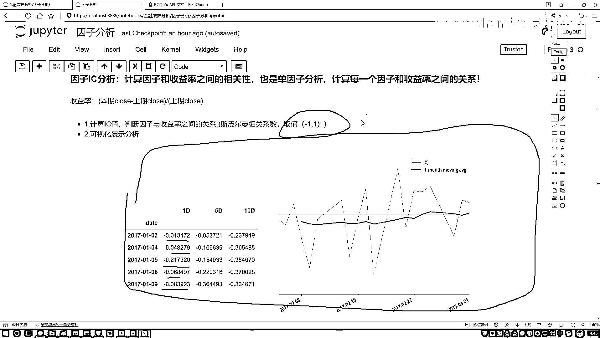

# 吹爆！2023B站公认最系统的Python金融分析与量化交易实战教程，3小时入门AI量化交易，看完还学不会你来打我！人工智能｜机器学习｜时间序列｜股票预测 - P40：1-因子分析概述 - 人工智能博士 - BV1aP411z7sz

这节课咱们来说一下因子分析，介绍大家解释一下我们要分析的一个目标，好比说现在这样我们拿到了股票当中很多的一些因子数据，那比如说咱们现在每个股票我都能取出来各种各样的指标，那指标随便列两个。

比如大家常见的一些基本面近期，我写个A还有一些技术指标的是也可以，这一块如果说咱再往下去画，那我们的因子能分成好多大类，有很多大类的因子，然后每个大类因子比如说基本面当中的，那你还能再细分吧。

再细分个123。。。一直好多好多个吧，各种各样的指标，那问题来了，那比如现在你手里啊，你能拿到有这么300个指标，或者说你手里现在有300个因子，那你说这300因子一会儿当我要做一些回测的时候。

或者说我要设计策略的时候，咱们是都用呢还是用不分几个呀，我们是不是得做这样一件事，判断一下什么样的一个因子，诶是我想要的，什么样的因子是我不想要的，换句话来说，诶先300个因子我们给它放到这儿啊。

要干什么，我说给它们做一个排序吧，按照它们的一个成绩，什么叫做一个成绩呢，诶比如因子，我说按它呀对我最终的一个收益的影响，我说给打个分吧，有打98分的，诶意味着这因子挺好的，有打97，96，95。

诶一招零分是吧，把这些因子从上到下，我能不能排一个序啊，好像来说能，因为每个因子对最终结果影响是不一样的吧，那现在我们就要做这样一件事啊，看一看什么样的因子啊才是好的，那怎么看才是好的呢。

其实最简单有几种方法，在这两个地方介绍两种，额最基本方法是什么，看我们的一个收益率，诶既然咱提到收益率啊，咱来解释解释什么叫收益率，你看我这边写了，收益率它是这样一件事啊，就是这个这些资料。

大家简单地去写啊，都不用去记，我觉得都很简单，也没有列公式啊，收益率这样，那比如说咱们现在，额当你去统计的时候，你说你按月统计也行，按五天按一天也行，咱拿一天举例子，那比如说你现在。

你想看每天的一个收益率，那等于什么，当天的一个收盘价，减去啊上一期就是上一个教育日吧，它的一个收盘价，再比上上一个教育日，它的一个收盘价叫做什么，我们当前这一天啊，我们的一个收益率。

那其实呢是要这样一件事，那你说股票要挣钱，诶是不是说我要积少成多啊，每一天都想去挣吧，那好了我说看一下，哎呦我这个因子啊，它也在变，我的收益率呢，它也在变，我想看一看，因子和收益率。

我们现在不是有好多天指标吗，比如这样，现在呢，我说连续啊，取了这么一年，一年可能有取到了250天吧，250天当中啊，你有这个因子，我写一个F，还有一个收益率，你写一个R，是不是啊。

它俩之间会有很多对应的一个值啊，每天都在变化吧，我们需要看什么，哎呦这个因子，它的一个走势，跟我收益率，它的一个走势怎么样，有什么样的一个关系呢，你是一个线性的啊，还是一个就是相关的，还是一个不相关啊。

如果相关的时候，哎你跟我这个相关程度怎么样，是个正的还是个负的啊，咱要把这些指标拿出来吧，其实说白了，我们要对因子，哎就是做这样一个分析，分析当中啊，咱们要做两件事，第一件事啊，就是一个因子的IC分析。

什么叫IC啊，呃，先给大家解释吧，什么叫IC，IC是这样一件事啊，其实很简单，它算的是一个相关性的指标啊，你看这块，我也写了，一会我们要去做的，计算什么，来计算一个IC值，IC值是这样，它说啊。

计算一下因子啊，我们的因子就是你选择，比如咱们一会会选一个P指标是吧，拿某个指标，哎，跟这个收益率，我直接啊，算一个相关性，算这个相关性啊，是一个斯皮尔曼相关系数啊，这个大家简单解释就行。

然后它的取值范围是负一到正一，越近于正一的，那越正相关，越近于负一的，越负相关，越近于零的，表示没什么关系啊，这样一件事，要算因子和我们收益率之间，这样一个相关性，然后呢，我们也可以把这件事啊。

叫做一个单因子分析，哎，为什么单因子分析啊，比如现在我这个选指标当中有300个，那收益率，哎，收益率相对来说是固定的吧，那每天什么样，就是个收益率吧，好了，那收益率啊，在相对固定的前提下。

我是不是得看一下，每一个因子，哎，跟我收益率的关系，第一个因子，跟收益率的关系，第二个因子，第三个，一直到第三百个吧，所以给我们的感觉啊，一会儿哎，我们可能会做一个负循环，是不是，在这个负循环当中。

要去遍地啊，每一个因子跟收益率啊，之间的一个关系，计算他们之间的一个，哎，斯皮尔曼相关系数就行了，啊，然后呢，这个是我们要去自算，哎，那计算结果叫什么，因子和收益率之间的这个斯皮尔曼相关系数。

我们计算出来的结果，就把它呀，叫做一个IC值了，啊，这就是它的一个缩写，叫IC值，然后呢，咱们想吧，那你说，你计算出这个IC值之后，我是不是得看一看，它的IC值的一个大小啊。

那下面我们还要做一个分析操作，在这里呢，比如说，啊，左边这个就是我们一会儿要去做的一个结果，那这里是统计了每一天，然后它的一个IC值，然后它的一个变化情况，然后右边这张图呢，就是蓝色这条线。

他画的你看这块斜标少，就是画了几个月的时间，蓝色这个就是他的IC值，然后他的一个，就是他的一个那个直线图啊，统一出来了，然后绿色的就是他的一个均线图啊，均线图当相当于就是，呃，你不是一天一天的。

你可以是十天的统计一个值，十天统计一个值，因为你看前面他有个空值吧，相当于这个是个窗口统计均值，这个再一个窗口，再一个窗口统计均值，哎，这是一个均线啊，这里给大家看了一下，就是一会儿啊。

我们要做一节指标，大家先不用去管啊，这些数字，这些东西我们一会儿怎么去做，一会儿代码当传，咱们给大家慢慢去说啊，怎么样画这个图，以及怎么样把这个结果给他呈现出来，然后呢，你看这个就是当中啊，他是什么。

是不是有一些正负值啊，哎，像我刚才说的，我们有一个取值范围吧，负一到正一之间，我们要找啊，看一看哪些因子跟生育率之间关系越大，关系越大的，我来挖掘一下，他跟我什么关系，是不是说这件事做的越值得呀。

那跟我都没什么关系的，或者说你这个这个东西反而会影响我的。

是不是干脆咱不管就行了，啊，这个就是一个因子分析。