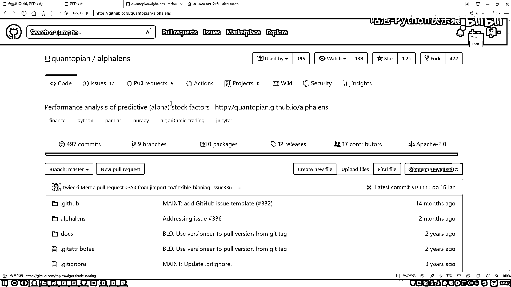
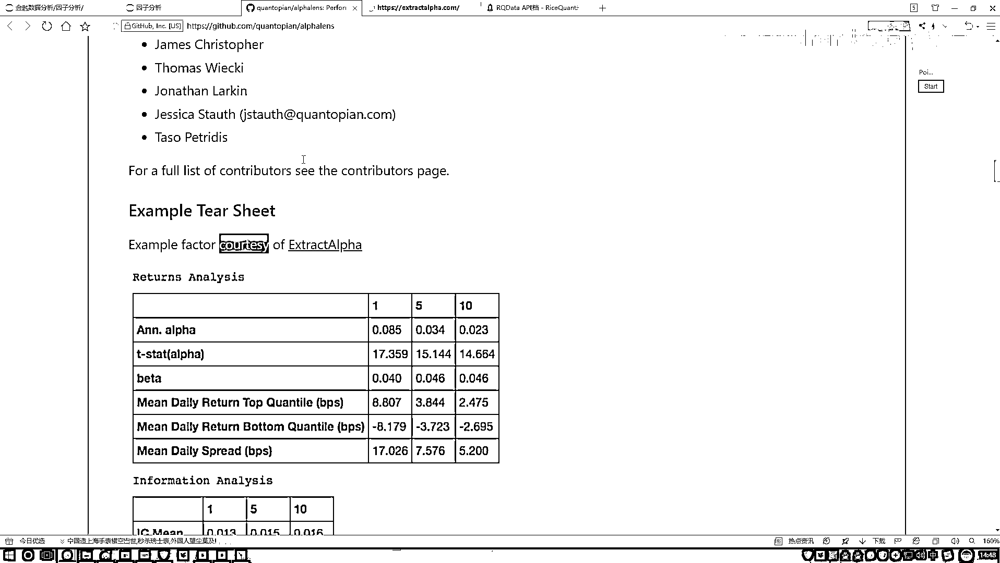
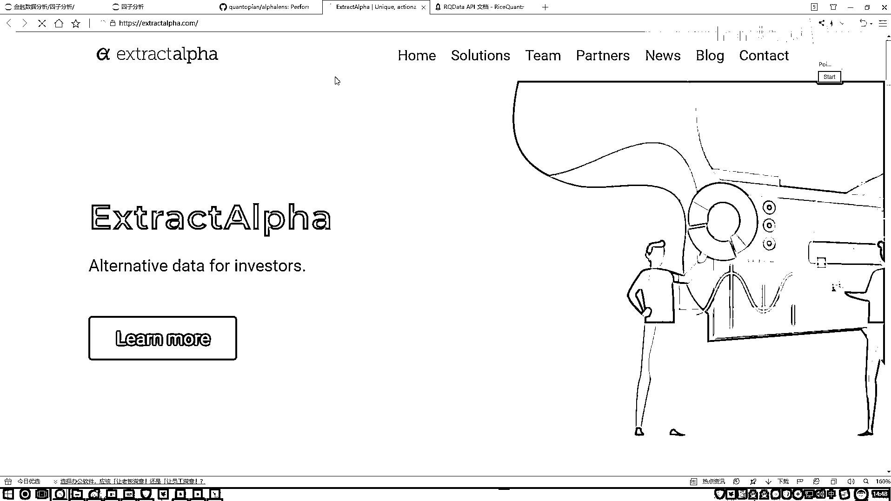
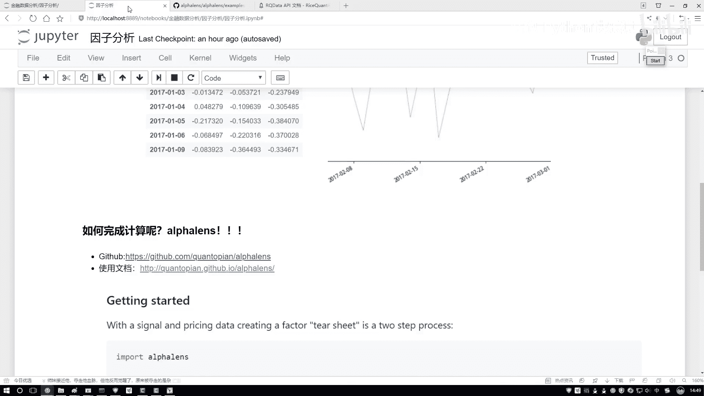
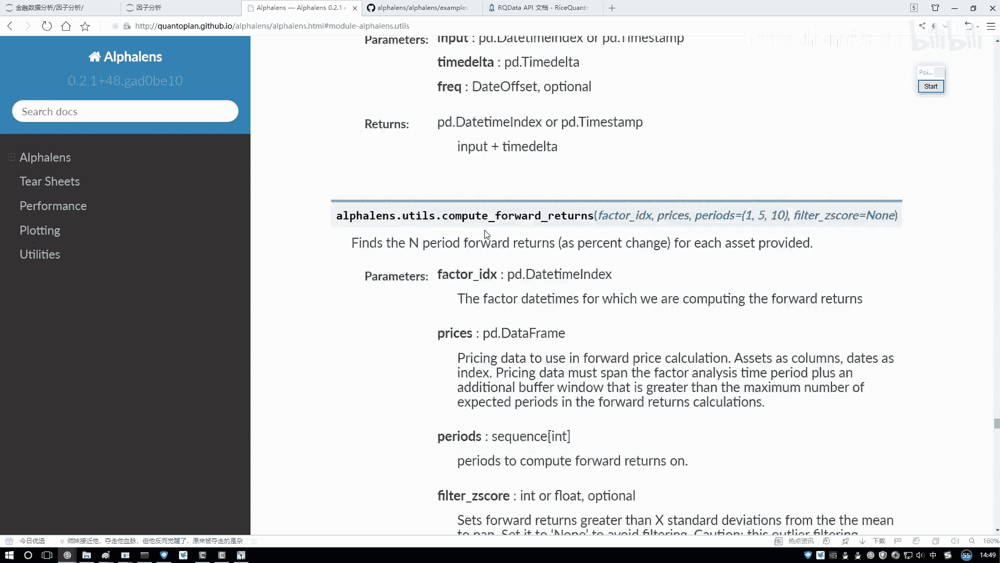
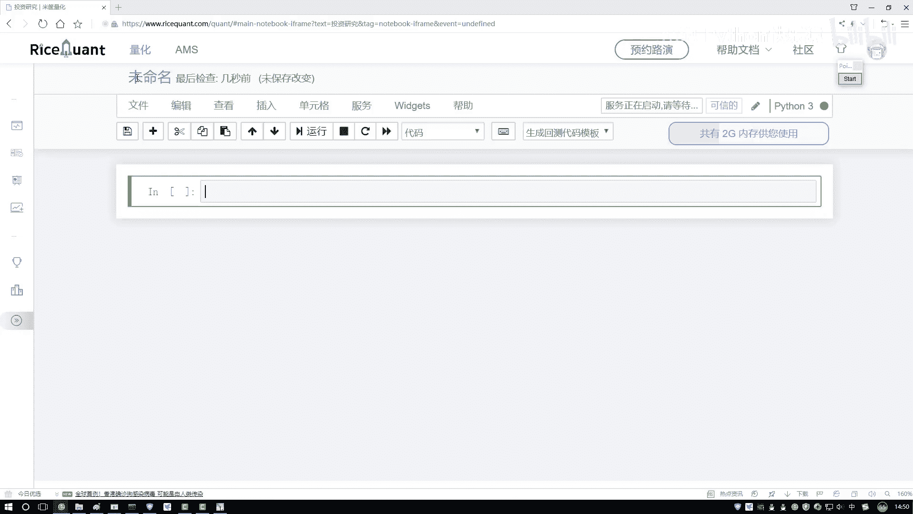
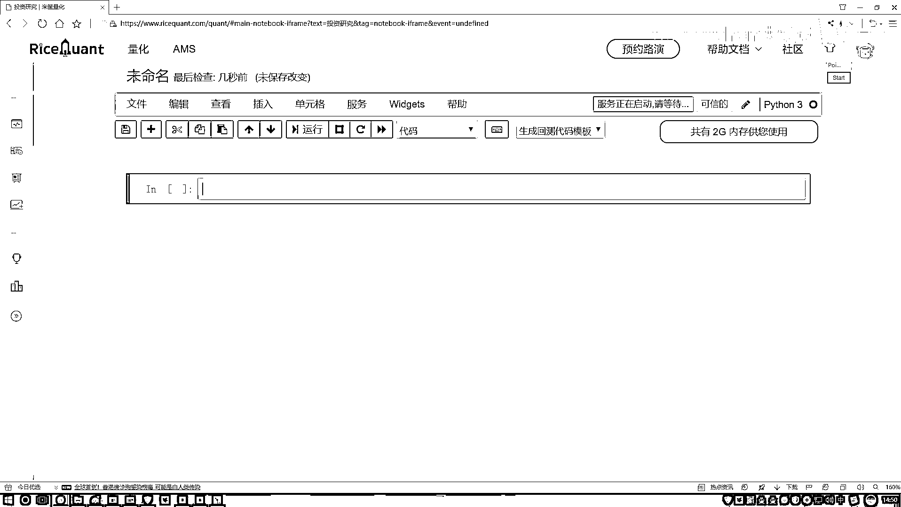
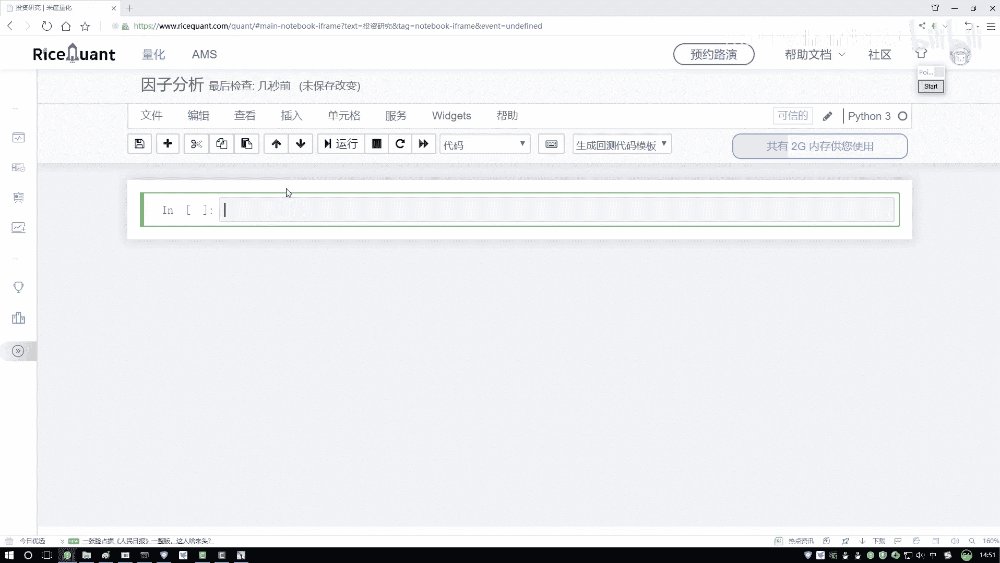
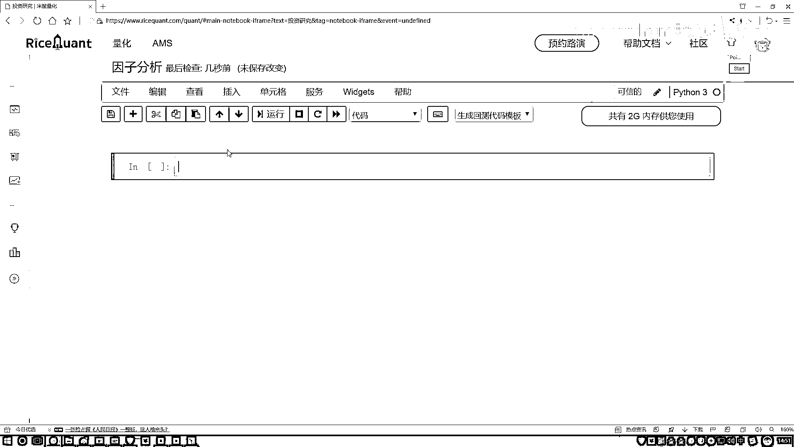

# 吹爆！2023B站公认最系统的Python金融分析与量化交易实战教程，3小时入门AI量化交易，看完还学不会你来打我！人工智能｜机器学习｜时间序列｜股票预测 - P41：2-Alphalens工具包介绍 - 人工智能博士 - BV1aP411z7sz

然后一会儿我们在做过当中，不是在我们这个notebook当中去写，是在我们的平台当中，平台当中去写，一会儿大家演示一下，在平台当中咱们怎么写，因为这里咱想去拿一些指标太麻烦了。

咱一会儿直接到平台当中去做，让我先把这个再介绍完，然后咱们就写代码，还有个东西要给大家介绍，就是叫做AlphaLens，这个东西很好用，相当于就是接下来我们所有的计算的操作，以及所有的画图操作。

你省事了，你不用自己去做了，有现成的工具包，帮我们去完成，我们来点开看一下，点开看一下，这个是他GitHub的一个链接。

AlphaLens，然后他就是专门去做音子分析的，但是它里边功能可能是比较多的，咱们这节课，可能给大家讲一些最核心的，然后剩下其他的，大家可以自己按照自己的喜好了，然后大家用这个工具包，就是第一步。

你需要去先装一下，装这个工具包其实很简单，你看我这个链接给大家列出来了，一个是他GitHub的一个网址，一个是他的一个使用文档，在他GitHub当中，他会告诉你怎么去安装，PIP install一下。

是不是行了，打开你的Anaconda Promet里边，PIP install一下，就完事了，安装非常简单，但是大家其实你也可以不用去装了，因为一会我们是用人家现成的平台，人家已经帮我们装好了。

如果大家想在本地玩，你自己装一下，然后装完之后我建议这样，就是可以看一看，他的一个使用文档，然后他的一些example，建议大家看什么，你可以看一看。

这里他有很多个小例子。

你点去之后这一块，这块。

不不是这个，不是这个，咱不看这个，看这里看这一块，他要得有一些examples，我找一找这块，他有一些说明文档，在这些说明文档当中，他会有，不是这里，在他的我看看这个，office当中，有没有这个。

example这里的，在这里他有一些，写的还不错的一些实体文档，相当于就是教你一些，最基本的使用方法，然后大家如果说，你想看这些文档，来去简单学一下也行，或者说一会听我讲也行。

我这些东西哪来的。

基本上所有东西，都是参考人家的一个官方的小例子。

看一看他怎么去做的，然后我照人家学一学，我再怎么给大家去讲，其实就是我觉得最好的学习东西，就是官方文档，还有一些官方的小例子，这里他介绍的比较详细，咱们内容相当于就是，把他给你介绍的，到时候给大家去说。

这些图什么意思，把他给你介绍这些所有东西，咱们给大家总结起来了，然后咱们一步一步照着去做，这里他有一个非常详细的小例子，我不给大家一个去读了，读的太花太花时间了，你想深入去学习，你可以去看一看。

他的一些具体的一些描述，如果说你想只想去做，咱们课程当中完成任务，看我给大家准备的一个小例子，给大家准备的案例就行了，这个是他的一个文档。

里边教程还是不错的。

然后第二个还有使用文档，使用文档就是他的一些API说明了，点进去之后，你可以看一下，在这里他会有一些简单的介绍，然后下面还有一些，就是基本的说明，然后这里你想看，他的一些各种各样的API。

其实我们主要的就用这几个，你想看的时候，这块有些说明，看他听他说也行。

然后有时候听我说也行，这是人家的一个文档，然后大家用的时候，这是先把简单看一下就行，知道有一个叫AlphaLearns的东西，帮助我们去计算，我们要的，比如说IC值，比如说我们要画这个图。

这个是一会咱要用到的一个工具，然后介绍另一个，还有工具在这里，在这个就是进入到我们平台当中了，在这个平台当中，咱之前是不是说，我们去新建一个策略，然后我们去跑一些回测，今天咱们先不用跑回测。

因为我们现在要干什么，对我们数据做一些分析，对我们数据做一些处理的操作，所以在这里咱们来看这块，有这个，有叫做一个投资研究，就是在左边的时候，有一个东西叫投资研究，咱来点一下，就是进入到你的策略当中。

然后这块有投资研究，咱不跑回测了，所以说点来点开一下看一看，点开完之后，他这块你看，像不像跟我们那个Notebook，启动的画面一样的，好了，这里我说我新建一个，新建一个Python3。

新建一个意思。

就是说这里，你去在人家的一个服务器上去写，因为你在自己电脑上去写，你数据获取不了，必须在人家服务器上去写，行了，咱们写一下，这个我们就叫做一个因子分析。

好。

然后重命名一下，在这里我们需要一会，就是一会咱们代码在这里写，到时候我会代码拷贝大家一份，到时候大家用的时候，你可以去上传到，或者是你复制到你的平台当中，或者说照着咱们视频，自己写也行。

这个是一会我们要用到的，一个写代码的工具，其实说白了。

就是在人家服务器上去写，跟我们自己写，其实没什么区别。