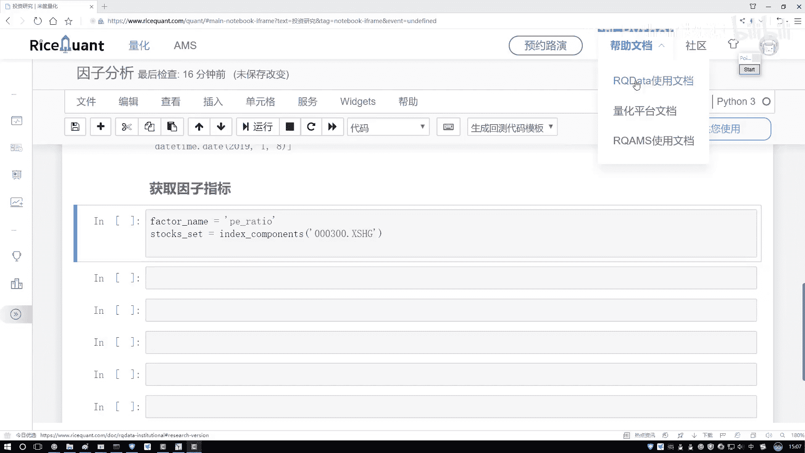
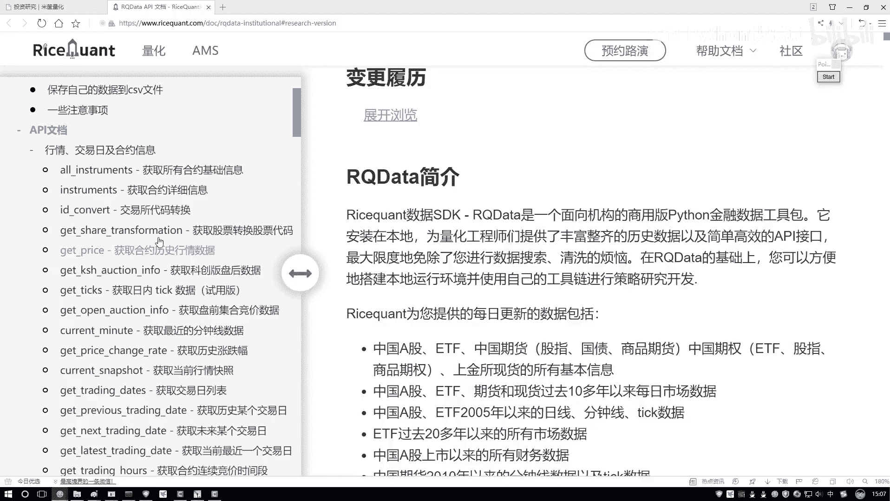
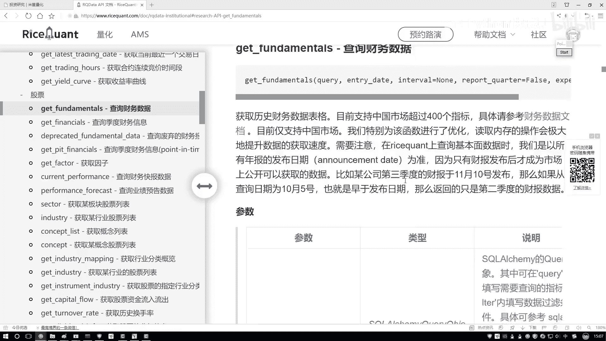
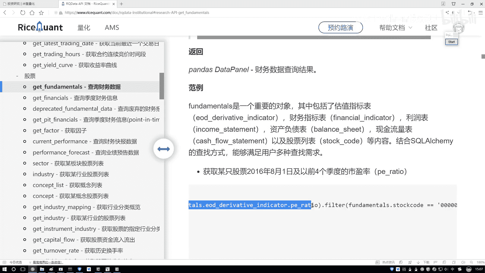
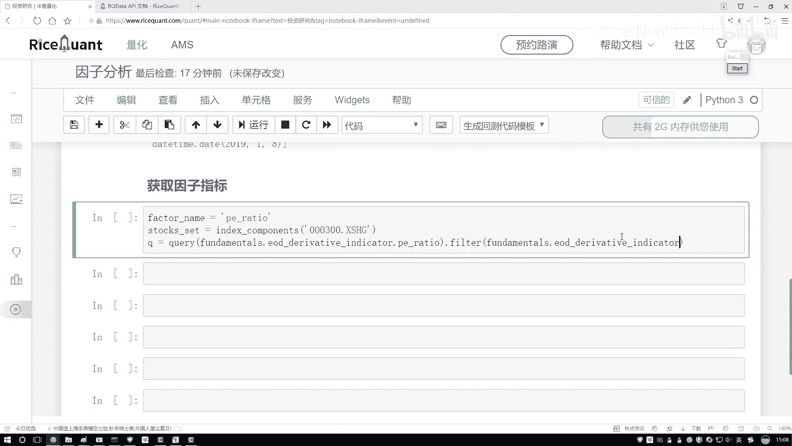
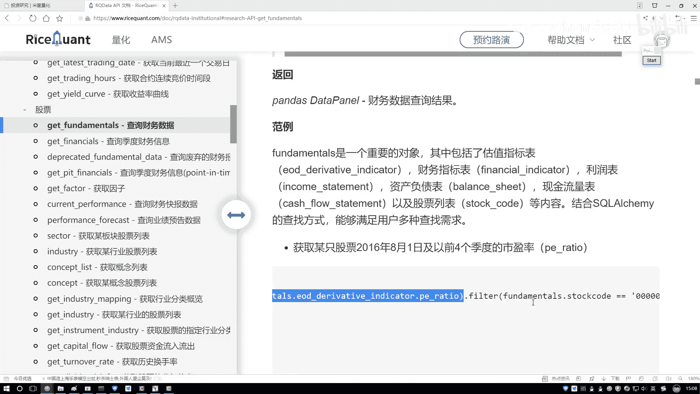
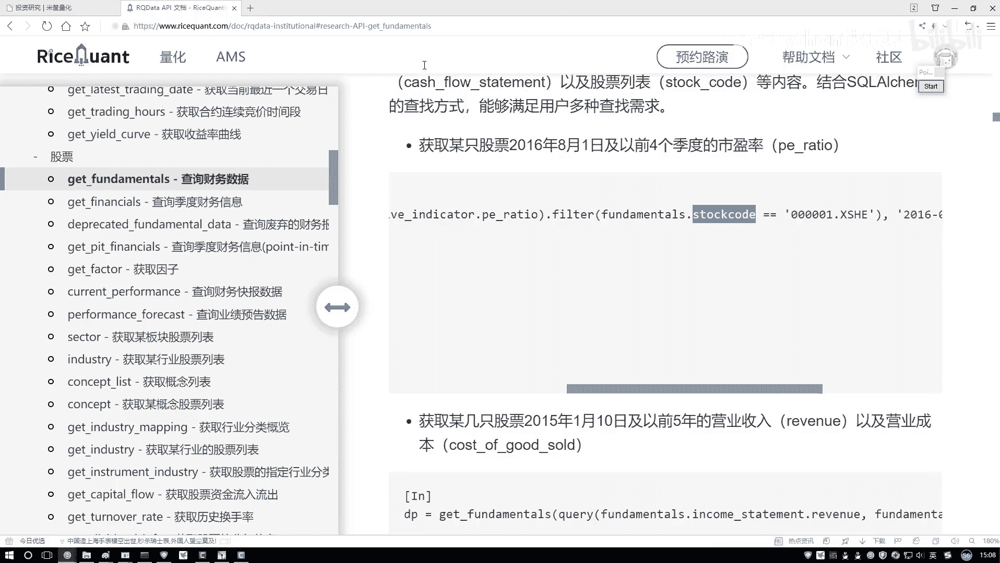
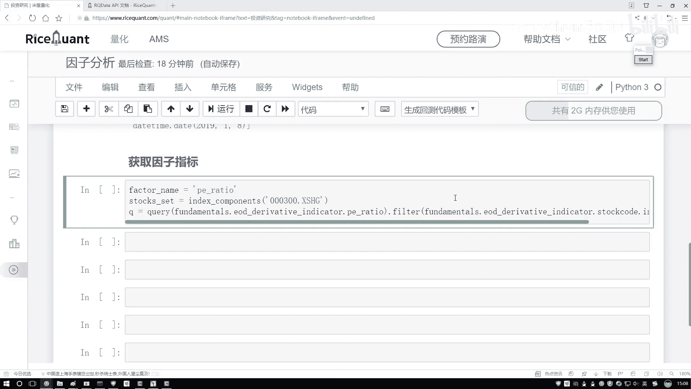
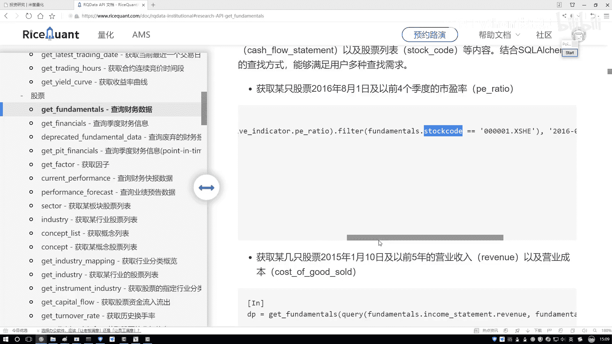
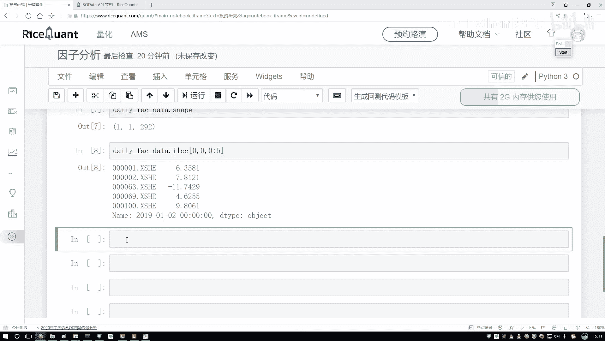

# 吹爆！2023B站公认最系统的Python金融分析与量化交易实战教程，3小时入门AI量化交易，看完还学不会你来打我！人工智能｜机器学习｜时间序列｜股票预测 - P42：3-获取因子指标数据 - 人工智能博士 - BV1aP411z7sz

这里啊，咱们现在已经啊，就是把所有的工具包全部给它导进来了，接下来呢咱们就用这个工具啊，帮我们去完成，我们因此分析任务就行了，而这里就是你看这个阿尔法瑞斯当中啊。

然后倒街景模块YOUTUS是一会帮我们处理数据的，然后plotting是帮我们去画图的，然后下面俩是帮我们一会儿做分析的啊，这是一会儿咱们用到的，然后因子分析咱名字改回来了行了，在这里咱们写吧。

那你想一想，这个诶跟之前咱的一个回测框架不太一样吧，回测框架当中有一个憨豆瓣，但是每天都可以去执行一些事，但是呢你看这里咱们现在这个模块当中啊，有每天去执行那一说吗，好像没找到吧，那我要干什么。

我师父现在啊得把很多天的数据取出来啊，他没法每一天帮我取，每一天在帮我取吧，那咱们就怎么办，我得自己来去写了啊，咱们先写一下，第一步我们要选择一个日期数据，选择日期数据，什么叫选日期数据呢。

你接下来要取哎，比如说一个从19年1月1号到20年，1月1号的，你得把这部分日期取出来，因为一会儿啊咱们在查询的过程当中，你得把日期传进去，咱才能查询出来相应的一个结果吧，好了我们来写一下第一个函数。

叫做我们去获取一下，获取啊，咱们的一个trading data啊，我们的一个所有的交易的，而不是data，是一个data，就是一个日期，日语当中有两个参数，第一个参数就是呃从哪年。

比如说从这个2019年吧，然后1月1号，然后呢，接下来第二参数到哪一年到这个2020年，然后他的一个1月1号诶，这就完事儿了，然后给他指定一个防御值，呃确定这是咱们现在要用到的所有的日期，每写完一部啊。

咱都来看一看，因为也不确定这个东西对不对，来检查一下啊，没问题是吧，好了，这是咱们现在指定好了，我需要的呃，一个时间段当中都有哪些个交易日，咱们现在全拿出来了，接下来呢我们是不是说呃。

要获取交易数据指标了，好了，获取啊，获取因子指标吧，因子指标今天指标怎么获取啊，是不是我们要做这样一个查询的操作了好了，查询套路当中，你先告诉我你要去查第一个因子，它叫什么名字。

这个到时候大家你们可以随便玩啊，咱就拿这个PRO来当做我们的一个指标得了啊，随便选一个，然后接下来那你说我现在啊，是不是说敌在所有的股票当中哎，去把这个因子拿出来啊，那好了，咱们得把股票拿出来。

这里啊我们也不做限制了，操作A股咱就直接的全部拿出来，然后一会儿咱们把这些因子哎都给它打印出来，然后咱们来分析分析，看看哪些音啊，看看这个因子在不同股票当中，它的一个指标怎么样。

我们先把所有的00300给他，全部先拿到手啊，XZHD行了，这是我们现在怎么样把所有的股票，咱现在都拿到手了，然后指定个名字吧，这就是我现在的一个股票池子啊，这是我现在有的一个股票，然后呢有了股票之后。

我们是不是要做一个查询操作呀，查什么查结局诶，fundamentals当中呃，去查一下当前我这个指标来说呀，它的一个各种各样的一个情况吧，呃这块这块这个太长了，我直接的去复制吧。

打开一下咱们的一个帮助文档，我们去对data获取是吧。

点第一个，然后呢这里哎它就是有所有的API在找啊。

就是现在我要去这儿呢，我们去查询一些它的数据，然后这一块我也不用看字段了。

我就图方便了，咱直接把这个东西复制过来就行了，这就是我当前的快捷语句，我直接复制了，然后复制到哪儿，我看看复制到这里就行诶。

我要的所有的指标行，再拿过来，实在记不住啊，这东西实在太长了好了，咱们来指定一下，这个就是我要查询指标，我说指定一个QQ呢，等一个query，我到这里去查呃，去查他当前的一个P指标。

然后呢对于这个P指标，咱可以给他做一个filter，就是看一看他是不是啊，在我的一个股票市当中，咱们来写一下哦，这些写挺长点，filter下fer当中啊，还是得把当前的啊这个传进来。

我把当前的这个东西直接的复制吧，太长了，这个名字把它复制过来，然后呢看一下当中它的什么。

它的一个代码的名字是吧，我看看他这个store code当中有没有一个杠啊。

这呢是吧，这是有一个杠的，好把它给它复制过来行了。

把他的一个code啊，没有杠，把他的一个code复制过来，然后呢去判断一下它的一个股票是否啊，是在我当前的这个池子当中，我的池子刚才定义好名字了吧，好了，在这儿给它复制过来，传进去，这就行了。

这里给大家看了一下，就是当前我们的一个查询语句，那做完这个查询语句之后，接下来我们是不是说哎，你得执行这样一个找的操作才行啊。

好了我们用几行在这里执行草操作。

我直接复制了，这里也直接get一下，get一下咱们当前数据，然后我的一个查询，我说这是Q，我给他传进来就行了，不光你要告诉我传进来个Q，你还要告诉我什么，唉你的一个查询日期吧。

日期咱们刚才是不是指定了好了，指定日期哎哟，但是这个日期它是一个他这个确定是吧，咱得查询某一天，这样吧，咱就查询查询第零天吧，先试一试，结果对不对啊，先把数据拿到手，然后指定一个返回值。

这个就是我们查询的结果，每一天的我们去查的一个factor诶，他的一个电脑数据行了，然后这样咱们执行一下哦，哦这这应该没问题是吧，不要看这个一些警告，警告跟咱没关系，只是平台它的一些问题，咱们不用去管。

然后这里咱们拿到这个数据，拿到这个数据之后啊，嗯咱来看一看吧，这个数据当中也指标，我说点ILOC一下，看一下LC当中，LC当中我需要先看一下吧，它的一个shift值啊。

这个需要给大家解释一下它的shift值啊，稍微的有一点不一样啊，你看什么它是个三维的，但实际上来说只有最后一个维度，它是有数据的吧，前两个没什么用啊，咱都不用去管这个事好了。

那我说前两个那默认就是002，然后接下来最后一个维度，我说我看这么五条数据吧，来执行一下，现在有什么了，是不是说哎这是一个咱的股票数据，然后这个是它的一个就是具体指标，它是等于多少。

咱们现在是拿到手了吧，大家可能说诶这怎么没有一个日期啊，因为这里边当你传的过程当中，是不是你就只写了当前的某一天，第一天哪天，2019年的1月2号吧，啊这是当前对于特定的1000。

咱把这个指标给拿出来了，但是让我们来想一想，现在我们要做什么，那现在我在这写一下，我们现在完成的，现在完成就是额获取啊，指定日期吧，指定日期的数据啊，咱们就会了，怎么样去做，那现在呢我们要做什么。

我要把这一段的时间全部的给它做出来吧。

