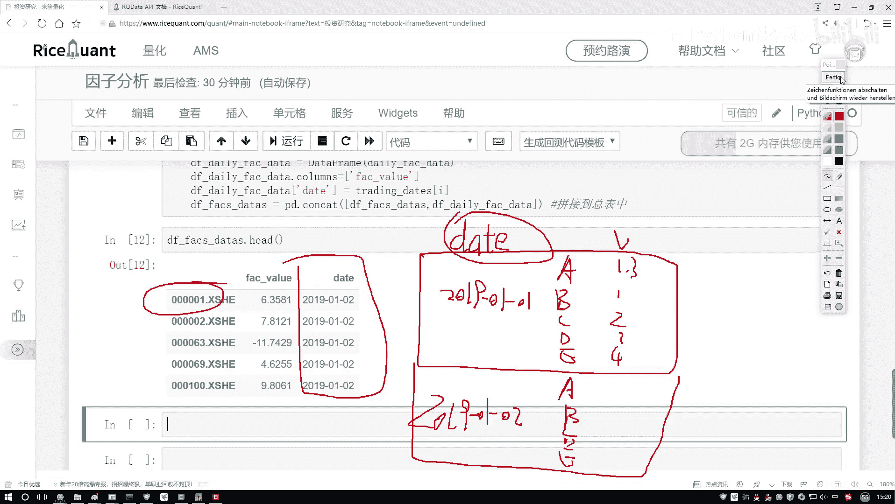

# 吹爆！2023B站公认最系统的Python金融分析与量化交易实战教程，3小时入门AI量化交易，看完还学不会你来打我！人工智能｜机器学习｜时间序列｜股票预测 - P44：5-数据格式转换 - 人工智能博士 - BV1aP411z7sz

现在虽然我们已经把数据给它搞定了，但是还有点问题，我们一会儿要用什么，要用AlphaLearns那个包吧，那个包当中它需要我们的一个数据格式，跟咱们现在的可不太一样，我不给大家看文档了，太麻烦了。

我这里大家来说人家要的什么格式，它要求你的数据格式这样，比如现在你看就是你这个，这是数据，这都是一个data，它都是一天的吧，它不是那样，它是这样一个指标，它说哎呀，现在这个data我给大家直接画。

它说现在这个data得这样，比如说咱们就拿有5只股票吧，那每天都有这5只股票吧，那好了，比如第一天它是2009年，然后这样一个-01-01，然后接下来这块它会有5只股票，就是A股票，B股票，C股票。

D股票，E股票是吧，然后具体有一些值，然后这个value就不写了，1。3，1点几，2点多，3点多，4点多，好了，这是什么，这是它说现在这是一个2009年1月1号的，然后接下来它的数据是这样的。

接下来是这个2019年它的一个01，再-什么，再-一个02，还是这5只股票吧，第一天，第二天，第三天，第四天，第五天，还是这些指标值吧，接下来2019年1月1号第三天，那你看人家要求的数据格式。

跟咱们现在要做的，你说一样吗，那肯定不一样吧，我是不是你把这个格式稍微的给它改一改，改成什么，按照咱们这个格式要求来去写吧，那怎么去办这件事呢，咱们来看吧，在这里，我们得写一下，好了，按照我们的要求。

我们得去从，大家来看一看，首先咱别的不用说，你要把谁当做索引，肯定是我data这个东西，所以说我们得需要重新的设置一下，所以把数据转换成我需要的这种格式，来执行一下。

对于当前我的dataframe做一点改变，对它我说，现在你得去重新设置一下索引了，设置这个索引当中，我得是拿谁当索引，那肯定我得是拿这个data当做我当前的一个索引，好，然后我们来执行一下。

然后这里重新的，我说我再执行这样一个复制，不还没完，这里不光我是要指定一个data，还要指定，我们的一个就是data，我来找一找，当下咱们的一个data，把这个data不要忘记。

把它的一个dataindex也拿到手，这是我们的一个实际数据，它的一个索引，这是一个股票，好了，这一回是什么，第一个维度就是我们说的，一个刚才说的日期，然后第二个咱们是不是，这个是我们的一个股票。

股票的index，你不是股票，就是股票指标，指标当中的索引是什么，是不是一个股票一个指标，一个股票一个指标，指标的索引，是不是就是股票它的一个编号，就是这个东西，这个就是咱们现在说的，这个指标。

它的一个index，咱是不是刚才画图了，是先是一个data，然后再是一个股票，它的名字，然后接来，再是它的一个，实际的一个，另外是什么，它的一个值，相当于是索引，索引当中第一个是data。

第二个是它的名字，然后值只有一个，就是指标，实际它是什么值，来执行一下，执行完之后，点hide一下，听我说好像挺啰嗦的，看这个结果，是不是跟咱们想的是一样的，这个是我的一个日期，2019，这看太少了。

看太多也没法看了，因为这个数据，某一天数据实在太多了，就这么看得了，这个是我的第一个data是吧，这个是我的什么，我指标的index，是我股票名字，这是股票名字，我的value是什么。

value只有一个了，就是当前这个指标值，它等于多少，好了，现在我们基本上，把咱们要做的事，都做出来了，拿到什么了，已经拿到了，咱们现在想要的一份输入数据了，一会咱们就能拿。

alpha learns来去执行，我们的一个统计的操作，不是就是计算，IC值的操作，这块我写一下，就是，格式转换，格式转换，没有为什么，就是为了满足工具包要求，人家这么定的，所以我也不知道为什么。

人家那么定的，但是我们必须得这么去做，用人工具包再也没得选，必须转成当前这种格式，你上面那种格式，人家不会自动帮你去转，好了，现在我们拿到这个指标了，然后在这个data当中，再把这个Ceres拿一下。

再把它的一个实际的一个值，给它取一下，因为一会咱们可能，在某些计算过程当中，会用到它的值，我们的一个指标，然后指定个值，然后Ceres，Ceres我的一个指标，然后它的一个data，等于我当前这个结果。

然后点head看一下，看有没有什么问题，当前拿到这一列，行，这一列没问题，好了，咱们单独这个数据拿到手了，接下来咱们还有另外一个操作，还有一个叫做除卷，我们的一个异常值，还有咱们的一个标准化的操作。

这个在这里，因为跟之前都是一样的，就不一样，因为一句说了，直接把复制过来就可以了，这块就是它的一个预处理操作，咱们做一个聚集值，还有这样一个标准化操作就行，方法比较简单，这个都不用给大家一个去看了。

指定好你的一个上限和下限，然后去判断，当前你的一个上限下限，是否满足要求，不满足要求，给它做一个规范化，然后标准化就是我的一个，X-min比STD，所以完事了，接下来是不是要对我所有的数据。

每一天都需要去执行什么，每一天都要去执行，咱的一个标准化，还有咱们的一个规遗化这样一个操作，然后如果说大家想把，它的一个分布情况，把这个图画出来，这块又给你画了直方图，可以简单的做一些观察。

这个是一些基本操作，咱之前都给大家看过了，所以这里咱们就不一个去看了。

然后接下来我们来说下一个。