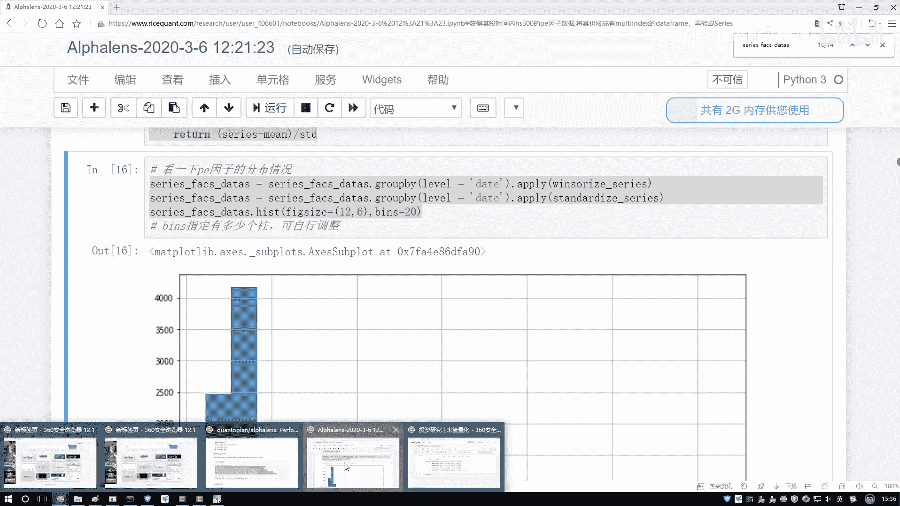
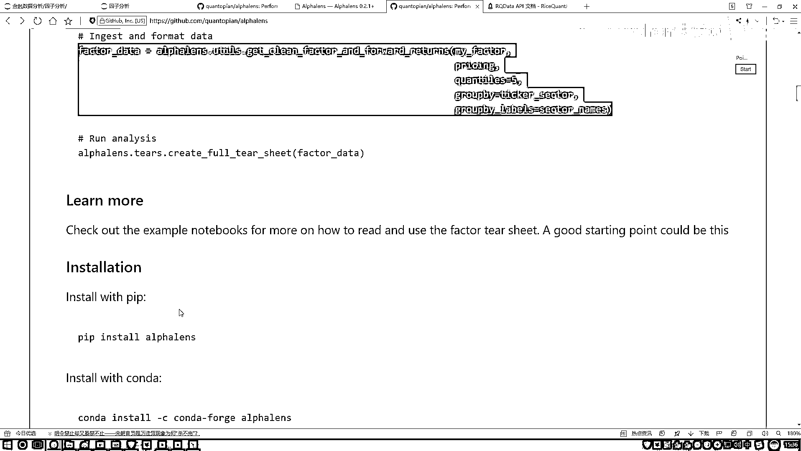
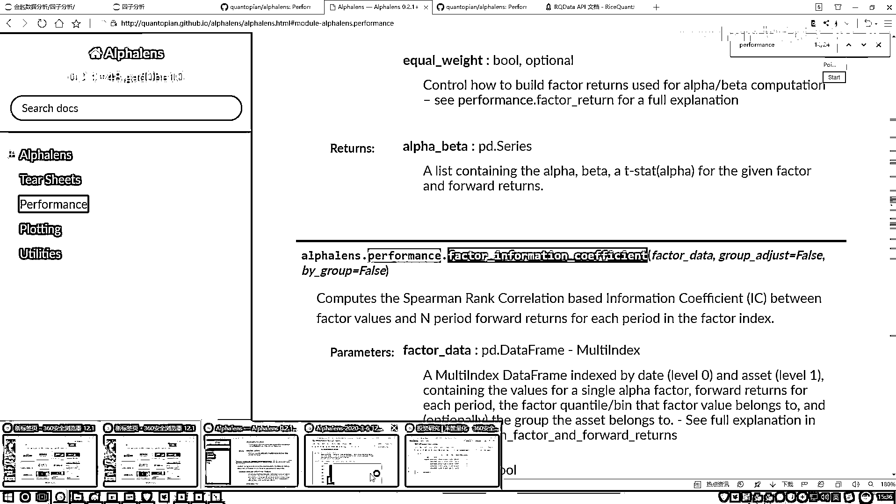
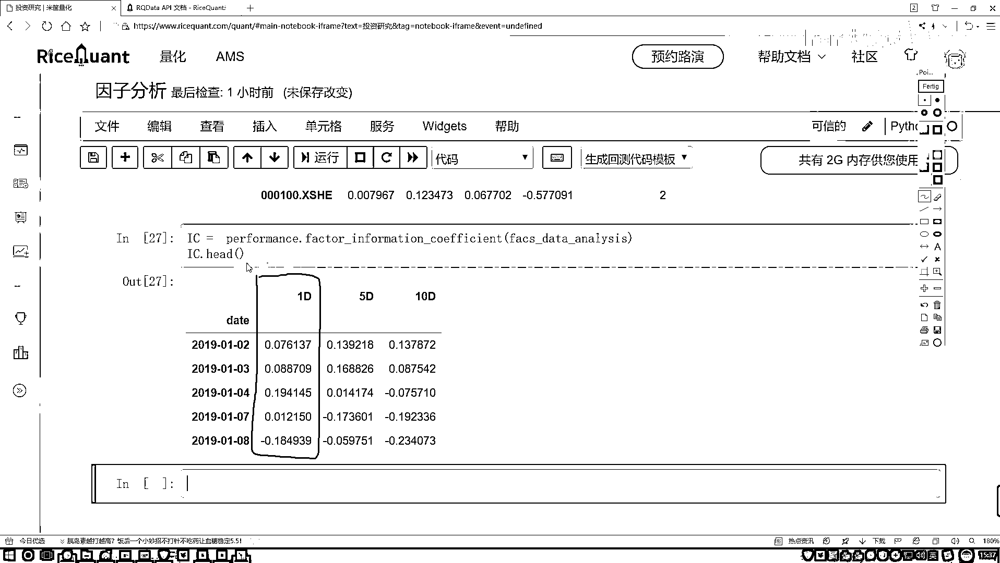

# 吹爆！2023B站公认最系统的Python金融分析与量化交易实战教程，3小时入门AI量化交易，看完还学不会你来打我！人工智能｜机器学习｜时间序列｜股票预测 - P45：6-IC指标值计算 - 人工智能博士 - BV1aP411z7sz

现在我们要算什么？是不是这个IC值啊？IC值就是谁跟谁去算啊？是不是当前我们的指标值跟他实际的一个收益率来去做计算吧？，那我们是不是知道当前我们每一天他的一个价格，或者每一天他的一个实际收盘价格是多少。

然后我们好算那个收益率吧？，好了，这里我们再来获取收盘价吧，获取收盘价，获取收盘价这个就是直接用这个getPrice函数，getPrice当中就是你需要去写你要获得哪些个股票，这里咱们来写吧。

我获取哪些股票，我的股票池呢，往上找，我写在哪儿去了？，这里咱们这个股票池子是吧，好了，把咱们的股票池子写进来，然后以及我们的还有两个参数，第二个参数就是一个start，start一个起始日期。

起始日期咱们的任务刚才说是从2019年然后1月1号，然后接下来有一个end date，到这个2020年然后他的一个1月1号就行了，这个就是当前我们会去获取他的一个价格。

获取价格当中他会给你拉出来一堆指标，我先看一下这块他给我返回的一个结果，应该默认是有好多种好多个价格的，press一下，press，prse，等于带着指标，然后看一看吧，press当中的前几条。

我看一下，getpress，getprse当中，然后prse，没问题啊，然后我的一个看顺，点hide，哦，他没有点hide是吧，这样我把它打印一下吧，他可能是一个list，打印前五个。

他这个index应该是个三维的，我看一看，他的一个。shapes，点shapes是个三维的是吧，那咱这里直接取一个吧，为了给他转成二维的，所以这里我们只取这个收盘价格了，然后再执行一下。

这回他变成二维了，二维就是一个DataFrame，我们就可以来去看一下了，行了，这里咱把这个收盘价格全拿手了吧，然后他的一个所以就是每一天，然后这一块对应的就是他的一个股票，每个股票名字。

然后以及每天他的一个价格，咱是不是全部给他指定好了，这里咱们就把这个数据做完了，然后这块还做的不太完善，我们再稍微指定一下，在这个press当中，我说我自己指定一下吧，指定一下他的一个所以，index。

然后他点他的一个name，等于我当前的这个data，然后呢接下来我指定一个列名，指定一个列名叫做一个code吧，就是我的一个股票是就是他是什么股票，他的一个列名，然后再点name一下。

等于咱们当前的股票名字，再执行一下，行了，这回有了，就是我们现在把咱们的一个收盘价数据都有了，那接下来呢，咱们要用啊一个非常神奇的函数了，在这里，我得去看一看，在咱们那个在咱们那个logbook当中呢。

在咱们logbook当中啊，这块有他的一个，直接上github吧，github当中啊，找一下这里，找一下他是怎么去用的，特别长的一个函数啊，记得是肯定记不下来了，找一找这里，utils当中，哎对就这个。

就这个东西特别长，你得把当前你的数据啊做一个格式的转换，这里就需要咱们传递两个参数，第一个咱们处理好的一个，呃，就是因子的数据是吧，第二个处理好的咱的那个什么，就是一个价格的数据，咱现在是不是都有了。

好了，我直接把它复制过来，全复制过来，这太长了，不可能记住的，把它复制过来，然后在我们这里，来咱们写一下，这块我写一下，就是格式转换吧，就是人家要求你必须这么去做，格式转换，直接一下，把它复制过来。

然后，呃，我看这里咱直接就是utils，该导进来了，前面不用了，然后这块几个参数，咱也用不了这么多，其他的我先都去掉吧，咱先主要用这么前三个，其他的对咱们来说没有用，就两个参数，第一个参数啊。

就是咱处理好的数据啊，找一下，刚才咱处理好的这个数据，给它复制过来，第二个就是press这个东西，我们刚才也写好了，也给它拿过来，行了，这就是咱现在需要的一个数据，然后呢，给它指定成一个名字吧，就是。

呃，我写一下，换一个名字，然后，我的一个data，我要去对它啊，做一个分析了，等于当前我的一个结果，行了，然后执行一下，做一个转换，转换完之后，给大家看一下吧，它长什么样子。

这个就是咱们现在得到的一份结果了，呃，在这个结果当中啊，就是它会给你打印出来的一些东西，给大家来说一说，当前的这个东西就是，呃，一个data，相当于你的一个日期，然后这个它自己起了名字啊。

它没叫这个code，这个是你的股票名字，然后这个1D，5D，10D，就是，呃，你可以按一期来，五期来，十期来，咱们刚才是怎么算的，我们刚才是不是说，咱们按一期，就等于今天的一个收盘价，减昨天收盘价。

比上昨天收盘价啊，你可以把这个五期来，十期来，这也行啊，然后这块就是factor，你实际的一个因子，它的一个值，是吧，然后这个呢，就是，呃，它把你的因子啊，自动的做了一个划分，它是这样。

默认它是有五个区间的，什么叫五个区间呢，就是，呃，它是百分未来的，比如这样，它说，呃，分了几个值，比如说你的因子，错导到大净排序，然后0。2的，然后有这个0。4的，然后有这个0。6的，然后有这个0。

8的，它可以看啊，你的因子的一个数值，落到了你整体到哪一部分，然后这一部分，我拿黑笔写，这一部分，就是0到0。2的是1，然后这是2，这是3，然后这是4，这是5，相当于，一会儿咱们有个图，它会给你统计啊。

就是不同的一个分组区间，这里，它的一个1，2相当于就是，呃，根据它数值的一个大小，然后把它落到它的一个对应的等级当中，你看前面写的都是1，因为它的一个负的都是比较大的，是吧，然后呢，下面，这个2。

这个2相当于，呃，怎么，怎么说呢，就是从左到右吧，做一个就是这样的一个顺序啊，这是一个负的，这是一个正的，做了一个排序，看一看它落到哪个区间上了，这个意思，区间的数越大，代表它的数值越大，区间数越小。

像1的代表它实际的数值，是一个越小的这个意思，行了，这个就是，咱当前把我们的一个数据，给它全部的做完了，然后这个1D的，咱主要用这个1D的，1D是什么，1D就是咱们刚才在那个Nobel的当中。

不是说一个受益率吗，咱们算完实际的一个比值吧，今天收盘价减昨天收盘价比昨天收盘价，咱们主要用这个1D来给大家做一个解释，那现在我们已经有了，就是想要的东西了吧，有什么了，一会咱用这个东西和谁。

和你的这个东西，是不是就够了，能算什么，能算咱们这个CPU的千万系数了吧，好了，我们来算一下，在这里咱们写一下，我看一下它的一个API，在它这个performance当中，有performance里边。

performance里边，然后我去计算它的相关系数，来，看一看人家怎么列的吧，又忘了。

在这里，在这里找一找它的一个相关系数，我看这块它有没有去说啊，这块没说，在API文档当中找一找吧，在API文档当中，然后。

control+F一下。

在performance当中来找，看一看它写在哪儿了，performance，这个不是，这个，这个也不是，这个也不是，这个也不是，我看一下这个，这个描述，这个描述也不是，它是一个factor开头的。

factor它的一个计算，这个值是吧，你看，这个值，factor，对你的一个因子做什么，做它的一个相关系数的计算吧，好了，我说把它复制过来吧，给它复制过来就行了，然后里边有参数啊。

就是你把你刚才就是转好格式，咱刚才看那个数据，传进去就行了啊，好了，我把它复制过来，然后在这里我们来写一下，直接复制过来了，太长了，记不住名字，再把我们的一个数据，数据就是刚才咱做好这份数据给它写一下。

它还给我有返回值啊，返回值就是这个IC值，IC我说等于当前我的一个结果，然后呢，我这个IC啊，来去点hide一下吧。

看一看咱们当前结果啊，就是现在，你看，我们关注的这一列是什么，这一列就是我们实际啊，该算的一个IC指标值了啊。

它的一个值咱们就算出来了。

