# 吹爆！2023B站公认最系统的Python金融分析与量化交易实战教程，3小时入门AI量化交易，看完还学不会你来打我！人工智能｜机器学习｜时间序列｜股票预测 - P52：5-完成选股方法 - 人工智能博士 - BV1aP411z7sz

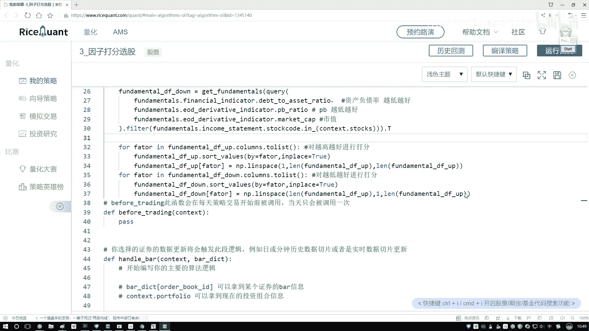

接下来咱们来把这两张表给他做一个拼接操作，来我们写一下这块呢我们要做一个拼接操作，PC操作，就是啊用一个data frame去转另外一个data frame，就完事了，咱们把这个复制一下。

就是让这个down，然后呢我说他点啊，然后去转一下作当中啊，把我们第2this dream给它传进来，这就行了好了，现在我们把两个day frame已经拼接起来了，那我们给它起个新的名字了。

现在在这个data frame当中，我们要做的其实上就是一个排名操作好了，明天指定名字叫做一个店铺转就可以好了，现在呢我们已经有了一个哦大表了，但是这个大表当中啊，还没有咱们这些排名的信息吧。

在这块我说我新建一个列啊，先一个列，这个当中呢就叫做哎咱们现在排名的一个结果，我叫做一个得分值吧，暂时先让这个得分值吧，它是一个都是零的，然后呢我们把这个得分值实际啊给它计算出来。

在这里我们就是诶这个题是什么东西，这一块我们传进来的就是哦指定好npd zero当中，你矩阵的一个维度，我们指定成一个300×1的就行了，这块就是一共有多少样本数据。

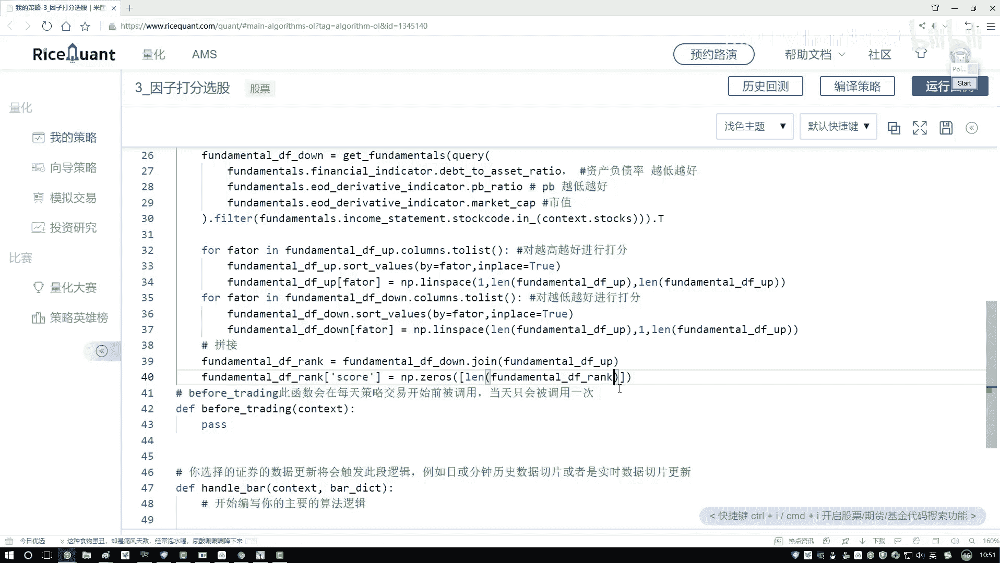

然后接下来再写一个一，把这一列数据给它构建出来，那好了，现在我们这一列已经构建出来了，但是这一列里边的数据啊全是一的啊，我们得写一下这块呢我们要去计算总分，计算总分，然后并排序。

现在呢我们每一个指标分都有了是吧，那接下来我要把这些指标的分啊，给它合在一起了好了，把它们计算一起计算一起啊，其实上我需要什么，就是哎我看一下当前比如说咱这六个指标嘛，六指标做一个加法，算一个求和操作。

这就完事了吧，好了，咱们来写一下这块，我看上一下，然后呢接下来我说把这个横着的，把他们其中一个一个的全部加到一起行吧，加到一起，我说我取最后的一个总和就完事了，然后呢，接下来我再对这个总和干什么。

做一个排序的操作吧，好这里我说要做一个sot values，做一个排序，排序当中啊，现在哎你告诉我你要去拜哪个指标了，那既然我们已经排到一起了，那最后排序完之后，他们算完之后得到了什么。

scar里边就是前面所有的累加吧，好了，把这个car拿过来就行了，然后呢我们希望这个排序啊。

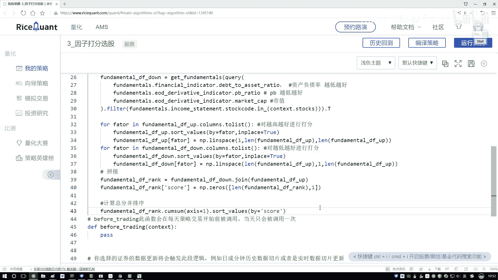

它是升序还是降序，应该是一个降序吧，因为现在我们要找的什么排名最。

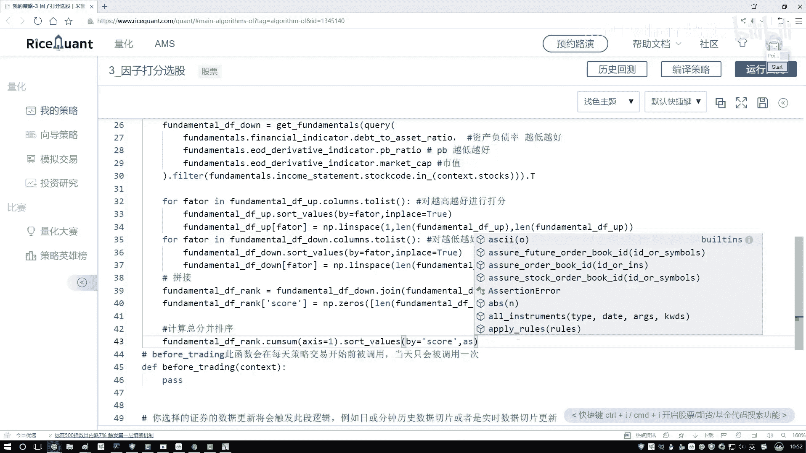

就是分数最高的哎这些结果吧，所以说咱们指定成一个false，我们要做一个降序好了就完事了，虽然相遇之后，现在我说呃给它一个返回值吧，这个就是我的一个data frame啊。

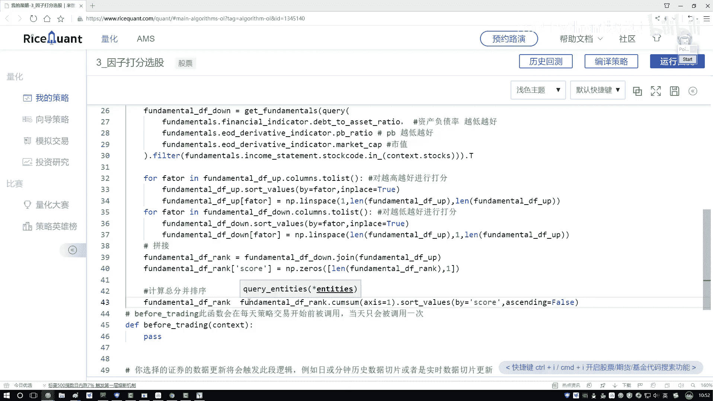

把这个返回值咱们给它做出来了行了，那现在我们已经得到了总分的一个结果，那接下来啊把这个东西直接叫做一个啊，这个其实我们不需要其他指标，我们只需要什么，只需要它这个scars值就行了。

把其中的一列拿过来好了，这一列这是一个呃，就是一个series，在这个serious当中，我们取了某一列，这个月拿了之后，接下来我说哦，你做一个返回吧，返回什么哎，我们返回的是前十名那个得分啊。

还是前十名那个股票啊，我们要选的是前十名的股票吧，就在这里我们要把他的给你DEX，也就是股票给拿到手，并且能给他涂list一下，在这里我再取吧，取一个前十，那就是从0~10，哎这就完事了。

这样我们就完成了。

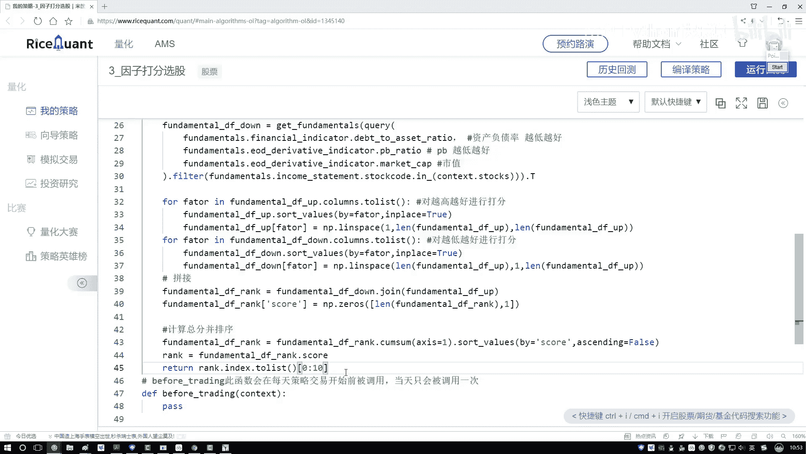

咱们当前啊就是呃get stars当中，咱们的基本操作了，相当于啊哦第一步我们是去啊读我的电子数据，短点数据之后呢。

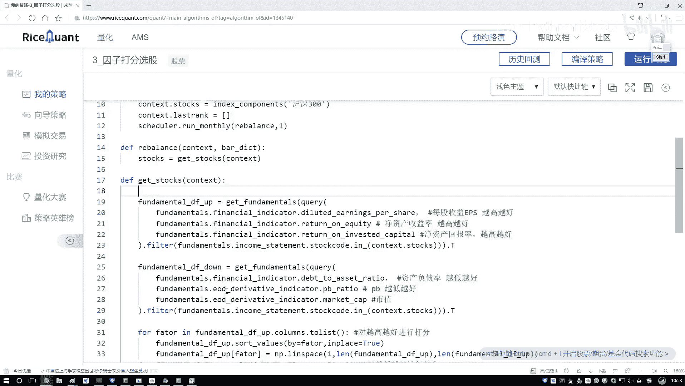

对应的数据啊，我们做做一个打分操作，把最终打分结果我说拼接起来。

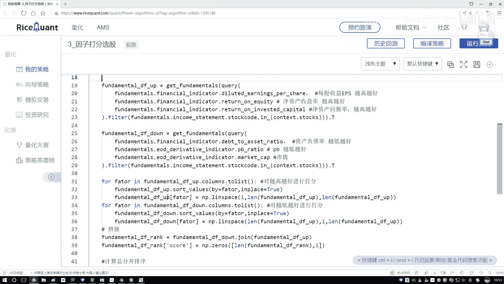

最终呢咱再完成一个排序，但现在他返回结果就是啊我没get到当中。

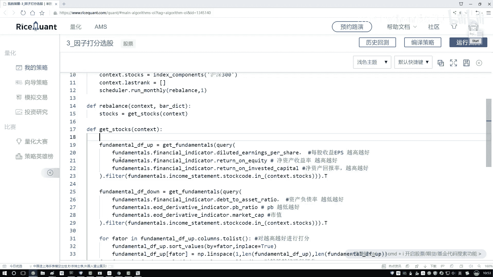

你执行一次，我们现在就你返回呀，当前啊就是当前某一天的啊，当前这些指标，然后它具体的前十是谁，我们就做完了吧。

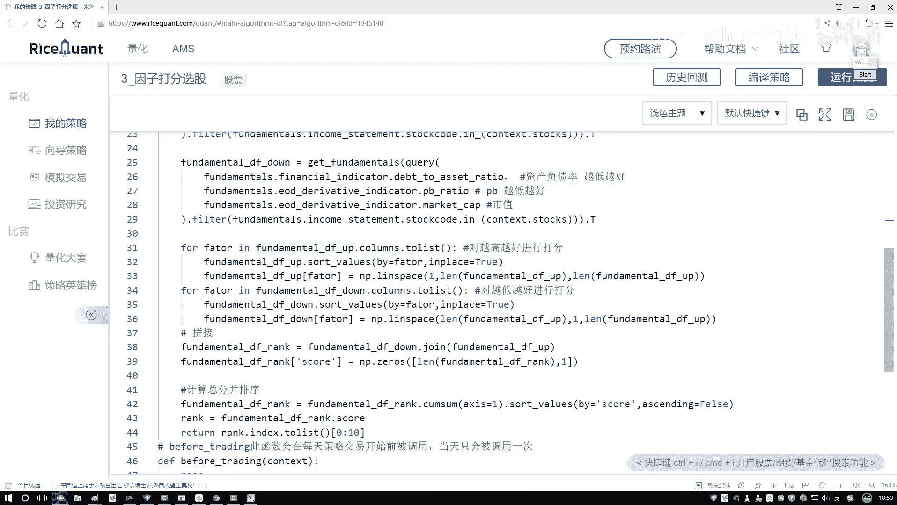

好了，这里我们的最关键的一个函数已经做完了，就是怎么样获取当前我的前十诶。

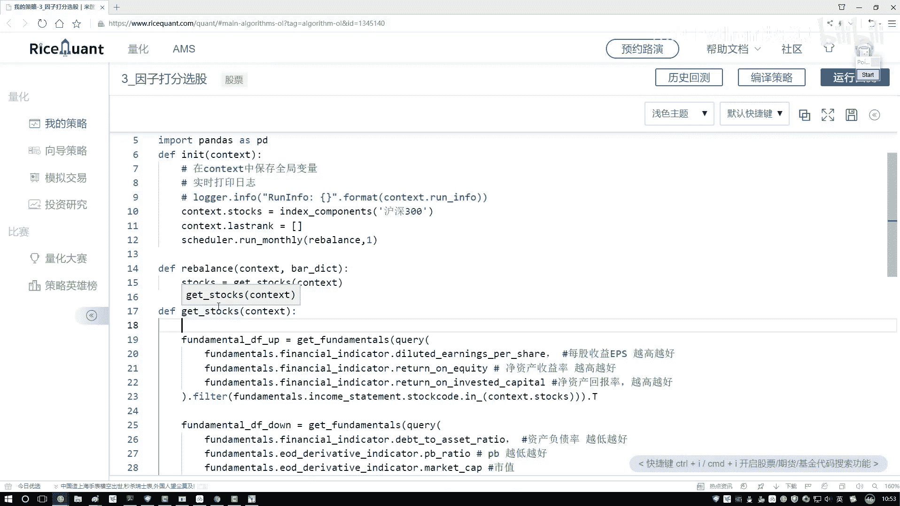