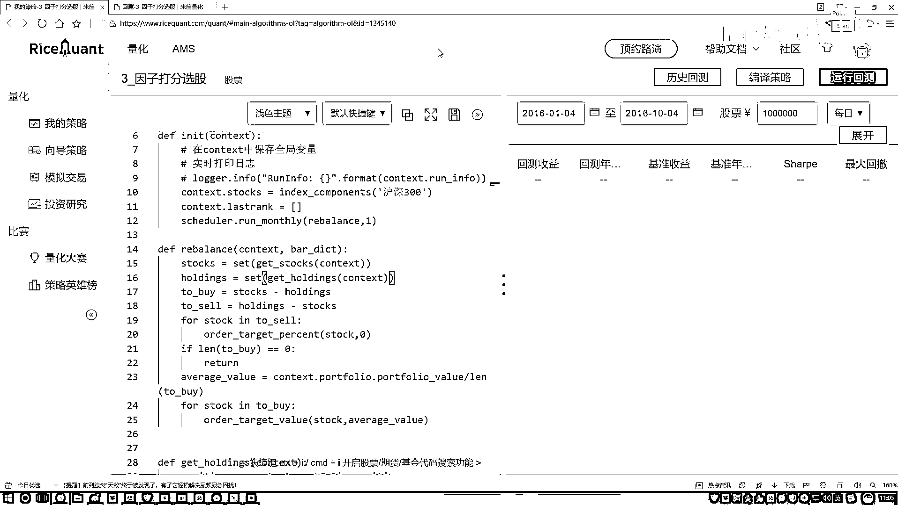

# 吹爆！2023B站公认最系统的Python金融分析与量化交易实战教程，3小时入门AI量化交易，看完还学不会你来打我！人工智能｜机器学习｜时间序列｜股票预测 - P53：6-完成策略交易展示结果 - 人工智能博士 - BV1aP411z7sz

接下来咱们来继续完成好我们的rebase的函数，第一步我们现在选出来了当前，我要去的就是当前我们排名的一个股票，然后呢接下来咱们把这股票拿手了，那接下来我们是不是得看一下。

哎呦现在我这个排名可能做了一些变化吧，那我们现在要再选函数就是，我们手里有的和现在新的一个排名当中，有什么样的一个差异，一会儿呢咱们是不是要基于这个差异，实际的咱们要去选一些股票。

或者说实际的我们要去购买一些股票了，好了咱们来把这个函数完成，这个函数其实说白了就是，去看一下当前你手里有的股票有哪些，然后呢我们做一个差异，好我们先演第一个，就是现在咱们手里有的。

咱先把手里有的股票给拿过来，把这个context都给我传进去，好了在这个函数当中咱们想一下要做什么，首先第一步，哎我说现在这个股票当中我是不是说看一下，我的一个position它是等于多少啊。

PSATM，好了拿到我们context当中找吧，context里边咱找一下咱们的用户信息里边，哦这些个指标，在这个指标当中我们是不是，哎把第一个position拿过来啊，跟咱之前的方法是一样的吧。

好了然后我说现在我写个名字吧，在这个holding当中，holding当中现在它是一个+s吧，现在它是一个list，然后呢一会儿我说把这个list做一个填充，然后做一个判断吧。

for咱们的一个position，在这一块，for我们的一个position，in这些position当中，好了看一看咱们现在这些持有的吧，如果说我持有的数量只要怎么样，它大于0是不是就行啊。

好了把我这个position拿过来，然后看一下，如看一下这里，哎我说先找到吧，找到把这个position传进去，看它什么，看一看咱们拥有的一个质量得多少吧，qunrty这个ty，然后去判断一下。

如果说大于2，那是不是说咱们现在持有啊，持有的时候给它加进来就行了，这块应该是个判断，如果说它是大于0的，大于0的情况下，咱就是持有的，持有的，然后在这里我说做一个path操作。

我path操作把咱当前的这个股票给它传进来，是不是就可以了，好了现在把咱们股票拿到手之后，那我说最后我return一下吧，return就是咱们当前你持有这些东西，好这完事了，好了咱们来练习。

现在我得到了，就是新的一轮stocks，是排名中的结果，然后接下来我说，现在把我holdings再拿到手，它等于去get一下，这就完事了，get一下咱当前结果，然后把context再传进去。

那现在我是要算什么，我说我得去算一下，我要买什么了，那我写一个to buy，我要接下来去买的，买的就是，当前什么，你手里有的这些东西，跟你现在新的一名之间，肯定有差异，重复的，你就不用去管了。

你要管的是什么，差异的，所以说在这个stocks当中，我们要在这个stocks当中，我们去算，减掉谁，减掉咱现在手里有的，这不就是我现在要去买的吗，然后不光我要去买，然后我可能还要去卖，去卖什么意思。

现在holdings当中不在哪了，不在stocks当中了，holdings里边不在stocks当中的，是不是用holdings，减去一个stocks当中，好了，我们把一个买的和卖的，都指定完了，先卖。

应该是先卖后买，好了，然后我一个fostock，in，在咱们现在要去卖的当中，然后咱就直行这样一个卖的，操作就写成了吧，然后一个order，order target value。

or order target percent，然后全卖掉，percent就是给它变成0，stock给它复制过来，然后全卖掉，占有的量变成0%，这就完事了，这就是一个卖的操作，然后接下来咱执行买。

这我也先判断一下，如果说咱们现在没有买的，这些return就行，如果这个东西to buy的，浪值如果它等于等于0，一只股票都没有去买，那return回去，相当于咱做完了，就完事了，然后如果说咱要有买的。

要有买的时候，咱得看一看，我现在手里有多少钱，然后咱平均去买，是不是行了，比如说给大家算一下，咱可以咱现在指定个指标，就是在这个context当中，你所有的信息都能调出来，你的一些用户的信息在这里。

把咱们信息当中，我看一下，找一个value值，咱们来，我把这个直接复制过来，这里边它叫做一个value值，应该是它这个全称，然后点一下它的全称，然后杠一个value就行了，好了，看下咱们现在。

有多少的一个资产，然后有多少资产之后，然后我们要指定，对于我当前这个资产，要判断什么，判断一下，当前我买股票的时候，我买一个股，然后咱买多少，好了，然后咱一共是有这么多股票，涂拜当中。

一共是有这么多股票，那他俩比一下，那就是实际一个股票当中，我们应该去买多少，好了，这块指定的参数，叫做一个，平均的，咱一会咱就平均去买，Average，然后一个value值就行了。

接下来我们还是执行这个函数，只不过说，还是把这个复制过来，还是要去编递一下，编递，在我们接下来，这块不是to sell了，就是一个涂拜的，在我们要去买的，这些个股票当中，这就不是1%了。

我们之前不是算了，你要买多少，那就是一个value，然后style当中，再指定出来了，然后每一个买多少，咱也指定出来，是不是就行了，这样我们就指定了，咱们去买的一个操作，好了。

现在基本上我们已经把所有操作，咱都列完了，回顾一下，看一看，我们还没有什么落下的，一开始在context当中，我说我指定一个股票值在，互联赛当中，然后这里有一个，Last Rank，就是我们上一期。

咱们的一个排名，咱们现在暂时还没用上这个结果，是吧，一会咱看会不会用，不会用给他注视掉，然后说每月咱要做一个调操的操作，然后每月在做调操的过程当中，我说我先去算算几个值，先算买什么和卖什么，不是。

就是现在我算一个新的排名的值，然后再算我手里有什么，然后接下来我说，基于他们的一个差异，然后去买还是去卖，这些操作都没什么问题，然后主要还是说，就是我们getSource当中，咱去查这些指标。

然后把这些做一些筛选，是吧，行了，基本上没什么问题，咱写完了，这样咱运行一下，看一看有没有什么问题，我估计可能会报错，又要报错没关系，咱们来改一改，我现在这pass没用上的，咱就全都给他pass掉。

然后看一下结果，这会可能会报错，来看一看，看数据结果，行这报错了，他说现在这会有一个无效的字符，找一找，他说每股收益PS呢，看一下，在咱们当前的，我给他还是放右边，每股收益EPS这，来找一找。

在当前这块，他说有一个特殊字符，放在methods点，然后去查找，这个写错了，这是什么，写成了一个中文逗号是吧，好，再执行一下，我顺便算了，这块先给它q掉，我发现几个毛病，这块它也是一个中文逗号，是吧。

咱都没注意，然后这块，然后这里这块又少写了一个逗号，我们再加上，这块它也少写了逗号，也加上，这里也是一样的，咱有点小毛病，给它稍微改一改，好了，这块都有些逗号，然后再往下看看，这都是在执行。

看有没有什么问题，他执行，然后我顺便先过一下，简单来找一找，有没有什么太大问题，然后这里看起来都没什么问题，行，看结果，看包不包错，看包错了，咱们来改，他说不知是类型，然后list，我看在哪，在这个。

to buy当中，等于这样一个减法，来看一下，我们现在设计了一个to buy，我说现在我要去买什么，等于我的一个stock，减去我当前的一个，holding，这块不行，我们得做这样一件事。

我也给它做成一个side集合，这样咱把它，全部处理成一个side集合，这一块，我说也处理成side集合，处理成side没问题，好了，这样咱来看一下，应该就能执行，我们的一个差异的一个操作了，这个关掉。

看一看，咱这块还有个东西忘设了，就是咱们的一个时间，时间也不管了，就是从2016年1月4号，到2016年1月10号，这无所谓了。

反正就是这些时间。

咱们不管了，然后一会我再改时间，咱们来观察观察。