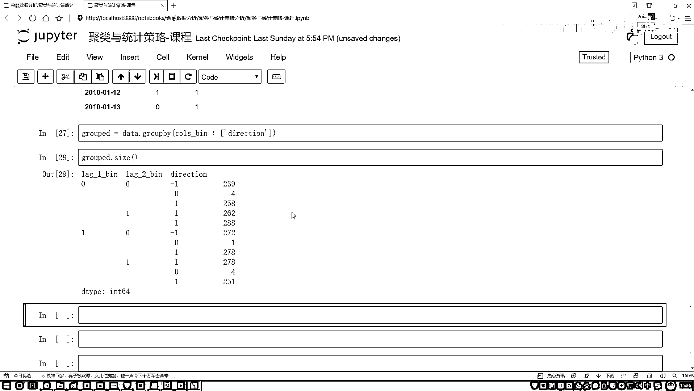

# 吹爆！2023B站公认最系统的Python金融分析与量化交易实战教程，3小时入门AI量化交易，看完还学不会你来打我！人工智能｜机器学习｜时间序列｜股票预测 - P56：2-统计分析所需数据准备 - 人工智能博士 - BV1aP411z7sz

好了来说下一个，下一个叫做一个统计分析，这个方法听起来好像更简单了一些是不是，统计分析其实要做一事儿也挺直接的，我说我现在这样吧，就跟那个赌鹅似的，我说这样，现在不是有两天的一个指标吗。

就是有这个前一天的一个指标，然后呢我写下有这个前一天的一个指标，然后呢还有这个前两天的一个指标，我说我想基于频率去算一算行不行，什么叫频率啊，我说我看一下，如果前两天都是都拿这个，拿这个拿绿色来画吧。

前两天都是跌的时候，我算一算第三天，它是跌的可能性大呢，还是涨的可能性大呢，这可以在历史数据当中做统计吧，然后说我说哎呀前一天是一个跌的，然后第二天是一个涨的，我再要去看一看，接下来跌的可能性大呢。

还是一个涨的可能性大呢，是不是也可以啊，但是不还有其他种其他种，那个方案啊，那接下来就这样，那你比如说这个前两天都是一个涨的，那第三天怎么样，那是跌的可能性大呢，还是涨的可能性大。

是不是一共还有大概也就四种吧，咱们不同的一个情况，我要分情况来去观察了啊，前两天情况对于我最终的情况，然后呢我基于这个概率吧，看一看哪一种情况下出现的概率高，那我就基于这个历史的策略啊。

按这种统计的方法，按照这种方法去买，看一看咱能不能赚钱啊，方法其实挺简单的，跟大家说这个方法，并不是真让你用这种方法，这种方法太传统了，只是让大家去熟悉啊，在Python当中，哎我提了上一个需求。

咱们怎么样去做啊，咱们重点是用Python把它做出来，行了在这个统计分析当中，我们来看吧，首先第一步啊，我统计什么，我说统计啊，这个前两天还有前一天的一个数据情况，并且呢，我说按区间给它分开。

哎呦这个东西，咱们该怎么样去做呀，那是不是我得看前两天，是一个涨了还是一个跌了，第一点，我有这样的一个数值层面上的一个判断吧，然后呢，我把判断结果还列出来，知道前两天具体的一个情况吧。

好了我说来咱们写吧，写一个函数，这个函数呢，叫做一个Bins，去构建一下我刚才咱们需要的东西，传进来我们的一个Data，然后Bins当中就是一会儿咱们拿谁来做判断啊，这个零现在大家可能看着不是特别明显。

一会儿咱们来说啊，在这里啊，一会儿我们要创建出来一新的变量，所以说指定一个Global，我的一个列名，列名，然后把这个列名指定成一个List，它是一个List结构，然后呢我说我去遍地吧。

遍地一下咱们当前的一个数据啊，这个数据上面咱们是不是有，就是前两天嘛，前两天指定个名字复制过来，之前我们定义好了吧，这是前两天的名字，这里我们可以直接去用吧，函数里边咱知道能用啊，之前定义个全局了。

然后，对于每一列，因咱们刚才做好的一个特征数据，然后我说呢，在这个特征数据当中啊，我要去创建了，一个Bins，一个Bins是什么，先指定好它的一个名字吧，它的名字就是，在原始的名字基础上。

然后再加上点后缀吧，加上一个杠B就得了，然后接下来我们来执行这样一个函数啊，就是叫做，现在解释什么意思，这个函数啊就是，它会帮我们去做一个分割啊，它会去帮我们去看一下，当前这个数据，它是在0左边。

还是一个在0右边，在0左边是不是代表跌了，在0右边是不是代表涨了，我们就做这样一个判断啊，就行了就是判断一下，它是在0的左边，还是在0的右边啊，就是就是在这头这个函数，去做一个判断吧，判断判断谁呢。

判断数据当中我当前的这一列，然后对当前这一列，我怎么样了，我说我刚刚才不是要去做判断吗，这个Bins啊，这里咱们判断的比较简单，其实不用这个函数也行，咱直接大小做判断是不是也行啊，这个函数大材小用了啊。

然后大家看看吧，现在看这个结果，好了这里我说我跟这个0做判断了，判断之后呢，我说我把这个结果啊，放到我的DataFrame当中，指定一个新的名字，这一块写一个等号，做一个复制是不是行了。

然后呢把每一列这个名字，我说我判断进来，当前名字我判断进来，这就完事了，然后再执行一下这个函数吧，执行函数很简单，调用这个函数，然后去在这里，把我们的一个Data传进去，然后这就完事了。

执行一下执行完了，执行完之后，咱来这样看一下吧，看一下我们的一个数据啊，它是长什么样子，Data我说点hide一下，你看这里，哎呦这个数据当中有点多啊，咱一会儿只选择其中的，哎呦算了。

我在这里直接选择其中的一部分，我说Data里边，选择咱们刚才做好的，这个是我们做好的，然后呢点hide一下，行了这里多什么，是不是多了一个0和1啊，像我刚才说的，就是其实刚才说的挺复杂的。

就是对我这个数据干一件什么事，对于每一列指标跟0做判断，大于0它就等于1，小于0怎么样，它就等于0了吧，这是咱当前判断，那就是1代表它是一个长了，0代表它是一个没长吧，所以说第一行的数据的意思就是这样。

前一天长了，前两天的时候没有长，就是一个跌了，这样一个感觉，行了，然后咱们把这个结果给画出来，画出来之后呢，哎你说哎这里还少了一个，少了什么东西啊，咱在这个数据当中啊，还少了一地。

就是看一下原始数据当中，原始数据当中有一个direction，原始数据当中有什么，有这样实际的一个方向吧，哎咱们一会儿不要统计嘛，这是不是它实际的一个方向，是怎么样了，然后呢我说我要统计这样的指标啊。

就是一个L1，这是前一天，然后一个L2，一个前两天，然后前一天什么情况，前两天什么情况的时候，我实际是什么情况，所以这里啊有个direction，它表示是一个实际的情况啊，一会儿咱得把这个给它用上。

行了问问大家咋做吧，我说我现在啊想要去分组统计了，哎呀各种情况分别有多少个，各种情况，然后他们的一个组合，那怎么办啊，有没有个海叔能帮我们去做呀，谁啊，你看这里名字我写出来了，用什么。

咱之前讲那个Pandas的时候，不说有一个方法叫做一个group by吗，用它来做属于完事了，非常简单吧，算了这直接给大家去写吧，data，直接干什么，直接的我去group by一下。

里边传进来一个参数，数学型了，传进来参数，那就是你把你需要的电明，全部传进去呗，需要谁呢，按照前一天前两天的情况，并且还要加上什么，还要加上咱刚才的一个方向吧，实际的一个情况吧。

好了这样我做一个group by，group by完之后啊，嗯，这个结果出来之后我复一个值吧，我说，它等于一个group的结果，然后我们执行一下，执行完之后，咱来看一看当前的一个结果吧，其实看这个结果。

看不出来什么东西，你要看的就是，各个可能性出现了多少次吧，就是比如说前一天跌了，第二天跌了，然后第三天啊，跌了涨了还是不变，它这个情况吧，所以说我们看一个size，就能打印出来这个情况了。

你看我打印一下，情况是不是都出来了，来看几个指标，前一天跌了，前两天跌了，然后当天的时候，然后它的一个，它的一个情况啊，是等于一个没变，还是等于一个跌了，还是等于一个涨了的情况，是不是有了。

这是我们前三个，然后下面呢，下面当中就是，前一天跌了，然后前两天的时候是涨了，然后当天的时候，哎这里，因为它把这个零没写，因为这个零怎么样了，零这块它是零了，然后没有出现，所以它自动的。

把这行给我过滤掉了，那这里我们一个点size完之后，是不是咱就得到了，所有我们想要的一个结果了，这里咱们结果就拿到手了。

