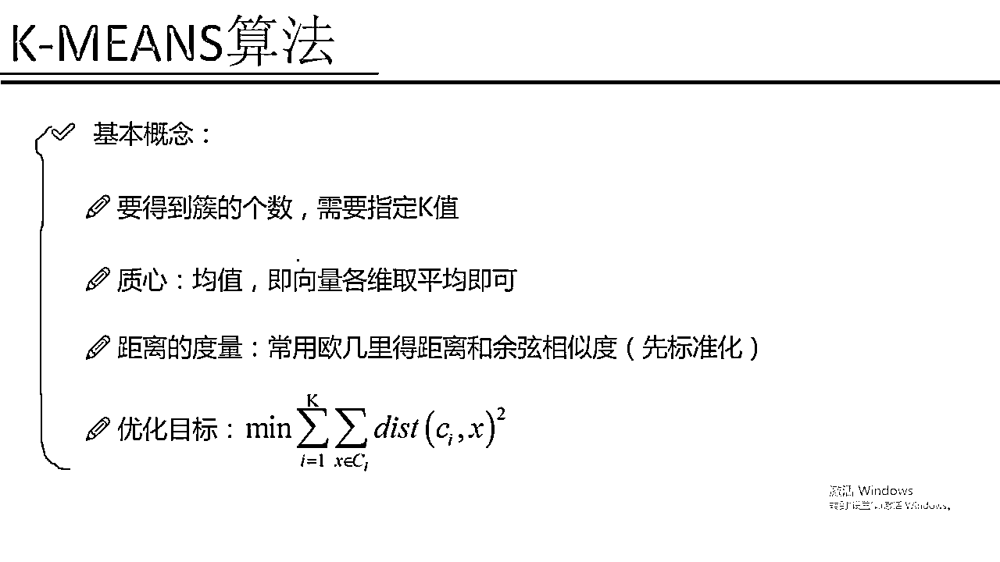

# 吹爆！2023B站公认最系统的Python金融分析与量化交易实战教程，3小时入门AI量化交易，看完还学不会你来打我！人工智能｜机器学习｜时间序列｜股票预测 - P58：1-KMEANS算法概述 - 人工智能博士 - BV1aP411z7sz

这节课咱们就来说一下在我们的基因学习当中，另外一个非常重要的分支叫做一个剧类，那首先咱们先来说一下剧类是用来干什么呢，这回我们的问题变了，咱们之前讲的问题是不是说，我们手里都是有一个标签。

然后我们要优化一个东西，然后写出一个目标函数，朝着这个目标函数进行优化就可以了，只不过说各种量子算法可能来说，它优化的过程是不太一样的，那现在我们的问题突然加大难度，我们现在是一个无间独的问题了。

也就是说现在我们手里并没有每一个标，就是并没有每一个数据属于某一个类别的一个标签，那对于这样一个问题我们就说它是一个无间独的问题，这个剧类也是我们无间独问题当中最典型的一个代表了，那这个剧类要干什么呢。

其实跟我们分类的效果是差不多的，我们还是要把这个比较杂乱数据分成到很多的堆，也就是说剧类我们是要把相似的东西分到一组，比如说我们来看右边这个图，其实右边这个图在原始数据集上，它是没有这样一个颜色标记的。

也没有告诉咱们这个绿色的是哪个，蓝色是哪个 红色是哪个，我们就要根据一种比如说一种相似度度量的方式，把一些相似的东西归到一边，比如说在这里我们来看绿色的归到了左，就是左上角红色的右上角。

蓝色的咱们在中间的下角这块，也就是说根据我这个数据它分布的不同，我要把相似的往一块凑，凑完之后我就得到了三个粗，也就是说剧类完之后的结果，我得到了三个不同的类别，分别是绿色 红色还有这样一个蓝色的。

那看起来就是剧类算法应该也是蛮简单的吧，其实剧类它从算法原理上来说是比较简单的，但是它仍然是具有很多比较困难的问题，给大家来举个例子，就是我们这个剧类它的一个难点在什么地方呢。

它这个难点不像咱们那个有坚度问题我们有标签，有标签是我们便于干什么，便于咱们自己进行评估吧，咱们之前是不是可以做个交叉验证，然后看一个精度啊，Recall值啊 Fcall值啊。

或者是你的一些True positive啊，False negative啊之类的这些很多个评估标准，那这些评估标准是怎么来的，是基于你的预测值和真实值之间做了一个比较吧。

或者说我们看了预测值和真实值之间的差异怎么样，按照某种评估的方法评估出来一个指标，那这个是我的有坚度问题当中我可以进行很多种评估，但是呢在我无坚度问题当中我手里没有标签了，这个评估它就非常非常难了。

我们需要去评估一下你剧类完的结果，这个东西难度是稍微有一些的，还有一点难点就是我们参数该怎么样调节呢，比如说我当前第一组参数得到了一个错误结果，第二组参数又得到了第二个结果。

那你说一个参数和二个参数哪个好呢，这点也是比较难比较为什么，还是因为咱们手里没有标签嘛，一分案类结果不知道它分的到底怎么样，二分案类结果也不知道究竟它分的怎么样，也就是说我们手里没有一个标准的答案。

没有一个标准答案这些事它做起来就稍微有些困难了，这个是我们剧类当中一个比较大难点评估还有调参的一个问题，那接下来我给大家讲两个非常经典的剧类算法，咱们就一个个来看吧。

第一个是我们看的最多的也是用的最广的，叫做一个K-means算法，K-means算法可以说是剧类算法当中最简单，但是呢也是最实用的一个算法。

首先咱们先来说一下就是这个K-means算法它的一个基本的概念，就是首先咱们需要明确一点，就是说这个K-means算法需要我们指定一个东西叫做K值，K值是什么意思，比如说上面这个图我说了一个K等于3。

那它最终是会什么，最终它会把我所有的数据聚成三个堆，就是绿色红色蓝色，那如果说我设置了一个K值K等于4呢，K等于4它会把我这堆数据聚成四堆，K等于5五堆K等于6六堆，也就是说一份数据来了。

你需要明确的告诉这个机器，你呀是想给它聚成几个堆，这个值首先需要咱们自己给定，这个也就是我们K-means算法当中最重要的一个概念，需要指定一个K值，你指定K等于多少它就会帮你得到多少个错。

下一个是一个质心，质心是在K-means当中一个非常重要的概念，什么叫做一个质心，质心说白了就是一个数据的均值，咱们先想就是我把一堆数据聚成了一堆，那这一堆它是不是得有一个均值的位置，均值是什么。

均值说白了就是各个数据在各个维度上取平均就可以了，比如说一个二维的X轴和一个Y轴，那我X轴上所有的数据取一个均值，Y轴上所有的数据再取一个均值，这我就得到了一个质心X和Y相当于是。

对所有的数据都取了上一个均值，那这里什么叫做一个质心，比如说我来单独看这个绿色的，绿色的一个质心可能大概是这样的一个位置，也就是各个X的一个维度取均值，Y这个维度取均值得到了我的一个质心。

红色也能算出一个质心，蓝色的同样我可以算出来一个质心，每一个错我都需要得到它的一个质心，那这个质心有什么用呢，这个质心是我之后要进行迭代需要用到的，大家需要先知道有这样一个概念叫做一个质心，距离的度量。

距离的度量是干什么的，咱们刚才不是说了吗，要把相似的东西分到一组，那怎么判断两个东西是不是相似呢，这个我们就要基于一个距离去做计算了，距离有什么意思，咱们来看，比如说咱们左上角有两个样本点。

这两个样本点到底有多相似呢，我们就可以来计算一下，最常见的计算方式就是一个欧式距离，直接算两个点的欧式距离就是x轴减x轴减x轴的，y轴减y轴再算这样一个平方向，非常经典一种计算方式叫做一个欧式距离。

欧式距离估计大家都比较理解了，欧式距离是其中的一种计算方式，或者我还可以算一个余显的相似度，这两个都是比较常见的，但是对于我们在K-means的设法普遍情况下，我们都是使用欧式距离。

来当成我们这个距离的一个评估标准的，那这里有一个问题就是，当我们使用一个欧式距离的时候，通常情况下我们要先对数据做一个标准化，什么叫标准化，比如说我现在有两个维度一个x轴一个y轴。

x轴的数据它都是比较小的，可能是分布都是0。01，有的是0。01有的是0。04有的是0。03，这是我第一条数据第二条数据第三条数据，在x轴上它的一个差异比较小，在y轴上它差异比较大。

可能y轴上是一个105 161 267，都是一个比较大的一个数，那这回我们来看当我们计算相似度的时候，x轴无论你怎么算它是差异都比较小，y轴也是无论怎么算差异都比较大，那这个时候我们是不是潜意识就认为。

咱们的一个相似度主要就由y来决定的，x基本没起到什么作用，可能有这样的一种想法，因为计算出来就是这样的，所以说在我们使用这个距离的一个度量的时候，一般情况下不是一般情况下了，基本所有情况下。

我们都要对先对我的数据做这样一个标准化，什么叫标准化，比如说我做这样一个规避化，让我的一个x轴，它的取值范围都是从0到1的区间，y轴取值范围也都是从0到1的一个区间，也就是说让我的一个数据x和y。

它的取值范围基本上都是在一个比较小的范围内进行浮动，比如说都是0到1都是-1到1，这些都是可以取的，也就是我们要做咱们的一个标准化的一个操作，这个是在我们剧烈当中基本上是必做的一项，先把数据做标准化。

然后我们再用距离的度量去看一下，什么样的两个样本点它是比较相似的，再把相似的分到一组就可以了，然后我们的k-mean算法它是要有一个优化目标，这个跟我们的一个积极学习的一个套路是一样的。

无论我们在做一件什么事我们都是要进行一个优化，通常情况下一个问题很难直接进行求解，我们是直接我们是经常通过这样一种优化的思想，找一个目标函数不断优化不断的接待进行求解的，我们来看我们要优化的是什么。

要优化的首先最外层是什么，最外层有一个i从1到k，i从1到k什么意思，它表示的就是我一共有多少个粗，比如说这个k=3的时候我要优化的就是对三个粗分别进行优化，里边是什么。

里边是对于每一个粗来说它都是有这样的一个，都是有这样的一个中心点，我要优化什么，比如说我们来看我们这个图当中，我这个绿色里边它是有一个中心点，我要优化的就是让每一个样本到中心点的距离都能够越小越好。

也就是说这个中心点真的是离粗当中，每一个值它的一个距离我都可以算出来，就是每一个粗当中绿色点当中每一个值，到了中心点的距离我都是可以算出来的，我希望这个球出来的一个总和。

就是每一个点到中心点距离的一个球和，对于这样所有绿色点来说它的值是越小越好的，这是对于其中的一个粗，那还有这样红色的粗，还有这样蓝色的粗，对于每一个粗来说我们看i从1到k。

对于每个粗来说它的一个值到中心点的距离，都是要越小越好的，为什么越小越好，因为越小我们说它是越相似的，我们的目的就是把要相似的东西归到一组，所以说我希望这个粗当中，它们离它距离的一个距离都是越小越好的。

不希望什么情况，不希望比如说这块有一个点我是分错了，这个点我换一种颜色吧，我换一种颜色我这个颜色，我看一下在哪去换个颜色呢，换一个蓝色的吧换一个绿色的，在这里比如说我这块还有个点，这块还有绿色点。

那我们可以看就是说我们现在由于多了一个绿色点，这个绿色点其实本身应该给它画成红色吧，但是其实我给它划分成了一个绿色，那这个时候我们可以想一想，绿色的这个样本点到它至心的一个距离，是不是非常大呀。

非常大是我不希望的一种情况，所以说在我迭代优化的时候我就会发现，这个绿色点它这个位置不太好，它不应该属于绿色的，那我给它画成一个红色的不就可以了吗，所以说在这里我们是有这样一种想法的。

就是基于每一个点来说，我要把它划分到一个合适的地方，怎么看它合不合适呢，就看它到中心的一个距离，它到绿色中心距离比较大，到红色中心距离比较小，所以说我认为它是红色的可能性是更高的。

我就会把它归到红色这个堆，这个就是我的一个优化的目标，我要使得我的一个每个粗当中，它的一个所有样本点到粗心距离都是越小越好的，那这个就是我们的K-mean算法它的一个基本概念。

可以看出来就是K-mean算法基本上没有什么难度，也没有什么数学，咱们用一种通俗的方式。

就可以把这个K-mean算法给它解释出来。