# 吹爆！2023B站公认最系统的Python金融分析与量化交易实战教程，3小时入门AI量化交易，看完还学不会你来打我！人工智能｜机器学习｜时间序列｜股票预测 - P60：3-KMEANS迭代可视化展示 - 人工智能博士 - BV1aP411z7sz

那咱们再来看一下就是对于这个K-means算法，它的一个剧烈的时候，它的一个可人化效果是长什么样子，根据咱们当前给大家讲那个流程，大家可以想一想，我这个K-means算法它的流程长什么样子呢。

这回咱们再来实际的，再通过它真实的剧烈的时候，它的一个状态来看一下，那这个界面就是一个老外，做的一个网页版的一个K-means，在这里它可以做一些可人化展示，咱们先来观察一下，然后这个东西怎么用。

怎么用到时候网址我已经是复制到这个PPT当中了，然后到时候把PPT发给大家，大家可以直接登录这个网址。

可以看一些K-means还有DBSN。

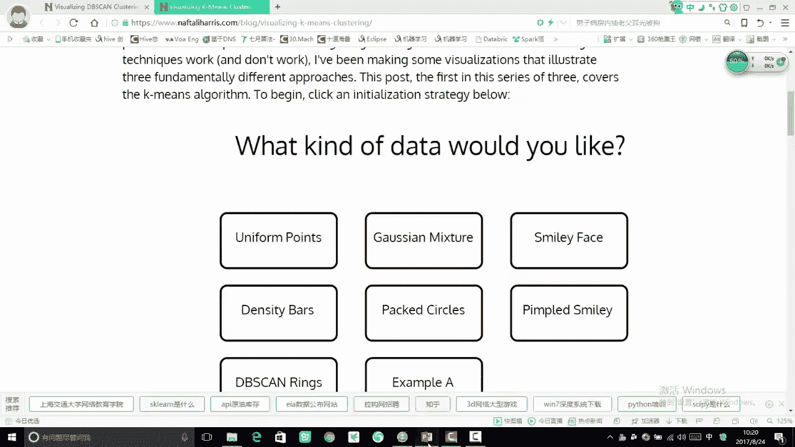

它的一个可人化的一个效果，在这里就是我们可以选择一个数据集，比如说咱们随便选一个，选这个数据集之后，然后在这里它有一个选项。

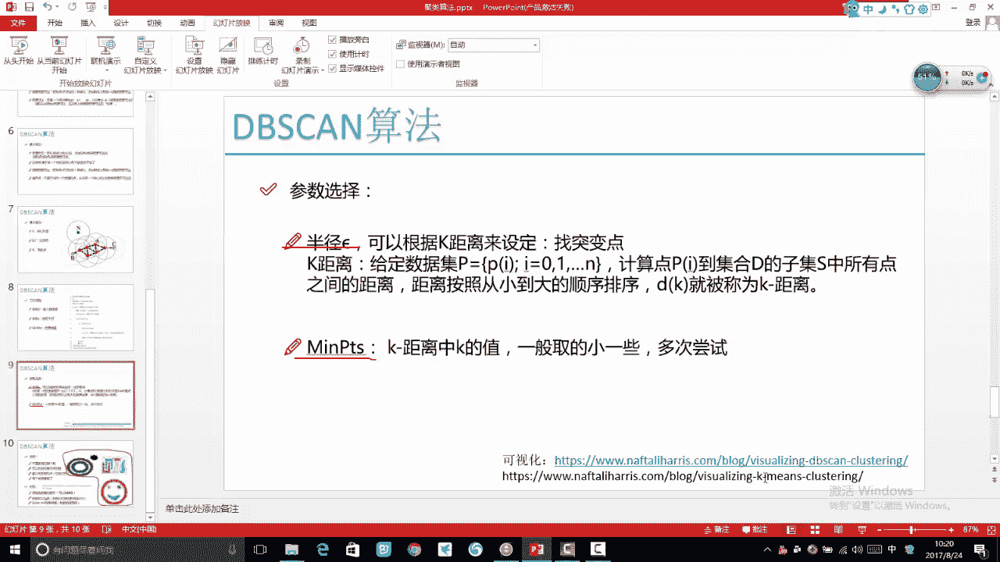

这个选项都比较简单，这个选项就是说爱的一个就是一个中心点，然后这里我们看大概是三个类别，所以说第一个点，第二个点，第三个点，这三个点都是随机的，我就是添加上去的，所以说咱们第一步是随机添加了三个点。

然后我够一下就是我去进行一个迭代了，咱们来点看一下，我够一下就是说现在在我这三个点看来，就是哪些点是属于绿色的，因为哪些点离绿色比较近，都算了一个距离之后，我认为这些点都是属于绿色的。

然后哪些点属于红色的，哪些点属于蓝色的，这是我第一步找出来三个中心点，然后分别把它们进行一个归属，然后要干什么，我去更新我这个中心点，咱们来看更新一下，更新中心点之后。

我来看就是现在是不是中心点发生了一个变化了，中心点发生了一个变化之后，我们要干什么，中心点怎么变的，基于我当前的数据去变，中心点发生了一个变化之后，然后我给这些点重新的安排一下，咱们再来点一下。

重新安排一下，然后这块咱们看一下，原来这块是有一个红色的，现在变成绿色了，然后这三个点完之后，我再更新一下我的一个中心点，再更新中心点变到这个位置，然后再去安排一下，再更新再安排再更新再安排。

现在大家可以看到一个结果什么样，我们现在结果跟我们目标是不一样的，我们目的是希望把这三堆，这明显不就三堆吗，上边左边右边，但是它虽然说是一个三堆，但是我给它聚成几堆，我给它聚成两堆。

我再无论怎么的点下去，你看它更新了吗，不更新了，饱和了，这就结束了，所以说K-mean算法最大的一个问题在哪里，它对初值的影响是非常大的，一个初始值做不好，它会使得你最终结果也做不好。

这个就是给大家证明一下，K-mean算法它的一个初始值是很重要的，也就是说大家在做K-mean的一个实验的时候，咱们可以做多次，然后取它的一个平均值，因为每一次你都是随机选值。

每一次你得到一个错都是不一样的，这个是K-mean算法最大的一个问题，之前一开始的时候，几年前我是怎么认为的，我认为K-means就是无论它因为是不断迭代下去，我认为它就是无论是怎么选初值。

最后迭代完肯定都是一样的，然后我拿SKlearn做实验的时候，我就发现为什么每一次差异有这么大，每次差异其实因为我那数据机比较难，每一次差异都比较大，所以说当时我看完之后我就反应过来了。

因为初值会对我结果产生一个非常大的影响。

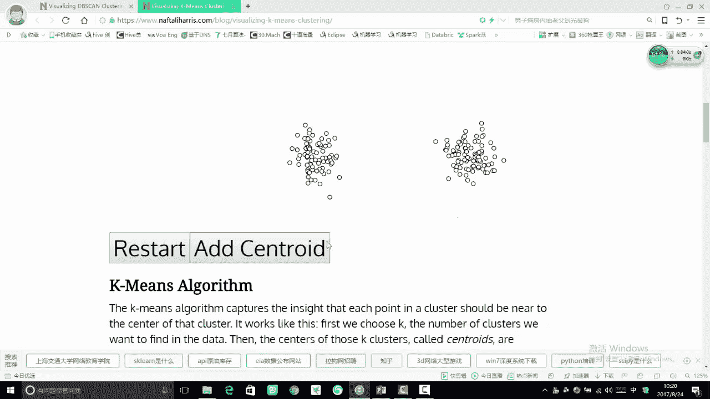

这就是这样一个例子，咱们再restart一下，然后重新来观察一下，还是要这样一个例子。

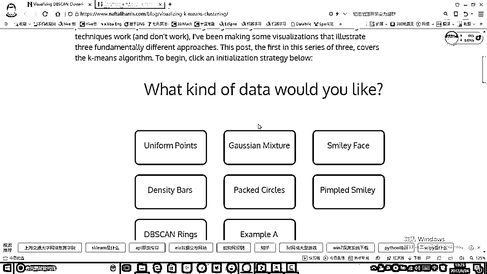

然后我随机的还是选择三个初值化点，假设说restart点其实也不是太好，咱们来看一下，如果说这三个初值化点它的一个效果是什么样，咱们勾一下，更新，reset，更新，更新，这个就不可以。

这一回就把我们三个初值点进行了一个更新完之后，就得到了这三个true，也就是说我们来看跟刚才结果是不一样的，不同的一个初值点对我的结果会产生比较大的影响，现在就不能动了，然后再restart一下。

咱们再来看一遍，再玩一下这个东西，然后add三个点，这三个点来看一下，这个应该肯定也是可以的，勾一下，然后update一下，再勾再update，这就是我得出来了三个点，基本情况下它都会得到一个准确的。

但是有些时候它的一个效果可能还会根据你初值值的不同。

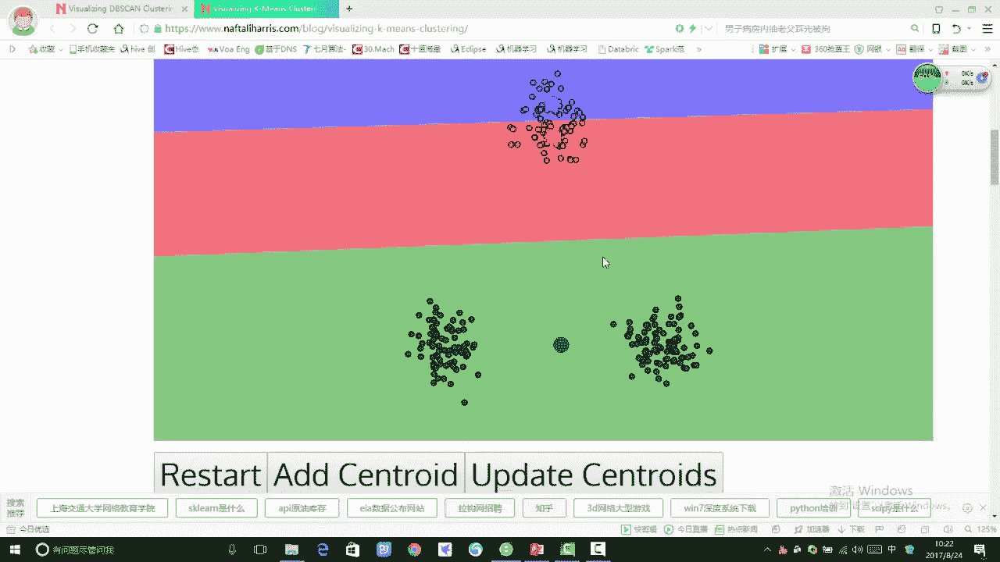

发生一个变化的，然后咱们再来看一下，我换一种点，我换这个点来看一下，这个点当中我在就是一个笑点，咱们来看一下对于这种比较不规则的一个数据。

它能不能够给它聚出来一个结果的。

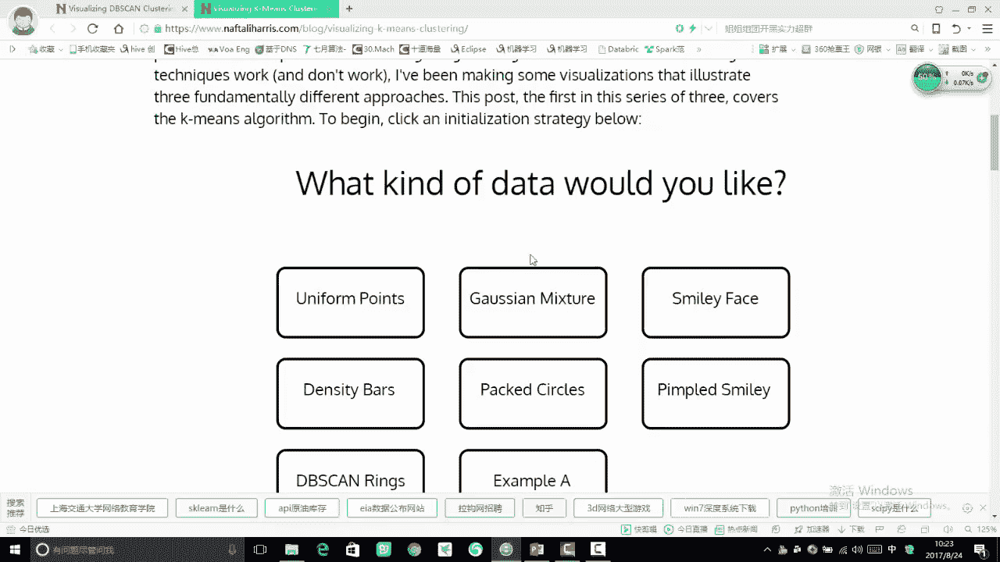

咱们来看，我一共几个处，我大致想一想。

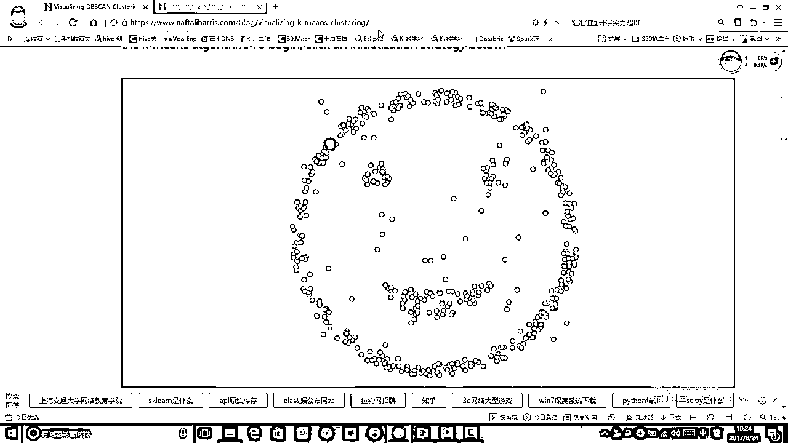

外层是一圈，然后两个眼睛一个嘴，一共应该是有四个吧，咱们加上四个点，1234加上四个点。

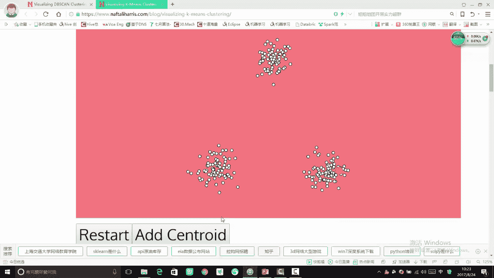

然后去勾一下，然后去更新，然后去重新的安排一下，然后更新，重新安排更新，重新安排更新，重新安排，咱们来看就是剧烈结果，基本上到这就差不多了，因为K-MES是基于距离进行这样的一个剧烈。

所以说现在只是进行一个微小的改变了，我们现在来看剧烈效果怎么样，这个剧烈效果是一般的，因为我现在剧烈完之后，对于每一个点来说，它属于的一个类别，跟我想象的不一样，我想象的是要嘴是一个，两个眼睛是一个。

然后外层圈是一个，但是它没有达到这样一个效果。

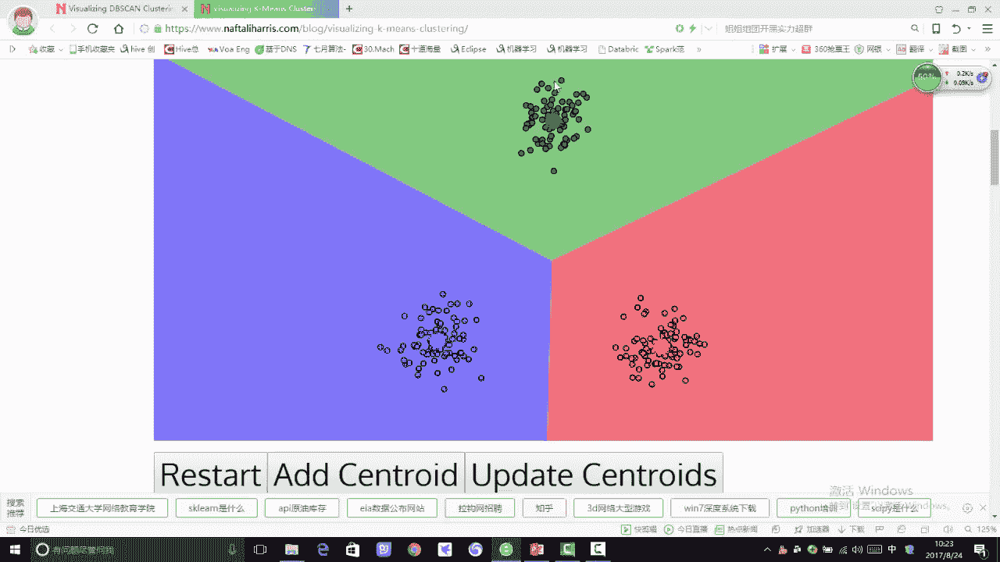

这个是跟初始值有关吗，跟初始值没关，咱们再来运行一下。

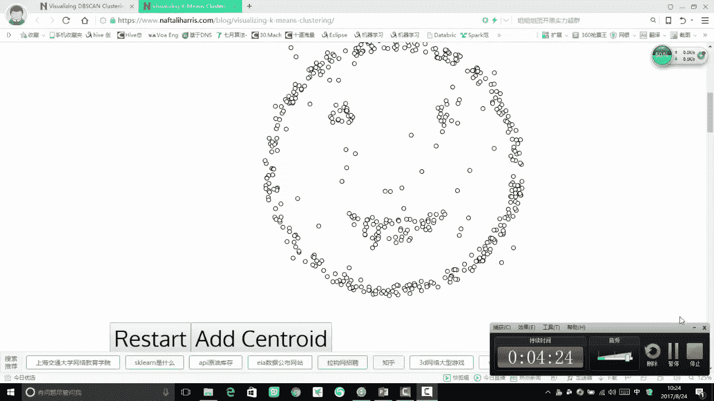

我们再来看随机的加上四个点，然后无论你怎么构下去，基本上它都是这样的，我们来看现在虽然说四个点初始位置改变了，这个簇也改变了，原来这个簇不是这个样子的，现在这个簇又变化了。

也就是说对于当前这个数据集来说，初始点不同，我这个簇完全就变了，好像就像旋转了一个圈似的，它这个簇完全发生了一个变化。

这个就是说对于一些不规则点。

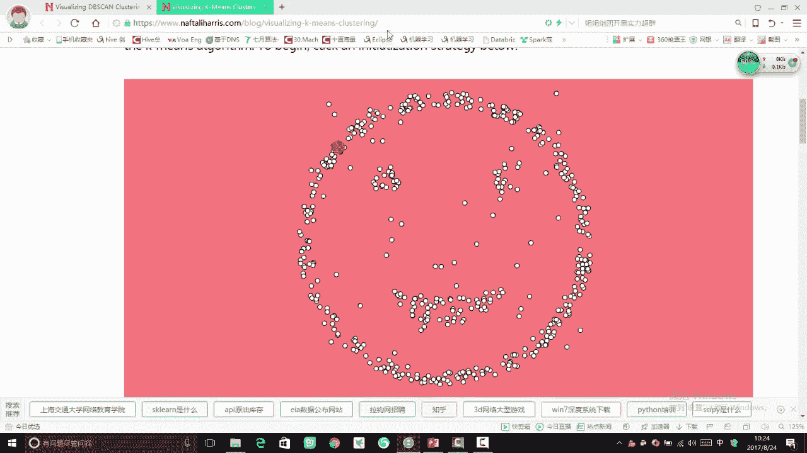

我们K-MES做起来，它的效果不是那么好的，咱们再来随便找一个，再来找一个这个东西，这个东西我来看一下，这个东西问题来了，现在最大的问题就是说，你说它是几个簇，不好说，你说它是三个簇也能分。

你说这是四个簇也能分五个六个，甚至八个都是可以的。

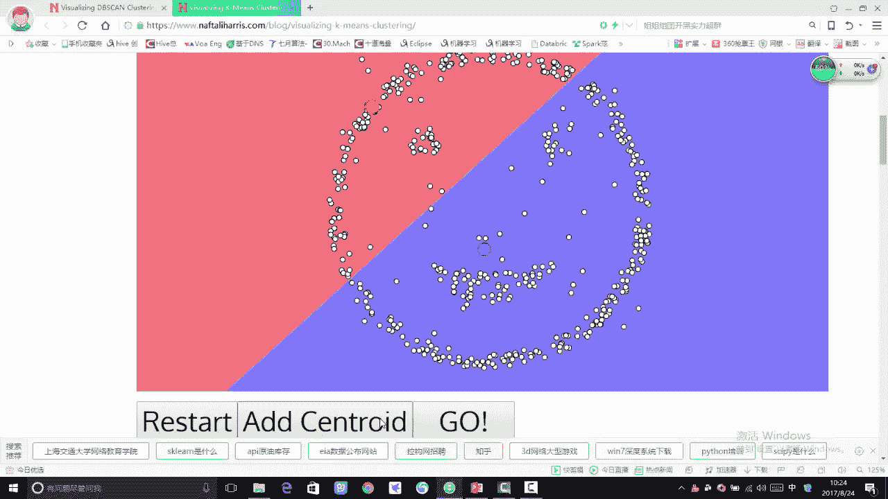

咱们来看当我三个簇的时候怎么样，这是我三个簇的时候，然后去更新更新更新，大概可能是得到这样的一个样子，这是我三个簇的时候，看起来好像有点这个意思。

左边是一个右上角。

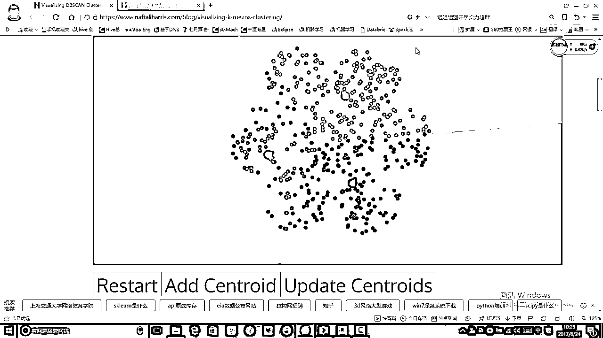

然后右下角又是一个，那当我们来看一下，当我这个东西，我是一个就是还是这个东西。

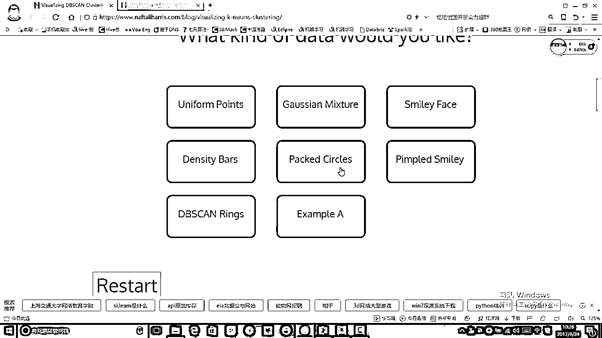

当我簇多的时候，它又会发生什么样的变化，当我是1234，我看一下123456，我再来一个，再来一个时候，咱们来再去勾一下，再去看一下，当我是多个簇的时候，好像也能划分出来这样一个簇吧，也是有意义的。

那也就是说对于K-MES来说，这样一个数据集，我到底分成多少个簇，可是分成多少个簇，分成现在123456，分成6个簇看起来，也没有什么太大问题，你分成个8个簇。

好像也没那么大问题。

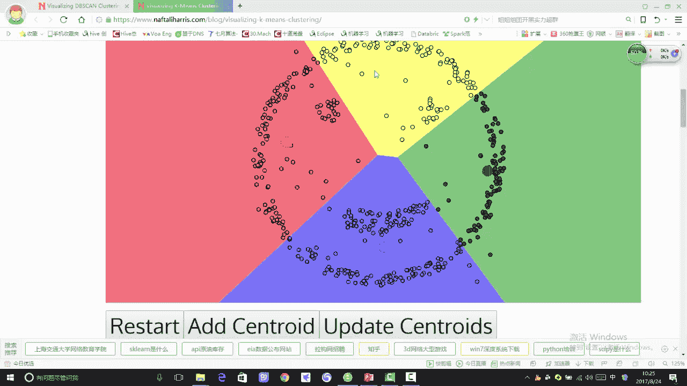

到底分成多少个，这个就比较难去看了，所以说对于当前的这样的一个任务来说，我们是很难去指定这样的一个K值的。

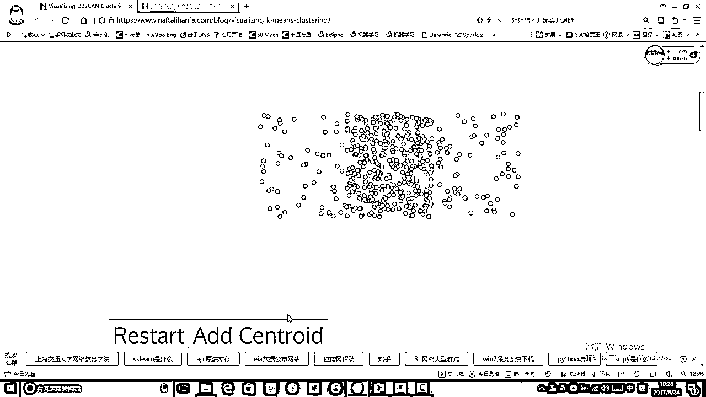

这里我比如说我随便指定三个，它可以分成，我们看一下它会分成啥样，跟我想象不一样，我想象是左边是一个，中间是一个，右边是一个，但是它是基于这种方式。

进行一个划分的。

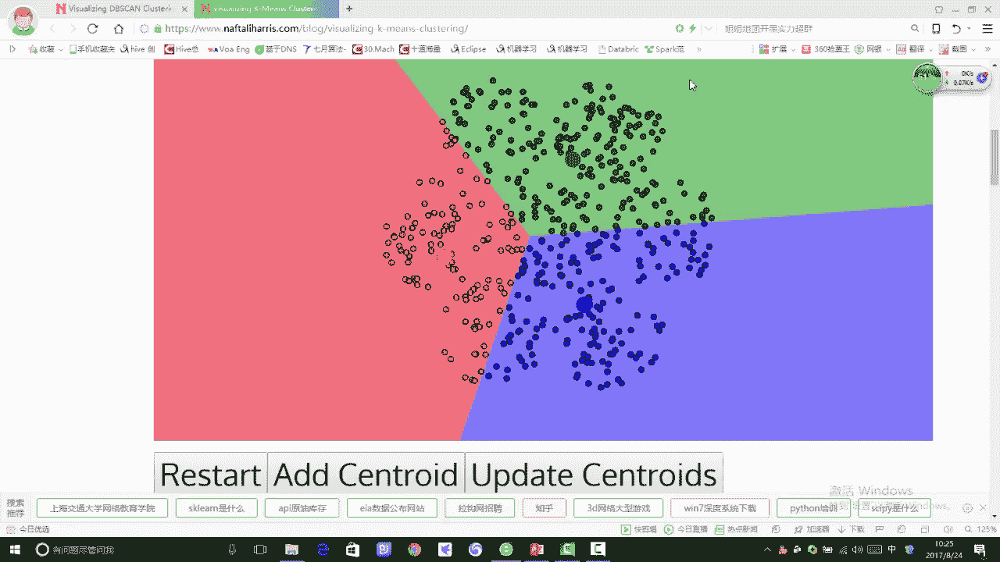

现在就更新不动了，再玩一遍，这个网址到时候已经发给大家，到时候大家都可以自己玩。

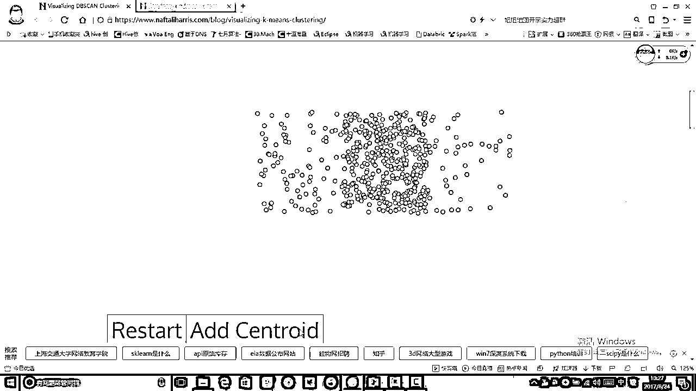

还是来三个点再购一下，购完之后又变成这个样子了，所以说大家可以看到，就是说这个K-MES，对初值的一个影响是非常大的，不同的初值剧烈完结果都是不一样的，当你想使用这个剧烈算法的时候，你得想一想就是。

当我用这样一个剧烈的时候，它对我初值竟然这么敏感，我是不是得做个十组八组的，然后取一个平均，就是说对于每一个点，它这次可能是绿色的，下次被捕是蓝色了，下次被捕是红色了，我可以取一个平均。

K-MES我们要做多遍的，K-MES对初值的一个稳定性是非常差的，那这个就是给大家看了一下。

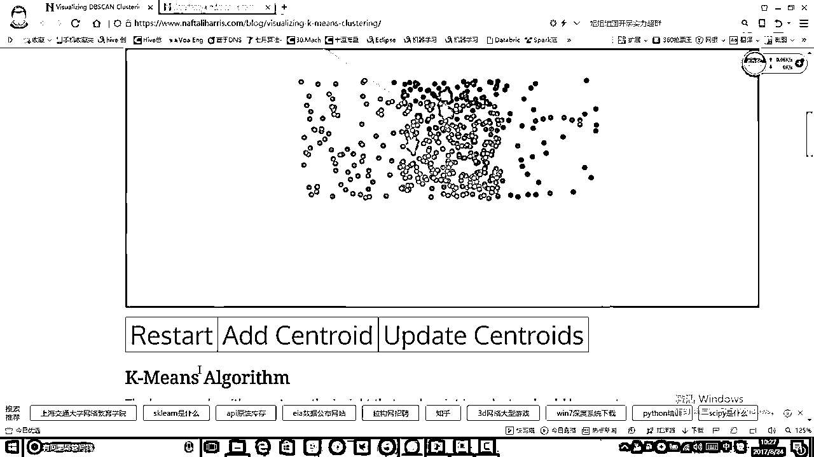

我们这个K-MES算法，它的一个可视化的一个效果，是长什么样子的，然后这里它还有一些其他比较好玩的东西，这个就给大家一个个展示了，这个也是老范给大家做的这样的一个，可视化的一个展示。

然后下面它有一个K-MES的一个介绍，基本上跟我差不多的，反正都是英文，大家感兴趣可以看一下。

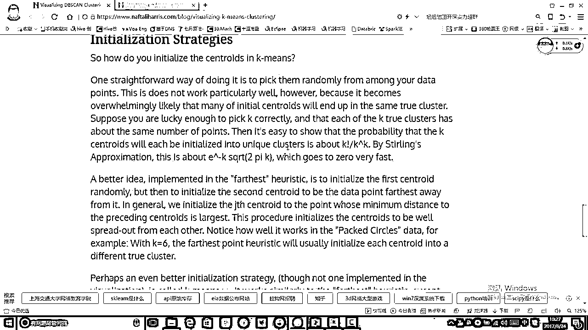

我是觉得这个可视化比较好玩，就给大家来演示一下，到时候大家就自己去玩吧。