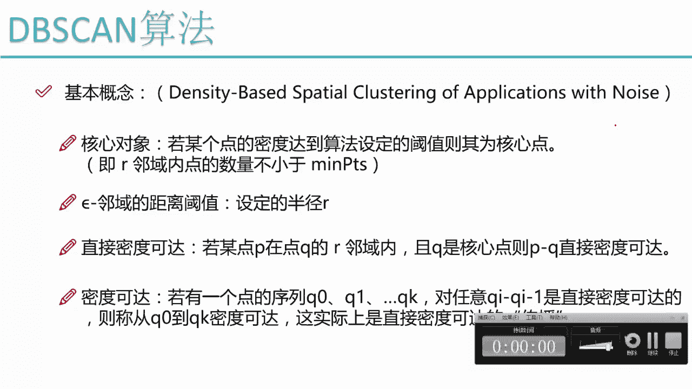
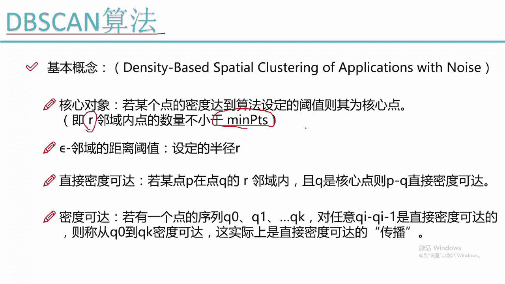
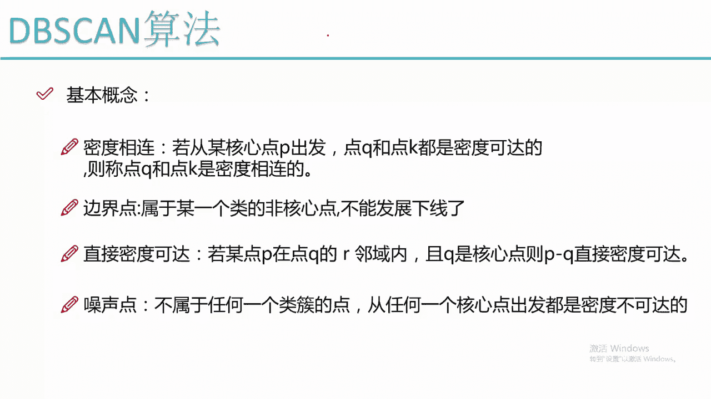
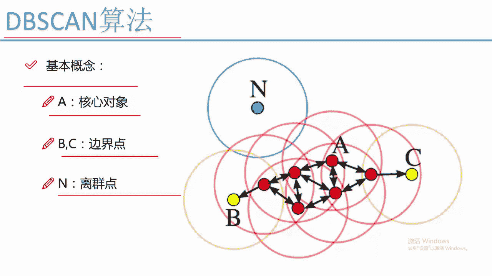

# 吹爆！2023B站公认最系统的Python金融分析与量化交易实战教程，3小时入门AI量化交易，看完还学不会你来打我！人工智能｜机器学习｜时间序列｜股票预测 - P61：4-DBSCAN聚类算法 - 人工智能博士 - BV1aP411z7sz

说完了这个k min算法之后啊，咱们刚才是不是说啊K面算法有些缺点，那这些缺点我们该怎么样克服呢，啊，这回要给大家讲的是一个在我们聚类算法当中，我认为非常牛逼，非常强大的一个算法，叫做DBSAN啊。

这个DBSN，大家可能一看，它是不是基于什么东西的一个扫描啊，其实啊不是这样的，这个只是它的一个缩写，它的全称是什么，它的全称啊是一个这样的，就是一个基于密度的啊，然后带有噪声点的一个聚类的方法。

这个聚类方法啊，它就是表达效果，一会儿会给大家展示它的一个表达效果，表达效果是非常强大的，所以说嗯如果说你的一个任务来了，我是推荐大家就是用这个DBSN啊，这个算法去做它的一个效果。

肯定要比k means，还有一些其他具体算法都要强，那之后我会给大家展示一个，基于实际数据集的一个对比啊，让大家看一下不同的聚类算法它的一个效果的，然后呢咱们来说一下，就是我们的一个DBSN啊。

它的一个基本概念吧，然后它的名字很长，就是基因密度的带有噪声的这样一个聚类，首先啊他给咱们定义的东西啊，叫做一个核心对象，核心对象是什么意思啊，核心对象说白了就是说嗯在这里，比如说我指定了一个圈。

我指定了一个圈，什么意思啊，指定一个圈，那么在当圈当中有一个点，那这个点啊，在指定的一个半径做成一个圈儿里边儿，它里边包含了很多其他的点，包含了多少个，其他点呢，只要大于我们设置一个阀值。

比如说我设置了一个阀值，是等于五个啊，如果说他大于了这个阀值，也就是说以这个点，然后为为圆心画了这样一个圈儿，这个圈当中呢，然后的一个点的个数是多于我们设置一个阀值，我就说啊它是一个核心对象。

那说白了就是我的一个阿领域啊，它那阿联域内的一个数量的一个点的个数，不小于啊，这个命pd啊是我自己设置了一个法啊，设置的这样一个阈值，这个阈值啊就是我的一个指标，比如说阈值上升五，那只要大于五了。

它就是这样的一个核心对象，有了这样一个核心对象啊，一会儿咱们就是要基于核心对象啊，不断的去找点啊，这是我的一个基本概念，有这样的一个核心对象，它的概念啊其实说的比较啰嗦。

就是每个点的密度达到了算法设定的阈值，说白了就是画上一个圈，这个圈里边有多少个点，这个点个数多于我设定的一个阈值，然后呢这块我们还需要设置我们的一个半径，说白了就是咱们刚才不是说一个点为圆心。

然后画上一个圈吗，那这个圈啊得有这样一个半径吧，这个半径需要我们自己指定出来，所以说啊这个DBSN算法需要我们指定，有什么东西啊，啊默认有两个东西需要指定，一个就是我的一个半径值，就是我的一个R值。

另外一个就是我的一个阈值，就是说嗯在这个圆内啊，不小于多少个点，我就说当前的一个点，它是一个核心对象，这两只啊需要我们自己进行一个设置的诶，那大家现在发现一个问题，我们是不是少了哪些参数啊。

K命令当中需要我设置一个K值，也就是说这类啊你到底想聚成多少个堆啊，咱们之前不是说哎呀这个K值非常难设置吗，然后呢这个DBSN算法我们来看它需要这个，我们就是需要我们设置上要K值吗，它是不需要的。

也就是说当我们用这个DBSN算法的时候，其实我们可以不去设置这个整个的数据当中啊，具体能聚出来多少个堆，我们可以把这个值给它省略掉，不是省略掉，就是我们根本都不需要设置这个东西，到底它能锯成多少吨。

是由算法实际给我们锯出来的，也就是说啊，这个dB的SN算法要比k miss好用多了，为什么，因为呢我们不需要前提的指定出来，你一共剩下多少吨啊，因为前提指定这个问题太难了，但是它同样有个问题啊。

就是我其他的参数设置还是一个大问题吧，你半进入设定大了或者半径声音小了，对结果有影响吧，你的一个面pd啊，这样一个个数甚至大声音小了也会产生影响吧，所以说啊就是DBSN4db sn算法。

虽然说啊我们不需要指定一个簇的个数，但是呢同样啊有两个参数也是比较难选的啊，一会儿可以带给大家看一下，然后呢这里还有两个概念，就是一个是直接密度可达，一个是密度可达，嗯这个就是比较绕啊。

咱们先来说一下直接密度可达，说白了就是说在某一个点P啊，P点它是在点Q的一个R联域内，并且这个啊并且这个Q它是一个核心点，那我就说了，这个P和Q它是直接密度可达了，说白了什么，说白了就是我的一个Q点。

首先它得是一个核心对象，什么叫核心对象，它里边的一个点的个数是大于我们的mp t s，只要有这样一个点P啊，P1点恰好在这个R领域R半径之内，然后呢我就说啊，这个P点和Q点它是直接密度可达到。

然后呢还有一个密度可达，密度可达，什么意思啊，密度可达，就是说现在我有个序列了，Q0Q一一直到QK，然后呢这个嗯QI其中QI啊，到QI减一，它是直接密度可达的，然后呢我们就说的就是前面每一个接每一个解。

每一个都是一个直接密度可达的，也就是说啊现在我有个这样的东西，也就是说在第一个圈当中啊，我有一个Q0，这个呃我的一个Q0啊，到我的一个Q1，它是直接密度可达的，然后这个Q1啊我还可以画个圈吧。

Q1在这块到我的一个Q2，它也是直接密度可达的吧，但其实啊这个Q2和这个Q0的时候，他俩就不是直接密度可达吧，我就说这个Q0和Q2它是密度可达的，因为它中间还连着这样一个Q1，其实相当于什么啊。

其实相当于我们这个密度是由Q里上，传播到这样一个Q2，它是有这样一个传播过程，然后这个Q2还可以去做这样的一个Q3，那这个Q2和Q3也是直接密度可达，所以说Q0到Q3啊，他也是一个这样的密度可达。

也就是说相当于是我画了一堆一堆的圈，然后去找这样的一个嗯，继续我的一个直接密度可达，然后去找这样一个密度可达，也就是一个基本的这样的一个传播过程，不断的去找的一个过程。

那这个就是我的DBSN算法的一个基本概念，基本概念当中啊，概念也不多，但是需要大家指定的就是我们的一个半径，还有我们的一个呃，就是我们这个半径，还有这样的一个mp t s，这两个指标是非常重要的。

也是我们在实际用DPSN算法，需要我们自己指定的一个参数项。

然后呢还有几个概念啊，咱们再来看一下吧，这些概念其实上不是那么太重要了，密度相连啊，密度相连就是说从某个核心点P出发呀，然后这个P和这个K啊都是密度可达的，然后呢我们就说它是一个密度相连的。

这个概念用的并不是很多，然后还有边界点，边界点啊，就是这个东西像什么这东西像传销啊，就是这个意思，然后就是怎么说呢，就是比如说这个是一个啊，这个是一个核心对象，然后呢它会发展出来很多的下限吧。

然后每一个下限啊，它还会基于他画一个圈，然后画一个圈之后，还会发展出来它的一些下限吧，那一直到某一个点啊，他画出一个圈，他画出一个圈之后啊呀我算了，看了一下这个点哎呀，比如说画了一个圈，是这个位置。

画了一个圈之后，最里边没有点了，没有点了，什么意思啊，它不能发展它的下限了吧，所以说啊我就说它是一个边界点啊，就是这样的一个意思，这个是有些概念的一个重复啊，这块这个重复了咱不说了，还有一个造型点。

噪音点什么意思啊，噪音点，就是说白了咱们都是基于一种传销的方式，然后去发展它的一堆一堆下线吧，那这个点假如说这个点离所有这个点太小了呀，离他最近的那个点画个圈，都没办法把这个点给他圈进来。

那这个点就没办法发展成它的一个下限了，所以说这个噪音点它就是不属于任何一个错的，离任何促的一个，就是离任何处的一个最边界的点，它的一个距离啊，都是大于了这样的一个R大于这样一个半径。

所以说我就把它当成是一个噪音点啊，任何一个和音点触发都是密度不可达的啊，都是达不到这样的一个点，他就是没办法被我们的传销抓进来的一个点，其实这个DBISN啊，就跟我们的传销差不多。

总是在发展它的一个下线，然后下线再去发展下线，把下线能发展出来，下限都给它聚在一块。

这就是我的DVSCN算法做了一件什么事，来看一下吧，我的一个流程来看一下，就是他做了一件什么事儿吧，这里呢假如说啊我这个A它是一个核心对象，然后呢基于我这个A这个核心对象，他要干什么。

他要首先画了最外层的一个圈吧，然后我可以把这块画一个东西AP，然后这是一个app，这是一个A撇撇撇啊，A3撇，然后呢他画了一个圈，看了一下，哎呀这块我有三个点是落在了离A点R领域。

就是阿伟半径的一个区域内，然后呢我会把这个A撇和APP，还有A3个撇都给他抓过来哈，都给抓过来，就说哎呀他都说完了，然后呢发展出来了这样三个下线之后啊，三个下限各自啊，还是为这样的为中心。

还是为圈再去圈，再去圈之后啊，又圈到了，又圈到了其他点吧，现在我圈到了这些点，我说这些点都是我这个属于我这个错的，然后呢至于最外侧的点，我在圈一旦要圈到了一个B，那个B它是一个边界点。

为什么说它边界点以这个B为圈的时候，我就圈不到其他能发展下线了，看我这个以B为圈画了这样一个黄色的圈，还能圈到东西吗，除了它的一个上限哈，就是圈不到它的一个下限了，所以我就说这个B点啊和我的一个C点。

它是一个边界点嘛，因为它发展不了下线了，然后其他点呢其他点都是我的一个核心对象啊，因为它里边的值，我们暂且认为都是大于这个mp t s的啊，它都是我的一个核心对象在发展我的下线。

然后呢这个N点啊他是个离群点，为什么离群点啊，因为没有人能发展到这个N啊，没有一个点他画了一个圈，能圈到这个N这个点，所以我就说啊这个N这个点它是一个离群点，那有了这样一个离群点概念啊。

大家可以想就是我们的DBSN算法，它能用来做什么呢，可以做咱们的一个异常检测这个问题吧，比如说嗯咱们的异常，咱们的一个异常，通常情况下，我们的异常跟我们实际情况发生的一个规律，都是有些不同的吧。

通常情况下呢，我的异常点呀都是离我正常点是比较远的，所以说我的DBSN算法，在做异常检测的时候也是比较合适的，它可以通过这种基于传销的方式，然后帮你找出来哪些点，它是一个离群点。

那离群点显然基本上就是你要找的这样的，一个嗯，就是要检测出来这个目标吧，你要检测出来一异常，检测出来夜离群，所以说啊这个DBSN算法非常适合，你在做一些异常检测，或者是离群点的一个检测的任务。

那这个就是我给大家看了一下啊，这个在我的BBSN算法当中啊，它的一个基本概念啊，核心对象长什么样，连接点啊，离群点啊，分别是长什么东西。

