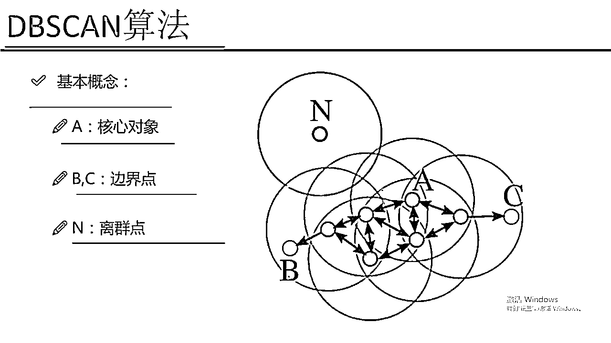

# 吹爆！2023B站公认最系统的Python金融分析与量化交易实战教程，3小时入门AI量化交易，看完还学不会你来打我！人工智能｜机器学习｜时间序列｜股票预测 - P61：4-DBSCAN聚类算法 - 人工智能博士 - BV1aP411z7sz

说完了这个K-mean算法之后，咱们刚才是不是说K-mean算法有些缺点，那这些缺点我们该怎么样克服呢，这回我给大家讲的是一个，在我们剧类算法当中我认为非常牛逼，非常强大的一个算法，叫做DBSEN。

这个DBSEN大家可能一看，它是不是基于什么东西的一个扫描，其实不是这样的，这个只是它的一个缩写，它的全称是什么，它的全称是一个这样的，就是一个基于密度的，然后带有噪声点的一个剧类的方法。

这个剧类方法它就是表达效果，一会儿会给大家展示它的一个表达效果，表达效果是非常强大的，所以说如果说你的一个任务来了，我是推荐大家就是用这个DBSEN，这个算法去做，它的一个效果肯定要比K-means。

还有一些其他剧类算法都要强，那之后我可给大家展示一个，基于实际数据集的一个对比，让大家看一下不同的剧类算法，它的一个效果的，然后咱们来说一下，就是我们的一个DBSEN，它的一个基本概念。

然后它的名字很长，就是基于密度的带有噪声的这样一个剧类，首先它给咱们定义了东西，叫做一个核心对象，核心对象是什么意思，核心对象说白了，就是说在这里，比如说我指定了一个圈，我指定了一个圈什么意思。

指定了一个圈，那么在当圈当中有一个点，那这个点在指定的一个半径，做成一个圈里边，它里边包含了很多其他的点，包含了多少个其他点，只要大于我们设置的一个罚值，比如说我设置的一个罚值是等于5个。

如果说它大于了这个罚值，也就是说以这个点，然后为原型画了这样一个圈，这个圈当中，然后的一个点的个数是多于我们设置一个罚值，我就说它是一个核心对象，那说白了，就是我的一个R领域。

它那R领域内的一个数量的一个点的个数，不小于这个meanpts，是我自己设置的这样一个阈值，这个阈值就是我的一个指标，比如说阈值设成5，那只要大于5了，它就是这样的一个核心对象，有了这样一个核心对象。

一会儿咱们就是要基于核心对象，不断的去找点，这是我的一个基本概念，有这样的一个核心对象，它的概念其实说的比较啰嗦，就是每个点的密度，达到了算法设定的阈值，说白了就是画上一个圈，这个圈里边有多少个点。

这个点的个数多于我设定的一个阈值，然后这块我们还需要设置我们的一个半径，说白了就是咱们刚才不是说以一个点为原心，然后画这样一个圈，这个圈得有这样一个半径，这个半径需要我们自己指定出来。

所以说这个DBSEN算法需要我们指定什么东西，默认有两个东西需要指定，一个就是我的一个半径值，就是我的一个R值，另外一个就是我的一个域值，就是说在这个圆内不小于多少个点。

我就说当前的一个点它是一个核心对象，这两个值需要我们自己进行一个设置的，大家现在发现一个问题，我们是不是少了哪些参数，K-mean当中需要我设置一个K值，也就是说具类你到底想聚成多少个堆。

咱们之前不是说这个K值非常难设置吗，然后这个DBSEN算法我们来看，它需要我们设置上一个K值吗，它是不需要的，也就是说当我们用这个DBSEN算法的时候，其实我们可以不去设置。

这个整个的数据当中具体能聚出来多少个堆，我们可以把这个值给它省略掉，不是省略掉，就是我们根本都不需要设置这个东西，到底它能聚成多少个堆，是由算法实际给我们聚出来的。

也就是说这个DBSEN算法要比K-means好用多了，为什么，因为我们不需要前提的指定出来，你一共设置多少个堆，因为前提指定这个问题太难了，但是它同样有个问题，就是我其他的参数设置还是一个大问题。

你半径设置大了或者半径设置小了，对结果有影响吧，你的一个min_pts这样一个个数设置大，设置小了也会产生影响吧，所以说就是DBSEN算法，虽然说我们不需要指定一个粗的个数。

但是同样有两个参数也是比较难选的，一会儿可以带给大家来看一下，然后这里还有两个概念，就是一个是直接密度可达，一个是密度可达，这个就是比较绕，咱们先说一下，直接密度可达说白了就是说，在某一个点P。

P点它是在点Q的一个R领域内，并且这个Q它是一个核心点，那我就说这个P和Q它是直接密度可达了，说白了什么，说白了就是我的一个Q点，首先它得是一个核心对象，什么叫核心对象。

它里边的一个点的个数是大于我们的min_pts，只要有这样一个点P，P点恰好在这个R领域R半径之内，然后我就说这个P点和Q点，它是直接密度可达的，然后还有一个密度可达，密度可达什么意思，密度可达就是说。

现在我有个序列了，Q0 Q1一直到Qk，然后这个Qi，其中Qi到Qi-1，它是直接密度可达的，然后我们就说，就是前而每一个，接每一个，接每一个都是一个直接密度可达的，也就是说现在我有个这样的东西。

也就是说在第一个圈当中，我有一个Q0，我的一个Q0到我的一个Q1，它是直接密度可达的，然后这个Q1我还可以画个圈，Q1在这块到我的一个Q2，它也是直接密度可达的，其实Q2和Q0的时候。

它俩就不是直接密度可达，我就说这个Q0和Q2，它是密度可达的，因为它中间连了这样一个Q1，其实相当于什么，其实相当于我们这个密度，是由Q0传播到Q2，它是有这样一个传播过程。

然后这个Q2还可以去做这样的一个Q3，那这个Q2和Q3也是直接密度可达，所以说Q0到Q3，它也是一个这样的密度可达，也就是说相当于是我画了一堆一堆的圈，然后去找这样的一个，基于我的一个直接密度可达。

然后去找这样一个密度可达，也就是一个基本的这样的一个传播过程，不断的去找的一个过程，那这个就是我的DBSCN算法，它的一个基本概念，基本概念当中概念也不多，但是需要大家指定的就是，我们的一个半径。

还有我们的一个，就是我们的一个半径，还有这样的一个minPTS，这两个指标是非常重要的，也是我们在实际用DBSCN算法，需要我们自己指定的一个参数项，然后还有几个概念，咱们再来看一下。

这些概念其实上不是那么太重要了，密度相连，密度相连就是说，从某个核心点P出发，然后这个P和这个K都是密度可达的，然后我们就说它是一个密度相连的，这个概念用的并不是很多，然后还有边界点。

边界点就是这个东西像什么，这个东西像传销就是这个意思，然后就是怎么说呢，就是比如说这个是一个，这个是一个核心对象，然后它会发展出来很多个下线，然后每一个下线它还会基于它画一个圈，然后画一个圈之后。

还会发展出来它的一些下线，那一直到某一个点，它画出一个圈，它画出一个圈之后，我算了看了一下，这个点比如说画了一个圈是这个位置，画了一个圈之后这里面没有点了，没有点是什么意思，它不能发展它的下线了吧。

所以说我就说它是一个边界点，就是这样的一个意思，这个是有一些概念的一个重复，这块这个重复了咱们不说了，还有一个噪音点，噪音点什么意思，噪音点就是说白了，咱们都是基于一种传销的方式。

然后去发展它的一堆一堆下线，那这个点假如说这个点，离所有这个点太小了，离它最近的那个点画个圈，都没办法把这个点给它圈进来，那这个点就没办法发展成它的一个下线了，所以说这个噪音点。

它就是不属于任何的一个处的，离任何处的一个，就是离任何处的一个最边界的点，它的一个距离都是大于了这样的一个R，大于这样一个半径，所以说我就把它当成是一个噪音点，任何一个核音点出发，都是密度不可达的。

都是达不到这样的一个点，它就是没办法被我们的传销抓进来的一个点，其实这个DBSC就跟我们的传销差不多，总是在发展它的一个下线，然后下线再去发展下线，把下线能发展出来下线都给它聚在一块。

这就是我的DBSCN算法做了一件什么事，来看一下吧，我的一个流程，来看一下就是它做了一件什么事吧，这里呢假如说我这个A它是一个核心对象，然后呢基于我这个A这个核心对象它要干什么。

它要首先画了最外层的一个圈吧，然后我可以把这块我画一个东西A'，然后这是一个A''，这是一个A'''A3'，然后呢它画了一个圈看了一下，这块我有三个点是落在了离A点R领域，就是R为半径的一个区域内。

然后呢我会把这个A'和A3'，都给它抓过来，都给抓过来就说它都是我的了，然后呢发展出来了这样三个下线之后，三个下线各自还是这样的为中心，还是为圈再去圈，再去圈之后又圈到了其他点吧，现在我圈到了这些点。

我说这些点都是属于我这个处的，然后呢基于最外层的点我再圈，一旦我圈到了一个B，那个这个B它是一个边界点，为什么说它边界点，以这个B为圈的时候，我就圈不到其他能发展下线了。

我看我这个以B为圈画了这样一个黄色的圈，还能圈到东西吗，除了它的一个上线就是圈不到它的一个下线了，所以我就说这个B点和我的一个C点，它是一个边界点，因为它发展不了下线了，然后其他一点呢。

其他一点都是我的一个核心对象，因为它里边值我们暂且认为都是大于这个meanpts的，它都是我的一个核心对象，在发展我的一个下线，然后呢这个n点它是个离群点，为什么离群点，因为没有人能发展到这个n。

没有一个点它画了一个圈，能圈到这个n这个点，所以我就说这个n这个点它是一个离群点，那有了这样一个离群点概念，大家可以想就是我们的DB-SCN算法，它能用来做什么，那可以做咱们的一个异常检测的问题吧。

比如说咱们的异常，咱们的一个异常，通常情况下我们的异常跟我们实际情况，发生的一个规律都是有些不同的吧，通常情况下呢，我的异常点都是离我正常点是比较远的，所以说我的DB-SCN算法。

在做异常检测的时候也是比较合适的，它可以通过这种基于传销的方式，然后帮你找出来哪些点它是一个离群点，那离群点显然基本上，就是你要找的这样的一个，就是要检测出来的一个目标吧。

你要检测出来异常检测出来一些离群，所以说这个DB-SCN算法非常适合，你在做一些异常检测，或者是离群点的一个检测的任务，那这个就是我给大家看了一下，这个在我的DB-SCN算法当中。

它的一个基本概念和印度羊长什么样，链接点离群点分别是长什么东西。

说白了就是我们这么传销去做就可以了。