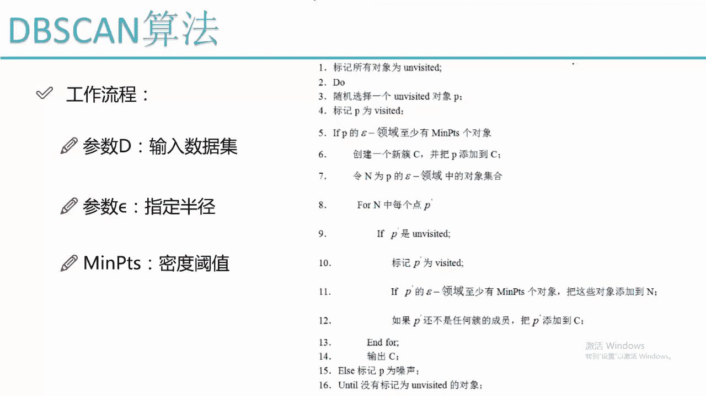
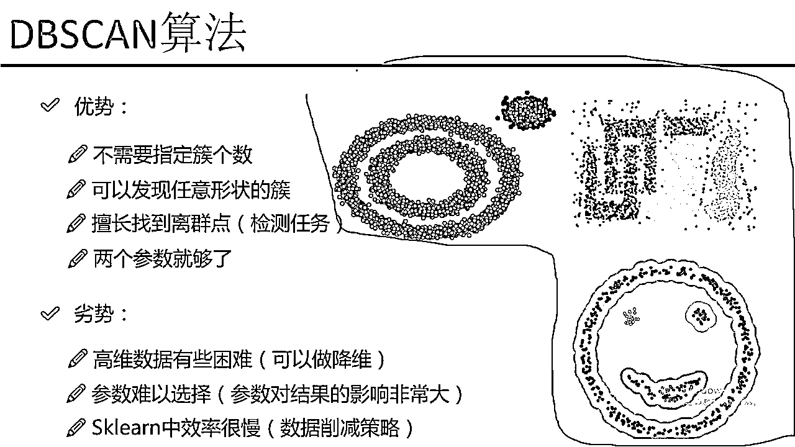

# 吹爆！2023B站公认最系统的Python金融分析与量化交易实战教程，3小时入门AI量化交易，看完还学不会你来打我！人工智能｜机器学习｜时间序列｜股票预测 - P62：5-DBSCAN工作流程 - 人工智能博士 - BV1aP411z7sz

然后我们来看一下我的整体的一个工作的流程吧，这个工作流程看起来是比较长的，其实它也不难，首先就是我们需要看一下我输入的一个参数，基本上这样三个参数就足够了，第一个参数是你的一个数据集。

这个无论什么算法都要把你的数据输进去吧，我有一个数据集需要指定，然后我还有一个参数，这个说白了就是我要指定我的一个R，就是这个DPS的测法它是G什么，我们来之前看的时候是不是说它基于画圈画圈去找点。

画圈找点发展下线，那这个圈不就是我们需要指定一个半径吗，所以说我需要指定出来这样的一个半径的一个值，然后MIM-PTS是我们的密度的一个阈值，说白了就是这样以一个圈为半径画出来的一个圆当中。

最少有多少个点它得是这样的一个有这样点，然后就可以规定它的一个核心对象，这个就是我工作流程当中需要输入的一个参数，然后我来看一下这个DPS的演算法是怎么样迭代的。

首先第一步我要把我的所有对象所有的数据拿出来之后，我都给它打上标记它是没有被访问到的，一开始所有数据都是没有被访问到的吧，这是我第一步把所有数据指定成都是一个没有访问到的，然后我做了一件什么事。

我随机的选择出来了其中的一个对象随机的选择出来一个，我给它标记成了一个visit，就是它是已经被访问到了，然后我来看就是说如果说当前这个点当前我选择的这个P点，它的一个R半径的一个领域内。

至少如果说这个点满足这样一个要求，也就是说它是一个核心对象，它这个点周围它是有一堆点的大于了，比如说我指定的这个密度的阈值是等于5的，它大于了5我说它这个核心对象吧，它是一个核心对象这个画的不太好。

大于3吧就是说大于3它有4个点，然后大于3它就是一个核心对象，这是我的一个P点，然后它周围有这样4个点，那这个时候会怎么办，这个时候我就先创建一个簇，先创建一个簇比如说是一个C吧。

然后我把当前这个点P首先来说它是我当前这个簇当中的一个点吧，C当中就有我这个P这个点了，然后我再去便利一下便利什么，便利就是我的一个对象在这个R领域它的一个集合。

在我的一个集合当中我去找这不是有4个点吗，我把这4个点先都给它拿到手，都拿手之后我们来看比如说这块是一个就是写一个ABCD4个点吧，ABCD4个点拿到之后然后我循环一下便利一下ABCD这4个点。

便利这4个点的时候我就可以来看了，就是说如果说我们在这块就是说首先，我们如果说一个点它是没有被标记的，首先就是ABCD这4个点我都用这个P来表示了，如果说ABCD这4个点是没有被标记的。

首先给它标记成它已经被访问过了，ABCD这4个点都会标必成被访问过了，然后我要看什么，然后我要看就是说ABCD这4个点还要去发展下线吧，在ABCD这4个点当中我还是去画这样4个圈。

画这样4个圈咱们来看这是一个圈，这是D点圈这是A点圈这是B点圈，圈里边还会圈到一些其他点吧，如果说我圈到了一些其他的点，并且ABCD还是4个核心对象，这个时候我就会把ABCD它4个发展到一项线。

还会继续填充到我这个N当中，也就是说我这个N是不断在扩充的，基于什么？，基于发展下线嘛，一开始P发展了4个下线ABCD，ABCD继续画圈画一圈之后还发展下线，把它所有的一个下线都放到一个N当中。

直到什么情况？，直到一个就是发展到一个下线，这个下线它不是一个核心对象了，那我就这个东西就停止了，直到ABCD比如说越发展越多，越发展下线越多，直到所有的下线都不是一个核心对象了，这个时候我们就要停了。

停的时候我们来看，我在这个N点这个N当中是不是发展出来很多下线了，发展出来多少下线呢？，发展出来多少个？，我给它放到这个C当中多少个？，也就是说我第1个错这就完事了，第1个错完事了。

我是不是第1个错当中里面是有非常非常多的东西了，发展出来了一堆的下线，这些下线我说它都是等于C1这个错的，这是我一开始选择出来了一个随机的点P，那假设说现在我编递完了C编递完了这些点之后。

然后我们是不是你看对于所有的对象来说，我还有一些没有标记的，假设说这一块有一个点Q，它是没有被标记的吧，那这一块我要就是相当于发展一个新大陆了，刚才那个传销的团伙被打掉了，C1这个错已经沟通下来了。

它已经被打掉了，然后我现在要编递的是另外一个点拿这个Q点，Q点相当于我们的一个头目，然后这个点头目没有被抓，然后他去发展另外一个下线了，在这里它还是会去圈是吧，圈完之后放到哪个错？。

它就不是放到C1那个错了，而是我要重新建立一个错，它是一个C2，在这里我会找出来所有的一个点，然后比如说如果说这个Q是核心对象，发展下线下线下线，然后继续去圈，直到圈不到为止。

再把这些所有的点能发展出来的放到我C2当中，但是注意一点就是说，如果说我的一个点是没有标记的，可能这个发展线当中有一些冲突，有一些冲突的时候我们要注意，如果说它是没标记的，我才能把它放到自己这里来。

这块就是说我这个Q又去发展出来一堆下线，然后放到了C2这个错当中，那假设说我这块还有个W，同样的道理W是最后，就是W也是没有被标记的一些点，在这里我把这个W这个点再给它进行一个，再给它进行一个换圈。

换圈之后我再去找它的一个，再去找它的一个领域，再去发展它的一堆一堆的下线，发展出来一堆一堆下线之后，我就得到了它的另外一个错C3，也就是说我这个DBS相当于什么，我就是愿意把它比喻成一个传销的东西。

一个传销就是说哪块有点没被标记，它就在哪个区域进行这样一个传销，传销完之后它把所有的一个下线都放到一起了，这样我就可以得出来最终的一个错，在这里给大家举个例子，就是有C1 C2 C3三个错。

最终三个错当中是不是都有各自的一个，就是一个代表值了，各自一个代表都有了，当我们遍历完所有的数据，所有的数据直到它都被标记成了一个被访问过了，那咱们这个事基本上就完事了吧。

咱们就把所有的错都给它拒出来了，这个就是我这个DBSN算法，从它的一个工作流程上给大家画了一下，它是怎么样去做这个事的，这个做法还是比较简单的吧，虽然这块写的挺啰嗦。

但是其实它的一个实际做法还是比较简单的，然后我们再给大家来说一下，就是关于这个DBSN，它是不是也需要指定这样一个参数，这个参数一般情况下也是比较难指定的，然后我们有一个就是，就是一个算什么。

算是公认的一个指定方法吧，咱们先来说这个半径，这个半径是最难指定的，因为这个半径，因为这个半径给大了，我可能圈的就多了，就是圈的多了，可能粗的个数就少了，半径给小了，圈的一个下限就少了。

可能粗的个数就多了，是会对我结果产生一个影响的，然后我们可以怎么做这个事，我们可以基于一个K距离去做，就是先给大家概述一下吧，比如说我数据一集当中一共是有N个点，然后P1 P2一直到Pn。

然后我可以把这个P个点都拿出来，然后我比如说我拿出来其中的一个点Pi，这个Pi这个点到我其他的一个点的一个距离，我都可以算出来吧，都给算出来之后，然后我折出来一个就是，Pi到P1的一个距离可能是第一。

Pi到P2它是一个第二，Pi到P3它是一个第三，然后一直往下去，咱们有一个这样的一个Dk，有这样一个距离，然后我可以根据这样一个距离，可能这个进行一个排序，咱们先按从头到大小进行一个排序。

第一第二第三按照大小进行排序，可能就是第一是等于0。1，第二是等于0。11，第三等于0。12，假设说突然有个突变点，第四等于什么，第四等于0。3了，那这个时候我们来看，就是第二和第一。

第三和第二之间的差异比较小吧，但是一旦这个第四和这个第三，咱们还是按顺序进行排的，第四和第三差异非常大，后面可能都是0。31 0。32，这个差异非常大吧，如果说我们找到了这样的一个突变。

找到了这样一个突变点之后，我们就可以根据这样的一个突变点，划这样一下，我们可以认为前面的这样一个距离，它是比较合适的，所以说可以指定出来我的一个R的半径，比如说等于一个0。12，找出来这样的一个突变点。

那后面我们还可以找这样一个突变点，就是基于这种方式，我们可以找出来，中间的一个突变点是什么样的位置，基于这样的一个突变点，剧情这样的一个距离的划分也是可以的，可以指定这样一个K距离，去找这样一个突变点。

然后算这样的一个半径，其实一般情况下，我们一般情况下我是怎么算，我也有时候懒得去找这个东西，基本大概试一试，然后大概试一试，然后咱们通过这样一个观察，这种东西虽然说是一种可取的方式。

但是也是需要你做大量实验来去观察的，很难一次性的把这些值都选准，选准这个值基本上是非常非常难的一件事，meanpts这个就是SKlearn当中给我们的一个建议，就是一般情况下。

就是我们让它的这个距离稍微小一些，稍微小一些4，5，10，这些比较小的值是比较合适的，这就是我们的两个参数。

一个半径还有这样一个点的个数。

相当于是这样的一个密度，这两个值一般情况下都是偏小一些的，然后我们来看一下就是dbse它的一个效果，右边的这个图当中，就是我列出来了三个dbse剧类完的一个结果，我们可以看就是说之前我说有一种粗。

让这个k-means剧类完之后，它是不是说左边是一个粗，右边又是一个粗了，这是k-means的一个效果，但是我这个基于密度的这样dbse设法，它会怎么样，它会把这个里圈和外圈分别给它识别出来，为什么。

其实在里圈有个点它为什么，一个点一个点慢慢发展下线，因为里圈跟外圈有一个距离，所以说里圈不会把外圈发展成下线，而是里圈会把这个里圈的所有的i这点，都发展成一个下线，这样里圈的点不就单独成一个粗了吗。

然后外圈的点不就又单独成一个粗了吗，所以说这个就是基于密度剧类的一个好处，它可以帮我们发现出来，就是更多的就是不论是更多的粗，就是帮我们发现出来任意类型的粗，只要这个粗它是有一点规律可循的。

它就可以把这个粗给它发现出来，然后右边就更神了，右边就是说对于这样一种非常奇怪类型粗，它还是能够给它发现出来，如果说你K-means怎么算，K-means那显然就是上面是一堆，下面是一堆的。

但是对于我们的DBSA，它还会是把我这个堆给它实际的，就是实际的可以找出来，因为它是基于密度的，只要密度它是能，就是这些点是聚在一起的，只要中间出现一些空白，这些点都聚在一起的，它就会按照发展下线。

直接给它都发展过来，这就是我基于密度的一个剧类，然后它有什么，它能帮我发现出来一些离群点，比如说我们来看这些点，这些点它都是一些离群点，因为它离哪个粗，它都没办法给它发展成一个下线。

所以说我就说这就是一堆我的离群点了，这些离群点我们也可以单独给它拿出来，然后这个DBSA在我的SKlearn当中，它有离群点的一个标记，它会指定一个粗是一个-1，-1就是正常粗都是0，1，2，3。

开始的然后一个粗建立，-1表什么，-1在SKlearn当中就表示这样的一个离群点，它会把所有这样一些离群点，放到-1这个粗当中，当成是一个离群点的一个粗，然后下面是这样一个笑点，这个笑点也是一样的。

就是我们的DBSA我们来看，当它去做这样的一个剧类的时候，还是会把咱们的一个点都拿出来，这个就是我DBSA它算法的一个优势了，咱们来看一下它这个优势都有什么，第一点是非常重要的。

就是我们不需要自己指定粗的一个个数，因为我们很难知道这个粗个数，到底是多少是合适的，它自己去找，基于密度自己去找，找出来多少个算多少个，这就是我们的优势，不需要我们自己指定我的一个粗的个数。

然后它DNA有点什么，它是可以通过这三个图大家看出来了，我们是可以发现任意类型的一个粗，什么样类型的粗，我都是可以给它发现出来的，然后它可以作用于我们检测任务，对于离群点我们都可以找出来。

它是-1那个粗，可以应用于我的一个检测的一个任务，然后它是一个参数，两个参数就够了，参数还是比较少的，然后这是它的一个优势，优势说完了，咱们再来说一些劣势吧，劣势就是说。

DBSA对高维的数据做起来有些困难，因为就是我拿SKLearn去做的时候发现了，如果说你数据维度特别高的情况下，它的一个效率是非常低的，而且速度非常慢，因为SKLearn当中具体怎么实现的。

基于什么样的一种算法，我还没看过它的一个原码，但是我做一个实验，就是如果说你的数据量是非常大，并且维度很多，它百分百会报这样一个错误，就是一个内存溢出了，如果说就是相同的数据，你放到K-means。

或者说放到一个Meanshift，或者是放到一个Bursh，或者是一些其他区域的算法当中，它的一个结果都不会报这个溢存溢出，但是如果你DBSA这个数据量比较大，它会报这样一个错误，所以说一般情况下。

我们是可以先做这样一个降维的参数，参数选择还是比较难的，刚才说过了参数确实难，SKLearn当中确实有这样一个问题，因为我现在也是遇到这样一个问题，就是如果说你的数据量太大了，没办法整体的传进去。

那怎么办呢，我们可以做这样一个数据的一个消减策略，比如说在这个我们可以看，就是说哪些数据有一些数据，它可能就是指标是差不多的，我们可以给它消一消，就像我们去剪头的时候，我给它说给我打包打包。

就是在相同位置给它消一消一部分，我们有一些数据消减策略，这个消减策略的方法还是很多的，我之前在做一个遗伤检测任务的时候，也是用了这样一个数据消减的一个策略的，那这个就是我的一个DBSA的算法。

它从整体上做了一件什么事，我们来看它的效果还是不错的吧，所以说刚才为大家推荐了，就是当我们用剧烈的时候，最好用这个DBSA，因为它的效果要比K-MISS强得多了，尤其是在你的一个数据。

它是比较不规则的情况下，这个时候我们的DBSA算法。

它的效果要好得多了。