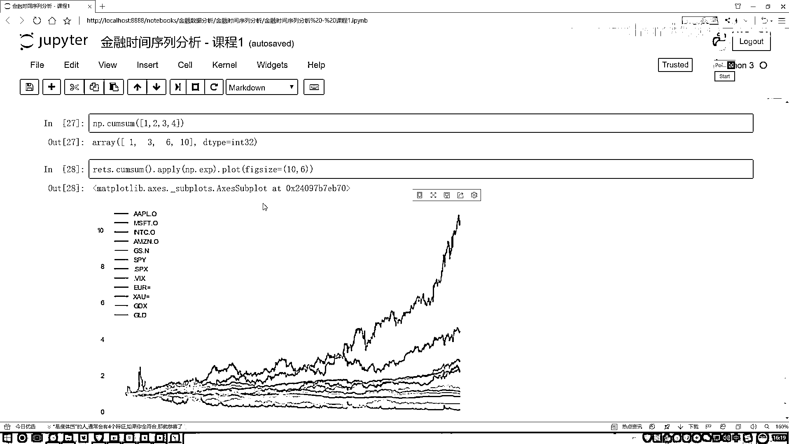

# 吹爆！2023B站公认最系统的Python金融分析与量化交易实战教程，3小时入门AI量化交易，看完还学不会你来打我！人工智能｜机器学习｜时间序列｜股票预测 - P7：1-连续指标变化情况分析 - 人工智能博士 - BV1aP411z7sz

那我问大家一件事，这个平均结果啊，我可不可以做一些加法的操作呢？，你看这里，现在我们观察的是什么？，是一个平均结果，相当于一个从整体上来看，这样一个结果，是不是？。

那我能不能对一个连续时间算它的一个增长率呢？，什么叫一个连续时间算它的一个增长率啊？，我给大家举个例子，比如说这样，我现在有一只股票，现在这个股票是100块钱，可以吧？。

比如说我写个第一天的价格是100块钱，然后呢，第二天，第二天它跌了，跌成50块钱，行吧？，那你说，对于这个两天来说，对于这两天来说啊，我的一个增长率是多少？，那是不是说用50减去一个100，再比什么？。

再比上一个100，是吧？，那我用一个负的50减去比上一个100，是不是？，那好，第三天，第三天这个东西啊，如果它涨了，涨到一个75，那你说第三天来说，那是不是用第三天减第二天的啊？。

那它就是一个75减去一个50，再比谁？，再比上一个50吧，那咱们来看一下，对于当前这个结果来说，哎，你看啊，之前我们大家想就是增长率这个东西，我能不能把各个指标增长率，就是把咱整个这个序列啊。

我算出来这个增长率，然后一个加到一起，我当做最终的一个总的增长率啊，哎，我能不能这么去算啊？，大家感觉好像没什么不行的啊，增长率加呗，加完之后算完就总的增长率，总的增长率反向整体，行不行？。

好像来说够呛，总的增长率不是反向整体，是反向第一天和最后一天，它们的一个结果，那能加吗？，再加试试吧，你看这个加法一旦做完之后，这等于什么？，这等于一个负0。25，是不是？，这等于什么？。

这等于一个正0。25，加一起怎么样？，等于0，一旦看到0，咱们可能觉着，哎呦，从第一天到第三天，中间隔了两天，隔完之后呢，我算了一个累加的增长率等于0，那就说明我这个股票，那就是没跌，它也没涨，但是呢。

我们来观察一下，原始多少？，100，现在多少？，奇数，跌没跌啊？，跌了吧，所以说对于这个增长率来说，能做加法吗？，那这一回，那大家可能想，哎呦，那我现在一个连续时间的序列，如果说我想做一些累加操作。

我们该怎么办呢？，那对于连续的计算，我们需要借助上一个数学公式，就是一个对数，给大家举例说明一下吧，咱们实际当中是怎么算的，这里我们用对数，对数当中呢，比如说，我们的后一天数据，在比上前一天数据。

那比如说，刚才咱们不是说了，第一天是100，第二天是50，第三天是175嘛，那就是这里，我们后一天，那就是一个50，比上一个100是吧，然后呢，再加上什么，再加上一个第二天的，不是第二天的。

就是下一个序列的，下一个序列就是一个75，那比上一个50，是不是就可以了，那这回咱们来看啊，之前咱们不是说了吗，我这样一个连续的一个增长率，反的是什么，那第一天和最后一天的结果之间。

做了什么样的一个差异吧，那怎么样描述出来这个指标呢？，你看这个对数当中，如果说，咱都以1为底可以吧，都以1为底的时候，那对数的加法，那等于什么，等于对数当中里边的一个乘法吧，那就是50比上一个100。

再乘上一个75，比上一个50，等于什么，等于对数当中75，比上一个100，相当于什么，最后一天的，跟第一天之间一比，他们之间的一个差异，是有多大吧，是不是这样一个指标，我们给它计算出来了。

那其实这个指标，你形象点说什么意思呢，就说比如说股票，股票一开始10块钱，然后呢，10块钱完之后啊，然后他经过了好多次，就是时间序列，然后有涨的有跌的，有涨的有跌的，你把各个值，把各个这个增长率。

给它用对数，然后累加一起，最后相当于什么，那不就相当于最后一天，跟第一天的一个结果之间的一个差异了吗，那这个的意思就相当于，你第一天股价这个钱，相当于最后一天，它是多少钱，说白了就是。

一开始股价的一块钱，10年股价的一块钱，相当于最后一天，股价是多少钱了，大概是这样一个意思，为大家写一下，就是咱们的一个计算方法，好了这块我们计算一下连续时间，在这块我们来计算一下吧。

这个计算好像没有什么特别公式，我们自己去写一下，首先呢，我们来写就是data，比上什么，比上他的一个前一天的吧，前一天数据，咱怎么样能得到啊，这个问题来了，前一天数据怎么得到，data当中。

我说我把这个数据啊，要是你看这里，如果说这个数据，要是每一天啊都能往前滚一下，就是这样，一开始是这个位置，我说给他都往上移这么一格，把他移上去一下，那当前这一天的，是不是就变成前一天的了。

是不是这样一个意思啊，我要把它往上移一格，是不是就行了呀，那怎么移这一格呢，不用担心了，有这样一个函数，来帮我去做，点shift一下，shift当中，你可以去选啊，以几格，比如说这样吧。

我先以一格给大家看一看，你看啊，这个1月5号，来看看这个1月5号，他现在是30。572是吧，来看，1月5号30。572，30。572其实是谁，其实是1月4号的吧，所以说我们现在这个1月5号的。

是不是就表示的是前一天的数据了，那比如说现在我们有一个data，我们还有一个data，点shift完的，你看这个data，我这个鼠标，data，data shift完的，shift就是一个1的。

那你说我怎么计算，我这两天之间的一个差异啊，哎这是正常的数据，这数据都往前回滚了一格，我做一个减法，是不是就直接得到了，数据两天之间的一个差异的结果啊，所以说我们的做法还是挺简单的。

这里咱们只用data，我们的当天数据比上什么，比上他前一天的数据，是不是就行了，然后呢，咱们之前说了，哎这块我们要怎么办，是不是你得给我引入一个对数啊，来表示当前结果啊，好了再指定个returns。

等于当前我做的这样一个结果，然后呢把这个结果展示一下吧，这个结果先执行一下，执行完之后，然后给他点hide一下，好了这个结果已经显示出来了，我还是点run一下，然后只保留其中几位，行这我们是算出来了。

当前我们的一个什么，连续的啊一个增长率吧，说白了就是第一天跟后面每一天的，我都能算出来，有第一天的价格啊，就第一天是一块钱，相当于第八天是多少钱呢，相当于第三十天是多少钱呢，各个指标值咱是不是全有了。

那其实现在还没全有，现在我们只是算了一个中间结果是吧，我们还差一步还差一步差什么，我们没有把这个结果给还原回去吧，我们只算了一下，这个连续的一个增长率，它的变化情况吧，那你说怎么样给它还原回去啊。

咱们实际上是不是在这里，我刚才还看了一下，我们有一个要求，要干什么来着，我要统计啊，看各指标最初的一块钱，相当于比如说10年的一块钱，相当于11年多少钱，相当于12年多少钱。

相当于13年14年18年多少钱，对于某一个股票来说，我是不是要把这个结果，给它算出来啊，那怎么样统计这样一个指标啊，那比如是这样我要画一个图，我画一个图可能是这样啊，就在这个图当中。

那比如说这里我就画那个，那个微软的股价吧，微软股价，那在这个10年的时候啊，它这是一块钱是吧，就假设它是一个单位块钱，然后呢我要知道这一块钱，相当于11年的，比如相当于11年的2块3。

然后相当于12年的4块2，然后一直点点点点点点变化，相当于比如说19年或者是20年，咱这数据没有20年，咱数据就到18年，我想看一看，它相当于18年多少钱，是不是也是股票的一个走势啊。

或者相当于我手里有个股票，我这么多年翻了多少番儿吧，咱是不是要观察这样一个指标值啊，对实验学家来说挺常统，就是经常会统计的一个值吧，怎么做，怎么做这件事啊，第一步那你说我现在，哎在统计过程当中。

那你说这个，11年的时候，你看我现在有这个10年，11年12年13年，我就写14年得了，那对于10年来说呀，它是不是得把前面的值都加在一起呀，是不是，那对于12年来说呢，12年来说它得把10。

11和12的都加到一起吧，做一个加法操作吧，咱之前说了对数做加法，相当于我直接得到，和最后的一个关系吧，是不是这样一件事，那13年呢，13年这里我颜色都快花没了，13年这里是不是要算它们的。

然后最后一个红色的14年，要算这样一个值啊，这是什么累加吧，那这件事怎么去做啊，怎么做，其实有个函数给大家来简单来看一下，这个函数叫numpy。consum一下，consum当中给大家举个例子。

比如说1234吧，我看这个总和它不错了，对type，这块我应该传一个去列，传一个list，list当中1234可以吧，你看它有返回什么，1360，1是什么，第一个值，2呢，第二个位置为什么3啊。

1+2=3吧，第三个位置为什么是6啊，1+2+3=6吧，在做的过程当中，是不是也是借助于这种consum的方法来去做啊，那对谁做操作啊，这一块都给大家列出来了，这numpy各个就是根据时间去列。

我各个地方的值，咱是不是全有啊，把它们干什么，做累加不就得了吗，好了把这个结果拿过来，对这个结果做什么，做一个consum操作，是不是就行了，对它只用consum操作，这个结果我为了咱能实际做计算。

引入了数学上的一个公式，叫做一个对数是不是，那现在你是不是讲到底，你得给我还原回去了，还原回去怎么办，咱得给它怎么样，做一个numpy。e的多少次密吧，这是exp表示e，咱之前默认numpy。log。

就是以e为底的，所以说此时当我在执行的时候，。opr操作咱之前讲那个pandas基础的时候，我说过了，每个都只用上操作嘛，咱还原啊，还完之后呢我顺便把这个图给大家画出来吧，这个图然后它等于一个16的。

然后咱执行一下，看一下这个图的结果，你看是不是像我刚才说的，最开始，这块e也不是相当于一块钱，就相当于一个单位吧，其实对股票来说你就当做一块钱吧，一块钱相当于11年多少钱，相当于12年多少钱。

13 14 15 16 17 18，是不是全有了，我看最猛的是谁，最猛的是亚马逊这个是吧，之前它10年的一块钱，现在已经能相当于什么了，10块钱了吧，咱是基于什么连续的一个增长率来去做计算的吧。

然后你看下面了，第二个是苹果的是吧，苹果的大概是4块多，是吧这是大概翻了多少番，这个意思，那你要拿那个茅台来说可能翻的更多，行了这是给大家看了一下，对于我们的金融时间序列来说，我们能统计的值其实挺多的。

在这里是给大家列出来了一些经典的，不是说经典吧，就是常用的一个操作，我们怎么样计算一个差异值，点difference一下，非常容易吧差异值我就算出来了，第二点的增长率，增长率像我刚才说的一个差异值。

可能有很多时候都是没什么价值的，多了少了一块，对于不同任务来说，对于不同的指标来说，这一代到底代表什么不好说吧，好了我们提到一个增长率，后一个值减前一个值再比上前一个值，很简单吧。

然后给大家绘图画了一下也比较直接，然后呢我又说了一下，增长率这个东西你算平均的行，但是你不能够算一个累加吧，因为累加在一起它是没有意义的吧，所以给大家举了一个例子，那如果说我想算这个累加呢。

我想算就是第一天，相当于后面几天的多少倍，再相对后面几天的多少倍怎么算呢，是不是一个延续时间增长率啊，我们引入了数学任务方法，做什么啊，做一个对数吧，不要忘记对数这块你做完之后。

如果你想还原到实际的数值，是不是得再给它还原回去啊，有这样一件事吧，最后咱统计了一下，当初最早的一块钱，相当于现在多少块钱，是不是加算了一万块钱相当于多少，有比较强的公司相当于十几块钱。

其他的其实走势都挺高的，但是呢也有一些指标，可能是下降的，可能保持不变的吧，反正就是当初你要买这些股票的人，基本上都发了，是不是这个意思啊，好现在大家看了一下，就是我们对这个金融实验序列当中。

一些序列的我们的计算操作，都该怎么样去在Pandas还有南北当中实现出来，其实说白了就是用这些工具包。

帮我们去做事情。

