# 吹爆！2023B站公认最系统的Python金融分析与量化交易实战教程，3小时入门AI量化交易，看完还学不会你来打我！人工智能｜机器学习｜时间序列｜股票预测 - P7：1-连续指标变化情况分析 - 人工智能博士 - BV1aP411z7sz

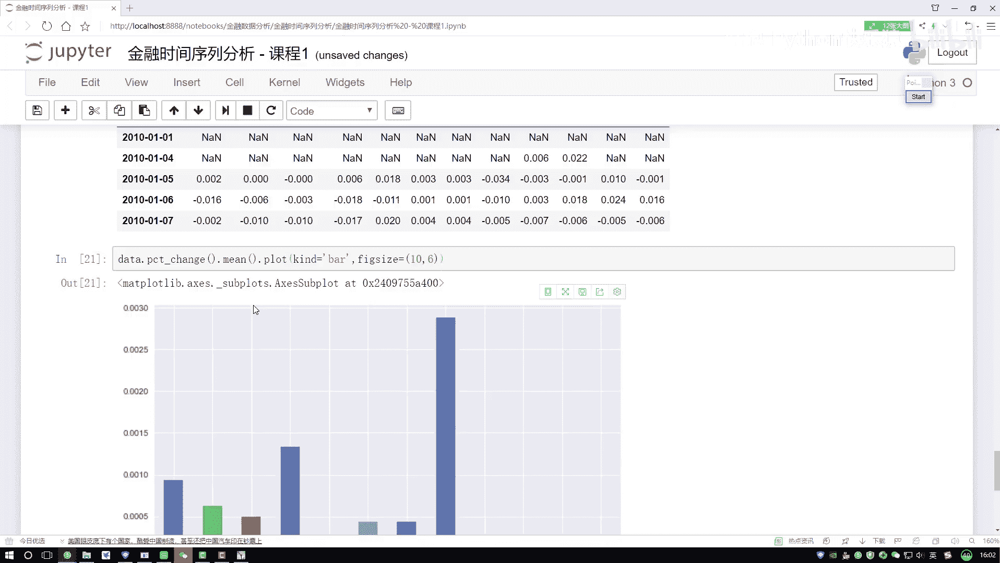

那我问大家一件事儿，诶这个平均结果啊，我可不可以做一些加法的操作呢。

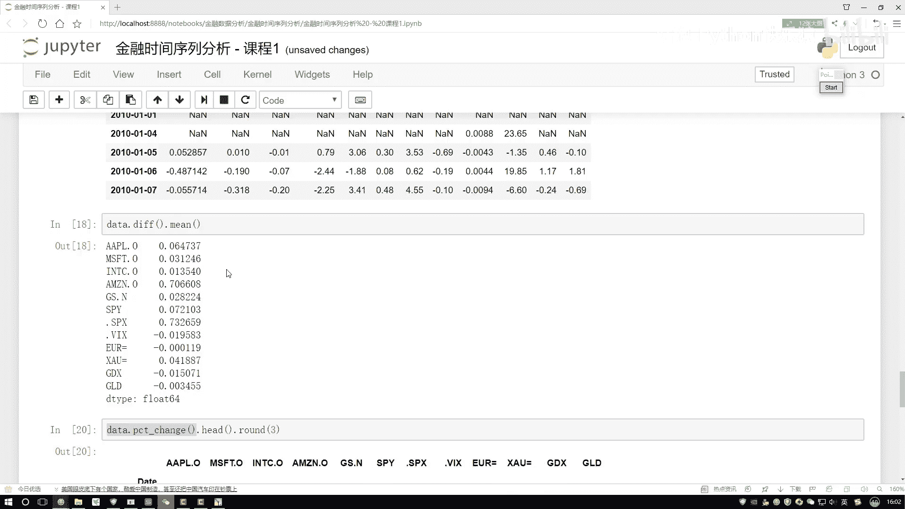

你看这点，现在我们观察什么啊，是一个平均结果，那相当于一个从整体上来看啊，这样一个结果是不是，那我能不能对一个连续时间，算它的一个增长率呢，什么叫一个连续时间算它的一个增长率啊，给大家举个例子。

比如说这样，比如这样，现在我有一只，我现在我有一只股票啊，现在这个股票是100块钱，可以吧啊，比如说我我写个第一天价格是100块钱，然后呢第二天第二天啊，他这个跌了啊，跌成个50块钱行吧。

那你说啊对于这个两天来说，对于这两天来说呀，我的一个增长率是多少，那是不是说用50唉减去一个100，再比什么，再比上一个100是吧，那就是负的50啊，减去比上一个100是不是那好。

第三天第三天这个东西啊，如果它涨了，涨到一个奇数，那你说第三天来说，那是不是用第三天减第二天的呀，那它就是一个75，减去一个50，再比谁再比上一个50吧，那咱们来看一下对于当前这个结构来说，唉你看啊。

之前我们大家想就是增长率这个东西，我能不能把各个指标增长率，就是把咱整个这个序列啊，我算出来这个增长率，然后一个加到一起，我当做最终的一个总的增长率啊，哎我能不能这么去算啊，大家感觉好像没什么不行的呀。

增长率加呗，加完之后算完就总增长率，总增长率反个整体行不行，好像来说够呛啊，总总这样就不是反应，他们的一个结果，那能加吗，再加试试吧，你看这个加法一旦做完之后，咱等于什么，这等于一个-0。5，是不是。

这等于什么，这等于一个正0。5+1起怎么样等于零，一旦看到零，咱不能觉着唉哟，从第一天到第三天，中间隔了两天，改完之后呢，我算了一个累加的增长率等于D2，那就说明我这个股票那就是没跌，它也没涨。

但是呢我们来观察一下原始多少100，跌了吧，所以说对于这个增长率来说，能做加法吗，不能做吧，那这一回那大家可能想哎哟，那我现在一个连续时间的序列，如果说我想做一些累加操作。

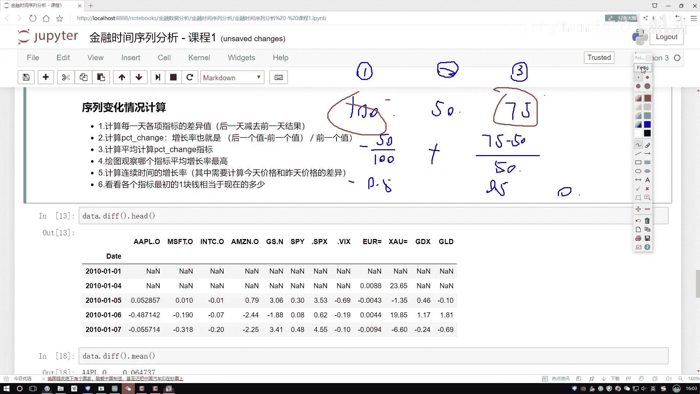

我们该怎么办呢，那对于连续计算，我们需要借助上一个数学公式啊，就是一个对数给大家举例说明一下吧，咱们实际当中是怎么算的，这题啊，我们用对数对数当中呢，比如说啊我们的后一天数据再比上前一天数据。

那比如说刚才咱们不是说了，第一天是100，第二天是50，第三天是一个75吗，那就是这里诶我们后一天那就是一个50，比上一个100是吧，然后呢再加什么，再加上一个第二天的，这不是第二天的。

就是下一个序列的，下一个序列就是一个75，那比上一个50是不是就可以了，那这回咱们来看啊，之前咱不是说了吗，我这样一个连续的一个增长率反了什么，那第一天和最后一天的结果之间，做了什么样的一个差异吧。

那怎么样描述出来这个指标呢，你看好这个对数当中，如果说咱都以E为底，可以八都E为底的时候，那对住了加法，那等于什么，等于对数当中里边的一个乘法吧，那就是50比上一个100，再乘上一个75。

比上一个50等于什么，等于对数当中75比上一个100相当于什么，最后一天的跟第一天之间一比，它们之间的一个差异是有多大吧，是不是这样一个指标，我们给它计算出来了，那其实这个指标你形象点说什么意思呢。

就是说比如说股票，股票一开始是十块钱，然后呢十块钱完之后啊，然后他经过了好多次就是时间序列，然后有涨的，有跌的，有涨的有跌的，你把各个值，把各个这个增长率来给它用对数老累加一起，最后相当于什么。

那不就相当于最后一天跟第一天的一个结果，之间的一个差异了吗，那这个的意思就相当于你第一天股价，这个钱相当于最后一天它是多少钱啊，说白了就是一开始股价的一块钱，110年股价的一块钱。

相当于最后一天股价是多少钱了啊，大概是这样一个意思啊，为大家写一下。

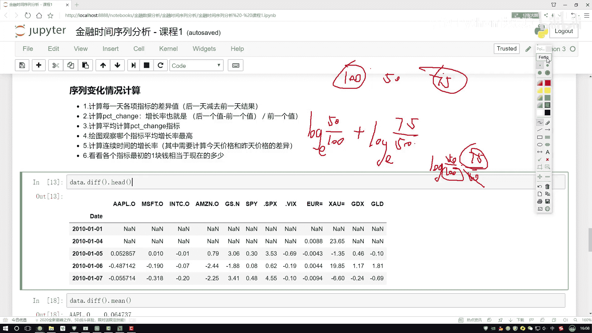

就是咱们的一个计算方法好了，这块我们计算一下连续时间啊。

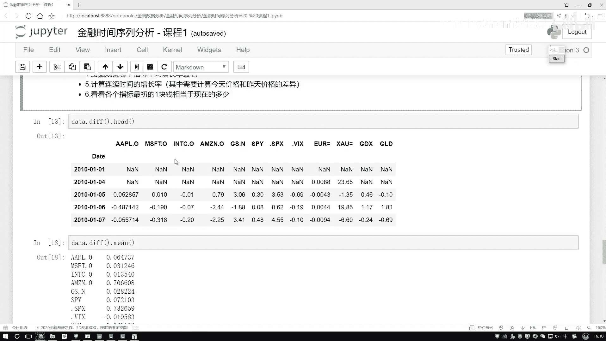

呃在这块我们来计算一下吧，这个计算呃好像没有什么特别公式，我们自己去写一下，首先呢我们来写就是data比上什么，比上它的一个前一天的吧，哎呦这个前一天数据咱怎么样能得到啊，哎这个问题来了。

前一天数据怎么得到data当中，我说我把这个数据啊，要是你看这里，如果说这个数据要是每一天啊都能往前滚一下，就是这样，一开始是这个位置，我说给他都往上移这么一格，把它移上去一下。

那当前这一天的是不是就变成前一天的了，是不是这样一个意思啊，我想把它往上移一格，是不是就行了呀，那怎么移这一格呢，嘿不用担心了，有这样一个函数来帮我去做A点shift一下，shift当中啊。

你可以去选哦，以及格，比如说这样吧，我先移一格给大家看一看。

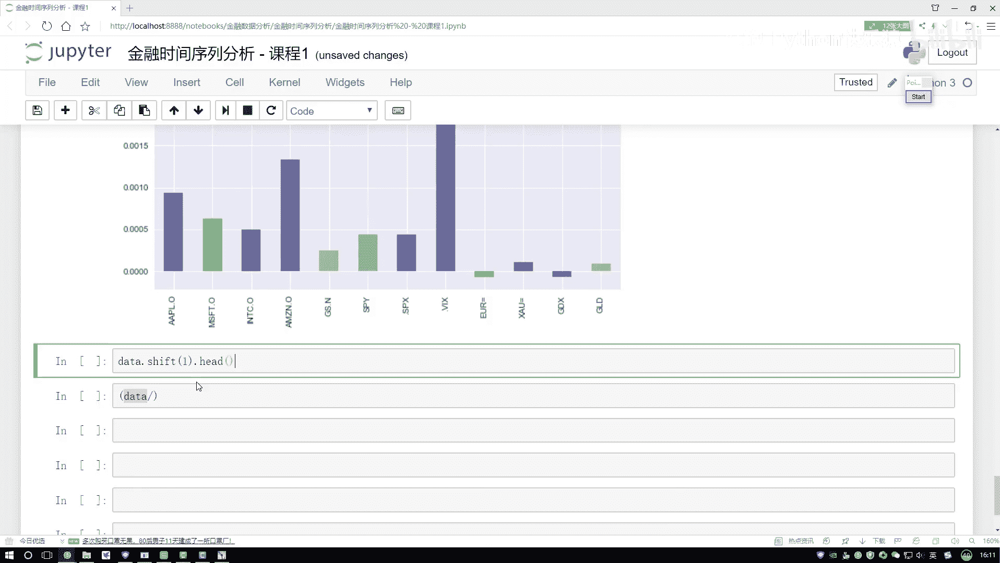

你看啊，这个月5号来看看，这个月5号他现在是30。572是吧，来看1月5号30点572，30。572，其实是谁，其实是1月4号的吧，所以说我们现在这个1月5号的，是不是就表示的是前一天的数据了。

那比如说现在我们有一个data，我们还有一个data点shift玩的啊，你看这个data点哦，这个鼠标有有data点shift完的shift就是一个一的，那你说我怎么计算我这两天之间的一个差异啊。

哎这是正常的数据，这数据都往前回滚了一格，我做一个减法，是不是就直接得到了数据，两天之间的一个差异的结果啊，啊所以说我们的做法还是挺简单的，这里咱们只用data啊，我们的当天数据比上什么。

比上他前一天的数据是不是就行了，然后呢咱们之前说了诶这块我们要怎么办，是不是你得给我引入一个对数啊，来表示当前结果啊，好了再指定个returns，等于当前我做的这样一个结果，然后呢把这个结果展示一下吧。

啊这个结果现在执行一下，执行完之后，然后给他点还得下好了。

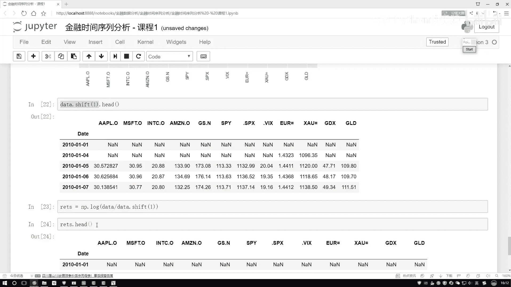

这个结果已经显示出来了哦，还是点弄得一下，然后只保留其中几位行，这我们是算出来了，当前我们的一个什么连续的啊。

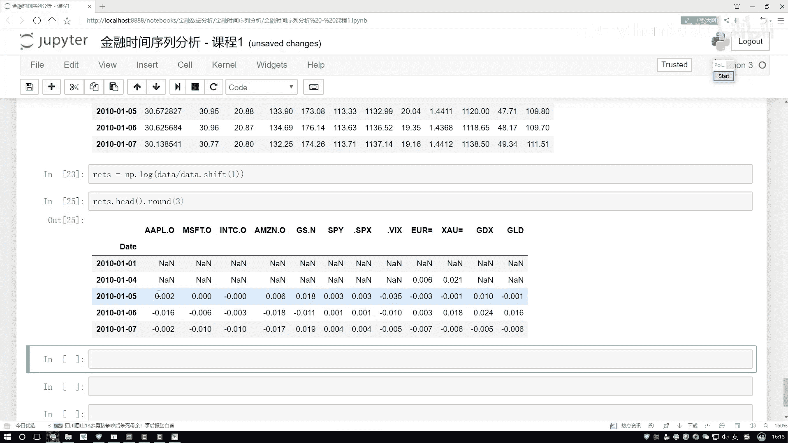

一个增长率吧，说白了就是第一天跟后面每一天的。

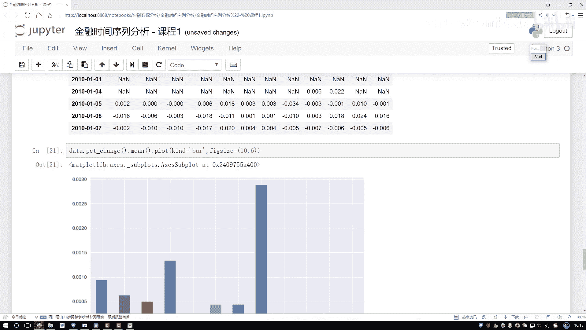

我都能算出来有第一天的价格啊，就第一天是一块钱。

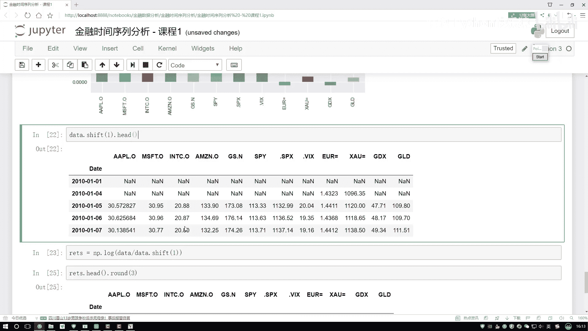

相当于第八天是多少钱呢，相当于第30天是多少钱呢，各个指标值咱是不是全全有了，那其实现在还没全有，现在我们只是算了一个中间结果是吧，我们还差一步还差一步差什么，我们没有把这个结果也还原回去吧。

我们只算了一下这个连续的一个增长率。

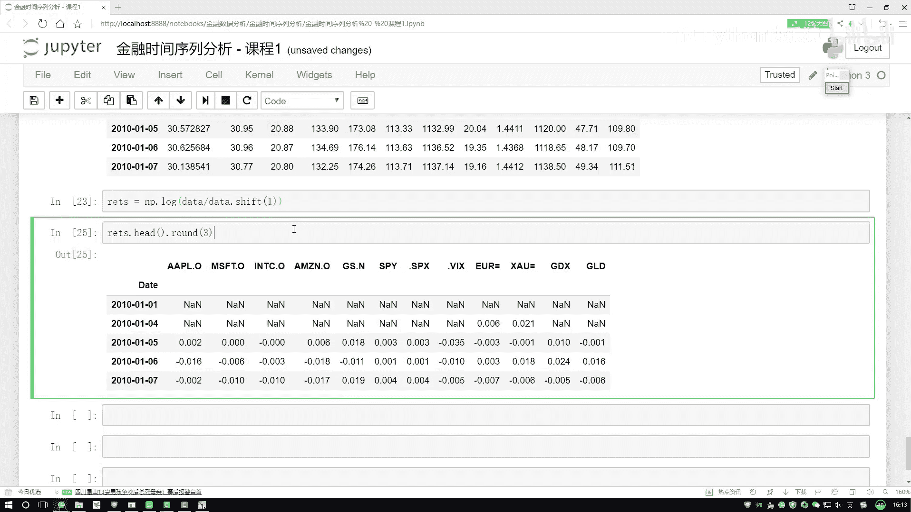

它的变化情况吧，那你说怎么样给它还原回去啊。

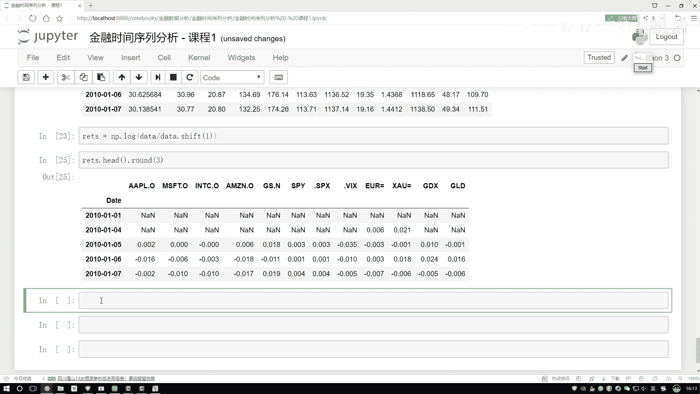

但实际上是不是在这里诶，我刚才还看了一下，我们有一个要求要干什么来着。

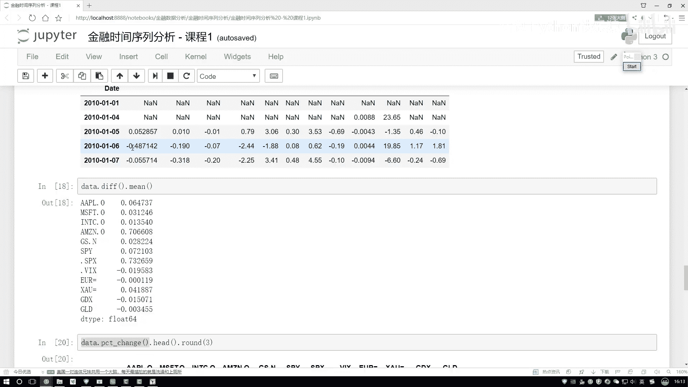

我要统计啊，看各个指标最初的一块钱相当于，比如说10年的一块钱，相当于一年多少钱，相当于12年多少钱，相当于13年一四年一八年多少钱。

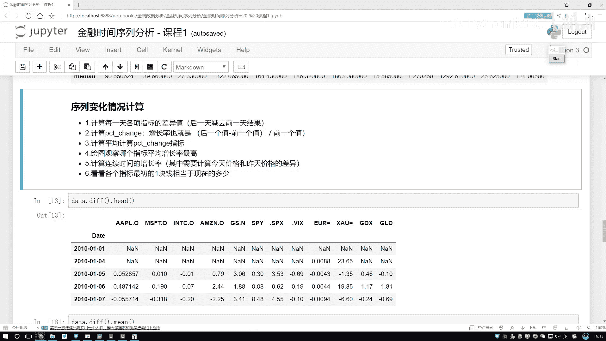

对于某一个股票来说，我是不是要把这个结果给他算出来啊。

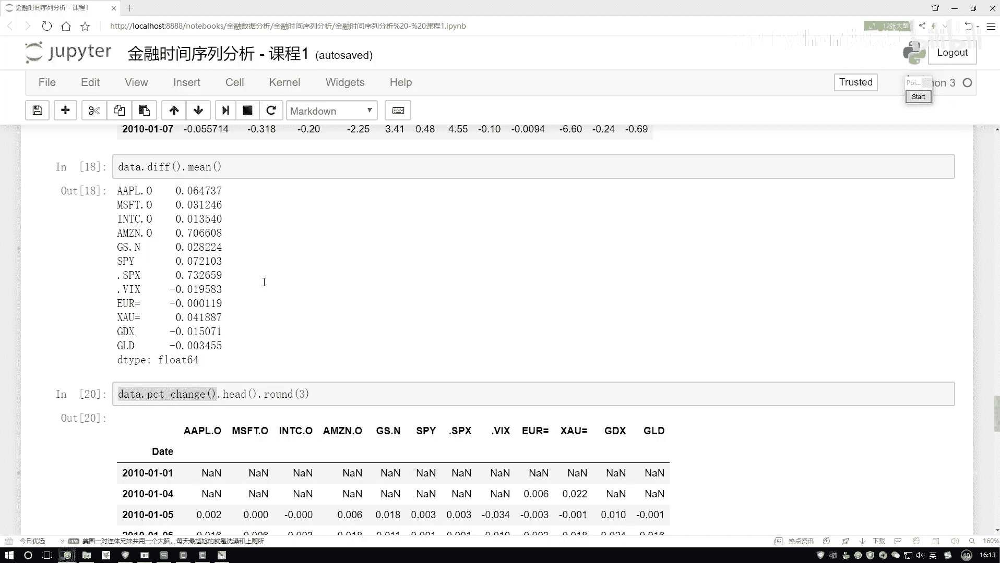

那怎么样统计这样一个指标啊，那比如说这样我要画一个图，我画一个图可能是这样啊，啊就在这个图当中，那比如说呃，这里我就画那个那个那个微软的股价吧，微软股价，那在这个10年的时候啊，他是一块钱是吧。

就假设它是一个单位块钱，然后呢我要知道这一块钱相当于11年的啊，比如相当于一年的两块三，然后相当于12年的四块二，然后一直点儿点儿点儿点儿点儿一变化，相当于比如说19年或者是20年，咱这数据没有。

20年，咱数据就到18年，我想看一看它相当于18年多少钱，是不是也是股票的一个走势啊，或者相当于我手里的股票。

我这么多年翻了多少分吧，咱是不是要观察这样一个指标值啊。

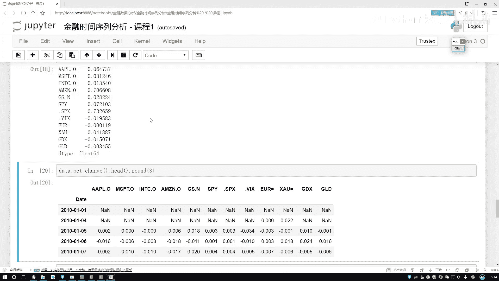

对实验学校来说挺长筒，就是经常有统计的一个值吧，怎么做怎么做这件事啊。

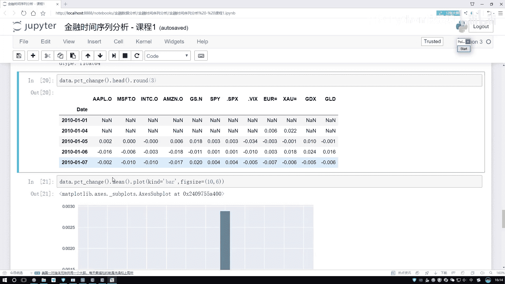

第一步，那你说我现在还在统计过程当中，那你说这个一年的时候，你看我现在我有这个10年，11年，12年，13年，我就写14年得了，那对于10年来说呀，他是不是得把前面的值都加在一起呀。

是不是那对于12年来说呢，12年来说，他得把1011和一二的都加到一起吧，哎一个做一个加法操作吧，咱之前说了对数做加法，相当于我直接得到第一个和最后的一个关系吧，是不是这样一件事，那13年呢。

13年这里我就可以颜色都快化没了，13年这里是不是算他们的，然后最后一个红色的14年要算这样一个值啊，这是什么累加吧，那这件事怎么去做啊，怎么做，其实有函数给大家简单来看一下。

这个函数叫NP点com sum，下com sum当中给大家举个例子。

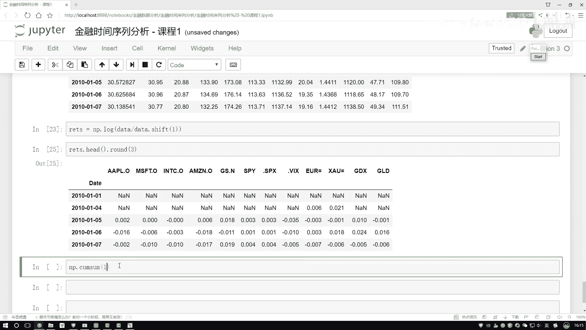

比如说1234吧，咱先来看结果，我看这个总和他有报错了哦。

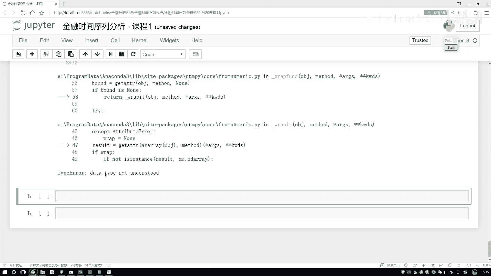

对type哦，这块我先传一个序列啊，传一个list，历史当中1234可以吧，你看它会返回什么136 11，什么第一个值二呢，在第二位置为什么三啊，1+2=3吧，第三个位置为什么是六啊。

1+2加三等于六吧，第四个位置为什么11+2加3+4=10吧，好了函数给大家列出来了，那你说咱一会儿在做的过程当中，是不是也是借借助于这种CONSUM的方法。

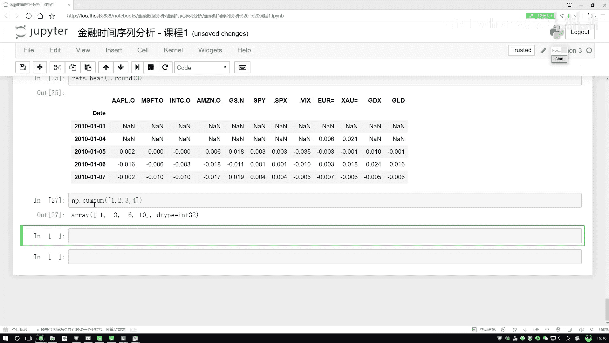

来去做呀，那对谁做操作这块给他列出来了，这南派个个就是跟其余时间序列，诶，我各个地方的值咱是不是全有啊。

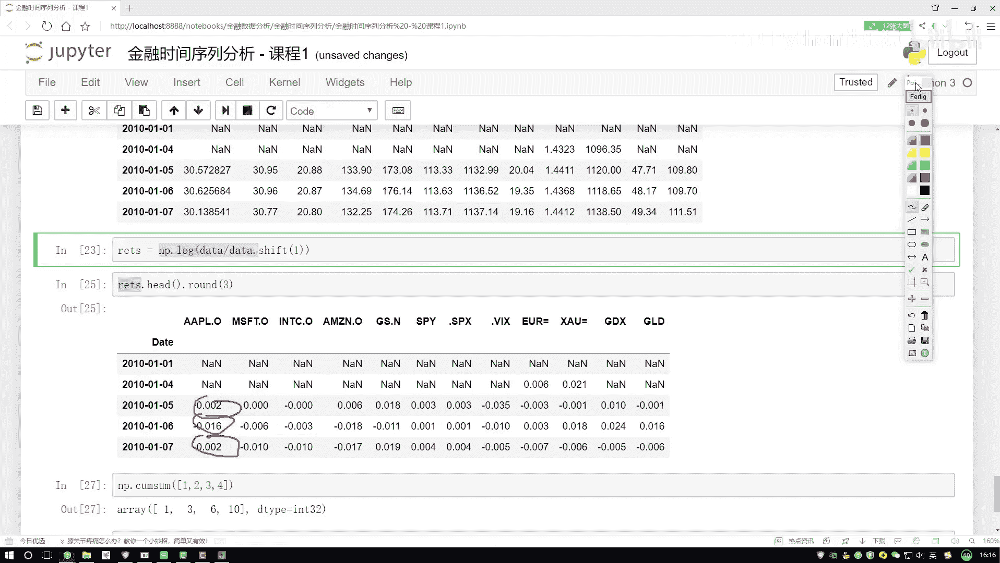

把他们干什么做累加不就得了吗，好了，把这个结果拿过来，对这个结果做什么，做一个com su操作是不是就行了，对它只用com sum操作，但是呢诶你看之前我说这个结果，我为了咱能实际做计算啊。

引入了数学上的一个公式，叫做一个对数，是不是。

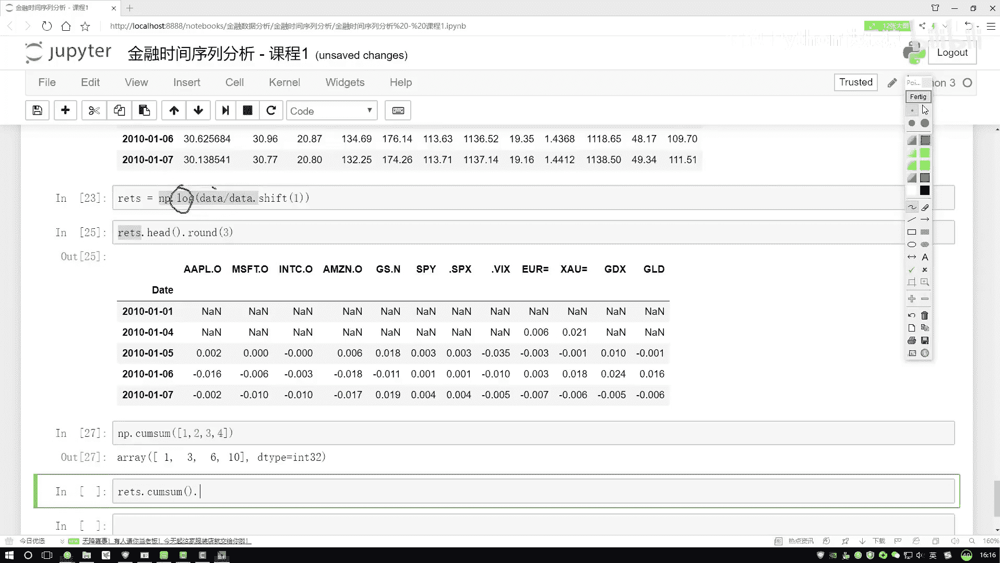

那现在你是不是讲道理，你得给我还原回去了，欢迎回去怎么办，咱递给他怎么样做一个NP点多少D的多少次幂，这是EXP表示E啊，咱之前默认NPLOG啊，就是以为底的，所以说此时当我在执行的时候，点欧派操作。

咱之前讲那个pandas基础的时候说过了，对其中每一个都执行让操作吗，咱要还原啊，画完之后呢，我顺便把这个图给它画出来吧，呃这个图然后他等一个16的。

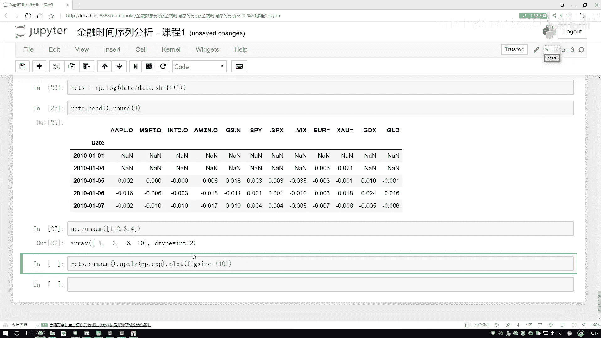

然后再执行一下，看一下这个图的结果，你看是不是像我刚才说的，最开始就相当于这块，也不是相当于一块钱。

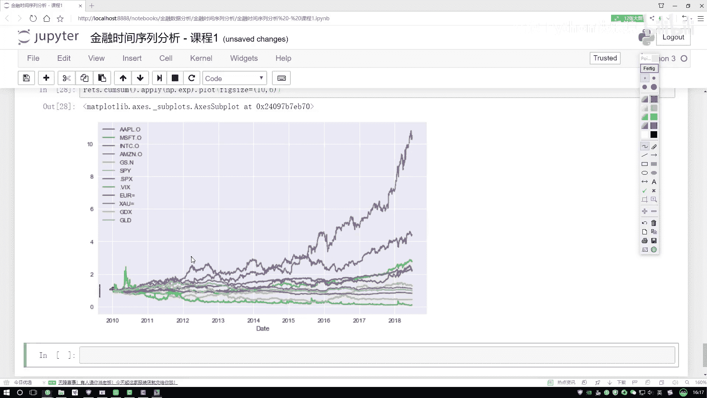

就当一个单位吧，啊其实对于股票来说，你就当做一块钱吧，一块钱相当于11年多少钱，相当于12年多少钱，131415161718，是不是全有了呀，我看我看最猛的是谁啊，最猛的是亚马逊，这个是吧。

之前他10年的一块钱，现在已经能相当于什么了，十块钱了吧，咱是基于什么连续的一个增长率，来去做计算的吧，啊然后你看下面的第二什么，第二个第二个是苹果的是吧，苹果的大概是呃四块多是吧。

这是大概翻了多少番啊，这个意思，那你要拿拿那个茅台来说，可能翻的更多哈行了。

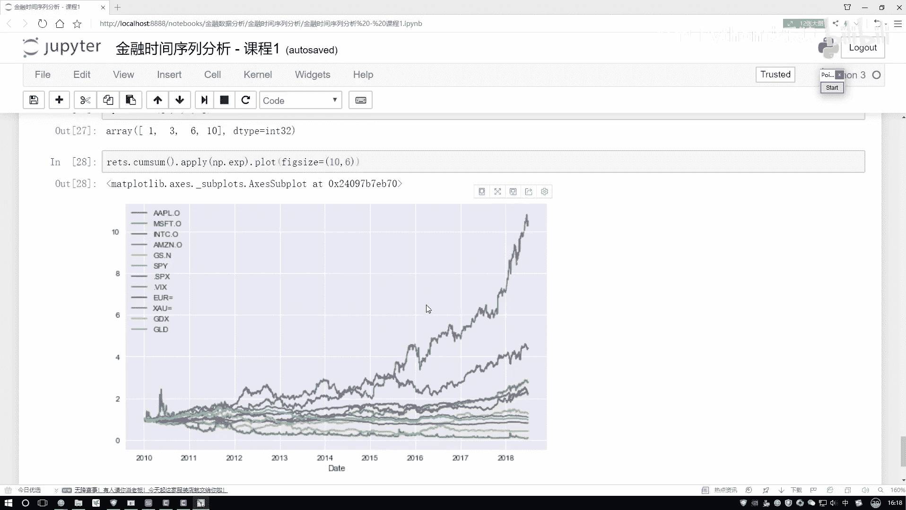

这里给大家看了一下，就是对于我们的金融时间序列来说呀。

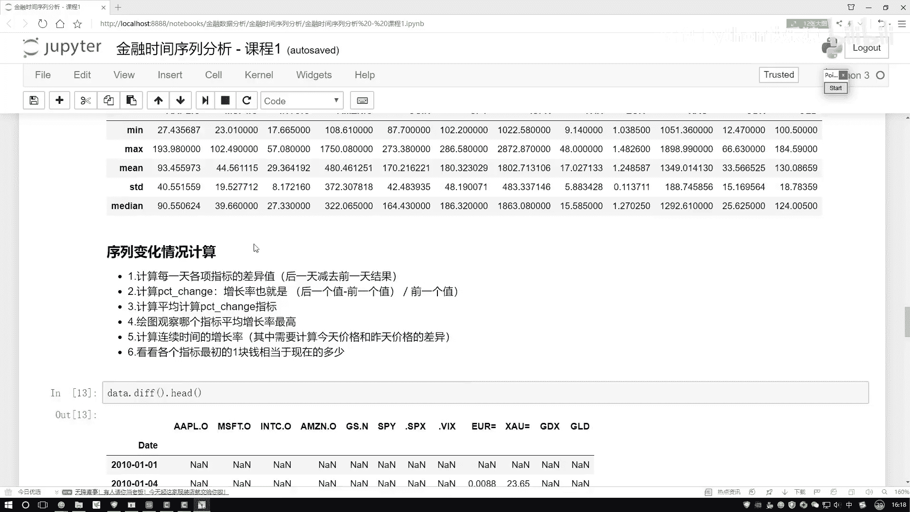

我们能统计值其实挺多的，在这里呢是给大家列出来了一些经典的，不是说经典吧，就是常用的一个操作啊，我们怎么样计算一个差异值点，difference一下，非常容易吧，差异值我就算出来了，第二点的增长率。

增长率像该说的一个差异值，可能有很多时候都是没什么价值的，多了少了一块，对于不同任务来说，对于不同的指标来说，可能你衡量起来，那这个一代到底代表什么，不好说吧，好了。

我们提到一个增长率后一个值减前一个值。

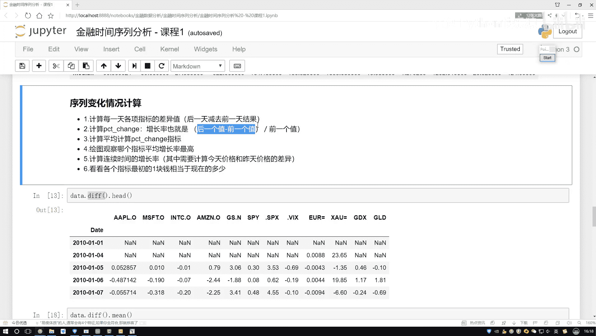

再比上前一个值，很简单吧，然后呢给大家绘图啊，画了一下也比较直接。

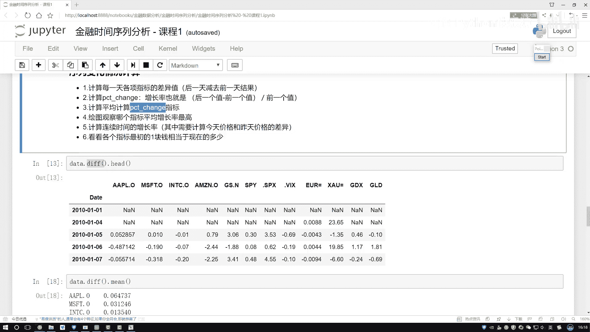

然后呢又说了一下增长率这个东西啊，你算平均的行，但是你不能给我算一个累加吧，因为累加在一起它是没有意义的吧，所以大家举了个例子啊，那如果说我想算这个累加呢，我想算就是第一天啊，相当于后面几天的多少倍。

再相对后面几天走多少倍，怎么算呢，它是不是一个连续时间增长率啊，我们引入了数学这种方法，做做什么，做一个对数吧，不要忘记对数这块，你做完之后，如果你想还原到实际的数值，是不是得再给它还原回去呀。

啊有这样一件事吧，最初咱统计了一下，当初唉最早的一块钱相当于现在多少块钱。

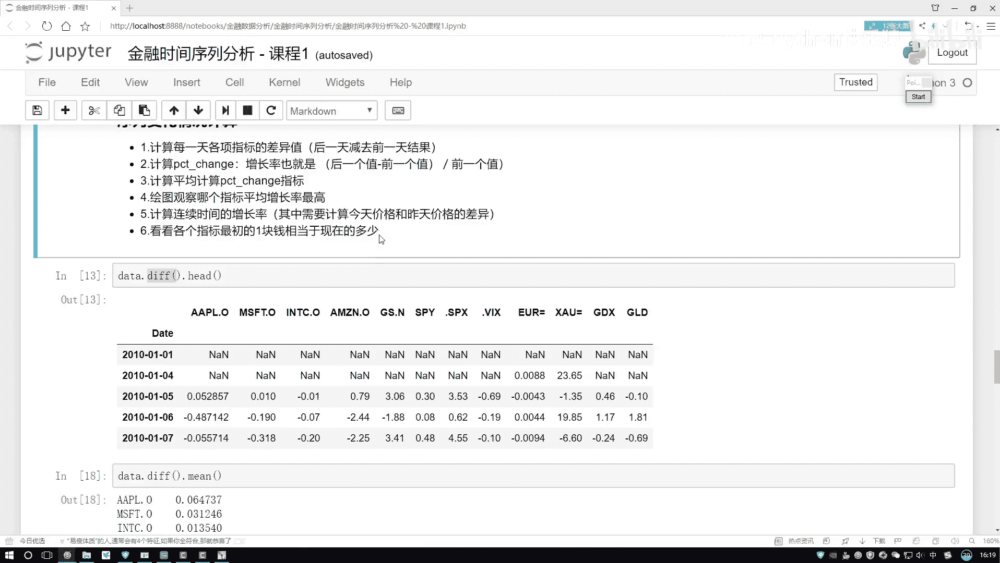

数学家算完了1万块钱有多少啊，有有有比较强的公司，相当于10万10几块钱。

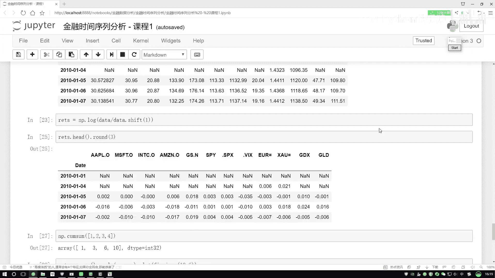

其他的那其实走势都挺高的，但是呢也有一些指标可能是下降的，可能保持不变的吧，啊反正就是当初你要买这些股票的人。

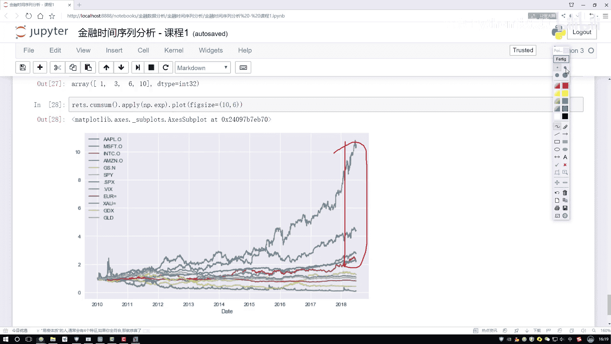

基本上都发了，是不是这个意思啊，好现在大家看了一下，就是我们对这个金融实验学习当中。

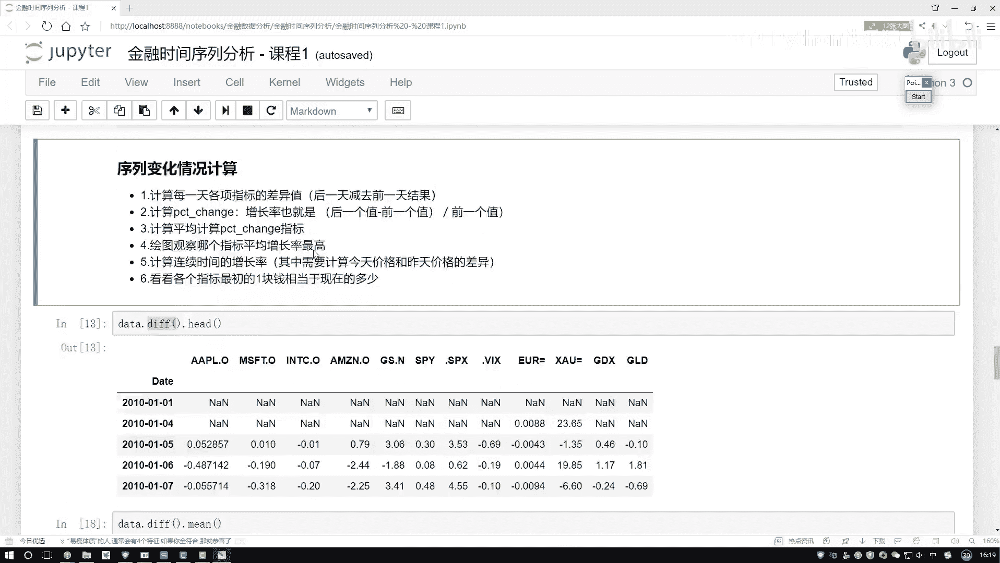

一些序列的啊，我们的计算操作都该怎么样去在pandas，还有单排当中实现出来。

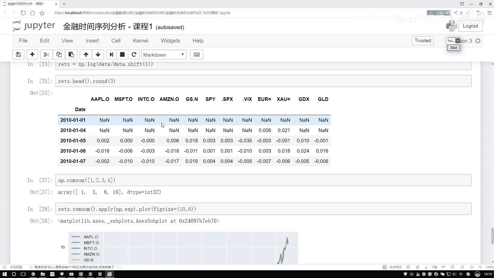

其实说白了就是用这些工具包不好。

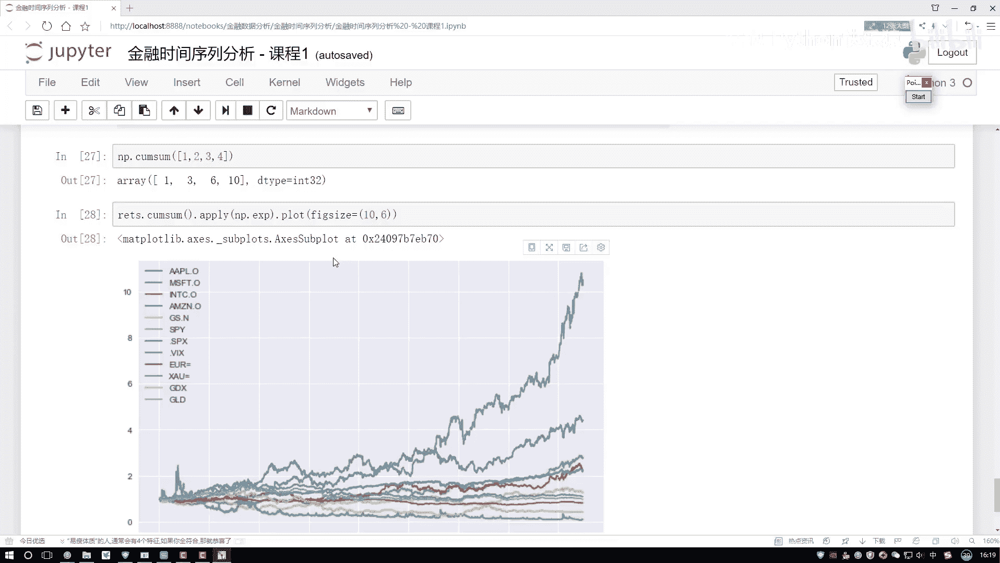