# 吹爆！2023B站公认最系统的Python金融分析与量化交易实战教程，3小时入门AI量化交易，看完还学不会你来打我！人工智能｜机器学习｜时间序列｜股票预测 - P8：2-时间序列重采样操作 - 人工智能博士 - BV1aP411z7sz

接下来咱们再来看这个重采样，还有时间窗口操作出彩啊，咱别说过了，就是正常数据啊，它是按照以TM为单位的，或者是以其他为单位的，现在呢我们想把这个单位啊做一个调整，比如说之前你是按天统计的。

等会儿先我换一个吧，我说我换到这个呃，以周为统计的，以年为统计的，以月为统计的，是不是可以啊，直接啊对咱们这个data做什么的一个RESIMPLE操作，RESIMPLE完之后。

咱们就相当于得到了这个重残的结果，重采样的过程当中，你需要给我指定啊，最少一个参数就是你告诉我以什么为单位是吧，那好了，以周为单位，以周为单位，两周为单位是不是都行啊，以周为单位的时候。

那你说显示的时候，你是显示个均值呢，还是第一个值，还是中位数呢，还是什么指标呢，自己来指定什么指标都行，指定指标之后。

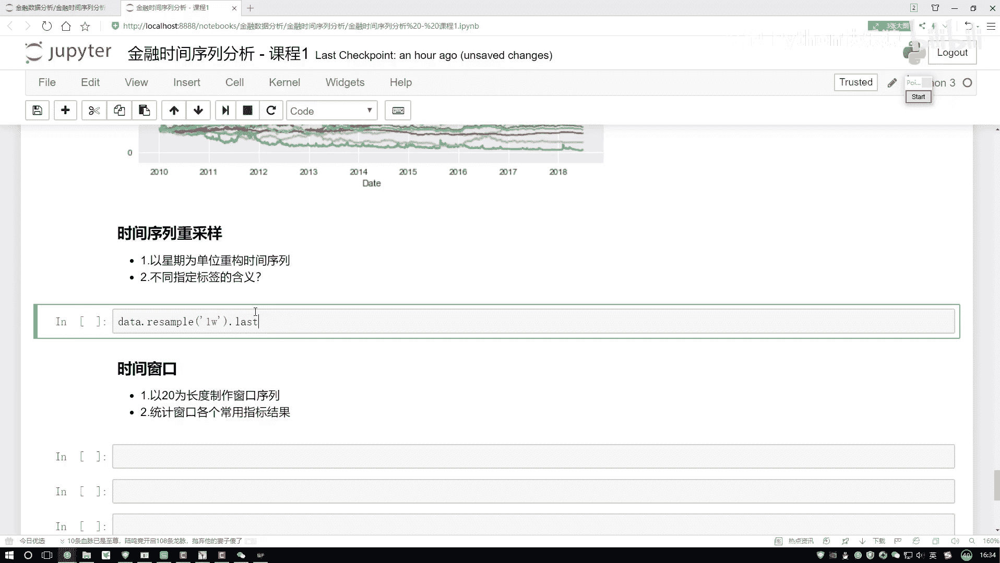

然后来指定一个head，然后再看一下结果，你看这里哎呀。

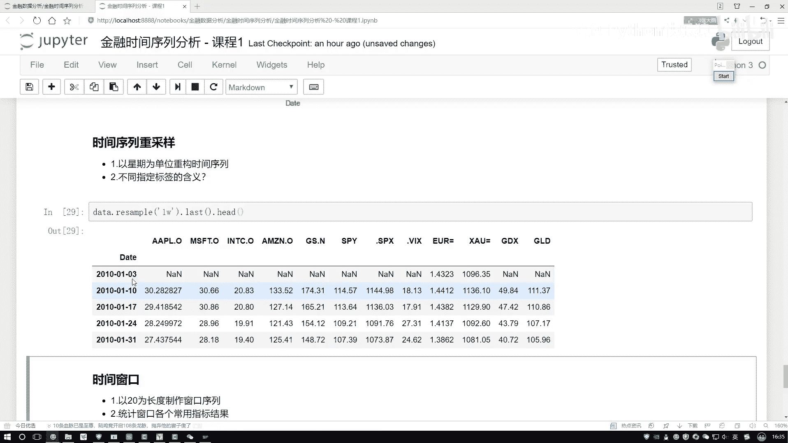

你看这块他是直接1月10号了，咱看一下为什么是1月10号，因为原始数据当中哎这一块前面都没有吧，所以说啊我做了一个松点样，相当于一周一周是这样一个窗口，我看看一二呃，呃大大大概是这样一个窗口吧。

把这个窗口做完之后，咱得到了当前的一个结果啊，这是我们现在做了一个以周为重，采样之后得到的一份结果，那其实啊就是不光啊就是一周七天七天往上涨，但其实我们不光能一周的，那还可以什么再换一下吧。

比如说哎我现在不以这个周，然后以这个月吧。

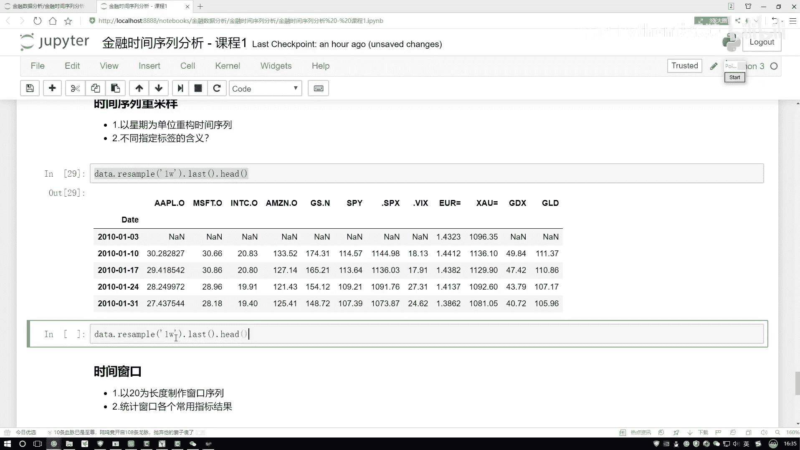

一个月行吧，是不是也能得到一个结果啊，但是这里大家需要注意一点啊。

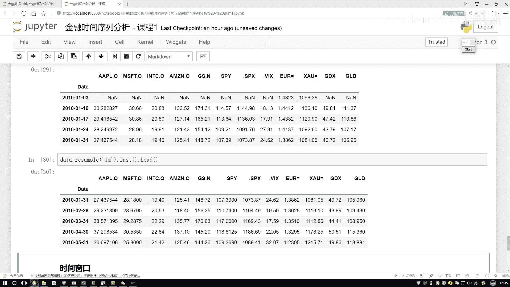

你看这块我第二点说了，咱可用什么不同的一个标签。

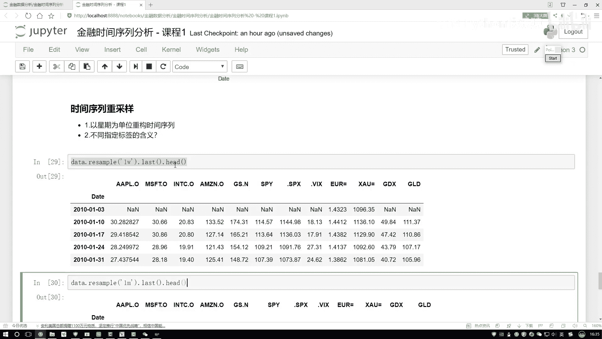

什么叫不同的一个标签呢，给大家来看一看，就拿第二事来说吧，这里我们还可以再加进来一个参数啊，比如说这里我这块写的是啊这么一个月是吧，然后呢我在这个label当中内部里边，我说我给它加深下变换吧。

加上什么，你可以把这个标签放到一个左边，或者说我给它放到一个右边，什么叫这个左边，还有这个右边，咱们来看一下这个level当中，你看啊就是如果说我指定成一个left吧。

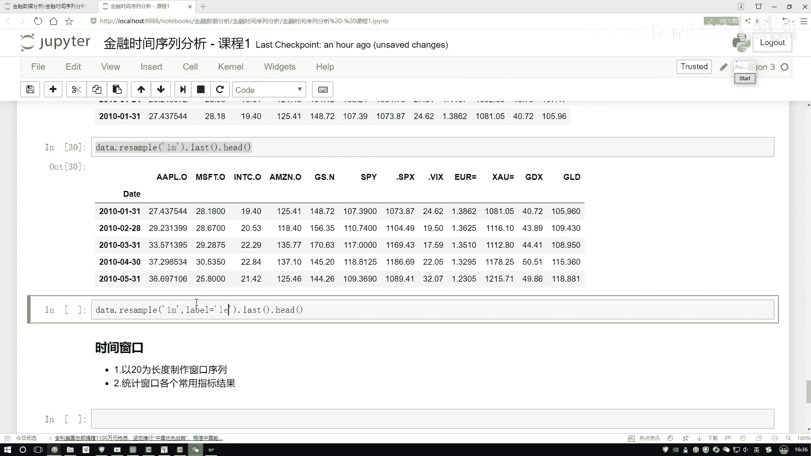

刚才默认识一个right，咱指定left，再来看一看，你看这个就是什么啊，原来第一个数据啊是这个1月31号，但是现在这个数据是12月31号哎，看起来数值不是那个统计怎么多统计一个月啊。

这里是1月31号啊，但是你看数值，你看这里1月31号这个数值，和这里这个12月31号这个数值来，大家来对比一下，你说是不是一模一样啊，是不是一模一样的东西啊，那他们之间什么意思呢，他说这样一件事儿。

就是现在啊，你虽然说这是一个月数据统计完之后，你要以哪一天为命名吧，left就是第一天，right就是最后一天啊，用哪一天来当做当前这个数据它的一个命名，或者当做他的一个缩影名字吧。

或者将做一个日期名字，这里就根据你不同任务来去选了，那比如说现在你觉着用前面的合适，那你就自己指定一个left，你觉得right合适，你就指定这个right是不是可以了。

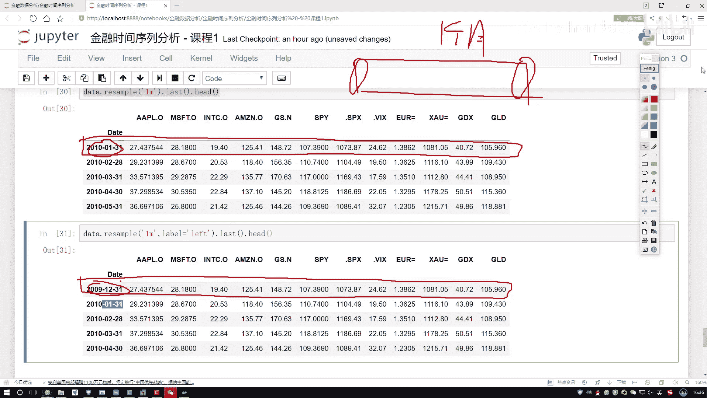

不要忘记啊，这块还有一个指标叫做啊一个不同的标签。

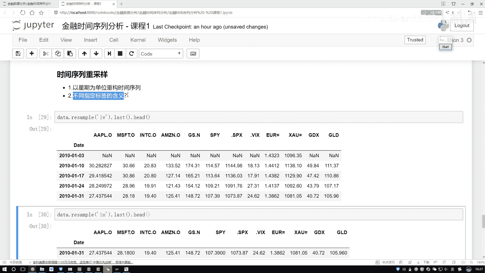

一般就是left和right，你自己选，看一看什么值合适，我估计大部分情况下还都是一个right的吧，因为就是你看哦，你当你指定成一个以左边的时候，那数据当中都没有31号，你还出现一个31号。

这是我不太靠谱的这样一个意思啊，那下面这个值呢，下面这个值1月31号，它其实描述的什么描述，是从他开始2月份的一个情况吧，所以说啊你最好指定成一个就是right的形式。

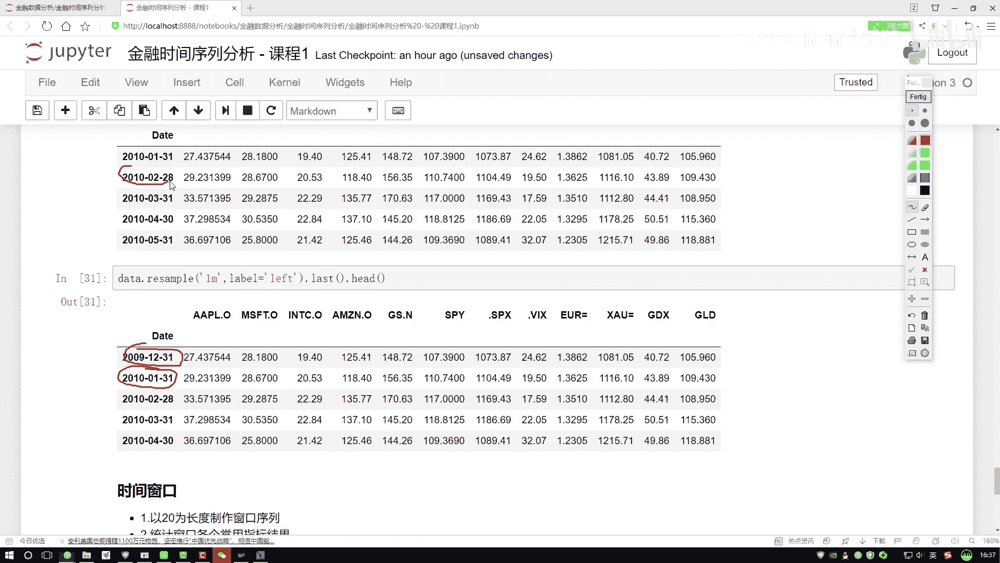

是符合呀咱们观察的一个逻辑啊，当然可能不同任务。

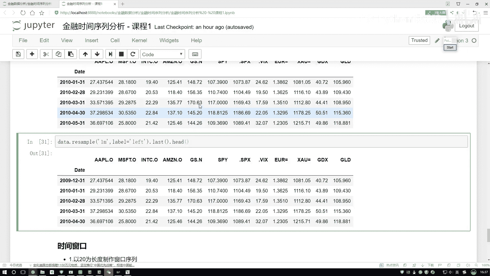

大家做法的需求可能不太一样，这个就是一个时间序列的中采样啊。

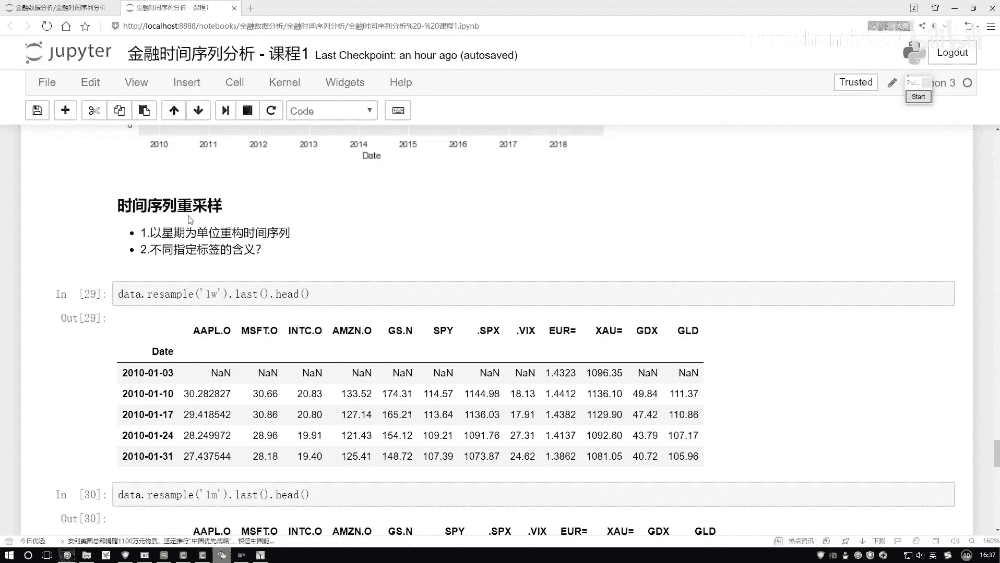

也是比较简单的，直接啊，咱就可以把这个数据啊，按照你想要的结果啊。

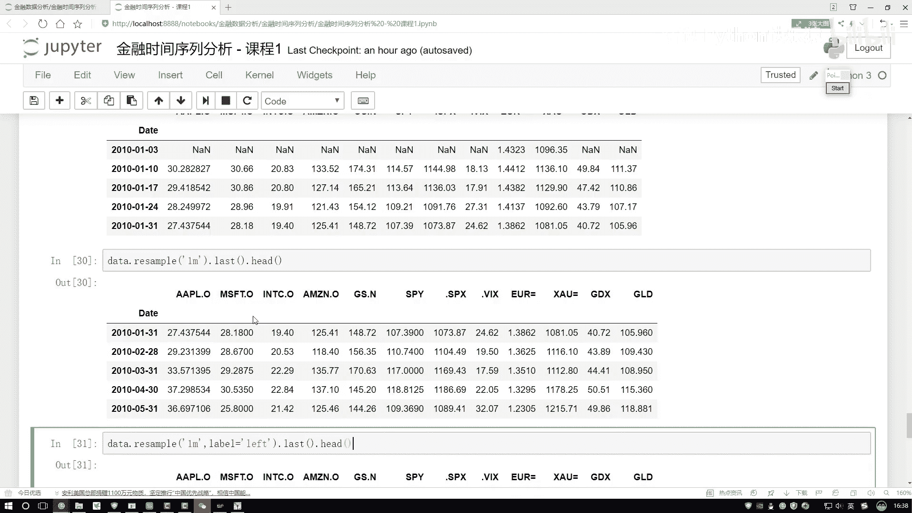

做很多重采样的方法好，接下来接下来就是我现在啊，不光要做这个重采样啊，不是不是做这个重采样，我要做一个窗口，什么叫做窗口呢，我是这样，现在我说我这是有一批数据行吧，好了，在我这批数据当中啊。

这样我说现在有这个数据当中啊，呃我要做很多序列出来，那这个数序列可能不是不不是一天，那什么意思呢，这里要有100天数据行吧，好了，我说我去截，我说我截的第一个窗口是这样，我说我结了这十天可能话有点大了。

我说这是十天数据行吧，接完这10年之后呢，我说下我再接十天，我说这个是一个一号数据啊，是这十天的，然后呢我说我再截个2号数据，二数据，它可能是从第二天到第11天的，可以吧，然后呢我说我再结合3号数据。

三数据呢可能是这个不光到这个11天，到这个三第三天到这个第12天可以吧，我可以啊，十天时间去结，每一个十天呢往后像是滑动窗口似的，移了一个单位，可以吧，这东西你叫做滑动窗口或者叫时间窗口都行啊。

我们要做这样一件事，行了咋做呀，这个东西给大家看一下吧，咱们现在怎么样去做这件事呃，首先第一步还是把我们的数据拿过来，然后呢你可以指定啊这样的一个window，就是我们的一个窗口。

比如说咱们这个窗口是等于十的，可以吧，然后呢接下来对我的数据啊执行这个操作吧，窗口是10data当中输入数据，那数据当中选一列吧，就选这一列得了，数据当中咱选择某一个指标，然后呢对这个鼠标怎么样。

我做一个rolling的操作，就该说的诶，你要做好多窗口做滑动了，然后呢这里边有有个参数啊，就是一个windo window当中啊，你自己指定的window等于多少啊，这块我自己指定了。

就等于我这个window得了这个window等于单元window可以吧，然后呢统计完之后，你看统计完之后啊，他现在这个结果展示的不是特别舒服，因为现在它是好多个序列，但可能展示的不是特别好看，这样吧。

我给他一个序列，我算每个序列当中它的一个最小值可以吧，相当于我第一个窗口最小值，第二个窗口最小值，第三个窗口当中最小值可以吧。

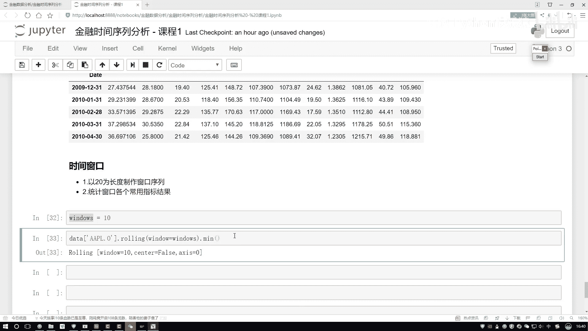

这就能展示出来了，做一下啊，前几个前几个都是NN值啊，因为这里边它是，我们得有有十个才能做当前这样的一个展示吧，好了，这里边就是我当前画出来的一份结果，这个结果不太好，这个结果比较闹心，因为数据当中啊。

但凡一个窗口当中存在这个NAN值呃。

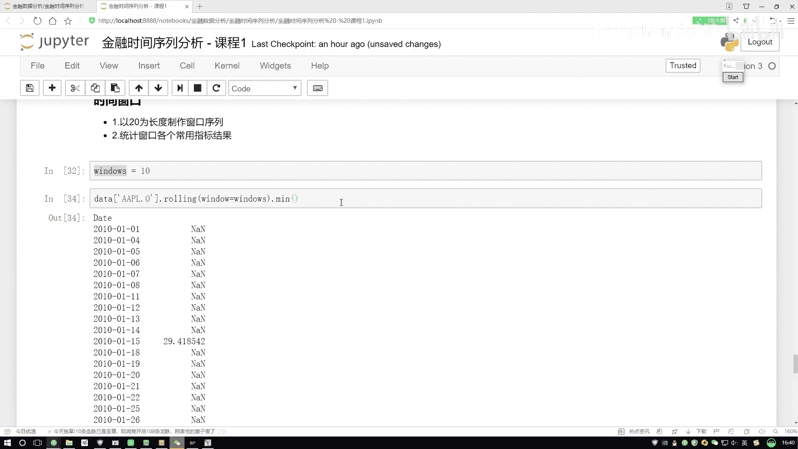

这这些很多东西都展示不出来，这样咱先得先对我数据做预处理吧，这块大家到时候做着做出加一步吧，得先对我数据做预处理，你得先把这个缺失值诶给它剔除掉，要不然不行，在这里D3D把这个data重新的构建一下。

我说我的data等于我当前的这首，我当初要去DP一下啊，DP一个AA就是我去做一个缺失值吧，然后我写个data2吧，data2等于data点召唤A，然后呢我把这个东西都拿做data2来去做。

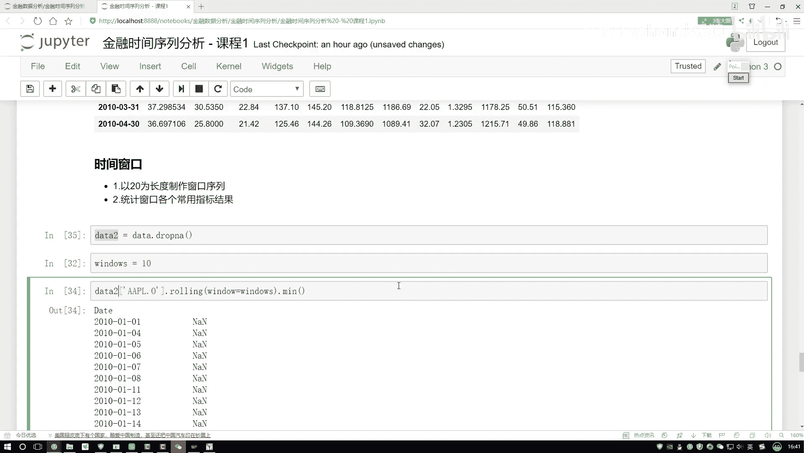

行了啊，这回咱就有了，你看这回咱下面这都不是空值了吧，因为上面上面就是空值，正常的，因为窗口还没到那个长度，是不是，然后下面你看之前咱算有AN值，现在怎么样就都没有了吧，这样我就得到了诶，这是一模。

这都第几个有的部署了，这是第多少窗口，然后它的一个最小值D多少窗口，它的一个最小值，咱是不是能把所有的结果全不得给他算出来啊，啊这一块再把这个结果得到手了，那如果说呢你想对好多窗口啊。

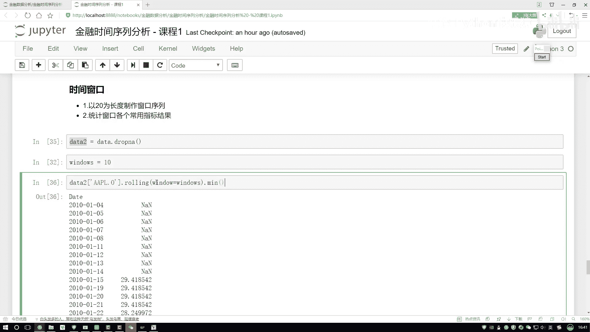

都执行这样一些统计的操作，该怎么办呢，咱可以把这个序列啊都可以加一加哦。

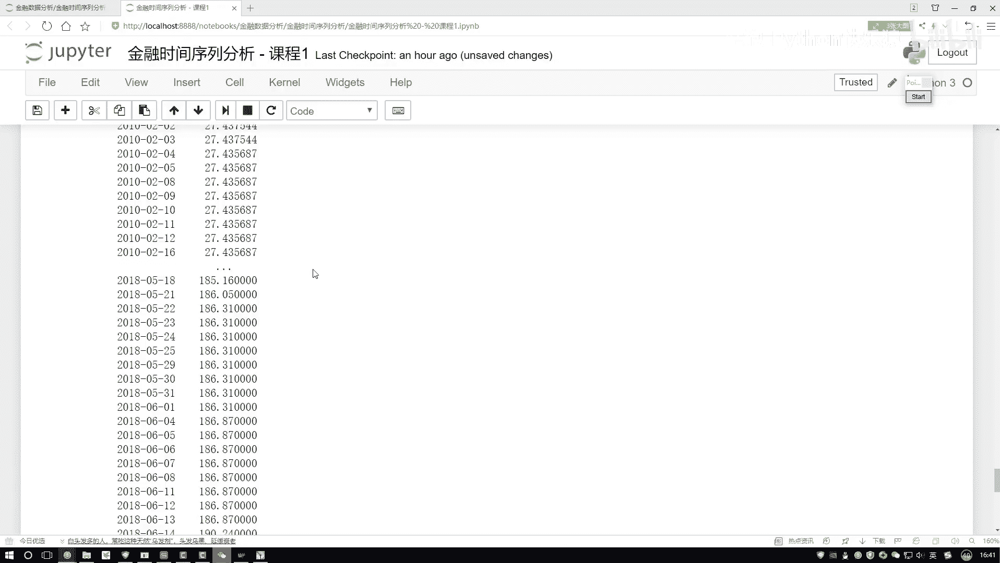

来这块写一写，我说现在啊这个呃重新的构建一个data吧，我说这个data当中我加上一些列呃，data2当中加上一些列，加上一些什么列呢，我说这块它是一个最小值是吧好了，我指定一个，这是一个最小值。

然后等于它的一个最小值，然后呢可以再加啊，这块不光有最小值，我还可以统计它的一个最大值，然后这就是一个最大值，然后再写几个吧，再写一个均值和一个st得了命值，然后这块一个TD这块也是点名一下。

然后这里是点STD一下就行了，然后指定完之后，我把这个呃数据还是给大家打印来看一下，点害一下行了。

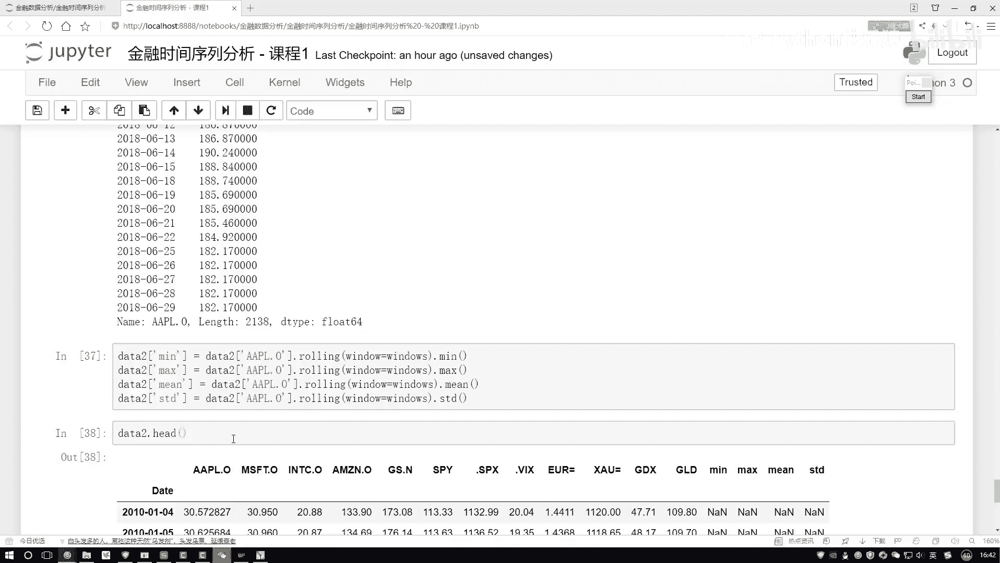

看后面几个指标吧，这块怎么样，是不是哎呦这个点head的不行。

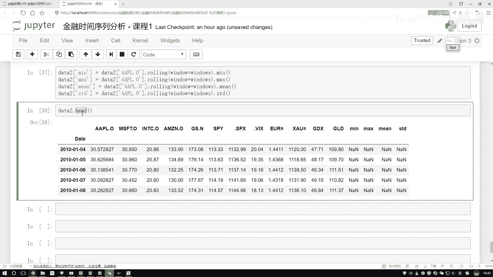

你这么滴吧，你点tile一下吧，点TAO当中，是不是这个结果咱就给他算出来了啊，这块就是咱当前的一份结果，不光我们把这个呃前两节指标写出来了，还有什么基于当前这个窗口当中最小值，最大值。

还有它就是符合他这个序列，符合他这个窗口当中所有的一些统计值，咱是不是全部给它画出来了，基于窗口来去画的，相当于啊是以这样一个范围来去统计，当前的我的一些结果啊，这就是我们的一个时间窗口或者是时间序列。

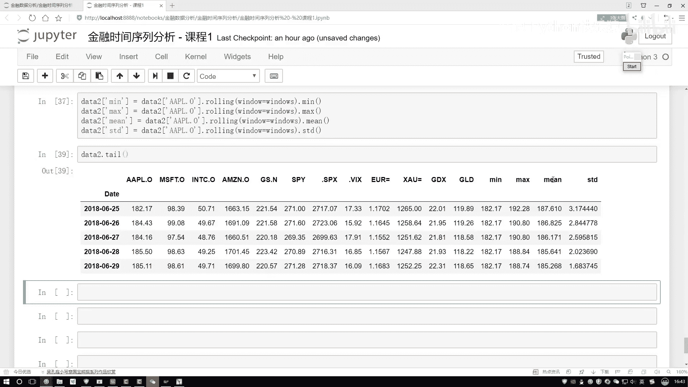

怎么去做，以及呢我们可以对这个时间序列啊，执行的一些操作不要忘记点啊，就是你对这些窗口在做操作的时候啊。

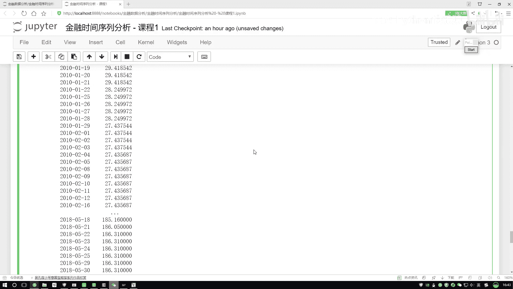

先做一个预处理，你得把这些缺失值给去掉。

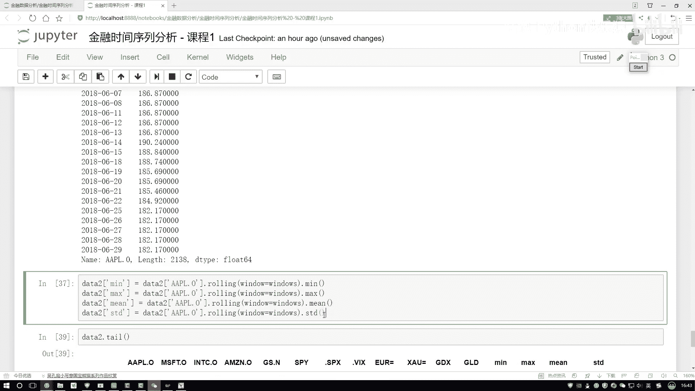

因为刚才给大家演示的时候，我刚刚就忘了，如果你没去掉这个缺失值，它这块怎么样会出现好多AN吧。

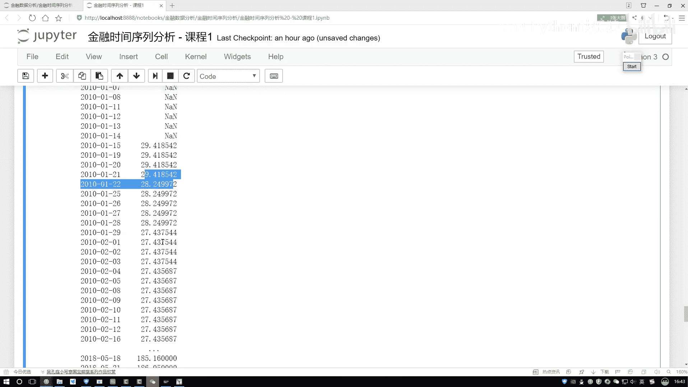

所以说第一步啊，咱得先把这个数据做好预处理，这可能是很多数据分析任务当中，我们第一步吧啊。

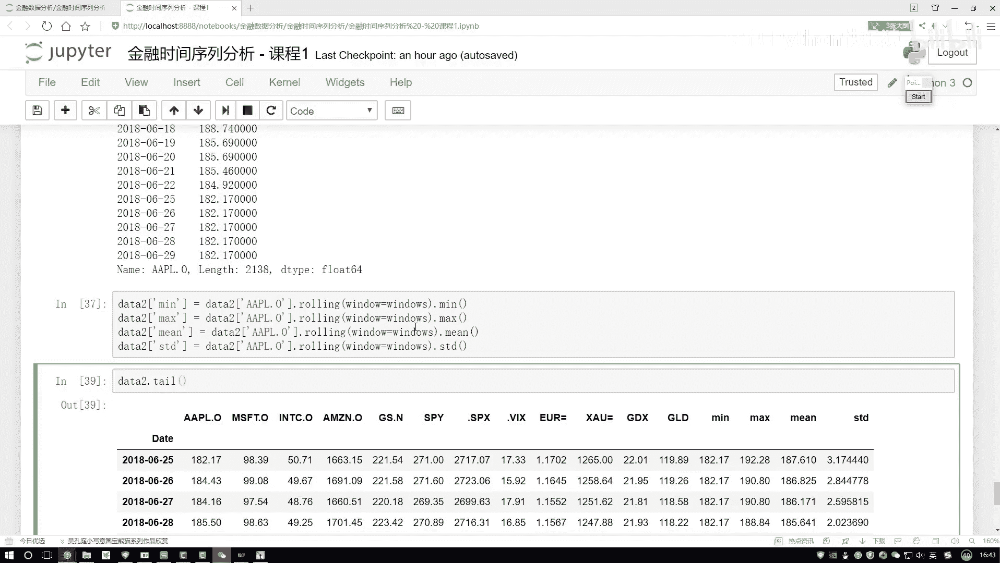