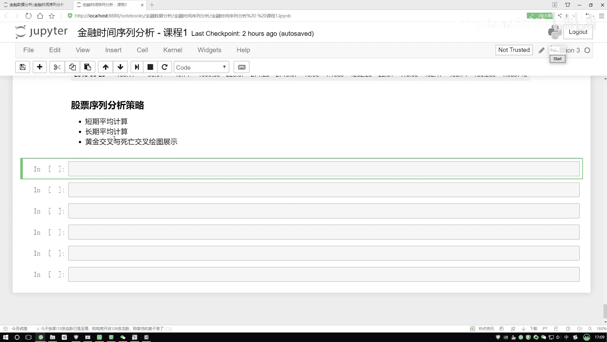

# 吹爆！2023B站公认最系统的Python金融分析与量化交易实战教程，3小时入门AI量化交易，看完还学不会你来打我！人工智能｜机器学习｜时间序列｜股票预测 - P9：3-短均与长均计算实例 - 人工智能博士 - BV1aP411z7sz

接下来咱们来做一个股票序列的一个分析策略，这个分析策略是让我们去计算一些指标，然后看一看我们什么时候该买，什么时候不该买，其实说白了就是一个比较常见的词，黄金交叉还有一个死亡交叉。

这里当我们要去计算黄金还有死亡的时候，我们是不是得有两个指标，你得告诉我一个短期平均的走势，还有一个长期平均走势，然后我们去看一看，他们在哪出现了这样一个交叉，在这里我们就得按照这个套路一步步去做。

首先第一个，这块这是我们第一个要去做的，是一个短期平均，然后接下来长期平均，最后画图给大家做一个展示就可以了，好现在算短期，短期的话一般情况下就是5天比较常见，因为一般咱们的一个一周，我这5个交易日。

所以说一般咱拿5天来去算，但是这个数据，这个数据你看，它从10年到18年，这个时间有点太多了是吧，所以说我们也可以相对的，把这个短期和长期，改的稍微的大一点，正常短期，可能5天10天比较常见。

然后长期可能20天30天，这比较常见，比如说我们先写，先把这两个值给计算出来，管它多少天先算，对于我们data来说，我要指定某一个股价，算哪个看哪个股票，就看这个得了，就看咱刚才说的苹果股票得了，好了。

对于我们当前的苹果股票，然后对于它做这样一件事，我们去算一个窗口是吧，算窗口它的一个均值，我们算一个短期，短期当中你自己指定一个window，window咱指定稍微小一点，比如说就10天。

就是一个10天做一个窗口，然后在这一块，我算了它的一个均值就可以了，这就是一个短期的平均，很简单，以10天的一个窗口去算，这10天的均值，然后把这均值拿到手，传入到我的这个水母当中，指定一个名字。

还没有指定名字，在这一块，我得给它指定个名字，就叫做一个10天得了，这就叫做一个10day，然后我们再做第二个，比较实在了，叫做一个短期，叫做一个mestere的1。

然后一会再做一个长期mestere的2，然后再写一个m2，m2就是还是股票，但是我们窗口可能稍微大一点，咱指定成一个30，然后还是算它的一个平均值，给它算完，算完之后，然后把这个结果展示出来，股票当中。

股票当中，看我要展示哪些指标，我展示苹果就行了，就展示这三个，一个是苹果的一个，这个多，怎么多了一点东西，这个直接复制过来，一个是苹果股价，然后第二个就是，咱们的一个m1，还有一个m2，还有这个是m1。

然后再把m2给复制过来，把这三个指标显示出来就行了，然后对于它，我去点hide一下，这块我看出错误了，出，OK error，说明我传入的有问题，少了一个中括号，给它传进去，好，然后点hide一下。

都是这样，hide一下得了，行，这是咱们现在指定的三个指标，我们当前苹果的一个股价，然后一个m1是一个短期的平均，然后m2它是一个长期的平均，这两个值我是不是算完了，接下来，你是不是说在实际的数据当中。

你可以把这个短期的平均和长期的，平均，通过一种不是通一种，就在图当中画出来，我们不是要找那什么黄金交叉，还有死亡交叉，所以咱画一画这就行了，在我们的电脑当中，我这直接给复制了，对于它。

我去画一个整体图就行了，点plot一下，然后指定我这个图的一个大小，这就完事了，然后是一个6来展示一下，行了，这个图看起来不是特别好看是吧，因为什么，因为咱们当前时间来说太长了。

然后时间要是单独选某一年还行，这样我一定程度上，把稍微的作业变换，我说这就是30，然后得了，这是一年估计250交易日，然后咱们这么来画，这是一个短期，这是一个长期，要不然这交叉太多了，咱看不出来了。

我把让它的幅度稍微大一点，这样使得取的就会比较少，画的可能会层次分明一点，再来执行一下，你看这回怎么样，这回更清晰了一点，咱们来看一下当前我的一个走势，然后这块有几个值，就是蓝色的是它拿红色笔。

蓝色的是它的一个股价，然后绿色的是我们的一个短期，然后红色的是我们的一个长期，是吧，来观察几个值，先来找一找，咱们刚才说了几个点，就是一个死亡交叉，还有一个黄金交叉，死亡交叉就是说你要赔了。

黄金交叉就是说你要赚了，咱们现在找就是看第一个点，穿交叉完之后，你看我们的一个短期，短期是绿色，短期怎么样，往下去就走了，穿越到哪了，穿越到长期的一个下面了，所以说这一块，你从这个走势来看。

你说要怎么样了，要下跌了，所以说此时怎么样，不适合买，赶紧把这个东西给它抛出去，给它套里边，然后咱们来看第二个，再看第二个走势，我看看这里，再看这个走势，这走势怎么样，短期这个绿色，超越了我们长期红色。

并且往上上升的，此时说明什么，这是一个黄金交叉，在这一块，咱们就要赚了，可以去买了吧，这一块给大家对比了一下，在我们的金融数据当中，就是股票数据当中，有两个常见词，一个死亡交叉，还有一个黄金交叉。

咱们该怎么样给它划出来，其实说白了，就是你自己去指定一个窗口，短期的一个窗口，可能咱这个指标太大了，因为这个数据它太长了，正常你拿到近期的一些数据，你可以指定一个，三天五天，那可能上海它是五天。

五天可能是比较常见的，然后这一块一个长期的，可能是20天，它是一个月，20个交易日，可能是比较常见的，这个就是咱们的一个短期，还有一个长期的一个平均计算，注意点这一块，我们写什么值，。

me一定是一个平均值，其他值可能含义，就不是那么特别明显了，这是一个均值，然后你们看出现这样的交叉，刚才为大家说了，死亡交叉，还有一个环境交叉是吧，那能不能把这个图，你说你给我画的更直接一点。

直接给我展示出来，哪一块，它是一个短期的，是一个大于长期的，哪一块短期是一个小于长期的，你再把交界点给我画出来，能不能把这个分析，咱做得更到位一些也可以，咱们指定一下，这块我可以指定一个安排函数。

安排点，wear一下，wear什么意思，刚才不是要做判断，你这个短期的跟长期的去比，然后它的一个数值是大了，还是个小了，是吧，一个m1，然后去跟这个m2去比，安排点wear的意思，就是说你现在首先去比。

然后咱再说比完之后，你对这个结果该怎么操作，好了，第一个参数是要比什么东西，第二个参数就是一个条件，如果m1我的一个短期平均，大于长期平均的时候，把值指定成几，我看这个任务当中，咱就指定一个1-1得了。

如果大于指定一个1，如果小于指定是一个-1，就相当于两个分水岭，就两个分界线的意思，指定一个1一个-1，然后现在就是大于的时候，我指定一个1，小于的时候指定个-1，你把这个指标，你得告诉我它是什么。

咱指定一个指标，指标当中你指定一个position，然后它的一个位置，看是一个1这个标志位，还是-1这个标志位，它就描述了，当前咱的一个短期和长期，平均的一个，计算结果，然后再支线一下。

我看一看出现了一点小问题，key error，没有m1，这块咱写是data2是吧，把这个data2传进去，这也是一个data2，好支线一下，这里咱就有了，有了完之后，我们要把这个结果，给它展示出来。

这个结果展示的过程当中，我先给大家来展示一下，这个数值结果，。head一下，从这个数值结果来说，看不出来什么太多东西，这-1，咱不看这个数值结果，直接画图，画图当中，就是我要去对我当前这个data。

data2当中，我要画这几个指标，有几个指标，刚才我们是画了三个，现在咱又多了一个，我直接复制过来，直接复制过来多了什么，多了一个position是吧，把position拿过来，这不就行了吗。

把它拿过来，然后我还是直接。plot一下，然后这个结果是不是就有了，这个结果，这个结果不行，这个数值上左边来说，左边来说，都是它实际的值的一个走势，然后我们这个值指定了一个，1和-1，看着不行。

这样咱再添个坐标轴，这块不光plot的时候，然后我把这个坐标轴，重新再写一个，右边咱再画一个坐标轴，因为左边坐标轴，取值范围太大了，不适合我-1和1，这都看不出来了，我在右边画个轴，右边我说这是-1。

然后这是1，然后在右边这个轴来画，是不是也行，咱再画一个轴，右边这个轴当中，就是。plot的时候，然后第一个参数，一个figure size，第二个你可以指定，就是我们第二个轴，第二个轴。

然后它的一个坐标，secondary，secondary当中，我指定一个y，把y传进去，第二个y轴，第二个y轴描述谁，把咱这个position传进去就得了，复制过来，第二个y轴是描述着它的，给它去掉。

然后咱们再执行一下，看一看这块出现了什么小问题，这个东西sectorasec，少了一个字母是吧，second，second，ar，不是少了个y是吧，sector然后y，行，再画一下，这咱图就出来了。

这张图什么意思，像我刚才说的，这块是一个-1，这一块是一个1，你看这里，我们是不是多出一条线，多出一条线什么意思，表示咱们的一个position，我们的一个位置，位置当中等于1的，表示什么。

咱们的一个短期平均，你看这个绿色的，它就是绿色这个东西是大于什么，大于我的一个长期平均，所以说此时它在上面的，然后下面就是我的一个短期平均，小于一个长期平均，你看这个趋势，由1变到一个-1，那说明什么。

这是一个死亡交叉，这一块就是怎么样，咱又跌了，是不是，再看这里，但这里是不是一个相反趋势，我的一个短期平均，然后往上超越了，我的一个长期平均，说明要涨了吧，说明可以买了吧，所以这是什么，黄金交叉。

后面咱是不是一样，这里咱就是基于刚才给大家说的，我们的一个死亡交叉，还有一个黄金交叉，咱在这个图样当中，其实就是不是在图样当中，在我们的一个CHA当中，你去指定好窗口，咱可以算什么，算我们的一个短期。

还有长期平均，其实就是在Pandas当中，基本上能想到的这些计算，咱是不是都能玩起来，画图展示出来，这个也是比较明显，咱当前的一个走势情况，好了，这里给大家说了一下。

就是我们的一个分析的。

股票分析的一个小策略。